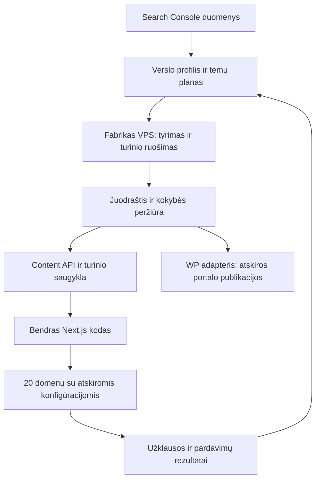

# Fabrikas ir 20 nišinių verslų: techninė analizė ir rekomenduojama architektūra

2026-09-29. Analizuotas vietinis `fabrikas-github-upload` eksportas. Tai architektūros pasiūlymas; veikiančios sistemos, publikavimo grafikai ir portalai nekeisti.

## Patikslinta pirmo etapo apimtis

Naujausia techninė kryptis: remtis esamu Dovanos123 pagrindu ir atskiru lengvu turinio planuotoju/generatoriumi. Fabriko prijungimas neprivalomas. Sujungimas aprašytas [bendrame maždaug 30 svetainių plane](C:/Users/lenovo/Documents/nisiniai_puslapiai_monetizavimui/BENDRA_30_SVETAINIU_SISTEMA.md); žemiau esantis Fabriko auditas lieka informacine medžiaga.

Vartotojas patikslino: pradžioje paleidžiame visus 20 domenų tik su landing page, SEO turiniu, prekių / paslaugų aprašymais, kontaktais ir matavimu. Tiekėjų integracijos bei individualios sistemos kuriamos tik pagal susidomėjimo rezultatus. Dabartinį darbą apibrėžia [20 svetainių SEO MVP planas](C:/Users/lenovo/Documents/nisiniai_puslapiai_monetizavimui/20_SVETAINIU_SEO_MVP.md). Šiam etapui rekomendacija supaprastinta iki bendro svetainių variklio ir vieno diegimo su atskirtomis domenų konfigūracijomis; vienas techninis pilotas skirtas patikrinti šabloną prieš pritaikant jį visiems 20.

Toliau pateikta kodo analizė lieka aktuali. Pilnos platformos, PostgreSQL, atskirų Vercel projektų ir verslo modulių pasiūlymai yra vėlesnio vystymo variantai, ne pirmo etapo reikalavimai.

## Ankstesnis pilnos platformos variantas, skirtas vėlesniam vystymui

Rekomenduoju bendrą Next.js svetainių kodą, atskirą kiekvieno domeno konfigūraciją ir atskirus Vercel projektus iš tos pačios kodo bazės. Viena administravimo sistema aptarnautų visą portfelį. Fabrikas toliau veiktų kaip Python turinio planavimo, rengimo ir publikavimo užduočių sistema VPS aplinkoje. Esami WordPress portalai liktų su savo tema ir įskiepiu.

Naujoms svetainėms pridėtume nuo WordPress nepriklausomą turinio publikavimo API. Vertingiausią fabriko logiką panaudotume pakartotinai. Temos dizaino principus ir SEO reikalavimus perkeltume į mažą komponentų biblioteką; PHP įskiepis tiesiogiai Next.js aplinkoje neveiks.

Jeigu vienintelis tikslas būtų kuo greičiau paleisti pirmus 1–3 paprastus puslapius, WordPress su išgryninta esama tema turėtų mažesnę pradinę integravimo apimtį. Tačiau 20 skirtingų verslų, individualių įrankių ir būsimo atskiro projekto pardavimo tikslui renkuosi bendrą kodą su atskirais diegimais. Vercel savaime nesuteikia SEO pranašumo.

## Ką patikrinau

- Perskaityta architektūros dokumentacija ir pagrindiniai tikslinių svetainių, planavimo, publikavimo, temos bei SEO įskiepio kodo keliai.
- Vietinė 2026-09-23 atkūrimo DB kopija atidaryta tik skaitymui (`mode=ro&immutable=1`), nekviečiant programos inicializacijos. Joje: **109 wordpress_sites įrašai, 1 target_domains įrašas ir 1 target_campaigns įrašas**. Tai konfigūracijos kopija, ne patvirtinimas, kad visi portalai dabar veikia ar priima publikacijas. Dalis naujesnių target lentelių šiame atvaizde nerasta; kodo schema ir ši kopija nėra lygiaverčiai įrodymai apie dabartinę produkciją.
- 19 Python failų — `core/target_*.py`, `scheduler.py`, `run_worker.py` — sėkmingai patikrinti su `ast.parse`. Tai sintaksės, ne veikimo patikra.
- Keturi PHP failai praėjo `php -l`: `seo-engine.php`, `schema-handler.php`, `product-mode.php`, `ai-content-synergy.php`.
- Paleista viena esama temos SEO sutarties testo funkcija. Ji baigėsi `FileNotFoundError`, nes ieško `synergy-core/plugin/includes/schema-handler.php`, o eksporte yra `synergy-core-theme/`.
- `synergy-core-theme/dist/.vite/manifest.json` nėra. Surinkimo ir realios naršyklės našumo patikros neatliktos. „Zero bloat“ šiame etape yra architektūros kryptis, ne išmatuotas rezultatas.
- Nepaleisti scheduler, worker, migracijos, mokami AI kvietimai ar publikavimas. Neatliktas visos sistemos saugumo auditas. Dokumentuose esantys paleidimo nurodymai vertinti kaip analizės medžiaga.

## Ką jau turime ir panaudotume

| Komponentas | Patvirtinta kode | Pritaikymas mūsų verslams |
|---|---|---|
| Raktažodžiai ir klasteriai | `core/target_keyword_bank.py:275` renka banką iš tikslinės svetainės turinio; nuo 372 eil. yra pradinis kelias iš profilio temų | Palikti saugojimą ir būsenas; papildyti naujo verslo tyrimu |
| Raktažodis → puslapis | `core/target_url_mapper.py:160`, `:251` susieja temas su URL ir planuoja trūkstamą turinį | Pridėti puslapio tipą ir komercinę paskirtį |
| SEO planas | `core/target_seo_planner.py:838` planuoja naujus tekstus, atnaujinimus ir tinklo publikacijas | Kurti planą pagal konkretaus verslo poreikius ir pasirengimą |
| GSC ir konkuruojantys URL | `core/target_seo_planner.py:234`, `:382` turi sinchronizavimą bei kanibalizacijos analizę | Susieti su užklausomis ir pajamomis |
| Vidinių nuorodų auditas | `core/target_internal_link_auditor.py:362` audituoja nuorodas; yra taisymo veiksmai | Panaudoti tikrinimo logiką, WP skaitymą ir rašymą pakeisti adapteriu |
| Turinio paruošimas | `core/target_site_publisher.py:744` rengia paketą, kartoja generavimą ir taiko taisykles | Išskirti neutralią paruošimo dalį nuo WordPress paskyros, kategorijų ir publikavimo |
| Įrodymų pagrindas | `core/content_v2/evidence.py:88`, `quality.py:83`, `engine.py` turi šaltinių, teiginių ir galiojimo tikrinimą | Pritaikyti nišiniams gidams bei partnerių duomenims; jų taikymą kiekvienam naujam keliui reikės aiškiai sujungti |
| Eilės ir grafikai | `scheduler.py:687`, `:771`, `core/task_router.py`, `core/worker.py:11172` | Palikti ilgoms užduotims; naujoms svetainėms nereikia savo atskiro AI worker |
| Išorinės publikacijos | `core/target_campaigns.py`, `target_daily_scheduler.py:32`, `target_donor_matcher.py` | Naudoti kaip atskirą redakcinio platinimo kanalą |
| Temos konfigūracija | `inc/design-registry.php`, `designs/README.md`, `inc/site-overrides.php` | Perimti manifestų, spalvų, šriftų, kompozicijų ir atskirų svetainių konfigūracijos idėją |
| Lengvesnis temos režimas | `inc/product-mode.php:22`, `:68`, `:79` turi `clean` ir `community`; numatytasis režimas `clean` | Verslams reikėtų naujo `business` profilio, jei liekame WP |
| Sąlyginiai ištekliai | `inc/enqueue.php:255`, `src/js/app.js`, Vite įėjimai ir dinaminiai moduliai | Perimti principą: funkcijos kodas įkeliamas tik ten, kur naudojamas |
| Techninis SEO | Įskiepio `includes/seo-engine.php`, `schema-handler.php`, `seo-hygiene.php` | Perkelti taisykles ir testuojamus rezultatus į Next.js metaduomenų bei schema komponentus |

`AI Content Synergy` nėra vien mažas SEO įskiepis: pagrindinis failas turi 5 717 eilučių, registruoja SEO, publikavimo, atnaujinimų, analitikos ir kitus integracijos kelius. Perkelti visą jo funkcionalumą būtų gerokai platesnis projektas nei reikia pirmoms svetainėms.

## Svarbiausios spragos ir pataisymai

### 1. Planavimas naujam domenui dar per silpnas

Klasterio pavadinimas kode parenkamas iš kategorijos, žymos ar pavadinimo žodžių (`target_keyword_bank.py:81`). Jei turinio nėra, sukuriamos temos iš `profile_json.topics`; tai naudingas pradinis kelias, bet ne pilnas paklausos ir paieškos ketinimo tyrimas. URL priskyrimas remiasi tekstiniu panašumu. Šis mechanizmas turi padėti redaktoriui, o ne nuspręsti, kad kiekvienam panašiam raktažodžiui reikia naujo puslapio.

Reikia naujo verslo brief: auditorija, paslauga, regionas, kainodaros principai, realios kompetencijos, partneris, įrodymai, pageidaujama konversija. Iš jo, paieškos duomenų ir klientų klausimų formuojamas temos žemėlapis. Kiekviena tema turi konkretų tikslinį URL, puslapio tipą, šaltinius, ryšį su paslauga ir peržiūros būseną.

### 2. Publikavimas susietas su WP dar prieš generavimą

`prepare_target_article_package` tikrina WP rašymo teises ir gauna WP kategorijas prieš generuodamas straipsnį. Worker perduoda paketą bendram WP publikavimo keliui. `finalize_target_article_publish` vėl skaito WP įrašą ir remiasi `wp_post_id`. Vien pakeisti API adresą nepakaks.

Reikia atskirti `ContentBrief` → `ContentPackage` → `PublisherAdapter`. WP adapteris liktų esamiems portalams; naujasis naudotų mūsų Content API. Identifikacija: stabilus `content_id`, svetainės ID, versija ir išorinio leidėjo ID, kai jis reikalingas.

### 3. Numatytieji kiekiai ir būsenos netinka visoms nišoms

Naujai svetainei kode parenkami 2 target tekstai per dieną, 1 tinklo straipsnis per dieną ir 30 nuorodų per mėnesį; nustatymas pradžioje turi `enabled=0`, tačiau publikavimo būsena yra `publish` (`target_keyword_bank.py:229`). Metinio plano funkcijos numatytoji tinklo apimtis yra 14 per savaitę. Tai skirtingi konfigūracijos lygiai, kuriuos reikia suderinti, o ne laikyti rekomenduojamu SEO tempu.

Siūlau numatytąją būseną `draft`, o kiekius skirti kiekvienam verslui pagal patvirtintą planą ir redagavimo pajėgumą. Tinklo publikavimas turi būti nepriklausomas nuo turinio kūrimo savame domene.

### 4. Kokybės taisykles reikia pritaikyti puslapio tipui

Target straipsnio kelias taiko ilgų evergreen tekstų taisykles, įskaitant mažiausiai 950 žodžių konfigūracijos ribą (`target_site_publisher.py:768`). Tai netinka kontaktų, paslaugų užklausos ar skaičiuoklės puslapiui. Reikia atskirų taisyklių gidui, paslaugai, palyginimui ir įrankiui.

Sename `target_content_writer.py:28` yra bendrinis atsarginis tekstas, grąžinamas ir po generavimo klaidos. Patikrintame worker publikavimo kelyje naudojamas kitas, griežtesnis publisher; neaptikau šios funkcijos kvietimo tikrintuose core/gui/opencodex keliuose. Šio atsarginio teksto neperkelti į naują adapterį. Nesėkmingas generavimas turi palikti klaidą ar juodraštį.

### 5. SEO duomenys dar neparodo verslo rezultato

`target_feedback_loop.py:12` atnaujina nuorodų ir GSC rodiklius. Patikrintuose target moduliuose nerasta kliento užklausos → pasiūlymo → pardavimo modelio. Jį reikia pridėti atskirai.

Prieš automatizuojant sprendimus pataisyti metrikų semantiką: šiame feedback kelyje sumuojami paskutinių 45 dienų snapshot įrašai ir naudojamas paprastas CTR bei pozicijų vidurkis. Reikia patikrinti, ar snapshot periodai nepersidengia, skaičiuoti CTR iš bendrų paspaudimų / parodymų ir poziciją tinkamai sverti. Tai rizika pagal kodą, ne šiame audite įrodytas produkcinių skaičių iškraipymas. Trūkstamų duomenų nelaikyti nuline paklausa.

### 6. Eksportas dar nėra paruoštas diegimo paketas

Trūksta temos `dist` manifest'o; esamas testas naudoja ankstesnį temos kelią. Reikia sutvarkyti kelius, surinkti temą ir atlikti staging patikrą, jei pasirenkamas WP pilotas.

Dar svarbiau: šiame aplanke faktiškai yra `.env`, `secrets/`, DB kopijos ir archyvas, nors README eksportą aprašo kaip be tokių duomenų. Jų reikšmių ataskaitoje nėra. GitHub/Vercel diegimo šaltiniui naudoti atskirą švarų kodą; ignoravimo taisyklės neapsaugo nuo rankinio viso aplanko įkėlimo. Tai konkrečiai rastas eksportavimo trūkumas.

## WordPress ir Vercel pasirinkimas

| Variantai | Nauda | Kaina sudėtingumu | Vertinimas |
|---|---|---|---|
| 20 WP svetainių + bendra tema | Iškart dera su fabriko publisher ir įskiepiu, pažįstamas redagavimas | 20 diegimų priežiūra, verslo šablonų ir užklausų sistemos papildymas | Geras greito piloting'o variantas |
| WP kaip CMS + Next.js priekinė dalis | Palieka WP redagavimą | Reikia prižiūrėti abi platformas ir jų sinchronizavimą; WP SEO išvedimas automatiškai nepersikelia | Ne pirmas pasirinkimas šiame projekte |
| Vienas Vercel diegimas, 20 domenų | Paprastas bendras leidimas ir valdymas | Bendra klaidų zona, griežtas domenų, turinio ir cache atskyrimas; sunkesnis atskyrimas pardavimui | Tinka, jei visi lieka vieno operatoriaus platformoje |
| Bendra kodo bazė, atskiras Vercel projektas domenui | Bendri komponentai, atskiri leidimai ir rollback, lengviau atskirti parduodamą verslą | Reikia automatizuoti projektų konfigūraciją ir atrankinius diegimus | **Rekomenduojama mūsų portfeliui** |

Vercel palaiko tiek vieną multi-tenant diegimą, tiek atskirus projektus. Tai infrastruktūros pasirinkimas; bendra administravimo sistema galima abiem atvejais. [Vercel architektūrų aprašymas](https://vercel.com/docs/platforms).

Komercinių svetainių biudžeto neskaičiuoti pagal nemokamą Hobby: jis skirtas asmeniniam nekomerciniam naudojimui. Reikia tinkamo mokamo plano ir faktinio naudojimo sąmatos. 20 projektų nėra tas pats, kas 20 atskirų mokamų komandų, tačiau bendras srautas, funkcijos, vaizdai ir turinio paslaugos turės sąnaudas. [Vercel Hobby sąlygos](https://vercel.com/docs/plans/hobby).

## Siūloma sistema



Fabriko užduotys nėra lankytojo užklausos dalis. Vieši puslapiai skaito paskelbtą turinį ir turi veikti, net kai generavimo worker sustojęs. Naujo turinio publikavimas atnaujina tik paveiktą svetainę ir puslapius. Ilgai veikiančio dabartinio worker neperkelti į HTTP užklausą; Vercel funkcijos turi vykdymo trukmės ribas. [Vercel Functions](https://vercel.com/docs/functions/limitations).

### Bendra kodo struktūra

```text
apps/site                  bendras Next.js svetainės variklis
apps/admin                 portfelio, turinio ir užklausų valdymas
packages/ui                prieinami vizualūs blokai
packages/seo               metaduomenys, sitemap, robots, schema
packages/content-contract  versijuojama turinio ir API schema
packages/business-modules  formos, pasiūlymai, parinkimas, rezervacijų užklausos
sites/<site_id>             prekės ženklas, pasiūlymas, puslapiai ir įjungti moduliai
```

Tai siūloma struktūra, dar neimplementuota programa. Pirma sukurti vieną site aplikaciją ir minimalų administravimą; katalogų struktūra nėra priežastis iš karto statyti didelę platformą.

Kiekvieno domeno `SiteConfig` apibrėžia tikrą operatorių, pagrindinį URL, kalbą, teritoriją, kontaktus, dizainą, paslaugas, aktyvias funkcijas ir turinio politiką. Kontaktų, kainų ar įrodymų trūkumas turi būti matomas redaktoriui; neegzistuojančių reikšmių sistema nesugalvoja.

Skirtingi homepage parenkami iš riboto rinkinio kompozicijų: vietinė paslauga, individualaus projekto sąmata, prekių parinkimas, skaitmeninė paslauga ir apgyvendinimo katalogas. Bendra tipografijos ir blokų sistema leidžia išlaikyti kokybę, o kiekvieno verslo informacijos hierarchija lieka skirtinga.

### Turinys ir publikavimo API

Naujai svetainių daliai siūlau PostgreSQL turiniui ir užklausoms, objektų saugyklą vaizdams bei failams. Esamos fabriko SQLite bazės pirmame etape nemigruoti: fabrikas lieka planavimo šaltiniu, turinio API — viešai publikuojamų versijų šaltiniu. Sutarti, kas valdo laukus ir kaip grąžinamas redaktoriaus pataisytas tekstas, kad AI neperrašytų naujesnės versijos.

Minimalios esybės: `sites`, `offers`, `pages`, `content_versions`, `topic_clusters`, `topic_nodes`, `sources`, `media`, `leads`, `lead_events`, `publication_jobs`, `performance_daily`.

Publikavimo sutartis turi `site_id`, `content_id`, `version`, `page_type`, `slug`, `status`, metaduomenis, turinį, šaltinius, autorių / peržiūrėtoją ir vidaus nuorodų ID. Galimos būsenos: `draft → review → approved → scheduled → published`, taip pat `failed` ir `archived`. HTTP priėmimo patvirtinimas nėra viešo paskelbimo patvirtinimas.

Privalomi techniniai sprendimai: atskiras raktas ir teisės svetainei; idempotentiškas įrašymas pagal svetainę, turinio ID ir versiją; turinio validacija; apsauga nuo vykdomo HTML/MDX; pakartojimai su aiškia klaidos būsena; versijos konfliktų kontrolė; publikavimo istorija ir grąžinimas į ankstesnę versiją. Nuorodos generuojamos iš puslapių ID, kad nebūtų išgalvotų adresų.

Atnaujinant turinį naudoti tikslinę cache revalidaciją. Jei vėliau pasirinksime vieną multi-tenant diegimą, cache raktai ir žymos privalo apimti svetainės ID, o nežinomas domenas neturi gauti kitos svetainės turinio. [Next.js revalidateTag](https://nextjs.org/docs/app/api-reference/functions/revalidateTag).

### Verslo funkcijos

Pirmam etapui: veikianti užklausos forma, failo / nuotraukos pridėjimas ten, kur reikia, atskiri kontaktai, administravimo būsena, atsakingas žmogus, atsakymo terminas, šaltinio priskyrimas ir pardavimo rezultatas. Siuntimas el. paštu turi naudoti eilę ir pakartojimus; forma nėra laikoma sėkminga vien dėl animacijos naršyklėje.

Vėliau: tiekėjų pasiūlymai, rezervacijų užklausos, patikimomis taisyklėmis paremtos skaičiuoklės, klientų kabinetai, atsiskaitymai. Modulis įjungiamas tik konkrečiam verslui. Nepaleisti bendros elektroninės parduotuvės, CRM, rezervacijų ir SaaS platformos visiems 20 iš anksto.

## Topical authority procesas

Teminis autoritetas nėra mūsų sistemos suteikiamas balas ar garantuota paieškos pozicija. Darbinis tikslas — nuosekliai ir pagrįstai atsakyti į tos nišos pirkėjo klausimus, turėti realų pasiūlymą ir iš rezultatų mokytis.

1. Verslo profilis ir paslaugų puslapiai: ką tikrai galime parduoti ir aptarnauti.
2. Temos žemėlapis: problemos, pasirinkimas, kaina, įgyvendinimas, priežiūra; sujungti sinonimus ir tą patį ketinimą.
3. Duomenų patikra: realių paieškos rezultatų forma, konkurentų aprėptis, turimi GSC duomenys ir klientų klausimai. Raktažodžio apimtis ar sudėtingumas nežymimi išgalvotais skaičiais.
4. Šaltinių paketas: gamintojo dokumentai, partnerio praktika, patvirtintas kainodaros principas, nuosavi pavyzdžiai. Kintantiems faktams — galiojimo data.
5. Brief ir generavimas: konkreti problema, būtini atsakymai, įrodymas, ryšys su paslauga ir natūralus veiksmas klientui.
6. Peržiūra: faktai, nauda, kalba, dubliavimas, veikiančios nuorodos ir atitikimas pasiūlymui. AI įvertinimas vienas pats nėra faktų patvirtinimas.
7. Publikavimas ir vidaus nuorodos: hub → konkretus klausimas → tinkama paslauga; tarpusavyje jungiamos susijusios temos.
8. Rezultatai: indeksavimas, parodymai, paspaudimai, tikros užklausos, pardavimai. Remiantis jais atnaujinti, plėsti arba sujungti turinį.

Google AI turinio gairės akcentuoja vertę ir tikslumą; masinis puslapių generavimas be papildomos naudos nėra geras pagrindas. [Google gairės generatyviam turiniui](https://developers.google.com/search/docs/fundamentals/using-gen-ai-content).

Pradinis pilotas vienai svetainei: vienas homepage, 2–3 realūs komerciniai puslapiai, vienas info hub ir 4–6 patikrinti atsakymai į svarbiausius klausimus. Tai mūsų darbo apimtis, ne SEO formulė. Pilnus 20 svetainių žemėlapius pradėti kaip hipotezes ir detalizuoti pagal faktinį verslą.

## Kaip naudoti 109 portalų tinklą

Techninis pagrindas yra: donorų aktualumo vertinimas, kalbos ir šalies filtrai, grafikai, `nofollow` / `sponsored` režimai ir istorija. Dienos planuoklis skaičiuoja kalendorinio mėnesio biudžetą. „30 publikacijų per tiksliai 60 dienų“ reikėtų atskiro kampanijos pradžios, pabaigos ir bendro limito patikrinimo; tai nėra tas pats, kas `backlinks_per_month=15`.

Rekomenduoju šį kanalą naudoti atrinktoms publikacijoms su realiu skaitytojo interesu: patikrintas kainodaros tyrimas, montuotojo paaiškinimas, originalus įrankis ar praktinis pavyzdys. Rodikliai — tinkama auditorija, nukreipimai, užklausos ir verslo rezultatas, ne vien nuorodų skaičius.

Google link spam taisyklės apima automatizuotas nuorodas, kurių pagrindinis tikslas yra manipuliuoti pozicijomis. Išdėstymas per 60 dienų šio tikslo nepakeičia. Apmokamas publikacijas reikia tinkamai žymėti; `sponsored` ar `nofollow` sprendžia nuorodos pobūdį, bet nesuteikia vertės menkaverčiam tekstui. [Google link spam taisyklės](https://developers.google.com/search/docs/essentials/spam-policies#link-spam).

Kode `target_campaigns.py:1221` raginama neminėti sponsored placement; šią taisyklę reikia pakeisti, kad ji neprieštarautų realiam publikacijos pobūdžiui. `resolve_rel_tokens` turi automatinį dofollow pasirinkimą pagal aktualumą ir limitus; techninis balas nėra nepriklausomos redakcijos sprendimo pakaitalas. Nepadaryti 20 svetainių tarpusavio nuorodų tinklo vien dėl SEO.

## Įgyvendinimo etapai

| Eilė | Darbas | Priėmimo kriterijus |
|---|---|---|
| 1 | Švarus naujos platformos kodas, esamo fabriko integracijos sutartis | Jokio `.env`, DB ar atsarginių kopijų diegimo šaltinyje; aiški adapterio riba |
| 2 | SiteConfig ir pirmi trys verslo brief | Tikri kontaktai, paslaugos, operatorius, konversija ir faktų šaltiniai |
| 3 | Vienas Next.js variklis ir 3 kompozicijos | Trijų skirtingų verslų puslapiai iš tos pačios bazės; aktyvios tik reikalingos funkcijos |
| 4 | Užklausos ir minimalus valdymas | Testinė užklausa išsaugoma, pristatoma, priskiriama svetainei ir turi rezultatą |
| 5 | Content API ir fabriko adapteris | Juodraštis → patvirtinimas → publikavimas; pakartotas prašymas nesukuria dublikato |
| 6 | SEO bazė ir teminis planas pilotams | Tinkami canonical, sitemap, robots, schema, vidinės nuorodos; nėra indeksuojamų preview kopijų |
| 7 | Kokybės, izoliacijos ir atkūrimo patikros | Vienos svetainės raktas nevaldo kitos; žinomas rollback ir atkūrimas iš atsarginės kopijos |
| 8 | GSC ir verslo rezultatai | Rodoma svetainė → kanalas / puslapis → užklausa → mūsų pajamos bei sąnaudos |
| 9 | Likusios svetainės bangomis | Naujas projektas pridedamas daugiausia konfigūracija ir jo turiniu |

Nepradėčiau nuo viso fabriko perrašymo ar visų 20 pilnų svetainių vienu metu. Pirmi trys pilotai: greitossvetaines.lt (paslaugos paketas), roletaiklaipedoje.lt (vietinė užklausa), traktoriupadangos.lt (prekės parinkimas). Jie patikrina tris skirtingus veiklos modelius. Jei trūksta partnerio, prototipą galima parengti, tačiau klientų priėmimą sieti su realiu aptarnavimu.

Prieš masinį paleidimą tikrinti mobilų atvaizdavimą, formos klaidas ir dubliavimą, klaviatūros naudojimą, struktūrinių duomenų atitikimą, sugeneruotą HTML, pradinį JS/CSS ir paveikslus. Tik po bandomojo diegimo galima pagrįstai kalbėti apie našumą. Straipsnių kiekis ir technologijos pavadinimas nėra „top SEO“ įrodymas.

## Atskiro verslo pardavimas

Kiekvienam projektui iš anksto apibrėžti eksportą: domeno konfigūracija, puslapiai ir jų versijos, teisėtai naudojami vaizdai, nukreipimai, nuosavi įrankiai, priklausomybių sąrašas ir veiklos ataskaita. Atskirti privačius duomenis ir bendro fabriko prisijungimus. Atskirai įvertinti perduodamus klientų duomenis, sutartis ir programinės įrangos licencijas.

Pirkėjui turi būti įmanoma gauti savarankišką svetainę be prieigos prie likusių 19 verslų ar viso portalų tinklo. Būtent dėl šio tikslo rekomenduoju bendrą kodą su atskirais diegimais ir aiškiu duomenų atskyrimu.
