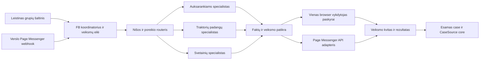

# Facebook kanalas visam nišų tinklui

2026-10-01. **Po savininko pavedimo įgyvendintas atskiras privatus FB core modulis, per-nišos įjungimas, GUI, patvari eilė ir ribotas Codex CLI generavimas. Gyvas rinkimas, Page webhook, siuntimas ir nuolatinis stebėjimas neprijungti.** Faktinis šios pakopos kodas / naudojimas / ribos: [FACEBOOK_MODULE](agent-business-core/FACEBOOK_MODULE.md), [priėmimas](research/facebook-module-2026-10-01/QA.md). Žemiau aprašyta tikslinė architektūra nėra visų jos adapterių veikimo įrodymas. Šis dokumentas papildo [ACQUISITION_CORE](ACQUISITION_CORE.md), o ne kuria antrą CRM. Faktinė paskyros / grupių peržiūra ir aktualūs Meta šaltiniai: [tyrimas](research/facebook-acquisition-2026-10-01/RESEARCH.md). Vykdymo instrukcija: [acquisition skill FB priedas](SKILLS/niche-client-acquisition/references/facebook.md).

## Sprendimas dėl vienos paskyros

Viena FB paskyra turi vieną kanalo koordinatorių. Nišų specialistai gauna savo kontekstą, analizuoja tinkamus signalus ir paruošia veiksmą; paskyrą valdo tik koordinatoriaus adapteris. Nereikia 30 nuolat veikiančių modelių ar 30 tabų. Specialistą paleidžiame konkrečiam darbui su konkretaus siteId faktais.

Diagrama yra tikslinė architektūra. Grupių šaltinio / browser šaka lieka išjungta, kol nėra tinkamo platformos leidimo. Oficialios Page žinutės nėra asmeninio Messenger ar grupių API pakaitalas.

### Kaip dalinamės darbu

| Funkcija | Darbas | Prieiga |
|---|---|---|
| FB koordinatorius | Kanalų registras, darbo eilė, teisių / limitų tikrinimas, rezultatų apskaita | Paskyros susiejimas; nėra laisvos prieigos visiems specialistams |
| Routeris / atranka | Buyer, supplier, referral, employment; niša, apimtis, vieta, aktualumas | Leistinas minimalus signalas ir nišų pasiūlymų aprašai |
| Nišos specialistas | Naudingas atsakymas ir poreikio klausimai pagal BUSINESS | Tik savo siteId patvirtinti faktai ir autorizuoto pokalbio kontekstas |
| Quality | Faktų, konteksto, teisių ir siūlomo veiksmo patikra | Tik konkrečiam veiksmui būtini duomenys |
| Browser / API adapteris | Įvykdyti patikrintą veiksmą; gauti kvitą | Tik reikalingas kanalas; paslaptys serverio pusėje, ne modelio prompte |

Tai funkcijos bendrame runner/router, ne penki nauji serveriai. Esamo `conversation`, `sales`, `supplier`, `quality` pagrindo tęstinumas derinamas su jo vykdytoju. `researcher` / FB adapterių ši sutartis dar neprideda prie veikiančio runtime.

**Browser:** vienas aktyvus FB veiksmas vienai paskyrai, patvarus lease su epoch/fencing, tikslaus tabo ir paskyros konteksto patikra. Pradžioje vienas darbo tabas; pagalbinis tabas tik konkrečiai reikalingai taisyklei ar šaltiniui. Vien tabų skaičius neapsaugo nuo dviejų worker konkurencijos. Kitų sesijų Gmail / core tabai neperimami.

**Page API:** atskiri pokalbiai gali būti apdorojami lygiagrečiai pagal faktinius Meta limitus, tačiau to paties pokalbio veiksmai vykdomi nuosekliai su revision. Jiems Chrome tabai nereikalingi. Browser užraktas neturi stabdyti laiku gautų Page užklausų.

## Savininko mandatas ir reali kanalo prieiga

2026-10-01 savininkas aiškiai delegavo agentui pačiam pasirinkti nišoms tinkamas grupes, stoti į jas, ieškoti tinkamų įrašų ir rašyti įprastus komentarus. Šiose ribose nereikia prašyti patvirtinti kiekvieną grupę ar komentarą. Tai įrašytas mandatas, ne jau atlikti veiksmai.

Mandatas nepaverčia nežinomo vykdytojo patvirtintu meistru, nesuteikia kitų nišų klientų duomenų ar naujos mokamų reklamų autorizacijos. Naujos paskyros / app teisės, teisinis susitarimas, CAPTCHA ar jautrių duomenų perdavimas vertinami pagal konkretaus įrankio taisykles. Įprasti pasirinkimai deleguoti; šių išimčių negalima pakeisti bendru „veik autonomiškai“ promptu.

| Kanalas | Dabartinis įrodymas | Realizacijos sprendimas |
|---|---|---|
| Asmeninės paskyros grupių naršymas / komentarai | Savininko mandatas yra; automatinio naudojimo Meta leidimo įrodymo nėra | Nuolatinio collector ir browser siuntimo neįjungti. Nepateikti UI automatizacijos kaip API apribojimų apėjimo |
| Grupės taisyklės | Viena grupė apžiūrėta; kitos tik kandidatai | Atskirai tikrinti grupės taisykles, identitetą, reklamą ir duomenų naudojimą. Admin leidimas nepakeičia Meta leidimo |
| Asmeninis Messenger | Pokalbiai šiame tyrime neatverti; bendras inbox mandatas / teisės nepatikrinti | Neimportuoti viso asmeninio inbox; nėra oficialios Page integracijos teisės į asmeninius DM |
| Verslo Page Messenger | Aktualus oficialus API kelias patikrintas dokumentacijoje; mūsų Page/app/token nepajungti | Prioritetinis būsimas autonominio inbound kanalas; testuoti tik patvirtintoje Page / app aplinkoje |
| Tinklalapio forma / el. paštas | Esamas atskiras core ir jo dokumentuotos ribos | Išlaikyti savarankišką veikimą. FB nuoroda negali žadėti dar nepaleisto URL ar neveikiančio kontakto |

Aktualūs Meta faktai ir jų šaltiniai laikomi tyrimo 3 skyriuje. MCP, n8n ar browser wrapper savaime nesuteikia šaltinio teisių. Neplanuojame paskyrų keitimo, sesijos slapukų kopijavimo, CAPTCHA apėjimo ar elgsenos maskavimo. Nėra patvirtinto „saugaus komentarų skaičiaus“, kuris pakeistų teisę naudoti kanalą.

## Paskyros ir prekės ženklo modelis

Asmeninė paskyra komentaruose lieka tikru savininko identitetu; ji neapsimeta 30 skirtingų įmonių ar nepriklausomu rekomenduotoju. Kalbant apie mūsų projektą atskleisti ryšį su juo. Bendras operatorius MB Pinet, kontaktas pagal aktualią nišos config; dabar numatytai info@pinet.lt. Neskelbti svetimų telefonų, adresų ar lab issuer rekvizitų.

Pirmam oficialaus Messenger bandymui siūloma viena tikra operatoriaus Page, aiškiai pristatanti aptarnaujamus projektus. Page buvimas / kontrolė šiuo metu UNVERIFIED. Atskira nišos Page galima vėliau, kai turime jai auditoriją ir pagrįstą poreikį. Atskiros asmeninės paskyros nišoms nereikalingos.

SiteId parenkamas iš patikimo įėjimo / Page susiejimo ir kliento pasirinkto klausimo, tikrinant registrą. Bendros Page neaiškus pokalbis lieka `unassigned`, kol išsiaiškinamas poreikis; neparenkame nišos pagal žmogaus vardą. Vienoje gijose vyksta vienas aktualus nišos pasiūlymas. Tikra nauja kito projekto užklausa sukuria atskirą site kontekstą; tai nesuteikia kryžminės reklamos leidimo.

## Per-nišos konfigūracija ir grupių registras

Laikyti atskiro site ACQUISITION dalį: BUSINESS / faktų versija, pirkėjas, konkretūs klausimai, geografijos hipotezė, leistina apimtis ir išimtys, naudingas pasiūlymas, kvalifikavimo kriterijai, tikri URL / kontaktai, veiksmų ir išlaidų ribos, stabdymo kriterijai. Ji nesaugo paskyros slaptažodžio ir nekeičia bazinės kanalo politikos.

Grupės registro minimalūs laukai: tikras groupId / URL, pavadinimas, šalis / kalba / tema, matoma viešumo būsena, `inspectedAt`, taisyklių URL ir peržiūros data, reklamos / automatizacijos / pakartotinio naudojimo būsena, paskyros narystės patvirtinimas, tinkančios nišos, kandidatės / patikrintos / sustabdytos būsena. Nepatvirtinta taisyklė nėra PASS. Neeksportuoti narių ar visų postų „dėl visa ko“.

Šiame tyrime grupė su taisykle nepernešti grupės turinio naudojama tik anoniminiam kanalo vertinimui. Jos autorių kontaktai, postų tekstai ir lead sąrašas nesaugoti. Grupės narystė ar viešumas nėra CRM eksporto licencija.

| Niša | Tinkamo signalo hipotezė | Ką atmesti / kaip padėti |
|---|---|---|
| auksarankiams | Baldų surinkimas, lentynų/karnizų kabinimas, baldo reguliavimas; darbų sąrašas, vieta, laikas | Ne elektra, dujos, santechnika, konstrukcijos ar bendras remontas. Padėti susirašyti apimtį; dabar nežadėti meistro ar atvykimo |
| traktoriupadangos | Pirkėjo padangos keitimo poreikis su technika, pilnu žymėjimu, kiekiu ir laikotarpiu | Pardavėjo reklama nėra pirkėjas. Neparinkti saugaus suderinamumo vien iš dydžio; nežadėti likučio / tiekimo |
| greitossvetaines | Pats verslas ieško svetainės ar aiškiai įvardija užklausų kelio problemą | Meistrų grupės narys nėra savaime svetainės pirkėjas. Neteršti kliento darbų paieškos postų svetainių reklama |

Nišų apimtis tikrinama pagal [auksarankiams BUSINESS](sites/auksarankiams/BUSINESS.md), aktualius [padangų](sites/traktoriupadangos.md) ir [svetainių](sites/greitossvetaines.md) faktus bei kontaktų config. Seni briefų kontaktai ir hipotetinės kainos nėra siuntimo šaltinis.

## Veiksmų eiga ir bendruomenės vertė

1. Iš leistino kanalo gauti minimalų signalą; atskirti originalią datą, stebėjimo datą ir nepatikrintą aktualumą.
2. Atskirai nustatyti `fit`, `intent`, `recency`, `contactability`, `fulfilment`. Teikėjo skelbimas, personalo paieška ar didelis rangos pirkimas nenukreipiamas į smulkių namų darbų pasiūlymą.
3. Parinkti vieną aiškią naudą: trumpą darbų/padangų duomenų ruošinį, vieną tikslinantį klausimą ar naudingą atsakymą. Nuoroda tik kai padeda klausimui ir yra gyva; jokio automatinio 30 domenų reklamavimo.
4. Tikrinti tikrą siuntėjo ryšį su projektu, šaltinio / grupės / adresato / kanalo teises, savininko mandato ribas, dabartinius faktus ir atsisakymą. Nepatvirtintos sąlygos stabdo konkretų veiksmą, ne sukuria naują pažadą.
5. Autorizuotą veiksmą vykdyti iš kanalo eilės. Prieš browser submit dar kartą tikrinti paskyrą, grupę, postą, draft versiją ir gijos aktualumą. Po jo gauti matomą kvitą; moderavimui laukiantis komentaras nėra viešas komentaras.
6. Tik gavus tikrą mūsų projektui adresuotą poreikį registruoti atitinkamą case šaltinį. Viešai pastebėtas prašymas lieka signalas; komentaras / reakcija nepaverčia jo mūsų klientu.

Naudingų postų idėjos pirmai nišai: „ką surašyti, kai reikia surinkti kelis baldus“, „ką nurodyti prieš kabinant lentyną“, „baldo durelių ar stalčiaus problemos aprašas“. Jas skelbti tik tinkamu ir leistinu būdu; nepateikti kaip mūsų atliktų darbų, ekspertinės tvirtinimo garantijos ar grupės admino rekomendacijos.

Kvietimas rašyti PM viename konkrečiame poste nėra leidimas reklamuotis visiems grupės nariams. Oficialus Page adapteris negali iš grupės profilio padaryti Page pokalbio. Asmeninės komunikacijos plėtrai reikėtų konkretaus autorizuoto verslo pokalbio ir tinkamos kanalo prieigos; visas savininko asmeninis inbox nepatenka į šį planą.

## Integracija su esamu core

Esamame `agent-business-core/runtime/src/pinet_core/models.py` patikrinti Business/siteId, Case ir CaseSource. `CaseSource` unikalumas apima environment / source_system / site_id / source_record_id; dabartiniai pašto moduliai nėra jau įgyvendintas universalus FB transportas. FB žinutė neturi apsimesti MailMessage. Naujam adapteriui reikia tikro kanalo įrašo ir migracijų / RLS patikros, suderintų su vykdytoju.

Siūlomi kanalo konceptai, **ne naujos DB lentelės ar veikiantys endpointai**:

| Konceptas | Būtini duomenys / elgesys |
|---|---|
| AccountBinding | Operatorius, paskyros/Page raktas, leistinas adapteris, aplinka, įrodyta prieiga, pause; token tik secret store |
| ChannelPolicy | Teisių šaltinis/data, versija, faktinis messaging window pagrindas ir expiry, numatytas išjungimas |
| Signal | siteId arba unassigned, minimali leistina kilmė, šviežumas ir kvalifikavimas; ne Case |
| ActionJob | siteId, account/Page/group/thread, paskirties ID, faktų/prompt/policy hash, vienas veiksmas, TTL, dedup key, būsena |
| ChannelReceipt | Platformos message/comment ID, attemptId, submitted/pending/visible/failed/uncertain; be slapukų ar viso ekrano istorijos |
| CaseSource | Tikro inbound event/message ID; kanalo ir site kontekstas, originalus ID išlieka |

Page pokalbio asmens raktas turi būti page/account-scoped, ne vien vardas ar PSID be Page. Email, voice ir FB tapatybės nesujungiamos pagal panašų vardą; reikia patikrinto vartotojo susiejimo. Bendras suppression neatskleidžia kitų nišų klientų tekstų. FB signalas, realus reply ir vėliau D1 forma deduplikuojami tik turint patikimą ryšį; neaiškus ryšys nėra aklas merge.

Webhook priėmimas turi patikrinti kilmę, deduplikuoti įvykį, patvariai saugoti jį ir greitai grąžinti kvitą. Prioritetas tikram inbound, o ne grupių tyrimui. Automatinio atsako delsą tikrinti pagal aktualią Meta politiką; nenaudoti lėtos Codex CLI užduoties kaip vienintelio sinchroninio webhook kelio. Greitas atsakymas turi būti tikras, o vėlyvas worker pakartotinai tikrina langą prieš siųsdamas.

Siuntimas po timeout nėra automatiškai kartojamas. API ir UI pristatymo neaiškumas turi `uncertain` būseną ir sutikrinimą; nenuliname idempotency pakeisdami tabs ar worker. Lease praradęs browser worker nebegali submit. Paskyros iššūkis / taisyklių pasikeitimas sustabdo atitinkamą kanalą; svetainės forma ir paštas lieka nepriklausomi.

## GUI

Plėsti esamą operatoriaus core UI, nekeisti turinio kalendoriaus klientų CRM kopija. Bendras `Kanalai → Facebook` vaizdas:

- **Grupės:** kandidatas/patikrinta/narystė, taisyklės, data, tinkančios nišos, nežinomos teisės; narių sąrašo nėra.
- **Signalai:** pirkėjas / partneris / personalas, siteId, šviežumas, tinkamumo priežastis, minimalūs leistini duomenys. UNVERIFIED matomas.
- **Veiksmų eilė:** parengtas / autorizuotas / laukia / įvykdytas / moderuojamas / uncertain / sustabdytas, konkretus kvitas ir blokavimo priežastis.
- **Pokalbiai:** tik autorizuoti verslo pokalbiai, konkrečios nišos case, aktuali window būsena, kitas veiksmas; ne savininko visas asmeninis inbox.
- **Rezultatai:** tikri projektui adresuoti poreikiai, kvalifikuoti poreikiai, partnerio priėmimai, vykdymas, mokėjimas, sąnaudos; synthetic / supplier / buyer atskirai.
- **Valdymas:** bendras ir per-nišą pause, riboti kanalai / veiksmai / išlaidos, instrukcijų versija. Modelis pats nepakelia teisių ar biudžeto.

Tai suplanuotas UI; naujo FB ekranų šiame etape nėra.

## Įgyvendinimo seka

| Etapas | Rezultatas | Priklausomybė ir baigimo įrodymas |
|---|---|---|
| F0 — atlikta | Paskyros ribota peržiūra, grupės/šaltiniai, planas ir skill priedas | Tik dokumentų priėmimas; jokio bot runtime ar pardavimų PASS |
| F1 — paruošimas | Per-nišos config, SourcePolicy, privati signalų/draft eilė, GUI maketas, kalibravimo fixture | Teisėtas duomenų įėjimas; anoniminės/redaguotos synthetic situacijos; nėra nuolatinio grupių collector |
| F2 — Page inbound | Vienas tikras Page/app susiejimas, webhook/queue/send adapteris, esamas case ryšys | Tikrinti konkrečios Page kontrolę, realius scopes/access/review reikalavimus, privatumo/secret tvarką ir endpoint testus; paskui ribotas gyvas mandatas |
| F3 — leistinas grupių veiksmas | Pasirinktas tinkamas adapteris ir grupių registry, vienas account writer | Tik realus platformos automatizacijos pagrindas bei grupės/duomenų/veiksmo sąlygos. Jei jų nėra, šaka lieka off |
| F4 — plėtra | Daugiau nišų / kontekstų pagal patikrintus scenarijus | Kokybiškas tikras poreikis ir ekonomika; nediegti commerce/voice vien dėl FB aktyvumo |

Savininko įprastų komentarų/join mandatas jau yra. Trūkstamas Meta leidimas nėra dar vienas „ar leidžiate?“ klausimas savininkui. F2 app susiejimo naujas sensitive access yra atskira konkreti integracijos operacija; šiame tyrime jos nepradėjome.

Pirmas poreikio bandymas: auksarankiams, 1–3 tinkamos grupės arba Page įėjimo šaltiniai, 14 dienų po leistino kanalo ir tikro kontaktų kelio paleidimo. Riboti tyrimo laiką, vienkartines ir nuolatines AI sąnaudas; naujų prenumeratų / reklamos išlaidų biudžetas dabar 0 €. Šie skaičiai yra eksperimento pasirinkimas, ne rinkos prognozė ir ne platformos leidžiami limitai. Vienu metu nepradėti visų 30 nišų socialinių kampanijų.

Pirmo ciklo mokymosi tikslas: bent 3 tikri tinkami mūsų projektui adresuoti poreikiai su darbais, miestu ir laikotarpiu; atskirai vertinti mokėjimo ketinimą ir vykdymo galimybę. Šis slenkstis nėra leidimas pereiti į antrą verslo fazę: galioja konkrečios nišos BUSINESS plėtros kriterijai. Neigiamas rezultatas vertinamas kartu su realia ekspozicija; neradome tarp netinkamų postų ≠ rinkos nėra.

## Kalibravimas ir priėmimas

Šios FB runtime patikros yra **NOT RUN**. Jos turi papildyti esamą core eval, o ne persivadinti dabartiniais jo pašto testais. Turėti development ir nematytus scenarijus; neeksportuoti tikrų grupės klientų tekstų į fixture. Kritinių teisių / tapatybės / netikrų faktų klaidų negali atsverti vidutinis „gero tono“ balas.

- [ ] Viena paskyra / dvi nišos / du browser worker: vienas lease, teisingas target, nėra dubliuoto ar kitos nišos komentaro.
- [ ] Buyer, supplier, employment ir didelis rangos poreikis atskiri; grupės miesto pavadinimas nepakeičia faktinės vietos.
- [ ] Nežinoma post data / senas terminas / crosspost / redaguotas poreikis nepriimami kaip nauji kvalifikuoti klientai.
- [ ] Nežinomi meistrai, likutis, suderinamumas, terminas ir kaina nesukuria vykdymo pažado; neleidžiamos darbų kategorijos nukreipiamos teisingai.
- [ ] Savininko mandatas nepakeičia Meta / grupės / duomenų teisių; rule change, account challenge ir pause sustabdo tik reikiamą kanalą.
- [ ] Prompt injection postuose, profiliuose, komentaruose ir prieduose negali pakeisti siteId, mandato, kainų ar atskleisti sekretų.
- [ ] Asmeninis DM, grupės profilis, Page komentaras ir Page Messenger nepasikeičia vietomis; tikras įėjimo event parenka tinkamą messaging window.
- [ ] Standartinio lango expiry, sąlyginė ad-origin išimtis, vėlyvas job ir HumanAgent apribojimas tikrinami tikromis kanalo taisyklėmis; ne pažadais iš modelio.
- [ ] Webhook tampering/replay, dvigubas event, 30 s automatinio atsako delsa, crash, uncertain send ir stale revision turi prasmingus adapterio testus.
- [ ] Bendros Page neaiškus siteId lieka unassigned; Page-scoped asmens raktas nesujungia nesusijusių klientų; RLS ir per-site kontekstas tikrinami.
- [ ] Tikras inbound, partnerio atsakymas, synthetic ir D1 dubliuotas įvykis nesumaišo paklausos metrikų; atsisakymas stabdo atitinkamą komunikaciją.
- [ ] Vienas actual kanalo kvitas, realus atsakymas ir teisingas case ryšys parodomi UI; submitted/pending/visible ir gautos užklausos būsenos skiriasi.
- [ ] Sąnaudų / laiko ribos, pauzė, kandidato baseline palyginimas ir rollback veikia; savikalibracija nekeičia teisių, mandatų, faktų ar public paketų.

## Derinimo būsena

Šio plano case / queue / channel / kalibravimo sąsaja perduodama savininko autorizuotai sesijai `01a0f1fa-3e13-7ab0-867b-d0091e73e1b7`. Jos runtime ir `voice-agent-plan/` šioje root užduotyje neredaguoti. [Koordinavimo įrašas](research/facebook-acquisition-2026-10-01/COORDINATION.md) atskiria išsiųstą pasiūlymą, vykdytojo atsakymą ir tikrą integracijos patikrą.
