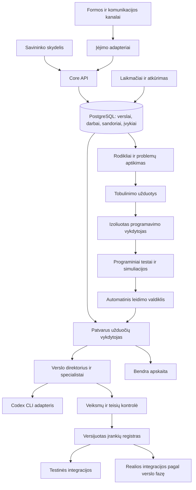

# Agentinių verslų core architektūra

Data: 2026-09-30. Būsena: pasirinkta įgyvendinimo kryptis, runtime dar nesukurtas. Projektuojamas vieno savininko valdomas nišinių verslų portfelis. Pirmas rezultatas — keturi skirtingi verslai simuliacijoje ir nuo pirmo bandymo veikiantis automatinio tobulinimo procesas.

## 1. Tikslas ir sėkmės kriterijai

Kiekvienas verslas turi direktorių, kuris stebi rezultatą, nustato procesų spragas, formuoja specialistus ir skiria darbus. Specialistai gali kurti savo instrukcijas, darbo procesus ir reikalingų įrankių kodą. Bendra platforma suteikia jiems vykdymo aplinką, duomenis, patvarias užduotis ir ribotas teises. Savininkas valdo tikslus, kapitalą ir nepasiekiamus verslo faktus.

Tiksliniai rodikliai: sėkmingi procesai, kritinių klaidų dažnis, likęs uždarbis, savininko minutės vienam rezultatui, agentų naudojimas, atkūrimo laikas ir automatiškai įdiegtų naudingų pataisų dalis. Agentų, žinučių ar sugeneruotų failų kiekis nėra verslo sėkmės rodiklis.

## 2. Brainstorm ir pasirinkimas

| Variantas | Privalumas | Silpnoji vieta | Sprendimas |
| --- | --- | --- | --- |
| Katalogas su daug MD failų ir laisvai paleidžiamais agentais | Greitai parodo vaidmenų idėją | Neužtikrina sandorio būsenos, teisių, pakartojimų ir rezultatų kilmės | MD naudoti instrukcijoms; pridėti patvarų runtime |
| Atskira programa ir infrastruktūra kiekvienai nišai | Lengva atskirti vieną projektą | Dubliuojamos integracijos, taisymai, priežiūra ir apskaita | Vienas core, atskiri verslo paketai |
| Daug mikroservisų, atskiras serveris kiekvienam agentui | Galima nepriklausomai plėsti komponentus | Didelė pradinė eksploatavimo apimtis | Pradėti nuo modulinio monolito ir kelių vykdytojų |
| Pilnas generinis ERP prieš pirmą simuliaciją | Atrodo išsamus | Neaišku, kokių funkcijų realiai reikia | Įgyvendinti bendrą minimalų sandorio kelią ir keturis skirtingus procesus |
| Agento laisvas produkcijos kodo perrašymas | Trumpas kelias nuo idėjos iki pakeitimo | Pataisa gali sugadinti veikiančius sandorius ar vertinimą | Izoliuota kūrimo aplinka, automatiniai vartai ir grąžinimas |

Pasirinkimas: **Python modulinis core, PostgreSQL, Codex CLI adapteris, programiškai vykdomos taisyklės ir atskiras simuliacijos bei pakeitimų tikrinimo sluoksnis.** Tai projekto sprendimas, ne vienintelis galimas technologijų rinkinys.

## 3. Komponentų schema



LLM parenka veiksmą ir paruošia argumentus. Core tikrina leidimą, faktus ir būseną, atlieka veiksmą bei išsaugo rezultatą. Sąskaitos, mokėjimai, užsakymo būsena ir biudžeto rezervacija turi aiškias programines taisykles.

## 4. Technologijos ir paleidimo modelis

| Dalis | Pirmo core pasirinkimas | Paskirtis |
| --- | --- | --- |
| API ir domeno logika | Python, FastAPI, Pydantic | Tipizuoti įėjimai, veiksmų schema, verslo taisyklės |
| Būsena ir užduotys | PostgreSQL, SQLAlchemy, Alembic | Transakcijos, eilė, dokumentai, versijos, migracijos |
| AI | Įdiegtas ir autentifikuotas Codex CLI | Struktūruoti sprendimai, analizė ir izoliuotas programavimas |
| Operatoriaus UI | React ir TypeScript, nedidelis atskiras frontend | Portfelio būklė, eiga, dokumentai, savininko klausimai |
| Artefaktai | Vietinė failų saugykla su hash ir DB nuorodomis | Bandymų dokumentai, ataskaitos, patvirtinti paketai |
| Kodo pakeitimai | Git ir izoliuoti darbo katalogai | Pataisų diff, versijos, patikrinimas ir grąžinimas |
| Eksploatavimas | Atskirai paleidžiami API, worker, scheduler ir builder procesai | Vykdymas nepriklauso nuo atviro pokalbio |

Pirmoje simuliacijų aplinkoje PostgreSQL paleidžiamas lokaliai arba izoliuotame konteineryje. Tikras 24/7 darbas vėliau perkeliamas į tinkamą serverį su atsarginėmis kopijomis ir proceso priežiūra. Užmiegantis savininko kompiuteris nėra patikimas produkcijos vykdytojas.

Tikslūs palaikomų bibliotekų leidimai fiksuojami diegimo pradžioje lock failuose. Pradžioje nepridedame privalomų Redis, Celery, Temporal, Kubernetes ar vektorinės DB priklausomybių. Jei išauga procesų koordinavimo poreikis, patvaraus vykdymo sąsaja leidžia pakeisti adapterį neišardant verslo modulių.

## 5. Duomenų ir aplinkų atskyrimas

Pagrindiniai identifikatoriai: `portfolio_id`, `business_id`, `legal_entity_id`, `environment_id`, `run_id`, `case_id` ir `correlation_id`. Verslas yra niša arba prekės ženklas; juridinis asmuo yra dokumentų ir finansinių pareigų subjektas. Jų nesutapatiname.

Kiekviena verslo užklausa vykdoma serverio nustatytame verslo ir aplinkos kontekste. Agentas negali pakeisti `business_id` tekste ir taip gauti kitos nišos duomenis. Bendros apskaitos paslauga turi aiškiai įvardytą portfelio skaitymo mandatą.

PostgreSQL eilučių lygio politika papildys API filtrus. Runtime DB rolė neturi būti superuser, lentelių savininkas ar `BYPASSRLS`; PostgreSQL dokumentacijoje aprašytos šių rolių išimtys, todėl vien įjungti RLS neužtenka. [PostgreSQL RLS](https://www.postgresql.org/docs/current/ddl-rowsecurity.html)

Verslo kontekstas nustatomas kiekvienoje DB transakcijoje per `SET LOCAL`, prieš bet kurią verslo duomenų užklausą. Trūkstant konteksto prieiga atmetama. Ryšio grąžinimas į pool negali palikti ankstesnės nišos konteksto; būtinas bandymas, kuriame tas pats ryšys paeiliui aptarnauja dvi nišas. Sudėtinės objektų sąsajos tikrina ir verslo bei aplinkos ID. Failų atsisiuntimas, paieška ir atminties parinkimas vykdo tas pačias teises kaip DB; vien sunkiai atspėjamas artefakto ID nėra leidimas. Agentams ir jų generuotam kodui nesuteikiama laisva SQL prieiga. [PostgreSQL transakcijos nustatymai](https://www.postgresql.org/docs/current/sql-set.html)

Simuliacija, staging ir produkcija turi atskirus prisijungimus, artefaktų vietas ir kanalų konfigūraciją. Testiniai kontaktai bei sąskaitos pažymimi infrastruktūros metaduomenyse. Jų negalima importuoti į viešos svetainės paketą ar tikrą apskaitą.

## 6. Verslo paketas ir agentų failai

Numatoma struktūra, kuri bus įgyvendinta roadmapo M2 etape:

```text
businesses/<businessId>/
  BUSINESS.md                  # Patvirtinti faktai, pasiūlymas, hipotezės
  AGENTS.md                    # Šios nišos darbo instrukcijos
  business.yaml                # Verslo tipas, fazė, kontaktų nuorodos
  mandate.yaml                 # Savininko ribos ir leistinos veiklos
  agents/<role>.md             # Specialisto užduotis ir darbo metodas
  agents/<role>.yaml           # Vykdytojui reikalingas tipizuotas aprašas
  workflows/                  # Deklaruojami procesai ir būsenų perėjimai
  integrations/               # Įrankių ir kanalų konfigūracija be sekretų
  evaluations/                # Matomi mokomieji scenarijai
  facts/                      # Šaltinių ir patvirtintų teiginių aprašai
```

Dinaminė klientų atmintis ir finansinė būsena laikoma DB. MD failuose nerašomi slaptažodžiai, pilnos klientų duomenų bazės ar nepatikrintos įmonės teisės. Instrukcijos versijuojamos; kiekvienas vykdymas saugo jų hash ir registruotą versiją.

Prieš aktyvavimą manifestas, instrukcijos, schemos ir įrankių versijos sujungiami į nekintamą patikrintą paketą. Vykdymas skaito registruotą paketą, ne ką tik agento perrašytą failą. Pasiūlyta rolė pirmiausia turi būseną `proposed`, po schemos, mandato ir jos užduočių bandymų — `active`. Tos pačios rolės kūrimo užklausa deduplikuojama; agentų išjungimas neatšaukia jų jau įvykusių veiksmų istorijos.

Agentui būtini laukai: rolė, tikslas, užduočių tipai, rezultato schema, matomi duomenys, leistini įrankiai, laiko ir naudojimo ribos, perdavimo sąlygos bei kokybės kriterijai. Director gali generuoti naują specialisto paketą, tačiau core jį patikrina pagal schemą ir leidžiamą mandatą prieš aktyvuodamas.

Pavyzdinis, dar nevykdomas specialisto aprašas:

```yaml
schema_version: 1
role: supplier_sourcing
business_id: pilot_physical
purpose: Gauti palyginamus tiekėjų pasiūlymus
runtime_profile: codex_structured
tools:
  - suppliers.search
  - offers.request
  - offers.compare
output_schema: supplier_shortlist.v1
limits:
  max_steps: 20
  max_children: 0
  max_retries_per_action: 2
permissions:
  can_change_bank_details: false
  can_raise_budget: false
```

Šie skaičiai yra siūlomi pradinių simuliacijų nustatymai. Realios piniginės ribos nustatomos savininko mandate; jų neišgalvojame.

## 7. Agentų organizacija

| Vaidmuo | Atsakomybė | Kaip matuojama |
| --- | --- | --- |
| Portfelio valdytojas | Prioritetai tarp nišų, bendras kapitalo ir naudojimo paskirstymas | Nišų rezultatai ir naudojimas pagal mandatą |
| Verslo direktorius | Komandos sudarymas, užduotys, kliūtys, ekonomika | Proceso sėkmė, marža, išimtys ir atsakymo laikas |
| Pardavimų specialistas | Poreikio išaiškinimas ir pasiūlymas | Faktų tikslumas, tinkami klausimai, konversija |
| Tiekėjų specialistas | Tiekėjo patikra ir palyginamos sąlygos | Patvirtintas prieinamumas, bendra kaina, terminas |
| Vykdymo specialistas | Užsakymo ar projekto įvykdymo sekimas | Terminai, klaidos, aiški galutinė būsena |
| Turinio specialistas | Klausimų ir turinio procesas per studiją | Naudingi URL, faktų patikra, tikros užklausos |
| Bendras apskaitos agentas | Dokumentų surinkimas, susiejimas ir savininko paketas | Pilnumas, dublikatai, neatitikimai |
| Sistemos tobulinimo agentas | Problemos, prioritetai ir pataisų užduotys | Naudingi įdiegti pakeitimai ir regresijos |
| Programavimo agentas | Pataisos ir nauji įrankiai izoliuotoje aplinkoje | Testai, simuliacijos, aiškus diff |
| Vertinimo agentas | Pokalbio ir artefaktų vertinimas pagal fiksuotą rubriką | Atitikimas programinėms ir etaloninėms patikroms |

Specialistas yra užduotims aktyvuojama rolė, nebūtinai nuolat veikiantis procesas. Direktorius pirmiausia panaudoja esamą rolę ar darbo procesą. Nauja rolė kuriama, kai turi konkretų rezultatą ir išmatuojamą poreikį. Ribojamas specialistų skaičius, delegavimo gylis ir bendras kvietimų biudžetas; rekursyvus neribotas agentų kūrimas negalimas.

## 8. Codex CLI vykdymas

AI darbams šiame etape naudojamas tik Codex CLI. Domenų vertintojui savininkas aiškiai nurodė `gpt-6.1-sol` ir `xhigh`. Core simuliacijų pradinis profilis siūlomas toks pats; kiekvienos rolės profilis registruojamas ir patikrinamas prieš vykdymą. Modelio ar nustatymų pakeitimas sukuria naują vertinimo versiją. Tylus perėjimas prie kito modelio neleidžiamas.

Operacinis agentas gauna minimalų kontekstą ir grąžina struktūruotą `NextAction`: veiksmą, argumentus, naudotų faktų nuorodas ir laukiamą rezultatą. Core vykdo įrankį ir jo rezultatą pateikia kitam žingsniui. Programa tikrina JSON schemą ir faktų nuorodas; sėkmingas JSON formatas dar neįrodo teisingo sprendimo.

Codex dokumentuotas neinteraktyvus `exec`, JSONL įvykių srautas ir `--output-schema` yra adapterio pagrindas. [Codex neinteraktyvus vykdymas](https://learn.chatgpt.com/docs/non-interactive-mode)

Pardavimo agentams nereikia laisvo shell ar prieigos prie projekto sekretų. Programavimo vykdytojas turi atskirą darbų katalogą ir kitą įrankių profilį. Jo pakeitimai pasiekia aktyvų kodą tik per release valdiklį. CLI procesai turi timeout, išvesties ribas ir viso proceso medžio stabdymą.

Adapteris registruoja CLI versiją, modelį, reasoning effort ir visus įkeltus instrukcijų šaltinius. Jis naudoja atskirą techninį profilį ir darbo vietą, nekeisdamas savininko bendrų nustatymų. `--ignore-user-config` išjungia naudotojo konfigūraciją, tačiau savaime nėra įrodymas, kad neįsikėlė globalus ar tėvinis `AGENTS.md`: jų parinkimą reikia atskirai kontroliuoti ir patikrinti. Kiekvienas pilotas gauna tik jo paketą, be kitos nišos instrukcijų ar paslėptų vertinimo duomenų. [Codex instrukcijų parinkimas](https://learn.chatgpt.com/docs/agent-configuration/agents-md)

Kūrimo izoliacija turi būti techninė: atskira konteinerio, VM arba patikrintų OS teisių aplinka, ribotas tinklas, CPU, atmintis, diskas ir vykdymo laikas. Ji neturi aktyvaus repo, apsaugoto valdiklio, tikrų verslo prisijungimų ar hosto valdymo prieigos. Codex autentifikacijai būtina vykdytojo prieiga laikoma atskirai nuo generuojamo kodo ir jo paleidžiamų procesų; jų bandymas nuskaityti prisijungimų failus turi būti atmestas. Git worktree tinka pakeitimams koordinuoti, tačiau dalijasi repo duomenimis, todėl vien jo sukūrimas neizoliuoja nepatikimo kodo. Kūrėjui pateikiama atskira bazinės versijos kopija arba eksportas. Izoliacijos bandymas būtinas ir šiame Windows kompiuteryje, ir būsimoje serverio aplinkoje. [Git worktree](https://git-scm.com/docs/git-worktree), [Codex sandbox](https://learn.chatgpt.com/docs/sandboxing)

Paskyros naudojimo limitas reiškia laukimo būseną su pakartojimo laiku. Saugojami tokenai, trukmė ir limitų įvykiai. CLI nepateikiamos patikimos USD kainos nevadiname nulinėmis išlaidomis; rodome „kaina nežinoma“ arba atskirai pagrįstą sąnaudų modelį.

## 9. Patvarus vykdymas ir darbų eilė

DB užduoties būsenos: `queued`, `leased`, `running`, `waiting_external`, `waiting_owner`, `succeeded`, `retry_scheduled`, `failed` ir `cancelled`. Darbas turi `lease_owner`, `lease_until`, `heartbeat_at`, bandymų skaičių, kitą paleidimo laiką ir rezultato nuorodą.

Kiekvienas perėmimas padidina `lease_generation`. Rezultato įrašymas, heartbeat ir veiksmo leidimas galioja tik dabartinei kartai bei galiojančiam lease. Pasibaigusio darbo senas vykdytojas gali dar grąžinti LLM atsakymą; gateway tokio atsakymo neveikia, o DB nepriima jo kaip naujos būsenos. Sustabdymas ar mandato atšaukimas tikrinamas iš naujo prieš išorinį veiksmą. Vien proceso užmušimas negarantuoja, kad jau išsiųstas tinklo prašymas neįvyko.

Vykdytojas trumpa transakcija pasiima darbą ir suteikia lease. LLM kvietimo ar išorinio API metu DB transakcija nelaikoma atidaryta. Nutrūkus procesui pasibaigęs lease leidžia darbą perimti. `FOR UPDATE SKIP LOCKED` tinkamumas eilės tipo lentelėms aprašytas PostgreSQL dokumentacijoje; šiame projekte jį siūlome darbo paėmimui, kartu įgyvendinant lease ir pakartojimų taisykles. [PostgreSQL SELECT](https://www.postgresql.org/docs/current/sql-select.html)

Procesas saugo `workflow_version` ir užbaigto žingsnio rezultatą. Perkrovimas tęsia patvarią būseną. Kritiniams sandoriams vienu metu leidžiamas vienas būseną keičiantis veiksmas; versijos numeris apsaugo nuo pasenusio pasiūlymo patvirtinimo.

Įrašas ir susijęs outbox įvykis išsaugomi viena transakcija. Pristatymas vyksta vėliau, su pakartojimais. Vykdymas projektuojamas kaip galintis pasikartoti; šalutinių veiksmų dubliavimą stabdo idempotency raktai ir išoriniai kvitai. Viso tinklo „exactly once“ pažado neteikiame.

Šalutinis veiksmas turi atskirą patvarų `action_id` ir būsenas `prepared`, `dispatched`, `unknown`, `confirmed`, `rejected`. Ketinimas, argumentų hash, gavėjas, įrankio versija ir biudžeto rezervacija įrašomi prieš siuntimą. Tas pats loginis veiksmas visuose bandymuose naudoja tą patį idempotency raktą; naujas job bandymas nesukuria naujo užsakymo rakto. Pakartojimas tuo pačiu raktu su kitu turiniu atmetamas. Pasikeitęs pasiūlymas reiškia atskirą aiškiai leidžiamą verslo veiksmą.

Timeout po siuntimo reiškia `unknown`, kol patikrintas tiekėjo kvitas, užsakymo paieška ar kitas autoritetingas šaltinis. Adapteris, neturintis patikimo kartojimo arba sutikrinimo būdo, nekartoja neaiškaus užsakymo ar mokėjimo automatiškai: sustabdo šį veiksmą ir ieško patvirtinimo. Neaiški būsena neatlaisvina galimai panaudotų lėšų. Įeinantys callback turi autentifikaciją, pasikartojimų kontrolę ir šaltinio ID; vėluojantis kvitas gali išspręsti `unknown`, bet negali perrašyti naujesnių sąlygų. Korekcija yra naujas susietas veiksmas.
## 10. Veiksmų kontrolė ir komercinis mandatas

Efektyvios agento teisės yra verslo mandato, agento profilio, įrankio registro ir aplinkos leidimų sankirta. MD failo pakeitimas šių teisių nepadidina. Bendra kontrolė tikrina dokumento versiją, sandorio būseną, gavėją, piniginę ribą, patvirtintus faktus ir veiksmo paskirtį.

Finansinis limitas tikrinamas ir rezervuojamas viena transakcija viso juridinio asmens bei verslo taikymo srityje. Du agentai negali atskirai perskaityti to paties likučio ir abu jį panaudoti. Patvirtintas kvitas rezervaciją paverčia faktiniu įrašu, patvirtintas neįvykimas ją atlaisvina, `unknown` ją išlaiko. Mandato versija saugoma įrodyme, tačiau vėlesnis teisių atšaukimas galioja ir seniems procesams.
Savininkas vieną kartą pateikia nepasiekiamus duomenis: realius rekvizitus, prieigas, kontaktų išimtis ir pageidaujamus komercinius limitus. Toliau pasiūlymai, sutartys ir kiti veiksmai, atitinkantys mandatą, vykdomi automatiškai. Trūkstama piniginė riba nėra leidimas agentui ją susigalvoti.

Mandato neatitinkantis prašymas sprendžiamas alternatyva, derybomis, atsisakymu ar proceso sustabdymu. Sistemai nereikia savininko leidimo kiekvienam įprastam sandoriui. Agentas negali pats keisti savininko nustatyto bendro išlaidų limito, teisinio subjekto ar lėšų gavėjo tapatybės.

Komunikacijos žinutės, tiekėjo PDF ir tinklalapis laikomi duomenimis. Juose esančios instrukcijos negali suteikti naujų įrankių teisių ar keisti sistemos taisyklių. Naujo banko gavėjo patikra remiasi atskiru patvirtintu procesu, o ne vien prašymu laiške.

## 11. Įrankiai, kanalai ir agentų darbo aplinka

Kiekvienas įrankis turi vardą, versiją, įėjimo ir išėjimo schemą, leidimus, šalutinio veiksmo tipą, timeout, pakartojimo ir idempotency taisykles. Kanalų adapteriai tą pačią bendrą žinutę susieja su gija, verslu, gavėju ir aplinka.

Įrankio sukūrimo eiga: poreikis → integracijos specifikacija → izoliuotas kodas → adapterio sutarties testai → simuliacija → įregistruota versija → ribotas aktyvavimas. Esama leidžiama jungtis gali būti įjungta automatiškai. Neprieinama registracija ar tapatybės patvirtinimas sukuria savininko klausimą.

Sekretai laikomi už agento instrukcijų ir kūrimo katalogų ribų. Įrankių gateway pasiima tinkamą prisijungimą konkrečiam verslui bei aplinkai. OAuth tokenai neišsiunčiami kitai tarnybai kaip universalūs kredencialai; tai atitinka MCP saugumo gairėse aptariamus tokenų paskirties ir perdavimo apribojimus. [MCP saugumo gairės](https://modelcontextprotocol.io/docs/2026-07-28/tutorials/security/security_best_practices)

Naršyklės automatizavimas naudojamas tik kai nėra tinkamos API ar struktūruoto būdo. Adapteris turi aptikti pasikeitusį puslapį ir neleisti tyliai interpretuoti neteisingo lauko. Naujos paslaugos mokamas planas pasirenkamas pagal pateiktą mandatą; neatitinkanti paslauga atmetama arba ieškoma alternatyvos.

## 12. Bendras duomenų modelis

| Grupė | Pagrindinės lentelės ar objektai |
| --- | --- |
| Organizacija | `portfolios`, `legal_entities`, `businesses`, `mandate_versions` |
| Agentai | `agent_specs`, `agent_versions`, `runs`, `jobs`, `workflow_instances` |
| Komunikacija | `contacts`, `conversations`, `messages`, `channel_receipts` |
| Sandoriai | `leads`, `supplier_offers`, `quotes`, `agreements`, `orders`, `fulfillments` |
| Dokumentai | `documents`, `invoice_records`, `payment_records`, `document_matches` |
| Įrodymai | `facts`, `sources`, `evidence_refs`, `artifacts` |
| Įvykiai ir kontrolė | `events`, `outbox`, `action_intents`, `action_receipts`, `budget_reservations` |
| Tobulinimas | `issues`, `experiments`, `changesets`, `eval_runs`, `releases` |
| Savininkas | `owner_requests`, `owner_inputs`, `access_requirements` |

Tai duomenų modelio projektas, ne įgyvendintos lentelės. Finansinėms reikšmėms naudojami sveiki mažiausių valiutos vienetų skaičiai ir aiški valiuta. Mokesčių skaičiavimo taisyklės bei apvalinimas versijuojami pagal realų juridinį subjektą; jų nenustato laisvas LLM tekstas.

Sandoris prieš pasiūlymą fiksuoja komercinį vaidmenį: kas pardavėjas, kas tarpininkas, kas gauna kliento lėšas, už ką išrašomas dokumentas ir kada uždirbamas komisinis. Šio vaidmens negalima tyliai pakeisti jau priimtame pasiūlyme. Pajamų metrika atskiria kliento užsakymo vertę, mūsų komisinį, faktiškai gautas pajamas, tiesiogines išlaidas, grąžinimus ir AI sąnaudas; tiekėjo apyvarta nepriskiriama mūsų pelnui.

Sutartis ir sąskaita turi šaltinio pasiūlymo, šablono ir duomenų versijas. Dokumento pataisa sukuria naują artefaktą ir aiškų ryšį su ankstesniu. Galutinės būsenos tikrinamos pagal DB ir kvitus. Frazė „išsiunčiau“ pokalbyje nėra pristatymo įrodymas.

## 13. Bendras apskaitos agentas

Surinkimas → dokumentų nuskaitymas → struktūros patikra → juridinio asmens ir nišos priskyrimas → dublikatų aptikimas → susiejimas su užsakymu bei mokėjimu → neatitikimų sprendimas → savininko paketas.

Pakete yra dokumentai, suvestinė, neapmokėti įrašai, trūkstami dokumentai ir korekcijų istorija. Dokumento nuskaitymo klaida nesukuria naujo patvirtinto fakto. Neatitikimus agentas pirmiausia sprendžia su dokumento šaltiniu. Asmeniui perduodamas tik nepasiekiamas faktas ar prieiga.

Pirmame core apskaitos agentas administruoja dokumentus ir jų atitikimą. Deklaravimas, konkreti apskaitos programa ir realių mokėjimų vykdymas vėliau jungiami atskirais adapteriais pagal patikrintas taisykles bei mandatą. Dokumentų surinkimo demonstracija nėra patvirtinimas, kad visa buhalterinė apskaita įgyvendinta.

## 14. Atmintis ir šaltinių patikimumas

Skiriami patvirtinti verslo faktai, išoriniai pasiūlymai, kliento teiginiai ir hipotezės. Faktas turi kilmę, patikros laiką, galiojimą ir taikymo sritį. Iš tiekėjo pasiūlymo gauta kaina galioja tik jo nurodytomis sąlygomis; prieš privalomą veiksmą patikrinama aktuali versija.

Kontekstas parenkamas konkrečiai užduočiai. Agentas negauna visos portfelio klientų istorijos. Įvykiai ir metrikos saugo nuorodas bei minimalius duomenis; kontaktų ir dokumentų saugojimo terminai apibrėžiami atskirai. Simuliacijų duomenys visi sintetiniai.

Žinios iš vienos nišos į bendrą biblioteką perkeliamos kaip anoniminis procesas, taisyklė ar įrankis. Kitų nišų klientų duomenys nepaverčiami bendra atmintimi.

## 15. Savininko priežiūra ir klausimų taisyklė

Skydelis rodo keturias grupes: verslų rezultatus, agentų darbų eigą, automatinio tobulinimo istoriją ir savininko reikalingus duomenis. Operacijų žurnalas skirtas peržiūrai; savininkas neprivalo skaityti kiekvieno pokalbio.

Leidžiami `OwnerNeed` tipai:

- `account_access` — reikalingas prisijungimas, registracija, OAuth, MFA ar nepasiekiamas paskyros veiksmas.
- `owner_fact` — trūksta neviešo fakto, rekvizito, nuosavybės įrodymo, mandato reikšmės ar kito savininko duomens.

Prieš klausimą agentas patikrina turimą patvirtintą informaciją ir galimas savarankiškas alternatyvas. Klausimas aprašo tikslų trūkstamą lauką, ką jau bandė, kuriam veiksmui tai reikalinga ir ar likęs darbas gali tęstis. Vienodas poreikis sujungiamas į vieną įrašą. Gavus duomenį, susiję darbai pratęsiami automatiškai.

Techniniai gedimai sukuria taisymo, pakartojimo, rollback arba riboto sustabdymo veiksmą. Būklė matoma skydelyje; tai nėra automatinis prašymas savininkui programuoti ar patvirtinti rutininę pataisą. Savininkas turi viso portfelio ir atskiro verslo sustabdymo valdiklius.

Minimalus būsenos vaizdas, incidentų žurnalas ir sustabdymo API būtini jau M1. M6 prideda patogų bendrą skydelį ir apskaitos paketą. Sustabdymas užblokuoja naujus veiksmo leidimus, tačiau nepašalina jau išsiųstų prašymų; jų kvitų sutikrinimas tęsiamas.
## 16. Autonominio tobulinimo ribos ir diegimas

Nuo pirmos simuliacijos tobulinimo agentas gauna programinių patikrų ir pokalbio vertinimo rezultatus. Jis deduplikuoja problemą, parenka pataisą, sukuria kūrimo darbą ir inicijuoja palyginimą. Detali eiga aprašyta [simuliacijų dokumente](SIMULATION_AND_IMPROVEMENT.md).

Agentai savarankiškai keičia darbo instrukcijas, leistinus procesus, integracijų kodą ir programinį core tame pakeitimų diapazone, kurį priima fiksuota tikrinimo sistema. Jie negali sumažinti vertinimo slenksčių, ištrinti nepraėjusių bandymų ar pakeisti apsaugotų teisių ir biudžetų taisyklių tam, kad pataisa praeitų.

Release valdiklis veikia atskirai nuo programavimo darbo ir negali būti perrašytas to paties nepatvirtinto pakeitimo. Pradinis apsaugotas sluoksnis apima teisių suteikimą, sekretų išdavimą, kritinių veiksmų kontrolę, etaloninius testus ir leidimo įrodymų tikrinimą. Jo plėtra yra atskirai įgyvendinamas sistemos vystymo darbas; savarankiškas operacinių pataisų ciklas dėl to nesustoja.

Apsaugotas valdiklis pats surenka kandidatą iš bazinės versijos ir patikrinto diff, su užfiksuotomis priklausomybėmis. Tikrina ir kodo, instrukcijų, konfigūracijos bei priklausomybių pakeitimus. Vertinimui ir įjungimui naudojamas tas pats nekintamas artefaktas su `release_manifest`: kodo, modelio profilio, instrukcijų, įrankių, migracijų, vertinimo rinkinio ir politikos versijos bei hash. Agentui pateikta ataskaita nelaikoma leidimo įrodymu; valdiklis skaito paties patikimo vertinimo serviso įrašą. Kandidato kodas negali pasiekti paslėpto scenarijaus etaloninės būsenos ar rašyti vertinimo rezultatų. Pakeitus paketą po bandymo arba pasenus bazei, kandidatas vertinamas iš naujo.

Aktyvūs sandoriai įprastai tęsiami jiems priskirta proceso versija; įrankių ir vykdymo versija taip pat fiksuojama. Kritinio defekto atveju susiję veiksmai stabdomi ir seniems sandoriams. Jie pratęsiami tik iš patikrinto checkpoint, naudojant suderinamą pataisą ar atskirą perėjimą; aklas seno proceso tęsimas draudžiamas. Naują versiją pirmiausia gauna naujos testinės sesijos, vėliau ribotas leistinų naujų darbų srautas. Grąžinimas pakeičia programinę versiją; jau įvykę sandoriai ir dokumentai nėra ištrinami. Jiems prireikus taikomi atskiri koregavimo veiksmai.

## 17. Integracija su esamu projektu

| Esama dalis | Prijungimas | Ko nekopijuojame |
| --- | --- | --- |
| Domenų vertintojas | CSV/XLS kandidatų ir hipotezių importas | AI balo nelaikome tikra paklausa |
| Turinio studija | Užduočių adapteris ir esama paketo schema | Antro savavališko publikavimo modelio |
| Viešas svetainių core | Užklausų skaitymo adapteris, vėliau patikimas įvykių perdavimas | SEO rendererio kopijų kiekvienai nišai |
| Svetainių dokumentacija | Faktų ir fazės nuorodos | Kitų nišų kontaktų bei pajėgumo |

Formos pirmiausia išsaugo užklausą viešo core patvarioje saugykloje. Adapteris ją perskaito ar gauna pasirašytą įvykį ir deduplikuoja pagal šaltinio ID. Sutrikus agentų core, vieša forma vis tiek priima užklausą. Integravimo metu reikia patikrinti, kuris įvykių kelias jau įgyvendintas; šiuo planu outbox viešame core dar nesukurtas.

`info@pinet.lt` ir `MB Pinet` yra naujausias savininko numatytas kontaktas. [MAIL_CORE.md](../MAIL_CORE.md) jau dokumentuoja konkretų vietinį forma → D1 → SMTP → Message-ID INBOX bandymą; tai įrodymas tam bandymui, ne visų domenų produkcijos paleidimui. Kanalo adapteris skiria šaltinio įrašymą, SMTP priėmimą, patvirtintą gavimą ir kliento atsakymą. Testiniai laiškai nepatenka į tikrų klientų srautą.

Bendra dėžutė savaime nenustato nišos. Įėjimo adapteris naudoja patikrintą formos `site_id`, tiekėjo callback arba užregistruoto pokalbio ryšį. Neaiškus naujas laiškas pirmiausia priskiriamas izoliuotam `unassigned` įrašui; spėjamas domenas nesuteikia teisės skaityti tos nišos klientų istoriją. Atsakymo adresas patikrinamas pagal pokalbį. Esamos turinio patvirtinimo, publikavimo laiko ir tarp-domenų nuorodų taisyklės lieka adapterio privaloma sutartimi: [NETWORK_LINKING.md](../NETWORK_LINKING.md). Simuliacijų agentas negali pats įjungti viešos parduotuvės ar publikuoti nepatvirtinto paketo.

## 18. Pajėgumas, sąnaudos ir atkūrimas

Pradžioje siūloma riboti bendrą operacinių CLI darbų skaičių iki 2, programavimo darbus iki 1 ir tobulinimo pakeitimą iki 1 vienu metu. Tai siūlomi pilotų nustatymai, koreguojami pagal išmatuotą trukmę bei paskyros limitą. Domenų vertintojas turi atskirą procesą; planuojant bendrą AI biudžetą įtraukiamas ir jo naudojimas.

Naudojimo rezervacija atliekama prieš darbą, o tikras naudojimas sutikrinamas po jo. Ribojami žingsniai, bandymai, delegavimas ir vieno incidento taisymo ciklai. Neapibrėžtas neribotas „tobulink save“ procesas nepaleidžiamas.

Bendras scheduler taiko atskiras operacijų, simuliacijų ir tobulinimo kvotas bei darbo prioritetų senėjimą, kad eksperimentai neužimtų viso pajėgumo. Kiekvienos klasės limitas negali būti laikomas nauju visos paskyros limitu. Domenų vertintojas kol kas veikia atskirai, todėl jo keturi CLI procesai turi būti įtraukti kaip išorinė apkrova, kol nėra bendro rezervavimo adapterio. Limito laukimas naudoja gautą reset laiką arba ribotą backoff; neegzistuojantis likutis neišgalvojamas.

Atsarginės kopijos apima DB, versijų registrą ir dokumentų saugyklą. Prieš realų paleidimą patikrinamas atkūrimas į atskirą aplinką, sustabdžius išorinį siuntimą. Dokumentų checksum patikra turi sutapti su DB nuorodomis.

## 19. Pirmo įgyvendinimo prioritetas

Pirmiausia sukurti patvarų vykdymą, teisių kontrolę, direktoriaus ir specialisto profilį, vieną testinį sandorio procesą ir automatinę pataisos eigą. Pirmame bandyme įterpti klaidą, kurią sistema gali pati ištaisyti. Tik tada išplėsti iki keturių skirtingų verslų, pilno scenarijų rinkinio ir dokumentų surinkimo.

Parduotuvė, kurioje bus parduodami užauginti verslai, lieka vėlesnis modulis. Core jau numato verslo paketo, duomenų, naudojamų integracijų ir išmatuotų rezultatų eksportą, kad būsimas perdavimas būtų įmanomas.
