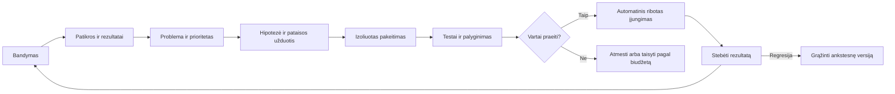

# Simuliacijos ir autonominis tobulinimas

Data: 2026-09-30. Tai projektuojamas bandymų ir pakeitimų vykdymas. Simuliacijos šiame darbe dar nepaleistos. Pagrindinis sprendimas: po pirmo vertinamo bandymo sistema automatiškai aptinka problemą, kuria pataisą, ją patikrina ir įjungia tik pagal atskirai vykdomus kriterijus.

## 1. Simuliacijos dalys

| Dalis | Atsakomybė |
| --- | --- |
| Scenarijaus valdiklis | Nekintami pradiniai faktai, įvykių laikas, sutrikimai ir tikėtina galutinė būsena |
| Kliento agentas | Poreikis, žinios, abejonės, bendravimo stilius ir informacijos pateikimas |
| Tiekėjo agentas | Faktinės testinės kainos, pajėgumas, derybų ribos ir atsakymo elgesys |
| Verslo agentai | Tie patys direktoriaus ir specialistų profiliai bei procesai, kuriuos tikriname |
| Testiniai įrankiai | Paštas, kalendorius, mokėjimai, dokumentai ir vykdymas be realių šalutinių veiksmų |
| Programinis vertinimas | Skaičiai, gavėjai, būsena, leidimai, dokumentai, idempotency ir patvarumas |
| Pokalbio vertintojas | Faktų naudojimas, bendravimas, poreikio išaiškinimas ir pažadų pagrįstumas |

Kliento ir tiekėjo agentai turi atskirus kontekstus. Jiems nepateikiamos darbuotojo instrukcijos ar teisingų atsakymų rinkinys. Darbuotojui nepateikiamas aktoriaus vaidmens aprašas ar paslėpti scenarijaus faktai. Infrastruktūra visada žino, kad tai bandymas, ir vykdo aplinkos atskyrimą.

Negarantuojame, kad modelis niekada neatpažins testinės situacijos. Tikslas — vienodas veiksmų kontraktas, realistiški duomenys, skirtingi scenarijai ir nepasiekiami atsakymų raktai.

## 2. Scenarijaus kontraktas

Scenarijus turi `scenario_id`, versiją, verslo tipą, duomenų rinkinį, virtualų laikrodį, aktorių instrukcijas, leidžiamus įvykius, sutrikimų planą, kietas patikras ir tikėtiną galutinę būseną. Faktiniai tiekėjo likučiai ir kainos nustatomi valdiklyje. Aktorius negali jų pakeisti vien sugeneruodamas kitokį tekstą.

Pavyzdys: klientui prekės reikia po trijų dienų, vienas tiekėjas gali pristatyti po septynių, kitas po dviejų, bet su didesne bendra kaina. Galioja mandato maržos riba. Teisingas rezultatas gali būti tinkamas pasiūlymas arba pagrįstas atsisakymas; bet koks pardavimas savaime nėra sėkmė.

Kiekvienas bandymas prasideda švaria DB ir artefaktų erdve. Laikrodis gali būti pagreitintas, bet agento timeout ir naudojimo apskaita remiasi tikru laiku. Duomenų seed stabilizuoja pasaulio sąlygas; LLM atsakymų jis nepadaro deterministinių.

## 3. Simuliacijos ir realių integracijų atitikimas

Testinis ir realus adapteris įgyvendina tą pačią įėjimo bei išėjimo schemą. Adapterių sutarties testai tikrina klaidas, kvitus, pasikartojimus ir timeout. Simuliacija turi mokėti imituoti ne vien sėkmę, bet ir „veiksmas įvyko, o atsakymas negrįžo“.

Testiniai gavėjai naudoja nepasiekiamus `.invalid` adresus, dokumentai saugomi testinėje erdvėje, mokėjimai vyksta tik stub ar sandbox tiekėjo aplinkoje. Net agentui pasiūlius tikrą el. paštą ar mokėjimą, aplinkos kontrolė neleidžia testinio proceso nukreipti į produkciją.

Ši kontrolė tikrinama bandymu: testinis vykdytojas bando pasiekti tikro siuntimo adapterį, o gateway ir tinklo politika tai atmeta. Testinėje aplinkoje nėra produkcijos kredencialų. Vien `.invalid` gavėjo vardas ar prompt sakinys „tai testas“ aplinkos neizoliuoja.

Prieš realų adapterį įjungiant turi būti patikrinta autentifikacija ir ribotas realus funkcionalumas. Simuliacijos sėkmė neįrodo, kad realaus tiekėjo API, pašto pristatymas ar dokumentų eksportas jau veikia.

## 4. Vertinimas ir vartai

Agentų vertinimo praktikoje derinami programiniai, modelių ir žmogaus vertinimai, galutinė aplinkos būsena bei pakartotiniai bandymai. Čia kritines operacijas tikrins programinės patikros; žmogaus atrankinė peržiūra gali papildyti vertinimo kalibravimą, bet nebus privalomas kiekvienos pataisos žingsnis. [Agentų vertinimo metodika](https://www.anthropic.com/engineering/demystifying-evals-for-ai-agents)

Kietos patikros:

- Teisingas verslas, juridinis asmuo, gavėjas ir aplinka.
- Teisinga kaina, kiekis, apvalinimas ir mandato marža.
- Aktualus patvirtintas pasiūlymas prieš įsipareigojimą.
- Dokumento duomenys sutampa su priimtomis sąlygomis ir šablono versija.
- Pakartojimas nesukuria papildomo užsakymo, sąskaitos ar mokėjimo.
- Išorinis kvitas ar DB būsena patvirtina deklaruotą rezultatą.
- Neišduodami sekretai ar kitų verslų duomenys.
- Perkrovus vykdytoją procesas tęsiamas iš patvarios būsenos.
- Pasenusio lease vykdytojas negali tęsti veiksmų ar įrašyti naujos būsenos.
- Neaiškus API atsakymas nesukelia aklo pakartojimo ar rezervacijos atlaisvinimo.
- Du lygiagretūs veiksmai negali panaudoti to paties piniginio limito ar rezervacijos.
- Sustabdymas ir atšauktos teisės galioja ir anksčiau pradėtiems darbams.

Pokalbio rubrika atskirai vertina aiškumą, tinkamus klausimus, įrodytus faktus, terminų komunikaciją, pagrįstą derybą ir tinkamą nežinomybės sprendimą. Vertintojas privalo galėti grąžinti „nepakanka įrodymų“. Jo kontekstas atskiras nuo pataisą kūrusio agento; tai sumažina informacijos nutekėjimą, bet nepanaikina bendro modelio klaidų.

Vertintojas kalibruojamas žinomais teisingais ir klaidingais pokalbiais, įskaitant sklandžiai parašytą neteisingą kainą ir pagrįstą atsisakymą. LLM įvertinimas negali panaikinti programinio pažeidimo. Neaiškus vertinimas turi būseną `inconclusive`: tai nėra nei sėkmė, nei pakankamas įrodymas automatiškai įjungti kandidatą. Sistema surenka trūkstamus įrodymus ar pakartoja bandymą pagal limitą; savininkui nekuria rutininės vertinimo užduoties.

Siūlomi pradiniai leidimo kriterijai, kuriuos įgyvendinant fiksuosime kaip versijuotą politiką:

- 0 kritinių pažeidimų paleistame privalomame rinkinyje.
- Bent 95 % sėkmės aiškiuose įprastų užklausų scenarijuose.
- Nė viena aktyvuota niša nepablogėja pagal jos privalomas patikras ir iš anksto nustatytas kokybės bei sąnaudų ribas; nuo M4 tikrinamos visos keturios.
- Nepadidėja savininko klausimų kiekis vien tam, kad agentas išvengtų sprendimo.
- Naudojimas ir trukmė telpa į nustatytą darbo biudžetą.
- Pataisa pagerina deklaruotą problemą arba pašalina patvirtintą trūkumą.

Tai siekiami slenksčiai, ne išmatuoti rezultatai. Ataskaita rodo imties dydį ir nesėkmes pagal grupes. Nulis stebėtų klaidų nėra visų būsimų situacijų garantija.

Prieš kandidatą eksperimentas fiksuoja pagrindinę metriką, leistiną pablogėjimą kitose metrikose, scenarijų grupes ir bandymų skaičių. Bazė ir kandidatas gauna tas pačias pradines pasaulio sąlygas, atskiras švarias būsenas ir kelis bandymus. Pokalbių vertintojui versijos pateikiamos kaip atsitiktine tvarka parinkti A/B variantai. Vertinama kiekviena niša ir gedimų grupė; vien geresnis bendras vidurkis nepakanka. Sėkmės vardiklis ir teisingos baigties klasė nustatyti scenarijuje, todėl agentas negali pagerinti procento atsisakydamas visų užklausų ar pažymėdamas sunkias bylas baigtomis.

M3 įrodo minimalų pataisos mechanizmą ir bendras kritines taisykles viename pilote. M4 turi bent 20 skirtingų scenarijų kiekvienai nišai, o M7 juos kartoja bent penkis kartus. Pakartojimai su tais pačiais scenarijais nėra tiek pat nepriklausomų realios rinkos atvejų. Maža ar nevienareikšmė imtis leidžia ribotą tolesnį eksperimentą, tačiau neatstoja produkcijos kvalifikavimo.
## 5. Du scenarijų rinkiniai

Matomas vystymo rinkinys leidžia programuotojui suprasti ir atkurti problemą. Apsaugotas vertinimo rinkinys laikomas už jo darbo aplinkos ribų. Vertinimo servisas negrąžina visų paslėptų atsakymų; prireikus sukuria atskirą minimalų atkuriamą pavyzdį.

Paslėpti atsakymai ir valdiklio faktai nepasiekiami ir testuojamo kandidato kodui: jis mato tik įprastą verslo įėjimą bei leidžiamą įrankio atsakymą. Kandidatas negali rašyti grader įrašų. Apsaugoto rinkinio naudojimas registruojamas ir ribojamas; po kartotinio pritaikymo prie jo reikia papildomų naujų nematytų atvejų. Nauja rinkinio versija turi kilmę ir pastovias kritines patikras, o ne vien pataisos agento sugalvotą palankų rezultatą.

Nauji scenarijai gali būti generuojami automatiškai, bet į etaloninį rinkinį priimami tik kai valdiklis turi patikrinamus faktus ir aiškią sėkmės būseną. Neaiškus ar klaidingas testas atskiriamas kaip vertinimo problema. Operacinės pataisos negali savarankiškai ištrinti privalomo testo ar sumažinti slenksčio.

Kasdieniam vystymui naudojamas trumpas rinkinys. Prieš leidimą — platesnis aktyvuotų pilotų rinkinys ir pakartotiniai bandymai. Naujas modelis, instrukcija, įrankis ar proceso versija patikrinami iš naujo.

Prieš M4 naudojamas esamo piloto ir bendrų kritinių scenarijų rinkinys; nuo M4 — keturių pilotų rinkinys. Klaidingas naujas scenarijus karantinuojamas kaip vertinimo defektas. Jau privalomo scenarijaus negalima pašalinti vien dėl kandidato nesėkmės: jo pakeitimas turi atskirą vertinimo versijos patikrą ir įrodymą, kad taisomas pats testas.

## 6. Tobulinimo ciklas nuo pirmos simuliacijos

Pirmam ciklui nereikia baigti visų keturių verslų. Minimalus fizinio produkto scenarijus gali tyčia turėti pataisomą transporto sumos klaidą. Etaloninė patikra ją aptinka; programavimo agentas pataiso leistiną skaičiavimo modulį; tas pats bandymas ir apsaugotos regresijos patikros patvirtina rezultatą.

Tai patikrina automatinį kelią, bet dar neįrodo, kad sistema savarankiškai atranda visas reikalingas verslo funkcijas. M4 turi papildomą nežinomą kūrėjui gedimą, M5 — realią scenarijaus įrankio spragą. Abiem atvejais sistema pati diagnozuoja poreikį, pasiūlo sprendimą ir parodo naudą nematytuose atvejuose. Demonstracijos ataskaita atskiria tyčia įterptą klaidą, savarankiškai diagnozuotą gedimą ir naujos funkcijos sukūrimą.

Kiekviena problema turi įrodymų nuorodas, paveiktą versiją, priežasties hipotezę, atkuriamą atvejį ir sėkmės kriterijų. Pataisa turi Git diff, testų rezultatus, instrukcijų hash, naudojimą, release sprendimą ir grąžinimo tašką.

Patikimas surinkimo procesas sukuria nekintamą artefaktą, kurį vertina izoliuoti bandymai. Leidimo valdiklis įjungia būtent tą hash ir patikrina bazės, politikos bei vertinimo versijų aktualumą. Pakeistas failas po sėkmingo bandymo, suklastota ataskaita ar pasenęs patikros leidimas atmetami. Pirmame M3 cikle tai vyksta tik simuliacijoje; produkcijos įjungimo vartai priklauso M7–M8.

## 7. Kaip sistema pastebi, ko trūksta

Signalai: dažnos trūkstamų laukų užklausos, nebaigti sandoriai, daug to paties rankinio veiksmo, timeout, dublikatai, dokumentų neatitikimai, ilgi atsakymo laikai, maža marža ir per didelis AI naudojimas. Direktorius mato savo nišą; bendras tobulinimo agentas jungia pasikartojantį techninį poreikį tarp nišų.

Pradinis prioritetų modelis: incidento kritiškumas, dažnis, paveiktų procesų dalis, patikimumas, galima nauda ir pataisos naudojimo kaina. AI negali pasiskirti didelės naudos be matavimo. Naujo įrankio hipotezė gauna ribotą eksperimentą su palyginimu.

Galimi sprendimai: papildomas klausimas, geresnė instrukcija, deterministinė patikra, proceso pakeitimas, naujas adapteris, naujas specialistas, perteklinio agento pašalinimas arba veiklos sustabdymas. Daugiau agentų nebūtinai pagerina procesą.

## 8. Pakeitimų klasės ir automatinis įjungimas

| Pakeitimas | Automatinė eiga |
| --- | --- |
| Instrukcija ar klausimų seka | Schemos patikra, scenarijų palyginimas, nauja instrukcijos versija |
| Verslo proceso logika | Būsenų perėjimų testai, keturių pilotų regresija, workflow versija |
| Naujas įrankis | Adapterio sutartis, aplinkos ir teisių patikra, simuliacija, registruota versija |
| Operacinio core kodas | Izoliuotas diff, programiniai testai, vertinimas ir ribotas release |
| DB papildymas | Atgal suderinama migracija, atsarginė kopija ir patikrintas atkūrimas; neįjungti M3, kol šis kelias neįrodytas |
| Apsaugota teisių ar vertinimo taisyklė | Nepriimama per tą patį savęs vertinantį operacinį pakeitimą |

Savininko patvirtinimo nepridedame kaip rutininio release žingsnio. Praėjęs leidimo valdiklio patikras pakeitimas įjungiamas automatiškai leistiname diapazone. Neleistinas pakeitimas atmetamas; sistema ieško kito sprendimo ir užfiksuoja ribą.

Pradinis apsaugotas sluoksnis turi būti sukurtas iki pirmo savarankiško tobulinimo. Jis apima savininko mandatą, sekretų valdymą, vertinimo vientisumą ir leidimo įrodymų tikrinimą. Kūrimo agentui nesuteikiama prieiga perrašyti savo paties vartus.

## 9. Ribos, sustojimas ir grąžinimas

Siūlomi pirmo piloto ciklo limitai: viena pataisa vienu metu, iki trijų kandidatų vienai problemai, iki dvidešimties agento žingsnių darbui. Skaičiai yra planavimo nustatymai, ne realių sąnaudų pažadas. Kvietimų ir laiko limitai galioja taip pat kaip programiniams darbams.

Išnaudojus biudžetą problema pereina į `deferred`, tęsiami nepaveikti darbai. Kritinė klaida apriboja susijusį veiksmą arba grąžina paskutinę gerą programinę versiją. Ji automatiškai nepaverčiama savininko leidimo prašymu.

`deferred` turi priežastį, kitą patikros laiką ir konkrečią pratęsimo sąlygą, pvz. naują faktą, prieigą ar kitą paskirtą eksperimento langą. Pakartotinis įdėjimas į eilę neatnaujina incidento bendro bandymų ir naudojimo limito. Pasikartojanti ta pati nesėkmė be naujų duomenų pereina į karantiną; sistema palieka aiškią būseną ir tęsia nepaveiktą veiklą. Tai apsaugo nuo begalinio brangaus taisymo rato. Operacinis pajėgumas rezervuojamas atskirai nuo eksperimentų.
Grąžinimas nekeičia jau įvykusių mokėjimų ar užsakymų istorijos. Neaiškus išorinio veiksmo rezultatas pirmiausia sutikrinamas su tiekėju ar kvitu. Korekcija yra naujas atsekamas veiksmas. Destruktyvios DB migracijos nepriklauso pirmajam autonominiam ciklui.

Naujos versijos bandymas iš anksto fiksuoja srauto ribą, stebėjimo langą ir automatines sustabdymo priežastis. Kritinis pažeidimas iš karto užblokuoja susijusius veiksmus, net jei dar nepakanka statistikos bendram kokybės pokyčiui. Senos aktyvios bylos negali toliau vykdyti to paties kritinio defekto; jų tęsimas tikrinamas iš checkpoint ir išorinių kvitų.

## 10. Savininko įtraukimas

Sistema autonomiškai sprendžia techninius ir darbo procesų klausimus. Savininkui sukuria tik `account_access` arba `owner_fact` poreikį, kai agentai negali patys pasiekti registracijos, patvirtinti tapatybės ar sužinoti neviešo verslo duomens. Klausimai deduplikuojami ir pateikiami kartu su konkrečiu paveiktu veiksmu.

Įprastos klaidų ir rezultatų ataskaitos matomos skydelyje. Savininkas gali koreguoti tikslus ar sustabdyti sistemą, bet nėra privalomas kiekvieno tobulinimo ciklo darbuotojas.

## 11. Perėjimas iš simuliacijos

Pirma: keturios izoliuotos nišos, patvarumas, kietos patikros ir automatinė pataisa. Tada: realių adapterių sutarties patikra ir stebėjimo režimas, kuriame sistema analizuoja leistinus realius įrašus nesukurdama papildomų komercinių veiksmų. Galiausiai: tik mandatą ir verslo fazę atitinkantys realūs procesai su ribotu naujų darbų srautu.

Simuliacija matuoja procesų kokybę. Tikros užklausos, sandoriai, marža, aptarnavimo laikas ir grąžinimai matuoja verslo naudą. Abi rodiklių grupės laikomos atskirai. Patvirtinta reali klaida, pašalinus nereikalingus asmens duomenis, gali tapti nauju atkuriamu scenarijumi.
