# Acquisition core architektūra

2026-10-10. Projektinis sprendimas; ne produkcinio pasirengimo patvirtinimas.

## 1. Kampanija ir tikslas

Kampanija priklauso `business_id + environment_id + site_id`. Profilis apibrėžia `objective`, `target_roles`, segmentą, vietovę, kalbą, patvirtintą pasiūlymą, CTA, kanalus, šaltinių politiką, grafiką, biudžetą, kontaktavimo pagrindą ir sustabdymo ribas. Įjungimas atskiras nuo profilio sukūrimo; pradžia `enabled=false`, `mode=research_only`.

| Tikslas | Gavėjas | Konversija |
|---|---|---|
| product_sale | buyer | Kvalifikuota užklausa / pardavimas |
| provider_signup | provider | Patvirtintas, užpildytas, aktyvus teikėjo profilis |
| partnership | partner | Realus sutartas bendradarbiavimas |

`provider` yra nauja aiški rolė; Madbeauty neturi apsimesti `buyer`, kad praeitų esamą filtrą. Migracija išsaugo esamų buyer kampanijų elgesį. Tikslo pakeitimas sukuria naują kampanijos versiją ir naują priėmimą.

## 2. Darbo eiga

```mermaid
flowchart LR
  A[Laikmatis] --> B[Koordinatorius ir biudžetas]
  B --> C[Paieškos adapteriai]
  C --> D[Pirminio šaltinio patikra]
  D --> E[Atranka ir deduplikacija]
  E --> F[Pasiūlymo juodraštis]
  F --> G[Faktų ir politikos vartai]
  G --> H[Peržiūra ir outbox]
  H --> I[Leidžiamas transportas]
  I --> J[Atsakymas arba registracija]
  J --> K[Case arba onboarding]
  K --> L[Rezultatai ir kalibravimas]
```

Siūlomas deployment: esamo Python core worker procesas ir PostgreSQL nuolat veikiančiame Linux serveryje. Vienas cron / systemd laikmatis kas 5 minutes pažadina due-job koordinatorių. Kampanijos laikas saugomas su IANA zona, įvykiai UTC. Madbeauty siūlomas startas darbo dienomis 09:00 `Europe/Vilnius`; tai konfigūracija, ne jau įjungtas grafikas. Atsakymų webhook arba atskiras trumpas polling intervalas neturi laukti kito ryto.

Koordinatorius paima nuomą, patikrina pause/expiry/budgets, sukuria dienos run ir suplanuoja ribotus darbus. Vienai kampanijai negali veikti du lygiagretūs dienos run. Praleistos dienos nesukuria neriboto laiškų pasivijimo; po sutrikimo leidžiamas vienas ribotas due run. Ilgi darbai skaidomi į atnaujinamus žingsnius. Nuomos generation/fencing neleidžia senam worker užrašyti naujo worker rezultato.

## 3. Per kur ieškome

Pirmas adapteris — Treg `serper.web.search`, paieškos frazės pagal tikslą, kategoriją ir vietą. Madbeauty apima visas grožio paslaugas pagal savininko patikslinimą: generatorius ima aktualų platformos kategorijų katalogą, kuria paslauga+vietovė užklausas ir paskirsto ribotą dienos biudžetą tarp segmentų. Vienas kelių paslaugų salonas deduplikuojamas tarp kategorijų. `gl=lt`, `hl=lt` yra užklausos parametrai; tinkama Lietuvos aprėptis dar neišbandyta.

Rezultatas yra kandidatas. Atskiras fetcher tikrina originalų organizacijos puslapį: tikra veikla ir vieta, juridinis statusas, kontaktinis kanalas, aktualumas, faktai ir jų galiojimas. Paieškos snippet nėra sutikimas, pirkimo ketinimas ar patikrintas kontaktas. Šaltiniai turi URL, patikros laiką, faktą ir leidžiamą panaudojimą. Išoriniai tekstai laikomi duomenimis, jų instrukcijos nevykdomos. URL fetcher blokuoja vidinius / metaduomenų adresus ir neleistinus redirect.

| Adapteris | Paskirtis | Patikrinta katalogo kaina USD | Sprendimas |
|---|---|---|---|
| serper.web.search | Paieškos rezultatai | 0.001 už sėkmingą HTTP200, įskaitant tuščią rezultatą | Pirmas atradimo adapteris |
| openmart.businesses.search | Vietinių verslų atradimas | 0.00894 už užklausą | Vėlesnis palyginamasis bandymas |
| tomba.companies.emails.list | Atrinktos įmonės domeno kontaktai | 0.0089 už netuščią iki 10 vietų puslapį | Tik sąlyginis papildymas |
| Oficialus puslapis / leidžiamas importas | Patikra ir alternatyva | Integracijos / apdorojimo sąnaudos | Būtina net naudojant Treg |

2026-10-10 read-only Treg katalogo patikra; mokami kvietimai neatlikti. Tomba siūloma `type=generic`, `limit=10`, tik jau kvalifikuotam domenui. Aprėptis ir paskyros kvotos nepatvirtintos. Openmart `match_score=0` atmesti: katalogas nurodo galimus nesusijusius fallback rezultatus. Serper katalogo `cache=forbidden`: nesaugoti raw atsakymų ar kurti jų cache be atskiro leidimo; saugojimo/pernaudojimo taisyklės turi būti įgyvendintos kiekvienam adapteriui. Atskirai saugoti leidžiamus request/cost receipts ir savarankiškai patikrintų pirminių šaltinių faktus.

Oficialūs šaltiniai: [Serper](https://serper.dev/playground), [kainodara](https://serper.dev/#pricing), [Tomba API](https://docs.tomba.io/api), [kainodara](https://tomba.io/pricing), [Openmart API](https://app.openmart.com/api-docs), [kainodara](https://www.openmart.com/pricing). Treg katalogo kainos nėra šių paslaugų tiesioginių prenumeratų kainos; prieš realų run tikrinti aktualią Treg sąmatą.

## 4. Agentų atsakomybės

| Vaidmuo | Įvestis | Išvestis ir ribos |
|---|---|---|
| Paieškos planuotojas | Kampanijos tikslas, segmentai, ankstesnė aprėptis | Ribotas užklausų planas; negali didinti biudžeto |
| Tyrėjas | Leidžiami šaltiniai ir kandidatai | Patikrinti faktai, rolė, vieta, tinkamumo priežastis; nežinomi laukai lieka nežinomi |
| Pasiūlymo rengėjas | Patvirtinti faktai ir verslo offer versija | Trumpas individualus juodraštis su vienu CTA; jokio garantuoto rezultato |
| Vertintojas | Juodraštis, įrodymai, taisyklės | PASS / taisytina / eskaluotina su konkrečia priežastimi |
| Atsakymų klasifikatorius | Tikras gavėjo atsakymas | Susidomėjimas, klausimas, atsisakymas, OOO, skundas ar neaišku |
| Koordinatorius | Tipizuoti sprendimai ir politika | Nuomos, leidimai, outbox, sustabdymas, įvykių apskaita |

Agentų sprendimai struktūrizuoti ir tikrinami schema. Kontaktavimo teisė, suppression, biudžetas, siuntimo režimas ir gavėjo adresas nėra modelio nuožiūra. Peržiūros antras modelio kvietimas naudingas, bet pats neįrodo nepriklausomos kalibracijos.

„Apmokymas“ pirmame etape reiškia patvirtintų verslo žinių paketą, užduoties instrukcijas, gerus/blogus pavyzdžius, regresijos scenarijus ir apsaugotą nematytą vertinimą. Modelio svorių fine-tuning dabar neplanuojamas. Nuolat gauti rezultatai nėra automatinis leidimas pakeisti prompt ar pradėti daugiau siųsti.

## 5. Duomenys ir esamo core integracija

Vienas bendras PostgreSQL ir registry, be atskiro CRM kiekvienai nišai. Siūlomos scoped lentelės: `AcquisitionCampaign`, `AcquisitionRun`, `AcquisitionProspect`, `AcquisitionEvidence`, `AcquisitionDraft`, `AcquisitionAttempt`, `AcquisitionJob`, `AcquisitionOutbox`, `AcquisitionEvent`, `AcquisitionSuppression`, `AcquisitionAttribution`.

Esami `Job` ir `Outbox` reikalauja conversation FK. Todėl acquisition turi savo tipizuotas job/outbox lenteles; bendri lease/fencing, budget ir transporto helperiai išskiriami ar naudojami per adapterį. Nekurti fiktyvaus Conversation ar Case vien tam, kad paieškos eilutė tilptų į dabartinę schemą.

Raktai: tenant + aplinka + kampanijos versija + vietinė diena run; normalizuotas domenas / organizacijos identifikatorius prospect; gavėjo ir kampanijos žingsnio raktas attempt; unikalus provider message/event ID atsakymams. Deduplikacija per dienas ir susijusias kampanijas; platesnis operatoriaus suppression tik minimaliais HMAC raktais, be kitų verslų laiškų ar kontaktų teksto atskleidimo.

Prospect būsena: discovered → verified → qualified → draft_ready → approved → queued → submitted → replied → interested → onboarding_started → activated. Atmetimas, blocked, suppressed, bounced, refused, complaint, uncertain ir expired yra aiškios būsenos, ne prarastos eilutės. Transporto ir onboarding būsenos saugomos atskirai, kad išsiųstas laiškas neprilygtų aktyviam profiliui.

Case ir CaseSource atsiranda tik gavus tikrą inbound atsakymą / užklausą arba aiškiai priimtą verslo įvykį. Email Message-ID, nuoroda į acquisition attempt ir webhook dedup saugo nuo dviejų leads iš laiško ir svetainės to paties įvykio.

## 6. Siuntimas, atsakymai ir teisė kontaktuoti

Trys režimai: `research_only`, `draft_only`, `controlled_send`. Prieš transportą pakartotinai tikrinami visi leidimai, offer galiojimas, suppression, dienos limitas ir CTA. Pirmą pilotą savininkas peržiūri kiekvieną gavėją ir juodraštį; vėliau galimas taisyklių apibrėžtas automatinis siuntimas tik po priėmimo.

Teisinis pagrindas ir transporto tiekėjo sąlygos yra atskiri vartai. Pagal [VDAI 2026-05-19 paaiškinimą](https://vdai.lrv.lt/lt/naujienos/pokyciai-tiesiogine-rinkodara-juridiniu-asmenu-atzvilgiu-mrB/) ir [DUK](https://vdai.lrv.lt/public/canonical/1779182967/1405/05-19_DUK_Tiesiogin%C4%97%20rinkodara_juridiniai_asm_svetainei.pdf), juridinių asmenų atvejui galioja atskira ERĮ taisyklė bei paprasto nemokamo atsisakymo reikalavimas. Savarankiškai dirbantis meistras gali būti fizinis asmuo; komercinis profilis nėra juridinio asmens įrodymas. Nežinomas statusas ar nepakankamas pagrindas → research/draft, siuntimas blokuotas. Sutikimo įrašas apima kanalą, tikslą, laiką ir šaltinį. Registracijos kvietimas nėra automatiškai transakcinis laiškas.

[Hostinger taisyklės](https://www.hostinger.com/support/1583510-is-mass-mailing-supported-at-hostinger/) draudžia nesutikusiems gavėjams siunčiamą unsolicited paštą. Todėl esamas Hostinger paštas nelaikomas paruoštu šaltų kvietimų transportu. Parenkamas transportas su šiam naudojimui aiškiai tinkamomis oficialiomis sąlygomis; jei tokio nėra, pilotas vyksta per opt-in kanalą / leidžiamą bendruomenės kvietimą. Socialinių grupių automatizavimas yra atskiras adapteris su grupės ir platformos leidimais.

Siuntimas turi provider receipt. Timeout po submit → `uncertain`; pakartotinis siuntimas tik po reconciliation, ne aklas retry. SMTP išorinio exactly-once pažado neduoti. Atsisakymas iškart stabdo visą gavėjo seką; skundas stabdo kampaniją; bounce blokuoja adresą; OOO neatstoja susidomėjimo. Follow-up pradžioje išjungtas. Jį įjungus ne daugiau vienas patvirtintas priminimas tik tinkamam gavėjui, niekada po atsisakymo / neaiškaus submit.

## 7. Madbeauty onboarding ir atribucija

Kvietimas turi veikiantį viešą CTA į tikrą prisijungimo kelią. Opaque kampanijos token URL neturi email ar asmens duomenų. Backend serveris validuoja token, tenant, expiry ir priskiria įvykį. Signup webhook pasirašytas HMAC, su replay apsauga ir unikaliu event ID. Tikras vartotojas pats sutinka ir registruojasi; agentas nesukuria paskyros ar neviešina nukopijuotos galerijos už jį.

Matavimo įvykiai: invitation_submitted, reply_received, interest_confirmed, signup_started, account_verified, profile_completed, provider_activated, provider_retained_30d. Atidarymai / paspaudimai tik pagal tinkamą privatumo politiką ir nelaikomi konversija. Savarankiškas organic signup saugomas atskirai nuo campaign-attributed signup; trūkstant token priskyrimas lieka unknown.

## 8. Valdymas, sauga ir eksploatavimas

Operatoriaus GUI: kampanija/versija, šaltinių priežastys, prospect ir juridinio statuso įrodymai, juodraštis, patvirtinimas, attempt receipt, atsakymai, onboarding funnel, išlaidos, suppression ir pause. Aiškios tuščios, loading, denied, pending, failed ir uncertain būsenos. Peržiūros teisė nesuteikia siuntimo teisės. API tikrina tenant ir rolę, ne tik slepia mygtuką.

Kiekvienas run iš anksto rezervuoja modelio ir duomenų išlaidas per esamą cost mechanizmą. Limitai per run/dieną/verslą/operatorių, atskira transporto kvota, užklausų skaičius ir laikas. Jokio automatinio mokamo fallback virš biudžeto. Prometheus ar esamas observability: job lag, lease loss, errors, uncertain, real spend ir funnel. Incidento runbook: pause, revoke transport, reconciliation, suppression, rollback config/model versijos; jokio „rollback“ jau pristatytiems laiškams.

Secrets tik serverio secret store, jokio slaptažodžių kopijavimo į kampaniją ar Git. Redaguoti logai; kontaktai ir laiškai tik privačiame scoped saugojime. Raw šaltinių saugojimas pagal adapterio leidimus. Siūlomas pilotinis nekonvertavusių prospects peržiūros / ištrynimo terminas 90 dienų, patvirtinamas duomenų politikos etape; opt-out išsaugo minimalų suppression įrodymą, kad ištrynimas neatnaujintų kontaktavimo.
