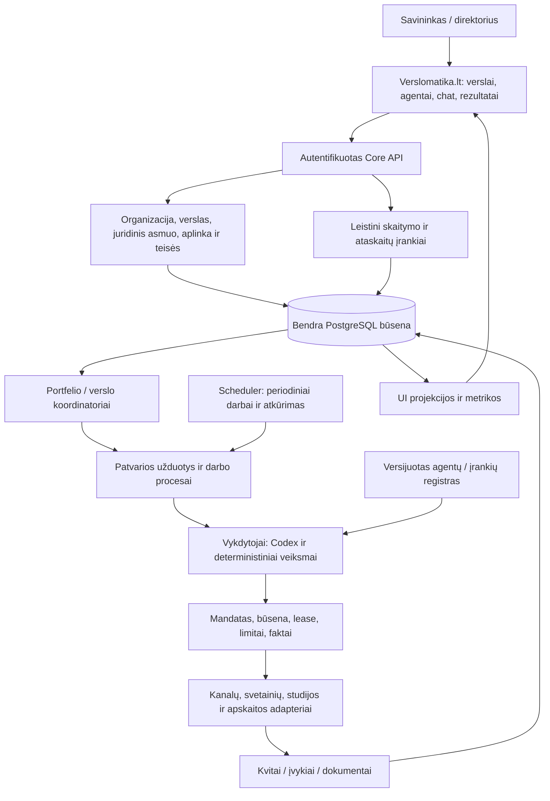

# Verslomatika agentinė architektūra

2026-10-10. Visi šiame dokumente nauji objektai ir endpointai yra **PLANNED**. [Inventorius](AUDIT.md) atskiria dabartinį kodą. Sprendimas tęsia esamą modulinį FastAPI/PostgreSQL core; planas nereikalauja pradinio microservices, Redis ar atskiro serverio kiekvienam agentui.

## 1. Organizacija ir vykdymas

| Funkcija | Atsakomybė ir ribos |
| --- | --- |
| Žmogus direktorius | Tikslai, mandatų ribos, naujos verslo kryptys ir nepasiekiami faktai. Tiesioginis chat su kiekvienu agentu |
| Portfelio koordinatorius | Leistinų verslų bendri rezultatai, prioritetų ir bendros apkrovos siūlymai. Kitų klientų duomenys neprieinami |
| Verslo direktorius | Šio verslo planas, užduočių paskirstymas, rezultatų peržiūra, išimtys ir ataskaita. Nekeičia pats bendro piniginio mandato |
| Specialistai | Pokalbio, klientų paieškos, tiekėjų, turinio, vykdymo, klientų aptarnavimo ar būsima kita konkreti atsakomybė |
| Apskaitos koordinatorius | Vieno juridinio asmens dokumentai/sutikrinimas/paketas, su leistinais verslų analitiniais pjūviais |
| Vertinimo/tobulinimo funkcijos | Kalibravimo stebėjimai, candidate, regresija ir patikrinto release eiga. Negali pakeisti savo priėmimo slenksčių |

Agentas yra patvari tapatybė ir versijuota rolė, aktyvuojama užduočiai. Jo „atmintis“ lieka DB ir šaltinių nuorodose. Pokalbis ar laikmatis pažadina darbą; nereikia visą parą laikyti kiekvieno LLM proceso. Koordinatorius taip pat dirba per tą pačią eilę ir įrankių kontrolę.

Agentų bendradarbiavimas eina per tipizuotas užduotis/rezultatus, priklausomybes ir perdavimo įvykius. Laisvas tarpusavio tekstas nėra galutinė sandorio būsena. Kiekviena užduotis turi vieną atsakingą instance; įnašai ir perdavimai atskirai užregistruojami. Ribojamas delegavimo gylis, vaikų užduotys ir bendras kvietimų biudžetas, aptinkami priklausomybių ciklai. Tiesioginė savininko užduotis ir direktoriaus planas deduplikuojami ir serializuojami pagal keičiamos būsenos versiją.

## 2. Scope ir tapatybės

`organization_id` — platformos klientas / prieigų riba; `portfolio_id` — jo verslų grupė; `business_id` — verslas; `site_id`/domain — išorinis kanalas; `legal_entity_id` — finansinis/teisinis subjektas; `environment_id` — test/staging/production. Business→legal entity ryšys versijuotas pagal galiojimo datą; buhalterinis dokumentas saugo savo subjekto snapshot. Pardavus verslą senas dokumentas nepriskiriamas naujam subjektui.

Vienas verslas gali turėti kelis domenus; keli verslai gali priklausyti vienai įmonei. Juridinio asmens ir verslo ryšys nereiškia, kad bet kuris vieno verslo agentas gali skaityti visą bendros įmonės apskaitą. Finansiniai įrašai scoped legal entity, bendri dokumentai turi patvirtintą paskirstymą. Cross-business koordinatoriui suteikiamas konkretus serverinis scope; nėra bendro `BYPASSRLS` LLM prisijungimo.

Narystę nustato autentifikuotas serveris. Modelio tekstas, browser query param ar įrankio argumentas pats jos nesuteikia. Scope tikrinamas API, DB RLS, paieškoje, priedų URL, eksportuose, atmintyje ir SSE sraute. Registry skaito tik techninius metadata be klientų tekstų. Prieiga prie konkrečių tenant duomenų vykdoma scoped transakcija; ankstesnio scope iš pool nepaveldime.

## 3. Agentų registras ir plėtra

| Objektas | Privaloma sutartis |
| --- | --- |
| AgentDefinition | `kind`, vardas/paskirtis, capability IDs, task/report/input/output schema IDs, palaikomi procesai, įrankių reikalavimai, UI panel IDs |
| AgentVersion | Nekintami code/instruction/tool/profile hash, priklausomybės ir kalibravimo manifestas; aktyvavimo ir rollback taisyklės |
| AgentInstance | Definition/version, organizacija, business arba legal-entity scope, vadovas, mandatas, konfigūracijos revizija, grafikas, būsenos, žinių šaltiniai, biudžetų nuorodos |
| AgentRun | Instance/version, task/workflow/trace, input snapshot, lease generation, įrankių kvitai, naudojimas, pradžia/pabaiga, rezultato artefaktas |
| Capability | Versijuota siaura galimybė, pvz. `messages.read`, `prospects.qualify`, `documents.prepare`, `accounting.reconcile`, `reports.status`; registry nėra leidimo suteikimas |

Nauja rolė → validuojamas aprašas ir schema → tools adapters → known/holdout kalibravimas → nekintamas release → riboto scope instance → patikrintas įjungimas. Generic agento kortelė, chat, tasks, activity ir reports veikia bet kuriam tipui. Specialūs paneliai parenkami iš patikimo registruoto komponentų katalogo; agentas neįkelia arbitrary HTML/JS į operatoriaus sesiją. Naujam agentui nereikia keisti sąrašo hardcode.

Registras rodo įdiegtus instance, siūlomas naujas roles ir prieinamus aprašus atskiromis būsenomis. „Yra instrukcija“ nerodo „agentas dirba“. Instance identitetas nekinta pakeitus instrukcijas, išjungus ar archyvavus; istorija išlieka.

Trys atskiros būsenų ašys:

- Parengtis: `proposed → installed → configured → calibrated → ready`, su konkrečiais trūkstamais reikalavimais.
- Veikimo kontrolė: `disabled / enabled / paused / retired`. Darbo būsena: `idle / running / waiting / degraded / offline`.
- Įrodymas: `not_tested / local_verified / staging_verified / live_path_verified`, su keliu, versija, data ir galiojimu. Įrodymas galioja tik jo apimtam keliui.

Kalibravimo lange rodyti žinomą korpusą, originalias klaidas, dabartinį kandidatą, naują holdout, tikrai atliktų dialogų ir kvietimų kiekį. Įkalibravimas nėra svorių fine-tuning; instrukcijų/rules/profile nauja versija. Pakitus kritiniam tool/policy keliui ankstesnis live receipt tampa recheck_required.

## 4. Bendri patvarūs objektai

| Grupė | Planuojami objektai / ryšiai |
| --- | --- |
| Organizacija ir saugumas | organizations, portfolios, memberships, business_sites, legal_entities, business_entity_assignments, mandate_versions |
| Agentai | agent_definitions, agent_versions, agent_instances, agent_runs, capability_bindings |
| Darbas | tasks, task_dependencies, workflow_instances, workflow_steps, schedules, task_attempts, action_intents, action_receipts |
| Direktorius | owner_threads, owner_messages, owner_directives, context_refs, report_requests, reports, metric_definitions, report_evidence |
| Veikla | operational_events, source_import_checkpoints, projection_checkpoints, incidents, owner_needs |
| Dokumentai / finansai | document_objects, document_versions, invoice_records, payment_records, allocations, reconciliation_matches, proposed_entries, export_batches, accounting_periods |

Nauji Task/Event/Artifact/Action turi tikrą scope ir optional case/customer conversation/owner thread/workflow nuorodas. Sudėtiniai FK užtikrina tą patį scope. Agentą/užduotį pašalinus negalima cascade ištrinti išrašytų dokumentų ar kvitų. Dokumentų turinys saugomas privačioje objektų saugykloje; DB — metaduomenys, SHA, versija ir teisės.

Task: `queued/leased/running/waiting_external/waiting_input/retry_scheduled/succeeded/failed/cancelled`; blocked reason, deadline, priority, dependencies, optimistic revision. Scheduler užregistruoja due tasks su unique schedule+scope+local period raktu; worker paima su lease/generation ir heartbeat. Cron gali pažadinti scheduler, bet nėra LLM, visą kampaniją vykdantis vienu nepatvariu skriptu. Po restarto tęsiame iš checkpoint, laikome vieną būseną keičiantį rašytoją.

Action: `prepared/dispatched/unknown/confirmed/rejected`. Request hash/idempotency key saugomi prieš išorinį veiksmą; intent ir outbox įrašomi toje pačioje transakcijoje. Stale generation ar atšauktas mandatas neleidžia naujo veiksmo. Timeout po siuntimo yra unknown; tik kvitas/sutikrinimas leidžia retry. Pause neištrina jau įvykusių veiksmų; inbound kvitų bei privatumo/aptarnavimo užklausų kelias tęsiamas pagal atskirą workflow. Campaign pause nestabdo žmogaus duomenų teisių bylos.

## 5. Įvykiai ir stebėjimas

OperationalEvent v1: `event_id`, schema/kind, organization/business/legal-entity/environment scope, instance/version/run/task/workflow/case/action/message/document IDs, `trace_id`, `causation_id`, actor, occurred_at/recorded_at, source system/source ID, status, evidence refs, redacted summary. Source event dedup, per-objektą monotoniška seka, late event/revision taisyklės ir projection watermark.

Veiklos seka atskiria ketinimą, atliktą veiksmą ir gautą rezultatą. Kanalo statusai rodomi tik pagal tikrą kvitą; SMTP accepted nėra inbox, opened nėra sutartis, modelio „sutiko“ nėra registracija ar mokėjimas. Exports ir task submissions audituojami, su importo ir įrodymų kilme.

Įvykių metaduomenys append-only; klaida taisoma korekcijos įvykiu. Asmeniniai tekstai laikomi pagal duomenų kategorijų retention/deletion taisykles, su redakcija ar nuorodos atšaukimu; nekintamas auditas nereiškia amžino PII saugojimo. UI rodo sprendimo santrauką, faktus ir kvitus; paslėpto modelio samprotavimo nereikia.

Dashboard ir chat naudoja tas pačias projections/metric definitions. Nuoroda atveda nuo ataskaitos skaičiaus iki leistino sąrašo ir pirminių įrašų. Rodomas data_as_of/watermark ir importuotų šaltinių pilnumas. Nereikia LLM nuolatiniam health polling, filtrams, grafikams ar sumavimui.

## 6. API ir atnaujinimai

Siūlomas naujas `/operator/v2` sluoksnis; visos žemiau pateiktos routes dar neegzistuoja:

| Keliai | Paskirtis |
| --- | --- |
| `GET /portfolios/{p}/businesses`, `/summary` | Leistinas portfelis, būsena ir rezultatų projekcija |
| `GET /businesses/{b}/agents`, `/activity`, `/tasks`, `/threads`, `/documents`, `/integrations` | Verslo bendri sąrašai, scope/cursor/filtrai |
| `GET /agents/{a}`, `/runs`, `/activity`, `/reports` | Instance ir konkrečių versijų/rezultatų peržiūra |
| `POST /agents/{a}/owner-threads`, `/owner-threads/{t}/messages` | Direktoriaus gija, klausimo/užduoties priėmimas |
| `POST /agents/{a}/tasks`, `/report-requests`, `/control` | Patvari komanda; kontrolė naudoja expected_revision ir audit reason |
| `GET /requests/{id}`, `/reports/{r}`, `/events?cursor=...` | Async rezultatas, atsekamas report, scoped SSE; reconnect replay |
| `GET /legal-entities/{l}/finance/periods`, `/exceptions`, `/exports` | Apskaitos scope su atskiru leidimu |
| `POST /documents/{d}/prepare`, `/accounting/exports` | Versijuotas dokumento parengimas / paketas; tai nėra savaiminis send ar deklaravimas |

POST gauna serverio actor/context, idempotency key ir expected revision; 202 grąžina request/task ID. Pakartotas tas pats tekstas su tuo pačiu raktu nekuria antro darbo. SSE yra pranešimo kanalas, DB lieka source of truth. Stream baigiamas atšaukus prieigą; nauji list/detail/export/download tikrina aktualias teises. Klaidos turi atkuriamą kodą be sekretų ir support correlation ID.

## 7. Migracija ir eksploatavimas

1. Pridėti schema ir versioned adapters prie esamo core; senų client API ir Conversation duomenų nekeisti vietoje.
2. Patvirtinti Business→organization/portfolio/entity mapping; unknown entity neleidžia finansinių veiksmų. Senas unikalus site/host lieka mapping į business_sites.
3. Naujas generic worker pernaudoja patikrintą lease/gateway/budget logiką. Esamus įvykius pradinėje stadijoje projektuoti read adapteriu, nedubliuoti per dvi nepriklausomas write schemas.
4. Checkpoint/backfill su šaltinio IDs; compare counts/statuses/hash, read shadow ir pasirenkamas cutover. Senos istorijos nekeičia nauji instruction IDs; senas event gali turėti agent attribution=unknown.
5. Perjungti vieną adapterį vienu metu; vienam veiksmui vienas aktyvus sender/worker. Rollback grąžina kodą/projekciją, neištrina įvykusių veiksmų. Prieš schema switch tikrinti forward/backward suderinamumą.

24/7 host turi prižiūrėti API, scheduler, workers, sekretų jungtis ir atsargines kopijas. Authenticated UI galima hostinti atskirai nuo Python runtime; viešas SEO core neprivalo tapti PostgreSQL agentų serveriu. Hosteris/domenas/CLI autentifikacija ir serverio vykdymo teisės tikrinami prieš production. Vietinis nešiojamas PC netinka garantuoti kasdienę veiklą miego metu.

Operational metrics: heartbeats, queue age, schedule lateness, adapter freshness/error, unknown actions, replication/projection lag, report coverage, quotas ir faktinis naudojimas. Atskiros chat/operations/calibration/maintenance kvotos su bendru account cap; direktorinis klausimas nebadauja dėl lab, bet neapeina finansinių limitų. Backup/restore, duomenų vientisumas ir tenant izoliacija priimami per realų testą.
