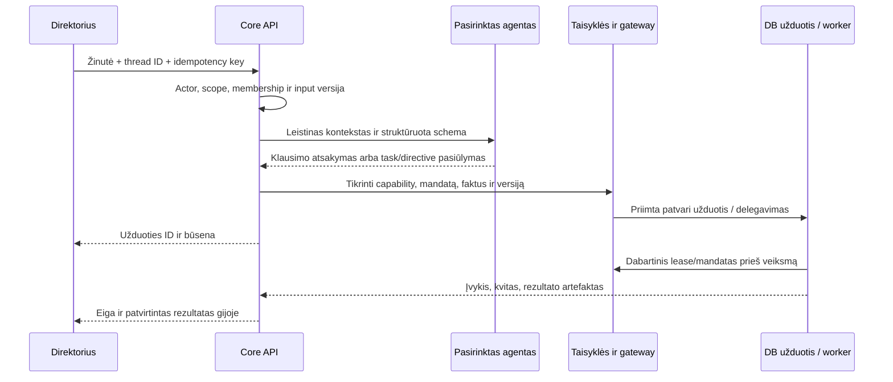

# Direktoriaus pokalbiai, delegavimas ir ataskaitos

2026-10-10. **PLANNED.** Tai valdymo kanalas savininkui ir deleguotiems operatoriams. Jis netapatinamas su svetaine besinaudojančio kliento Conversation ar outbound laišku.

## 1. Pokalbis su kiekvienu agentu

Verslas → Agentai → pasirinktas agentas → „Pokalbis“. Gija susieta su tikslia instance, business/legal-entity scope ir environment. Joje išlieka žmogaus žinutės, agento atsakymai, užduočių nuorodos, ataskaitų snapshot ir pasirinkti konteksto objektai. Pakeitus verslą rodoma to verslo gija; tekstas neperkeliamas į kitą scope. Galimos kelios temos tam pačiam agentui, pavyzdžiui, savaitės rezultatai ir atskira konkreti kampanija.

Agento profilis stabilus; atsakyti jis gali nauju Codex procesu. Serveris surenka paskutines leistinas žinutes, patikrintą santrauką ir aktualius DB objektus. Santrauka turi source message IDs, galiojimą ir versiją; jos klaida gali būti pataisyta, pirminiai įrašai neprarandami. Pirminė faktinė būsena svarbesnė už seną pokalbio santrauką.

Kiekvienas agentas turi bendrą valdymo kontraktą: savo paskirtį/mandatą, `status`, `worklog`, `report`, `explain_result`, `submit_task` ir `handoff` capabilities pagal teises. Užduotis ne jo sričiai perduodama kompetentingai rolei su nuoroda ir owner; agentas neprisiima neegzistuojančios galimybės. Išjungtas agentas gali pateikti leistiną istorijos/status ataskaitą, tačiau naujas operacijas blokuoja runtime būsena.

## 2. Klausimas ir nurodymas

| Žinutė | Kaip apdorojama | Matomas įrodymas |
| --- | --- | --- |
| „Kaip sekasi?“, „Ką šiandien padarei?“ | Savo agento status/rezultatų report pagal verslo vietinę dieną | Periodas, faktiniai duomenys, data_as_of, darbo/rezultatų nuorodos ir trūkstama aprėptis |
| „Kiek naujų teikėjų turime šią savaitę?“ | Read-only patikrinto Madbeauty backend metriko užklausa | Registracijų ir aktyvių teikėjų skaičiai atskirai; be adapterio atsakymas „nėra duomenų“ |
| „Parodyk, ką išsiuntei salonui X“ | Exact scoped message/thread lookup | Tikras tekstas/priedų versija, gavėjas ir atskiri siuntimo/gavimo kvitai |
| „Rytoj pirmiausia ieškok kirpyklų Kaune“ | Tipizuotas kampanijos/užduoties pakeitimas mandate | Užduoties ID, input/revision, grafikas, atsakingas agentas; result dar nėra completed |
| „Paruošk rugsėjo paketą buhalteriui“ | Legal-entity scope parengimo darbas | Laikotarpis, snapshot, trūkstami dokumentai, manifest ir eksporto rezultatas |
| „Kas stringa ir kodėl?“ | Blocked tasks/incidents ir šaltinių peržiūra | Priežastis, jau atlikti bandymai, kitas leistinas veiksmas, tikra owner_need jei būtina |
| „Lygink paskutines 4 savaites“ | Versioned metric/report query | Tos pačios definicijos ir aprėptis; nevertinami nesuderinami denominator ar skirtingi kainų basis |

Klausimas nepradeda išorinių veiksmų. Aiškus nurodymas priimamas kaip užduotis esamo mandato ribose, be papildomo „ar tikrai?“ kiekvienam rutininiam darbui. Neaiškus nurodymas, pvz. „paspausk juos labiau“, pirmiausia tikslinamas arba agentas pateikia leistiną konkretų variantą; neveikiame pagal spėjamą piniginę ribą ar kontaktavimo mandatą.

Mandato, biudžeto, gavėjo/banko tapatybės pakeitimas yra atskiras tipizuotas žmogaus valdymo veiksmas su senos/naujos reikšmės peržiūra ir revision. LLM klasifikatorius nėra žmogaus parašas tokiam pakeitimui. Paprastos agento užduoties prioritetą galima pakeisti tiesioginiu aiškiu nurodymu. Review queue naudojama tik ten, kur toks veikimo režimas nustatytas, arba konkrečioms išimtims; ji netampa privalomu kiekvieno laiško tvirtinimu visame portfelyje.

## 3. Nuo žinutės iki darbo



`OwnerDirective`: actor/message/thread, target instance/scope, intent, original_text_ref, normalized input/schema, evidence/context refs, expected revision, priority/deadline, idempotency key, mandate version ir status. Nurodymo perskaitymas, priėmimas ir užbaigimas yra skirtingi įvykiai. Nepriimtas schema/permission input saugo priežastį, nekuria šalutinio veiksmo. Direktoriaus ir specialisto nurodymai nekonkuruoja be būsenos kontrolės.

AgentRun vartoja visą bendrą rezervuotą biudžetą, įskaitant deleguotus subdarbus; vaikų darbai nesukuria papildomo neriboto limito. Schedulintas report taip pat turi quota/idempotency ir aktyvų mandatą. Paused operacijos netrukdo read-only direktoriaus užklausai ir incidentų peržiūrai.

## 4. Ataskaitų kontraktas

```text
Report v1
  report_id, request_id, requested_by, responding_agent_instance/version
  organization/business/legal_entity/environment scope
  period_start_utc, period_end_utc [start, end), display_timezone
  generated_at, data_as_of, source_watermarks, completeness, missing_sources
  metric_definition_versions, filters, compare_period, query_hash
  metrics[{id, value|null, unit, numerator, denominator, basis, evidence_refs}]
  completed_work[], outcomes[], active_work[], blocked_work[]
  costs[{amount|null, currency, estimated/observed/invoice_reconciled, source}]
  incidents[], next_actions[], owner_needs[], artifact_refs
  source_revision, content_hash, supersedes_report_id|null
```

Skaičius skaičiuoja deterministiniai report tools iš registruotos metrikos, modelis paaiškina ir susieja su klausimu. Įrodymai, periods ir completeness tikrinami serverio schema; nei modelio skaičius, nei jo tekstinis „patikrinau“ savaime nepriimamas. Eksportas JSON/CSV ir skaitoma HTML/PDF versija remiasi tuo pačiu snapshot. PDF nėra atskirai perskaičiuotas „gražesnis“ rezultatas.

Pagrindiniai report tipai: agento diena/savaitė, verslo savaitė/mėnuo, kampanija, atskiras case/thread, agentų išimtys, sąnaudų aprėptis, apskaitos laikotarpis ir leistinas portfelis. Nestandartinis klausimas sudaromas iš registruotų read queries bei filtrų; modelis negauna laisvo SQL. Naujam skaičiavimui sukuriama testuojama metric/report definicija. Jei klausimo negalima pagrįsti prieinamais duomenimis, pateikiamas konkretus trūkumas ir galimas tyrimo darbas, o ne išgalvota ataskaita.

| Sritis | Metrikos ir reikšmių skirtumai |
| --- | --- |
| Klientų paieška | Unikalūs rasti kandidatai, patikrinti/tinkami, parengti draft, išsiųsti/provider accepted, patvirtintas pristatymas, atsakymai, prasmingas susidomėjimas, registracija, aktyvus profilis. Kiekvienam žingsniui atskiras šaltinis |
| Pokalbio agentas | Užbaigti pokalbiai, išaiškinti poreikiai, gauti kontaktai, perduoti cases, patikrinta kokybė; kontaktas nėra pardavimas |
| Turinys | Parengta/peržiūrėta/exported/deployed/published; publish data nepakeičia realaus deployment |
| Finansai | Gautos lėšos, dokumentais pagrįstos sąnaudos, atviri likučiai, nesutikrinti įrašai, pasiruošimas buhalteriui. Operacinis prognozuojamas pelnas ir apskaitinis rezultatas atskirai |
| Patikimumas | Laukiantys/failed/unknown darbai, klaidų amžius, grafiko vėlavimas, duomenų šviežumas, critical incidents |

Zero naudojamas tik kai užklausa sėkminga ir žinoma aprėptis; neprijungtas bankas ar nepasiektas backend yra null/unknown. Ratio turi aiškų denominator ir minimum sample; nėra „100 % konversijos“ iš vieno nepilno atvejo. Laikotarpiai skaičiuojami UTC su verslo IANA timezone/DST; vartotojo žodis „šiandien“ išsprendžiamas ir parodomas. Fixtures/calibration negalima įtraukti į production rezultatus.

Ataskaita nekintama: vėliau gautas kvitas sukuria naują versiją su pastaba apie pakeistą periodą. Kanalo activity operatyvūs skaičiai ir sutikrintas mėnesio finansų snapshot gali turėti skirtingą data_as_of, todėl tai rodome. Cash ir accrued income, platformos fee ir visos teikėjo paslaugos vertė nesumuojami kaip tas pats uždarbis.

## 5. Atmintis ir patikimumas

Patvirtinti verslo faktai, vadovo nurodymai, klientų teiginiai ir agento pasiūlymai turi atskiras rūšis ir kilmę. Savininko pasakymas „noriu tokios kainos“ pirmiausia yra directive, ne tiekėjo patvirtinta savikaina. Naujas faktas turi scope, galiojimą ir patvirtinimo ryšį. Į ilgalaikę atmintį neįrašome spėjimų kaip tiesos.

Gijos failai/laiškai laikomi nepatikimu šaltinio turiniu, net kai direktorius klausia juos paaiškinti. Jie negali pakeisti įrankių leidimų ar duoti banko/slaptų failų prieigos. Atminties retrieval tikrina šiandieninę narystę; senas cached report nėra leidimas atsisiųsti svetimą invoice.

## 6. Pokalbio UX ir priėmimas

Matomas agentas, verslas, aplinka ir data_as_of. Atsakymas prasideda rezultatu, po to trumpi faktai, kliūtys ir kitas žingsnis; šaltiniai atveriami per rezultato nuorodas. Async darbas rodomas inline kortele su queue/running/waiting/failed/completed ir progress checkpoint. „Galvoju“ būsena neprilygsta veiksmų vykdymui. Vykdymo santrauka rodoma ir po reconnect.

„Stabdyti atsakymo generavimą“ ir „Atšaukti užduotį“ atskiros funkcijos; jau išsiųstas laiškas neatsitraukia. Valdymo jungikliai rodo, kokio scope darbą stabdo. Galima prisegti tik leistinus dokumentus ir nuorodas; sensitive laukai maskuojami pagal rolę, download audituojamas.

Priėmimas: bet kuris registruotas agentas atsako į status klausimą be naujo UI kodo; jo report sutampa su dashboard query; nurodymas sukuria vieną darbą ir po restarto išlaiko rezultatą; retry neatlieka antro veiksmo; svetimo verslo agento/gijos/šaltinio ID atmetamas; trūkstami šaltiniai nepaverčiami nuliais. Visi scenarijai [roadmap matricoje](ROADMAP.md).
