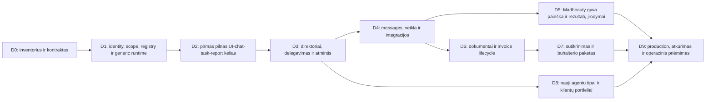

# Verslomatika įgyvendinimo roadmapas ir priėmimas

2026-10-10. **D0 planavimo paketas baigtas. D1–D9 neįgyvendinti šiame pavedime.** Vienų modulių ankstesni testai nepažymi visos naujos platformos punktų. Etapų ID D atskirti nuo [senos core M sekos](../ROADMAP.md) ir [klientų paieškos M sekos](../acquisition-plan/ROADMAP.md).

## Eilė ir priklausomybės

Prioritetas — vienas pilnas vietinis valdymo kelias kuo anksčiau. Finance ir acquisition gali turėti atskirus koordinuotus rašymo langus po bendro pamato; tai priklausomybių planas, ne šiame etape paleistas lygiagretus agentų darbas. Esamų modulių tobulinimas integruojamas adapteriais, nedubliuojamas.

| Etapas | Planuojama inžinerinė apimtis | Priklausomybė ir pagrindinis savininkas |
| --- | --- | --- |
| D1 | 4–7 darbo dienos | D0; core/identity vykdytojas |
| D2 | 4–6 | D1; core+UI vykdytojas |
| D3 | 4–7 | D2; agentų orchestration vykdytojas |
| D4 | 4–7 | D3; kanalų/observability vykdytojas |
| D5 | 6–10 | D4 ir acquisition M1–M8 reikiamos jungtys; acquisition/Madbeauty vykdytojas |
| D6 | 4–7 | D4 ir patvirtintas entity faktų modelis; dokumentų vykdytojas |
| D7 | 6–10 | D6, statement kelias ir buhalterio formatas; finansų vykdytojas |
| D8 | 3–5 | D3, o finansinio naujo tipo priėmimui D7; core vykdytojas |
| D9 | 4–7 | D5/D7/D8 norimai gyvai apimčiai; eksploatavimo vykdytojas |

Bendras orientyras **39–66 inžinerinės darbo dienos**, ne pažadėta kalendorinė paleidimo data. Tai preliminarus darbo skaidymas be tiekėjų/buhalterio laukimo ir pilotui reikalingo tikrų rezultatų laikotarpio. D5 acquisition darbai persidengia su ankstesnio roadmap M etapais, todėl abiejų skaičių nesumuojame. Po D1/D2 faktiškai išmatuotos trukmės planą pervertinti. Nesirenkame mokamų paslaugų vien pagal šį orientyrą.

## D0 — atlikta planavimo apimtis

- [x] Patvirtinta Verslomatika paskirtis ir direktoriaus chat/report reikalavimas.
- [x] Peržiūrėti faktiniai runtime/UI/document/finance pagrindai ir aiškiai atskirtas planned/live.
- [x] Aprašyta registry/runtime/reporting/schema, 35 paviršiai, finansų kelias ir priėmimas.
- [x] Užregistruotas savas dokumentų langas [issue61](https://github.com/christianza1989/nisiniai-puslapiai-monetizavimui/issues/61).

Dokumentų patikra ir Git perdavimas pateikiami [planavimo QA](../../docs/VERSLOMATIKA_PLAN_QA_2026-10-10.md). Tai nėra D1 pradžios ar platformos veikimo priėmimas.

## D1 — patvarus valdymo pamatas

- [ ] Organization/portfolio/membership ir business_sites schema; patvirtinta mapping nuo esamos Business.
- [ ] Legal entity identity/assignment modelis su unknown profiliu; jokio spėjamo PVM ar numeravimo.
- [ ] Individualus auth/session ir serverinės scoped teises, saugus secrets kelias, RLS/API/download/stream enforcement.
- [ ] AgentDefinition/Version/Instance registry, capability schema ir trys statusų ašys.
- [ ] Generic tasks/runs/events/artifacts/actions, pernaudojant patikrintus lease/fencing/idempotency/budget primityvus.
- [ ] Additive migracija, legacy read adapter, backup/restore ir source ID compatibility; migracijų rehearsal prieš cutover.

**Išėjimas:** du business scope ir dvi organizacijos nepasiekia viena kitos gijų/įvykių/failų. Užduotis nesusijusi su kliento Conversation vykdoma po worker restarto; senas lease jos rezultato nepakeičia. Esami client API regresuoja be duomenų praradimo. Activity ir actor audit tikri.

## D2 — ankstyvas pilnas kelias su UI

- [ ] Vienas React/TS shell, login/business selector/agent list/detail/owner chat/status report/activity.
- [ ] Status/worklog metrikos, query snapshot ir report evidence; API → UI realus adapteris nuo pradžios.
- [ ] Tikras Codex structured reply iš scoped faktų ir registruotų report tools; data absence ir limitų klaidos aiškios.
- [ ] „Paruošk ataskaitą“/sintetinė saugi užduotis: 202/request → task → run → checkpoint → report/artifact → inline result.
- [ ] Taikomos loading/empty/error/stale/permission/validation būsenos ir desktop/mobile kelionė.

**Išėjimas:** savininkas pasirenka vieną iš dviejų testinių verslų ir agentą, paklausia „kaip sekasi?“, mato teisingus duomenis, duoda užduotį ir po restarto/reconnect gauna vieną rezultatą. UI skaičiai sutampa su chat report snapshot. Testo aplinka neleidžia išorinio siuntimo. Tai vietinio kelio priėmimas.

## D3 — agentų organizacija ir valdymas

- [ ] Portfelio/verslo direktoriaus roles ir scoped delegavimas į specialistus, priklausomybių/ciklų ribos.
- [ ] OwnerDirective→task schema, aiški input/revision/purpose, dedup tarp tiesioginio nurodymo ir direktoriaus plano.
- [ ] Atmintis su kilme, aktualūs faktai ir revocation; ilgų gijų santraukos nepakeičia pirminės būsenos.
- [ ] Priority/deadline/schedule/pause/resume controls; one-state-writer ir mandate recheck prieš action.
- [ ] Periodinės dienos/savaitės ataskaitos ir incidentų/owner_need sujungimas; bendras account cap ir fairness.
- [ ] Agentų roles/status/report/action kalibravimas pagal [business-agent-calibration](../../SKILLS/business-agent-calibration/SKILL.md); version/holdout gates.

**Išėjimas:** direktoriaus nurodymas agentui A deleguojamas B, visas trace matomas, nėra dvigubo veiksmo ar neribotos rekursijos. Tiesiogiai paklausus B pateikiama tos pačios būsenos ataskaita. Paused/disabled instance nereportuoja, kad dirba. Instrukcijos pakeitimas nepakeičia ankstesnio run.

## D4 — komunikacija ir bendra priežiūra

- [ ] Pernaudotas pašto read/draft/receipt adapteris, message/thread/attachment teisės ir šaltinių kilmė.
- [ ] Activity timeline, global scoped search, tasks/runs/unknown/retry detalės ir metrics watermarks.
- [ ] Portfelio išimtys, adapter health/freshness, realūs retry/stop/reconcile controls.
- [ ] Pokalbio, sales/email, Facebook ir studio modulių registry adapters; jų readyness rodo tikras ribas.
- [ ] Version/calibration/release peržiūra; jokio automatinio outbound/finance aktyvavimo pagal conversation PASS.
- [ ] Privatus kontroliuotas send→receive→reply integration bandymas su esamu leidžiamu testiniu gavėju.

**Išėjimas:** tikras private test laiško tekstas/priedas, transport receipt ir gautas atsakymas matomi to paties verslo/case gijoje. Nežinomas timeout, duplicate/vėlyvas reply ir atsisakymas neužveda dvigubo siuntimo. Toks testas dar nėra realių klientų kontaktavimo kampanija.

## D5 — Madbeauty acquisition nuo paieškos iki rezultato

- [ ] Užbaigti [acquisition roadmap](../acquisition-plan/ROADMAP.md) discovery/evidence/contact/gateway/outbox/send/inbound/sign-up etapus.
- [ ] Patikrintas Madbeauty visų paslaugų registras, provider objective, aktualios sąlygos, onboarding ir active-provider įvykiai.
- [ ] Distributed schedule/lease, dienos ir finansinės kvotos, prospect dedup ir suppression; šaltinių/provider rights gates.
- [ ] Kampanija/prospect/message/reply/signup/active status trace ir dashboard/chat metrikos iš tikro backend.
- [ ] Atliktas uždaras daug archetipų/multi-turn calibration; naujas protected holdout ir originalių FAIL preservation, tik tada leistinas gyvas pilotas.
- [ ] Private integration → ribotas tikras pilotas su tikru paieškos/komunikacijos mandatu ir aktualiais sender/recipient faktais.

**Išėjimas:** patikrintas visas aktyvuojamas realus pipeline su kvitais, klaidų/stop/inbound scenarijais ir tikrais outcome įvykiais. Negarantuojame, kad kas nors sutiks prisijungti; neužbaigtas kontaktavimo ar onboarding žingsnis nerodo success. Jeigu realus pilotas dar negavo aktyvaus teikėjo, activation outcome lieka neįrodytas ir rodoma faktinė situacija.

## D6 — dokumentai ir sąskaitų lifecycle

- [ ] Privati versioned document store, registras, original/hash, scoped preview/download ir retention politika.
- [ ] Pernaudoti invoice/PDF math, typed extraction, dedup, source references ir correct entity assignment.
- [ ] Draft/prepared/issued/send/payment/accounting statusų atskyrimas UI/report schema.
- [ ] Issuing/numbering adapterio spec ir priėmimas, jei įjungiamas realus išrašymas; fallback lieka draft_only.
- [ ] Original/issued snapshot immutable, credit/correction/history ir unknown issuance sutikrinimas.

**Išėjimas:** dokumentas nesusijęs su kliento pokalbiu saugomas, peržiūrimas ir atkuriamas; matematika ir hash tikslūs. Neprijungtas issuer nerodo išrašytos sąskaitos. Tikro išrašymo funkcija ready tik po tikro adapterio/teisinių faktų priėmimo.

## D7 — apskaitos parengimas ir tikras buhalterio priėmimas

- [ ] Entity-specific accountant-approved policy, period/schema ir banko/PSP statement importas.
- [ ] Partial/multiple/advance/net-fee/refund/credit/payment match ir deterministic constraints.
- [ ] Document/source agent darbai, proposed entries, apskaitos koordinatorius ir exception resolution.
- [ ] Legal-entity period coverage, analitiniai verslų pjūviai, locks ir correction versions.
- [ ] [AccountingExportBatch](FINANCE.md), neutralus paketas ir tikram gavėjui priimtas programos adapteris.
- [ ] Buhalterio bandomas importas, sumų/originalų/pataisymų/time-saving priėmimas; gavimo/priėmimo ir feedback kelias.

**Išėjimas:** tikras buhalteris gauna sutartu kanalu paketą pagal mandatą, jį importuoja ir aiškiai priima arba grąžina konkrečias korekcijas. Užbaigtas šis procesas nėra automatinio deklaravimo, payroll ar visos įmonės apskaitos įrodymas. Nepriimtas gavėjo formatas lieka konkreti priklausomybė.

## D8 — plėtra ir klientų portfeliai

- [ ] Trečias naujas agento tipas pridedamas per registry/capabilities be naujos agentų sąrašo/chat/report UI šakos.
- [ ] Operatoriaus/buhalterio/read-only/naujos organizacijos narystės ir current permission revocation pilnas kelias.
- [ ] Instance/catalog/archive, pakeitimo/rollback/adoption istorija ir senų užduočių versijų tęstinumas.
- [ ] Skirtingiems klientams faktai/kontaktai/prieigos/mandatai atskirti nuo dabartinių MB Pinet defaults.
- [ ] Verslo eksportas/perleidimas kaip atskiras procesas su history/entity boundaries; be silent PII ar integrations transfer.

**Išėjimas:** 50 testinių verslų ir tipų įvairovė neįveda per-business core kopijų; scope/roles tikrinami. Naujas capability veikia common UI ir neapeina leidimų. Verslo perleidimas nepakeičia ankstesnio issuer/ledger ir neperduoda senų sekretų.

## D9 — production ir kasdienis darbas

- [ ] Verslomatika.lt hosting/DNS/TLS/auth, 24/7 API/scheduler/worker supervision ir tikros runtime prieigos.
- [ ] End-to-end realios aplinkos patikra, ne vien source merge ar vietinis screenshot.
- [ ] Backup/restore į kitą isolated aplinką, dokumentų hash vientisumas, kanalų OFF atkūrimo metu.
- [ ] Rate limits/CLI timeout/reset/cost reconciliation, queue fairness, duomenų šviežumas ir alerts.
- [ ] Paleidimo/incidento/rollback/adoption runbook ir savininko dashboard/chat kelionės.
- [ ] Kasdienis schedule išmatuotas su realiu periodu; vienkartinis rankinis start nėra dieninio vykdymo įrodymas.

**Išėjimas:** paskelbta konkrečių įjungtų agentų, procesų ir patikrintų integracijų matrica. Savininkas mato tą patį realų rezultatą UI ir pokalbyje. Priimtos live/read-only/planned ribos ir išimtys; agentų kiekis nėra universalios autonomijos pažadas.

## Priėmimo ir kalibravimo matrica

Toliau pateikti 45 atvejai **aprašyti, dar neįvykdyti** naujai platformai. Kiekvienas turės test ID, stage, exact code/instruction/schema version, input, programinį etaloną, originalų rezultatą ir kvitą. Paieškos 400 known dialogų corpus pernaudojamas atskirai; jie neprilygsta šiems 45 platformos tests.

| Sritis | Atvejai |
| --- | --- |
| Izoliacija / prieigos (1–7) | 1 svetimas business ID; 2 svetima organizacija; 3 tas pats DB pool ryšys po scope switch; 4 foreign attachment; 5 foreign thread/report; 6 revoked membership stream/download; 7 legal entity accountant access neplečia specialisto scope |
| Patvarumas / kontrolė (8–15) | 8 worker crash/restart; 9 stale lease; 10 pakartotas POST; 11 tas pats key su kitu body; 12 timeout po send/issue unknown; 13 late receipt; 14 pause prieš naują action; 15 budget contention tarp agentų |
| Direktorius / ataskaitos (16–25) | 16 „kaip sekasi?“; 17 0 prieš missing source; 18 stale/partial report; 19 chat/UI metrics equality; 20 directive→viena task; 21 koordinatoriaus ir žmogaus nurodymų konfliktas; 22 delegavimo ciklas/quota; 23 DST/timezone/day boundary; 24 injection šaltinyje/priede; 25 custom klausimas be reikalingo tool |
| Kanalai / acquisition (26–33) | 26 draft≠send; 27 accepted≠delivered; 28 reply correlation/dedup; 29 refusal/suppression; 30 campaign pause ir privacy support request; 31 registered≠active; 32 netinkamas prospect objective/role; 33 nepatikrintas šaltinis/contact basis |
| Dokumentai / finansai (34–43) | 34 draft≠issued; 35 unknown tax/issuer; 36 double numbering/unknown issue; 37 partial payment; 38 daug invoices viename mokėjime; 39 PSP net payout/fee; 40 credit/refund; 41 payment be originalo/neteisinga įmonė; 42 dublikatas prieš korekciją; 43 locked period + nauja paketo versija |
| Plėtra / atkūrimas (44–45) | 44 trečias agento tipas per registry/common chat/report; 45 DB/store backup restore ir sender OFF |

Dialogų kalibravimas taip pat tikrina direktoriaus archetipus: trumpas status klausimas, detalus analitinis klausimas, keičiami prioritetai, neaiškus nurodymas, prieštaringi nurodymai, nepasiekiami faktai, prašymas apeiti ribas, pakartotas darbas, paaiškinimas po klaidos, klausimas išjungtam agentui ir klausimas ne jo kompetencijai. Finansų korpusui pridedami prasti skenai, valiutos/rekvizitų klaidos, daliniai/avansiniai/persidengiantys mokėjimai ir periodų korekcijos. Known ir nauji holdout scenarijai atskirti; evaluator nemato candidate keičiamų kriterijų.

Programiniai invariants nepriklauso nuo modelio vertintojo. Kritinė izoliacijos, suppression, kvitų ar finansinių būsenų klaida blokuoja atitinkamą release kelią, net jei pokalbis skamba įtikinamai. Pokalbio kokybei — fiksuota rubrika, atskiras recipient/director simulator ir evaluator, originalūs FAIL. Nėra priėmimo slenksčių sumažinimo dėl kandidato klaidos.

## Darbo perdavimas

Kiekvienam D etapui: issue/failų langas, core-upgrade journal kai įgyvendinama reali bendra pataisa, source SHA, schemas/lock, taikomos suite komandos, originalios klaidos, link į įrodymus, desktop/mobile būsenų priėmimas, PR, merge/adoption ir konkreti rollback riba. PLANNED, local_verified, merged, deployed ir live_path_verified atskiri laukai.

Pirmas vykdytojui pavedamas paketas — **D1+D2**, su realiu vietiniu UI/chat/task/report keliu. Likę ekranai ir adapteriai neišnyksta iš registry; turi stage ir trūkstamą įrodymą. Šiame pavedime jų realizacija nepradėta.
