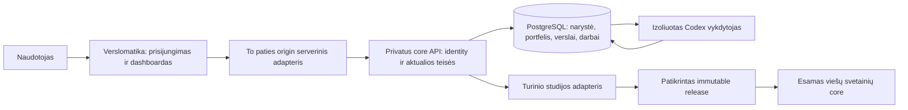

# Verslomatika prijungimas prie bendro core

2026-10-10. **Aktuali apimtis: planas, autorizuotas vietinis I1a/I1b ir siauras I2 operatoriaus pokalbis.** Po pirmo dokumentų commit savininkas „Kordinatorius A“ pokalbyje tiesiogiai pavedė „tai teskit darbus ir nestokit“ (turn01a12316-8c34-7492-8197-8fcd7deb6a8b). Ši sesija valdo core identity/registry/API bei durable task/run/event; direktorius (`01a0dcf8-8ade-7883-877b-8d5dba4e8c79`) — portalo login/BFF/dashboard/chat. [I1 įrodymai](VERSLOMATIKA_LOCAL_PORTFOLIO.md), [I2 įrodymai ir ribos](VERSLOMATIKA_LOCAL_CHAT.md), [istorinis planavimo inventorius](VERSLOMATIKA_CORE_INTEGRATION_EVIDENCE.md), [portfolio OpenAPI0.2.0](contracts/verslomatika-portfolio.openapi.json), [chat OpenAPI0.1.0](contracts/verslomatika-chat.openapi.json), [issue64](https://github.com/christianza1989/nisiniai-puslapiai-monetizavimui/issues/64) / [issue67](https://github.com/christianza1989/nisiniai-puslapiai-monetizavimui/issues/67). PR62 yra ankstesnis portalo planas; implementation PR nurodomi patikrų įrašuose. Visas D1/D2 ir hosted paleidimas tuo neužbaigiami.

## 1. Sprendimas ir santykis su ankstesniu planu

Verslomatika.lt tampa viena pagrindine prisijungimo ir verslų valdymo aplinka. Mūsų organizacija mato jai priskirtą esamų nišinių verslų portfelį; klientas — tik savo organizacijos leistinus verslus. Vėliau tame pačiame portale jis kalbasi su pasirinktais agentais, prijungia turimą verslą ir užsako naujo verslo kūrimą pagal aktualias core taisykles.

Platesnis agentų, ataskaitų, ekranų ir apskaitos projektas jau yra [PR59, pinned planas](https://github.com/christianza1989/nisiniai-puslapiai-monetizavimui/tree/87fcf4c34a4e1b1dab488bb193a1c1716bb51627/agent-business-core/verslomatika-plan). Jo D1+D2 kryptį pernaudojame. Šis dokumentas konkretina portalas→identity→portfelis→vietinis operatoriaus pokalbis jungtį ir priklausomybes. D1 skaidomas į ankstyvą skaitymo kelią ir agentų/darbų pamatą; vien skaitymas ar konsultacinis atsakymas neužbaigia D1/D2. PR59 nėra sujungtas į tikrintą main. Keturi portfolio GET ir du local auth POST aprašyti portfolio.v1; šeši thread/task keliai atskirame chat.v1. Generic agent registry, įrankių brokeris ir director business creation dar neįgyvendinti.

Nekuriame antro klientų/užduočių/pašto core Verslomatika repo. Jos esamą domeno auditą ir konsultaciją išlaikome kaip produkto įėjimo kelią. Registracija neprijungia visų agentų ar išorinių kanalų automatiškai.

## 2. Kas yra dabar

| Dalis | Patikrinta būsena | Integracijos sprendimas |
| --- | --- | --- |
| Privatus core main `d4ea8bf7384b70c4ea62a344001e3f8158812c56` | FastAPI/PostgreSQL; `Business.id` UUID, unikalūs `site_id` ir `canonical_host`; duomenų scope `business_id + environment_id` | Išlaikyti esamus UUID, istoriją ir scoped transakcijas. Organizacijų/narysčių sluoksnis bus papildomas |
| Esamos konsolės | Pašto ir Facebook moduliai, vietinė turinio studija | Moduliai ir adapterių pagrindai. Jie nėra bendras klientų dashboardas |
| Viešas core main `d0fd6b7d296303bfcaafadc4071945e675a72b96` | 9 sugeneruoti V1 paketai; Dovanos123 V2 staging, generated admission tuščias | Paketai ir publikavimo projekcija yra turinio šaltinis, o ne paskyrų/nuosavybės registras |
| Verslomatika main `50e00bebc2408b906c763d07b45d868aeabea98c` | Portalų sesijos pateiktas ir jos plane užfiksuotas Git pagrindas | Portalą keičia jos vykdytojas. Prieš app pakeitimus integruoti aktualų peržiūrėtą release source |
| Verslomatikos veikiantis release | Direktoriaus pateiktas source `e2897f8c6ac23fb493039517721f88e44e96f1b6`, Next.js 16.3.6 / Node22 | Domeno auditas ir konsultacija yra; customer login, portfelio dashboardas ir core connector dar nėra |

Šis inventorius yra source peržiūra. Nei deployment, nei konkrečių gyvos DB verslų UUID, nei 24/7 serverio neperskaitėme kaip naujo priėmimo įrodymo. Source merge, įregistruotas domenas, public paketas ir realiai veikiantis verslas turi atskiras būsenas.

## 3. Atsakomybės ir tapatybė

| Objektas | Vienas autoritetingas šaltinis |
| --- | --- |
| Asmens autentifikacija | Vietinis pilotas: core scrypt credentials ir opaque atšaukiama DB sesija. Portalas įgyvendina login/BFF/HttpOnly cookie, neturi antro password store. Hosted identity provider bus atskiras adapteris |
| Vidinis naudotojas | Core susiejimas `(identity_issuer, identity_subject) → user_id`; el. paštas nėra nuosavybės raktas |
| Organizacija, narystė, portfelis, verslo grant | Core PostgreSQL. Portalas skaito šį modelį, nesaugo konkuruojančios leistinų verslų kopijos |
| Verslas | Esamas `Business.id`. Organizacija yra prieigų riba; juridinis asmuo — atskiras finansinis/teisinis objektas |
| Svetainė/domenas | Esamas `site_id` ir tikras canonical host; prijungimo evidence. Domenas pats nesuteikia teisių |
| Užduotis/agentas/kvitas | Core; portalas rodo patvarią projekciją. Codex thread ID nėra platformos prieigos teisė |
| Viešas turinys | Esamas patvirtintos revizijos/publishAt/host filtras viešame core. Dashboardas nekuria naujo publisher |

Pilotui išlaikome esamą Business 1:1 site ryšį. Kelių domenų `business_sites` yra vėlesnė additive migracija; jos metu privaloma viena rašymo kryptis ir legacy API suderinamumas. Portfelio admin nėra automatiškai platformos superadmin. Mūsų org naudoja aktualius MB Pinet/info@pinet.lt tinklo faktus; klientų organizacijoms jų nepriskiriame kaip universalių rekvizitų.

### Autentifikuotas kelias

**Aktualus vietinis režimas:** naršyklė kviečia tik to paties origin portalo BFF. Login perduoda bounded `{username,password}` į fiksuotą loopback core adresą. Core išduoda atsitiktinį opaque Bearer tokeną iki8h ir DB saugo tik jo SHA256; portalas laiko tokeną HttpOnly/SameSite=Strict cookie. Core kas request tikrina persisted session, expiry/revocation/user-enabled ir aktualias memberships/grants. Naršyklės actor/org claims, global operator/worker/edge raktai šiame kelyje netinka. Logout atšaukia DB sesiją. Core ir portalas pagal nutylėjimą OFF; vietinis režimas negali veikti viešame/Vercel hoste. Tikslios guard/rate-limit/pagination taisyklės ir įrodymai — [implementation įraše](VERSLOMATIKA_LOCAL_PORTFOLIO.md).

**Vėlesnio hosted IdP adapterio pasiūlymas, šiame pilote neįgyvendintas:** verified provider session → dedicated portal-signed actor assertion TTL≤60s, single-use jti, method/path/query/body hash, audience/issuer/session binding ir current core grants. Portalo signing issuer atskiras nuo `(identity_issuer,identity_subject)`. Kiekvienam retry naujas assertion/jti, business idempotency raktas tas pats. Tam reikės atskiro threat review, issuer/key provisioning, nonce ir session-revocation adapterio; nereikia įsigyti išorinio auth provider vietiniam slice.

Core tokenas negali pasikliauti tokeno roles/grants snapshot. `PINET_OPERATOR_SECRET` lieka esamo operatoriaus keliui; jis nėra customer login ir portalas juo neproxyina arbitrary site ID. Viešo core `oai-authenticated-*` helperis nėra šio login autoritetas. I2 task current-grant/claim/heartbeat/result/revocation enforcement priėmimas pateiktas atskirai; būsimi streams/download/kitų adapterių jobs nėra keturių portfolio GET testų išvada.

## 4. Esamų verslų prijungimas

1. Vienas read-only discovery paima tikras esamas Business eilutes privačiai; sutikrina studijos stable IDs, main public paketus ir atskirų projektų registracijas. Privačių DB UUID nereikia kopijuoti į Git.
2. Sudaro privačią migracijos ataskaitą: esamas UUID, site ID/host, šaltinio commit, operatoriaus org binding, kodėl įtrauktas, būsenos ir konfliktai. Šis savininko pavedimas jau autorizuoja jam priklausančių esamų nišų priskyrimą; nereikia naujo smulkaus tvirtinimo kiekvienai aiškiai patvirtintai eilutei. Neaiški nuosavybė ar konfliktas lieka `pending/conflict`.
3. Idempotentinė additive migracija priskiria patvirtintas eilutes operatoriaus organizacijai ir išlaiko jų UUID/site IDs. Kartojimas tų pačių grants nekopijuoja. Neįrašytas į agentų runtime viešas site gauna patvirtintą registry įrašą ir `runtime=not_connected`; jam nereikalaujame sukurti fiktyvaus pokalbio profilio.
4. Standalone mūsų projektai, pvz. Madbeauty ar Namudarbas (`siteId=mokytoja-ai`), išlaiko savą backend/hostingą. Registravimas suteikia portfelio peržiūrą su jų actual būsena; jis nepajungia visų funkcijų ar nekeičia jų publisher.
5. `networkDomains` sąrašas, vietinis source katalogas, synthetic calibration registry ir nesujungtas PR nėra pakankami automatiškai pažymėti visus domenus active/live. Branch-only ir legacy darbai įtraukiami su šaltinio ref ir ryšio būsena, kai tapatybė/nuosavybė pagrįsta.

Žinomi main V1 IDs: `akmenas`, `auksarankiams`, `autoelektrikaivilniuje`, `fasadopastoliai`, `greitossvetaines`, `laiptucentras`, `miniekskavatoriai`, `roletaiklaipedoje`, `traktoriupadangos`. Vykdytojas ima inventorių iš machine-readable šaltinio, ID iš domeno negeneruoja iš naujo. Dovanos123 staging nėra live admission. Naujos kitų sesijų nišos įtraukiamos po jų atskiro aktualumo patikrinimo.

## 5. Pirmas API kontraktas — vietinis portfolio.v1

Contract ID `portfolio.v1`, OpenAPI info0.2.0; URL šeima sutampa su PR59 `/operator/v2`. [OpenAPI JSON](contracts/verslomatika-portfolio.openapi.json) yra canonical local sutartis. Immutable auth schema checkpoint7e476e4ae58297579c3044a2b08f2bf0e0a0d11a perduotas portalo type generatoriui. Actual runtime/source/HTTP/UI priėmimas atskirai — [implementation įraše](VERSLOMATIKA_LOCAL_PORTFOLIO.md). Tai nesuteikia production/hosted kliento konfigūracijos.

| Siūlomas GET | Rezultatas |
| --- | --- |
| `/operator/v2/me` | Core user ir tik jam leistini organization/portfolio IDs; jokių OAuth tokenų |
| `/operator/v2/capabilities` | Schema/version, actual palaikomas `portfolio.read`, aplinka ir source revision; CLI/kanalų capabilities neprisideda iš plano |
| `/operator/v2/portfolios/{portfolio_id}/businesses` | Puslapiuotas autorizuotas sąrašas: UUID, site/host, vardas, stage arba unknown, connection ir evidence timestamp |
| `/operator/v2/businesses/{business_id}` | Ta pati leistina registry projekcija; jokių kontaktų, transkriptų, finansų ar unpublished turinio |

Page limit 1–100; opaque cursor susietas su actor/portfolio/environment ir ordering snapshot. Svetimas objektas — 404 be jo metadata; absent/expired identity — 401; negalima capability — 403; netinkamas cursor — 400; pasenęs snapshot — 409; nesuderinamas contract arba source — 503. Visi atsakymai `private, no-store`; portalas necacheina jų tarp naudotojų. Stage/deployment/activity nėra numanomi iš source commit. Outage rodo tikrą klaidą; tuščias portfelis galimas tik po sėkmingos autorizuotos užklausos.

## 6. Darbų eilė ir failų savininkai

| Etapas | Konkretus rezultatas | Savininkas ir numatomos ribos | Išėjimas |
| --- | --- | --- | --- |
| I0: šis planas | Aktualus inventorius, dvišalis susitarimas ir API pasiūlymas | Ši core sesija: tik trys nauji docs/contract failai + savo WORKSTREAMS įrašas; portalų sesija: jos planas/ADR/handoff | Dokumentų QA + abiejų sesijų peržiūra; runtime priėmimo nėra |
| I1a: identity/registry | Core organizations/users/memberships/portfolios/grants ir saugus actor adapteris; additive bootstrap | Core vykdytojas: naujas `runtime/src/pinet_core/control/`, nauji tests; tikslios migrations/models/api integracijos rezervuojamos prieš kodą. Portalų vykdytojas: login/session ir BFF. Provider konfigūracija suderinama čia | Tikras DB migracijos/rollback rehearsal, current-grant enforcement ir dvi izoliuotos org |
| I1b: portfelio kelias | Pirmi keturi GET ir operatoriaus `/dashboard` su actual registry | Core: canonical OpenAPI/types ir read adapteriai; portalas: `web/app/dashboard/`, scoped `web/app/api/core/`, `web/lib/core/` (siūlomos ribos) | Browser→BFF→core→DB, reload/restart, known/unknown/error; visos P1–P12 patikros |
| I2: agentai/chat/darbai | PR59 D1 likęs generic registry/task/run/event pamatas ir D2 pilnas owner-chat→task→report kelias | Core: bendras durable vykdymas + brokeris; portalas: to paties dashboardo agentai/chat/tasks. Esamų Job/Artifact privalomas Conversation ryšys sprendžiamas adapteriu/migracija | Vienas realus scoped Codex atsakymas, duplicate/crash/lease/budget/cancel, UI/report sutapimas; P13–P17 |
| I3: naujo/kliento verslo onboarding | Verified ownership, idėja/domeno siūlymas, tyrimas ir izoliuotas F1 build/release | Verslomatika orkestruoja UI; vykdytojas naudoja aktualius core builder/planner/audit/impeccable ir BUSINESS/TOOLS taisykles | P18; vienas pilnas local kūrimo kelias. Pirkimas, deploy, paid tools ir klientų integracijos pagal tikrą konkretaus veiksmo mandatą |
| I4: hosted eksploatacija | Patikrintas komercinis portalas ir 24/7 core/DB/worker supervision, backups, alerts | Portalų hostingą valdo direktorius; core deployment turi paskirtą vieną owner. Tikslaus serverio/regiono ši peržiūra nenustatė | P19, actual hosted login/portfolio ir atkūrimas; tada tik konkrečių priimtų funkcijų customer launch |

I1 nėra viešas klientų registracijos paleidimas prieš izolacijos įrodymus. Priėmus I1 vietinį kelią pagal tiesioginį tęsti pavedimą įgyvendintas siauras I2 business-scoped consultation ir durable task/run/events. Etapų lentelė nepaverčia dalinio paketo viso D1+D2 priėmimu. Generic registry, direktorinis verslo kūrimas ir hosted/customer vykdymas lieka konkrečios priklausomybės; D3–D9 agentų plėtra/kanalai/finansai — PR59 roadmapo darbai.

Git eilė: core schema/identity/registry reviewed PR → portalų generated types/adapter/dashboard PR → bendras local acceptance → pasirinkto hosted piloto release. Viešo core PR pirmam read-only dashboardui nereikalingas. Prireikus turinio adapterio pakeitimo, jo PR turi exact companion SHA, suderinamumą ir atskirą public-core priėmimą. Peržiūrėti ir sujungti tik reikalingą PR59 scope; jo acquisition papildymai nėra portfelio runtime priklausomybė.

## 7. Hostingas ir Codex vykdymas

**Rekomendacija:** pirmą tiltą kuriame vietoje ir išlaikome dabartinį Verslomatikos Vercel deployment. Portalas bei BFF gali likti Vercel, viešas nišų core — savo dabartiniame hostinge. Python/PostgreSQL ir Codex CLI dirba atskirame prižiūrimame backend; konkretaus komercinio serverio/regiono/biudžeto pasirinkimas lieka I4.

Vercel Functions užklausų trukmė ribota; todėl verslo kūrimas ir agentų darbas gauna core job ID ir tęsiasi nepriklausomai nuo browser/request. Vercel Hobby yra nekomerciniam naudojimui; actual tinkamas portalų planas dar nepatikrintas. [Functions limits](https://vercel.com/docs/functions/limitations), [Fair use](https://vercel.com/docs/limits/fair-use-guidelines).

Cloudflare yra alternatyva po faktinio dabartinio Next app suderinamumo bandymo. Aktualios docs Next16 keliui aprašo beta vinext; esamo viešo core Workers naudojimas nepaverčia Verslomatikos runtime jau suderinamu. Host migracijos nepridedame prie login/portfelio pirmo priėmimo. [Cloudflare Next.js](https://developers.cloudflare.com/workers/framework-guides/web-apps/nextjs/). Abi sesijos šią pradinę kryptį suderino; šis dokumentas neperka plano ir nekeičia DNS.

Codex brokeris neperduoda arbitrary browser RPC. Siauras operatoriaus konsultacijos adapteris naudoja `codex exec --json`/output schema, fiksuotą serverio workspace/model/tool configuration ir pinned side-by-side CLI0.156.1. Global0.139.0 išlaikoma; requestedgpt-6-luna / medium joje atmestas, naujame actual probe/portalo kelyje priimtas. Įrankių/procesų OS isolation ir customer auth nėra šio proof. Interaktyvus būsimas `app-server` turi atskirą pinned broker/production proof; dabartiniam vienam atsakymui nereikalingas. [Non-interactive](https://learn.chatgpt.com/docs/non-interactive-mode), [App-server](https://learn.chatgpt.com/docs/app-server).

Privalomos brokerio ribos: core user/org/business/environment/thread binding; leistinų metodų sąrašas; jokio browser `cwd`, executable, shellCommand, process/spawn, naujo MCP, model-provider URL ar permission override; isolated OS/container/workspace ir minimalus egress. Modelio instrukcijų tekstas nepakeičia šių serverinių ribų. Source HEAD/main/instruction hashes užfiksuojami prieš kiekvieną reikšmingą job partiją per freshness gate; tuo metu pradėtas job išlaiko snapshot. Naujo verslo kodas gimsta savo branch/workspace ir pereina core priėmimą prieš release.

Operacijos turi current grant/mandate, idempotency fingerprint, lease/fencing, kvotą/biudžetą, timeout, checkpoint, redacted event ir rezultato kvitą. Promptas negali pakelti leidimų ar pats pažymėti darbo succeeded. Užduotis negali prarasti DB būsenos uždarius chat; pasenusio worker rezultatas atmetamas. Esamų operatoriaus CLI auth failų klientams nekopijuojame. Customer inference finansavimui pasirenkamas serverinis service credential arba faktinę aplikacijos eligibility patvirtinantis per-user OAuth kelias. Oficialus SIWC app-server token-sharing kelias egzistuoja, tačiau Verslomatikos app teisės/entitlements ir jų kainos dar nepatvirtintos. [SIWC integration](https://developers.openai.com/siwc/token-sharing-open-source/codex-app-server).

## 8. Visos platformos priėmimo scenarijai

Ši lentelė saugo visą darbų eilę; konkretūs I1 scenarijų PASS/PARTIAL/PLANNED ir testų kvitai pateikti [I1 įraše](VERSLOMATIKA_LOCAL_PORTFOLIO.md), siauro operatoriaus P13/P14/P16/P17 kelio įrodymai [I2 įraše](VERSLOMATIKA_LOCAL_CHAT.md). Istorinis21a59d5 planavimo rezultatas neturėjo runtime įrodymų ir lieka istorijoje. Pilni P15/P18/P19 ir visų adapterių/customer priėmimas dar neįvykdyti.

| ID | Tikras vėlesnio bandymo kriterijus |
| --- | --- |
| P1 | Tikras operatoriaus prisijungimas, registry UUID/site IDs/dashboard sutampa; po reload ir DB/API restart išlieka |
| P2 | Customer A mato tik A; B ir operatoriaus portfolio/detail grąžina 404; new org be grants yra tikrai tuščia |
| P3 | Forged/expired issuer/audience/signature/subject/session, replay jti ir request-binding pakeitimas atmetami; service credential vienas actor nesuteikia |
| P4 | Revoked membership/grant ir logout atmeta kitą GET net su dar galiojančiu assertion; vėliau uždaro stream/download |
| P5 | Tas pats DB pool ryšys po A→B scope switch, direct SQL kaip runtime role ir be scope neduoda svetimų duomenų; jokio BYPASSRLS |
| P6 | Paginated cursor iš A/B, kitos aplinkos ar kito snapshot netinka; kelių puslapių junginys neturi svetimų ar dublikuotų eilučių |
| P7 | DB migracijos pakartojimas nekuria naujų UUID/grants; konfliktas palieka legacy mapping ir aiškų receipt; snapshot backup/restore išlaiko ryšius |
| P8 | Package, staging, runtime-not-connected ir unknown deployment būsenos rodomos teisingai; repo sąrašas neįjungia kanalų |
| P9 | Core outage, schema mismatch, empty ir stale nėra fake-success; serveriai/intermediate cache negrąžina kito naudotojo atsakymo |
| P10 | HTTP/bundle/browser/logs neturi operator/worker/CLI credentials, PII/transkriptų ar raw tool output |
| P11 | Actual desktop/mobile/keyboard login ir dashboard kelionė, taikomos loading/error/empty/forbidden; measured viewport, noindex ir cache policy |
| P12 | Esamas Verslomatikos public audit/konsultacijos release ir core legacy site/mail/voice/publication testai regresuoja pagal paveiktą scope |
| P13 | Owner message→vienas patvarus task→real Codex structured result→report/UI; nežinomi duomenys nevirsta 0 ar tariamu veikimu |
| P14 | Duplicate key+same input tas pats task; kitoks input 409; crash/restart/reconnect/cancel ir stale lease nesukuria dviejų verslų/veiksmų |
| P15 | Svetimas thread/artifact/tool ir injected instrukcijos, shellCommand/process-spawn/permissions override neperžengia brokerio ir OS ribų |
| P16 | Worker prieš claim/tool/persist recheckina grants, mandate, source/version ir budget; revoked/paused/cap viršijimas stabdo naują veiksmą |
| P17 | Report ir dashboard skaito tą patį source snapshot/timewatermark; tikros šio kelio CLI sąnaudos/limitai registruojami, nežinoma kaina nėra 0 |
| P18 | Viena idėja/domenas→research/BUSINESS/TOOLS→F1→auditas/release su canonical source; availability/ownership ir publish permission tikrinami atskirai |
| P19 | Actual hosted TLS/login/portfolio, 24/7 supervision ir backup/restore į kitą izoliuotą aplinką; kanalai atkūrimo metu OFF; rollback į pinned release |

I1 minimalios suite: `test_control_portfolio.py`, esami `test_core.py`, `test_policy.py`, paveikti legacy rinkiniai ir portalų test/typecheck/build/browser acceptance. Atskiro legacy `test_security.py` nėra. Public-core test:core/seo-smoke taikomi jį keičiant; šio slice public source read-only. Tikslios vykdytos komandos ir rezultatai pateikti implementation įraše.

## 9. Rizikos, nežinomybės ir grįžimas

Likę konkretūs vartai: esamos/shared DB UUID inventory ir adoption (atskiras pilotas nėra istorinių UUID migracija); hosted IdP sesija; generic agent registry/tools broker ir direktorinis business creation virš dabar esančių non-conversation task/run/events; I4 TLS/backend/regionas/hosting, backup/restore ir eksploatavimo biudžetas. I1/I2 local DB/API/UI įgyvendinimo būsena pateikta atskirai. Apmokėjimai, klientų laiškai, išorinių paskyrų valdymas ir apskaita turi vėlesnius mandatus/priemimą.

Perjungimas feature flag vienam read adapteriui. Iki acceptance esamos konsolės/core API lieka pagrindinis operatoriaus kelias; nenaudoti jų kaip tylaus customer auth fallback. Rollback išjungia portalų tiltą ir naujus worker claim, grąžina pinned app/API versijas; additive mapping paliekamas audituotas, klientų istorija ar UUID netrinami. DB destruktyvus downgrade galimas tik po atskiro suderinamumo/backup rehearsal, ne kartu su UI revert.

Šis Git perdavimas pateikia planą ir scoped local implementation. Main merge, hosted deploy, vieša klientų registracija ir visų verslų autonomija yra atskiri įvykiai.
