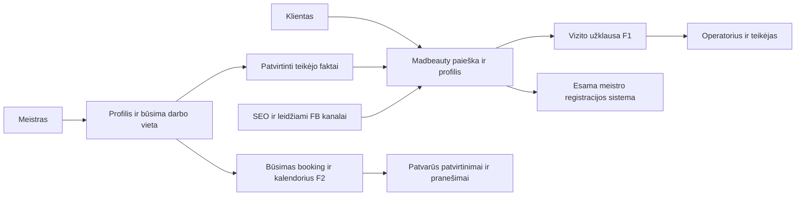

# Madbeauty platformos planas

2026-10-05. Statusas: PROPOSED / RESEARCH_COMPLETE, ne IMPLEMENTED. Parengta pagal savininko „iškart reikia planuoti normalią platformą“ ir nemokamų skelbimų / naudojimo reikalavimą. Rinkos įrodymai: [RESEARCH](../../research/madbeauty-2026-10-05/RESEARCH.md). Komercinis pasirinkimas: [BUSINESS](BUSINESS.md). Pritraukimas: [ACQUISITION](ACQUISITION.md).

## Nauja darbo eiga: pirma visas privatus prototipas

2026-10-05 savininkas pasirinko pilną paspaudžiamą platformos sąsają su centralizuotu dummy data rinkiniu prieš tikro backend prijungimą. Po Fresha peržiūros autoritetas [FINAL_PROTOTYPE_PLAN](FINAL_PROTOTYPE_PLAN.md), [70 ekranų inventorius](SCREEN_INVENTORY.json) ir [DEMO_DATA_CONTRACT](DEMO_DATA_CONTRACT.md). UI/assets/data foundation jau įgyvendinta ir lokaliai patikrinta; pilni klientų/meistrų/operatoriaus keliai dar PLANNED. [PROTOTYPE_ROADMAP](PROTOTYPE_ROADMAP.md) aprašo mock → real adapterio priėmimą. Nurodymas leidžia privačiai projektuoti visą būsimą produktą; tikro public paleidimo / paklausos / F2 veikimo vartai lieka atskiri. [Web/PWA/app sutartis](MOBILE_ARCHITECTURE.md), [Fresha peržiūros ribos](FRESHA_UX_REVIEW.md).

SEO ir ryšių architektūra projektuojama kartu: [SEO_GEO_PLAN](SEO_GEO_PLAN.md), [URL_POLICY](URL_POLICY.json), [CONTENT_LINKING_PLAN](CONTENT_LINKING_PLAN.md) ir [CONTENT_MAP](CONTENT_MAP.json). Neindeksuojame dummy pasiūlos ir kiekvienos datos / valandos kombinacijos. Patvirtinti paslaugos miesto katalogai gali būti Google landing; straipsnių CTA resolveris naudoja tikras paslaugas / miesto kontekstą ir eligible target, ne laisvai agento sugalvotą filter URL.

## Produkto tikslas ir nemokamumo sutartis

Vienas grožio paslaugų portalas, kuriame klientas randa tinkamą meistrą ir organizuoja vizitą, o meistras valdo savo pasiūlymą ir, vėlesniame etape, registracijas. Lietuva — tikslinė rinka; pirmas segmentas Vilnius / nagų priežiūra. Duomenų modelis nuo pradžių palaiko kitus miestus ir paslaugas, tačiau viešoje paieškoje nerodome fiktyvios pasiūlos.

Piloto skelbimas, profilis, naudojimas ir klientų užklausos nemokami; platformos komisinis 0 €. Pradiniame pilote nėra mokamos paskyros, mokamo profilio patvirtinimo ar privalomo iškėlimo. Kai vėliau kuriamas bazinis kalendorius, jo piloto naudojimas taip pat planuojamas nemokamas. SMS, mokėjimo procesoriaus ar trečiųjų šalių planų nevadinti nemokamais ir neįjungti be atskiro faktinio biudžeto / sprendimo. Meistro darbo kaina priklauso jam; nemokama platforma nėra nemokama procedūra.

Galimi ateities AI/premium įrankiai yra atskira savanoriška hipotezė; neskelbti nei kainos, nei privalomo nemokamo plano konvertavimo. Prieš komercinį priedą turi būti tikra kliento vertė, kaštų apskaita ir savininko sprendimas. Nemokamo piloto duomenų nepernaudoti kitų nišų reklamai.

2026-10-05 savininkas atidėjo atsiliepimų rodymo apmokestinimo idėją. 10 €/mėn. ar vienkartinis reputacijos aktyvavimas nepatvirtinti ir neįgyvendinami. Atsiliepimų funkcijos etapas lieka šiame plane; nemokamas marketplace pilotas nepakeistas.

## Vientisa platforma, keturios darbo sritys

| Sritis | Vartotojas ir rezultatas | Pirmas veikimo etapas |
|---|---|---|
| Viešas marketplace | Klientas palygina realius profilius ir paslaugas, pateikia konkretų poreikį / pereina į meistro booking | Fazė 1 |
| Profilio pateikimas | Meistras prašo nemokamo profilio, patvirtina informaciją ir teises; administratorius tikrina | Fazė 1, be viešos self-service paskyros |
| Meistro darbo vieta | Savo profilis, paslaugos, komanda, kalendorius, vizitai ir pranešimai | Fazė 2 po paklausos ir vykdymo sprendimo |
| Operatoriaus valdymas | Pasiūlos kokybė, patvirtinimai, užklausos, atsakymų būklė, pažeidimai, kanalų rezultatai | Minimalus privatus valdymas fazėje 1; plėtra vėliau |

Tai iš anksto suplanuotos vieno produkto sritys, ne keturios nesusietos svetainės. Nauja niša išlieka pirmoje fazėje; normali architektūra nėra automatinis full booking / commerce įjungimas.

Diagramoje F2 dalys suplanuotos; F1 maršrutai taip pat dar neįgyvendinti šiame tyrime.

## Kliento kelias

1. Pasirenka paslaugą ir miestą, prireikus rajoną. Telefone mato paiešką ir konkretų pasirinkimą pirmame ekrane; nereikia programėlės ar privalomos paskyros.
2. Filtruoja kainos variantą, vietą ir teikėjo patvirtintas paslaugas. „Priima naujus klientus“ ar konkretus laisvas langas rodomas tik su realiu šaltiniu ir aktualumo data.
3. Atidaro meistro profilį: tikrų darbų galerija, paslaugos / priedai / trukmė, darbo vieta, teikėjo informacija, kontakto patikros apimtis, atšaukimo paaiškinimas.
4. Fazėje 1 gali „Pateikti vizito užklausą“ arba aiškiai „Registruotis meistro sistemoje“. Išorinis booking neatvaizduojamas kaip jau Madbeauty patvirtintas vizitas.
5. Užklausos patvirtinimas paaiškina, kad pageidavimas gautas, bet laikas nepatvirtintas. Registracijos numeris tik gavus patvaraus įrašymo sėkmę. Gedimo metu jokia žalia fiktyvi sėkmė.
6. Kai teikėjas patvirtina laiką, vartotojas gauna tikrą patvirtinimą per patikrintą kanalą. Fazėje 2 šį procesą pakeičia tikras laiko pasirinkimas, resurso laikinas laikymas ir rezervacijos patvirtinimas.

Tuščio rezultato atveju pateikti realų alternatyvų miestą / paslaugą arba skaidrų poreikio testą. Nerodyti išgalvotų profilių užpildymui, „turime laisvą laiką šiandien“ ar garantuoto atsakymo, kol tai nepatikrinta.

## Paieška pagal tikrai laisvą laiką — produkto sutartis

2026-10-05 savininkas patikslino pagrindinį scenarijų: pasirenku paslaugą, šiandien / rytoj / konkrečią datą, miestą ir tinkamas valandas; matau meistrus, kurie tada turi vietą. Šis scenarijus yra privalomas būsimo F2 kalendoriaus piloto rezultatas, ne pasirenkamas kosmetinis filtras. F1 lieka skaidri užklausų / išorinės registracijos paieška; laisvų laikų filtras neįjungiamas su išgalvotais ar nepatikrinamais laikais.

### Kliento pasirinkimai ir rezultatas

- Paslauga ir konkretus variantas / priedai, pvz., gelinis lakavimas su seno lako nuėmimu. Priedų trukmę ir kainą nustato konkretus teikėjas; bendro numanomo laiko visiems meistrams nėra.
- Miestas ir pasirenkamas rajonas. Atstumo filtras galimas tik turint patikimas vietos koordinates ir kliento pasirinktą atskaitos vietą; jis nereikalauja mokamo žemėlapio nuo pradžių.
- „Šiandien“, „Rytoj“ arba konkreti data pagal Europe/Vilnius; neteisingi / jau praėję laikai atmetami serverio laiku.
- Valandų intervalas. Numatytasis aiškiai pažymėtas režimas „Visas vizitas turi tilpti šiame intervale“: 17:00–20:00 lange 90 min. procedūra negali prasidėti 19:00. Jeigu vėliau pridedamas pradžios laiko režimas, jis turi atskirą aiškų pasirinkimą ir testus, o ne pakeičia numatytąją reikšmę tyliai.
- Kortelėje: konkretus meistras / vieta, realūs darbai, pasirinkto varianto kaina arba aiškus consultation/from statusas, kliento vizito trukmė, siūlomi pradžios laikai ir vizito pabaiga. Neapibrėžtas priedas / trukmė negali sukurti instant booking pasiūlymo.
- Rezultatus galima rūšiuoti pagal artimiausią tinkamą laiką ir patvirtintą palyginamą kainą; atstumu tik su faktinėmis koordinatėmis. Pasirinktas rūšiavimas matomas. Nemokamame pilote nėra paslėpto mokamo iškėlimo.
- Jei rezultatų nėra, originalios sąlygos paliekamos. Klientas pats pasirenka išplėsti laiką / datą / vietą arba, kai priimtas waitlist modulis, gauti pranešimą apie atsilaisvinusią vietą. Kiti pasiūlymai aiškiai atskirti; nėra tylaus filtro ignoravimo.

### Užimtumo ir rezervacijos taisyklės

1. Vienas autoritetingas užimtumo šaltinis konkrečiam specialistui / resursui. Tikrinamas darbo grafikas, pertraukos, atostogos, ranka įrašyti vizitai, aktyvūs laikini laikymai, patvirtinti vizitai ir registracijos prieš vizitą terminas. Tik laisvos valandos grafike dar nėra laisvos registracijos įrodymas.
2. Visa procedūra su priedais ir teikėjo nustatytais paruošimo / sutvarkymo buferiais turi tilpti laisvame resurso intervale. Kliento valandų filtras taikomas jo vizitui, o buferiai papildomai tikrinami resurso grafike. F2 pilote vienas specialistas / viena vieta / vientisa procedūra; kelių resursų ar etapinių paslaugų negalima žadėti iki jų atskiro priėmimo.
3. Profilis be prijungto patikimo kalendoriaus nepatenka į laisvų laikų rezultatus. Gali būti atskiras „Pateikti užklausą“ katalogas, bet jis nesumaišomas su rezervuojamais laikais. Išorinė registracijos nuoroda ir ICAL/busy importas savaime neįrodo atominio patvirtinimo galimybės.
4. Išorinio adapterio aktualumo riba ir sutrikimų elgesys nustatomi bei išbandomi prieš įjungimą. Pasenęs, nutrūkęs ar nežinomas sync negali palikti laikų rezervuojamais kaip patvirtintai laisvų; vartotojui rodomas tikslus alternatyvus užklausos kelias. Šiame plane nėra išgalvotos universalios sync garantijos.
5. Pasirinkus laiką serveris dar kartą patikrina kainą, trukmę, teises ir užimtumą; konkretus laikymas turi galiojimo terminą. Atominė patikra ir įrašymas apima persidengiančius intervalus, ne vien vienodą pradžios laiką. Dvi užklausos negali patvirtinti persidengiančių procedūrų tam pačiam resursui.
6. Jei vietą jau užėmė kitas klientas ar meistras rankiniu būdu, klientui aiškiai pranešama ir pateikiami nauji tinkami laikai. Jokio fiktyvaus patvirtinimo; pakartotas submit / tinklo retry su tuo pačiu idempotency raktu grąžina tą pačią rezervaciją.
7. Patvirtinus rezervaciją invaliduojama susijusi laisvų laikų paieška. Sėkmingai atšaukus ar pasibaigus laikymui resursas grąžinamas į paiešką, jei jis vis dar tenkina grafiką ir registracijos taisykles. Vizito pakeitimas atomiškai patikrina naują laiką; nesėkmė nepraranda seno patvirtinto vizito.
8. Patvirtinimas ir pranešimo outbox įrašas yra patvarūs. Laiško gedimas nekeičia užimtumo ir nesukuria antros rezervacijos; sąsaja leidžia matyti tikrą rezervacijos būseną, o ne spėti iš išsiųsto laiško.
9. Vieša paieška atskleidžia tik tinkamus laisvus laikus; neatskleidžia užimtų vizitų klientų, jų kontaktų ar procedūrų. Visos teikėjo / vietos / siteId teisės tikrinamos serverio pusėje.

### Privalomi laisvų laikų priėmimo scenarijai

Visi žemiau esantys scenarijai dabar PLANNED / NOT RUN. Įgyvendinant saugoti faktinius rezultatų ir duomenų įrodymus; dokumentų integrity PASS jų nepakeičia. F2 įjungimas negalimas esant neišspręstai kritinei užimtumo, izoliacijos ar rezervacijos klaidai.

| ID | Patikra | Tikėtinas rezultatas |
|---|---|---|
| AV-01 | Šiandien / rytoj / data, miestas ir 17:00–20:00 langas | Tik tinkamo miesto, datos ir viso vizito intervalą atitinkantys laikai; praėjusių laikų nėra |
| AV-02 | 90 min. paslauga, 30 min. tarpas; papildomas nuėmimas ir buferiai | Netelpantis vizitas negrąžinamas; teisingas resurso rezervuojamas intervalas |
| AV-03 | Pertrauka, atostogos, rankinis vizitas, aktyvus laikymas ir registracijos terminas | Kiekvienas blokas pašalina konfliktuojančius pasiūlymus |
| AV-04 | Profilis be kalendoriaus, pasenęs ar sutrikęs išorinis adapteris | Jokių patvirtintai laisvų laikų; tik aiškus užklausos kelias |
| AV-05 | Du klientai rezervuoja vienodą arba skirtingos pradžios persidengiantį laiką | Tik viena patvirtinta rezervacija tam pačiam resursui |
| AV-06 | Meistras įrašo vizitą tarp paieškos ir kliento patvirtinimo | Kliento konfliktas aiškiai pranešamas; jokių dublių |
| AV-07 | Pakartotas submit, retry ir replay po serverio patvaraus įrašymo | Viena rezervacija, tas pats rezultatas, nėra dvigubo pranešimo įvykio |
| AV-08 | Atšaukimas / laikymo galiojimo pabaiga ir pakartotinė paieška | Resursas atlaisvintas, cache atnaujintas, laikas rodomas tik jei dar tinkamas |
| AV-09 | Vizito pakeitimas į užimtą laiką ir sėkmingas pakeitimas į laisvą | Nesėkmė išsaugo seną vizitą; sėkmė keičia užimtumą atominiu veiksmu |
| AV-10 | Europe/Vilnius DST, dienos riba ir įvestas neegzistuojantis / dviprasmis laikas | Teisingas UTC ir vietinis atvaizdavimas; dviprasmybė išsprendžiama aiškiai |
| AV-11 | Paslaugos kaina / trukmė pakeista prieš ir po patvirtinimo | Prieš patvirtinimą klientas mato ir priima pokytį; patvirtinto vizito snapshot išlieka |
| AV-12 | Tuščias rezultatas, rūšiavimas, filtrų keitimas ir mobilus grįžimas | Jokio tylaus sąlygų išplėtimo; aiškūs išsaugoti filtrai ir tinkami nauji rezultatai |
| AV-13 | Kito meistro / vietos / siteId prieiga ir viešas užimtumo atsakymas | Svetimi privatūs vizitai neprieinami; viešai tik laisvų laikų duomenys |
| AV-14 | Laiško gedimas ir atkūrimas po patvirtinimo | Vizitas išlieka, outbox būsena matoma, rezervacijos ir pranešimo dublių nėra |

Paieškos mobili sąsaja, prieinamumas ir actual Lighthouse priklauso bendram A–Z auditui. Operavimo stebėjimas turi atskirti paieškos klaidas, pasenusį sync, konfliktus patvirtinant, outbox gedimus ir tikrus įvykusius vizitus. Konkrečios našumo / aktualumo ribos priimamos su faktiniu prototipu ir apkrova; „veiks kaip laikrodis“ nėra nematuota 100 % garantija.

## Meistro kelias

Fazėje 1: meistras pateikia dalyvavimo poreikį ir viešus verslo duomenis, operatorius patvirtina kontaktą, darbo vietą, paslaugų kainos faktus ir nuotraukų teises. Galima pateikti dabartinę registracijos nuorodą. Tikras profilis publikuojamas po teikėjo patvirtinimo. Prašymas sukurti profilį yra pasiūlos signalas, ne kliento pirkimas. Katalogo moderavimas turi veikti net jei būsimas agentų runtime neveikia.

Fazėje 2: meistro paskyra su prisijungimu, saugiomis sesijomis ir konkretaus teikėjo teisėmis. Meistras redaguoja savo paslaugas, kainos variantus, trukmę, darbo grafiką, pertraukas, atostogas, registracijos taisykles. Savo klientą gali užrašyti į kalendorių. Paskyros uždarymas / eksportas ir kontaktų keitimas turi aiškų kelią. Atsiliepimo, nuotraukų ir profilio moderavimas nepriklauso nuo mokamo plano.

## Pagrindiniai ekranai ir jų būsena

| Ekranas | Turinys ir pagrindinis veiksmas | Etapas / sąlyga |
|---|---|---|
| Homepage | Ryški paslaugos/vietos paieška, tikros meistrų kortelės, paslaugų pasirinkimas, kaip vyksta vizitas, prisijungti teikėjui | F1; be netikrų bendrų skaičių |
| Paslaugos miesto sąrašas | Palyginami variantai, filtrai, kortelės, rezultatų aktualumas, tuščio rezultato kelias | F1; SEO tik tikram turiningam sąrašui |
| Laisvų laikų paieška | Paslauga ir priedai, miestas / rajonas, data, viso vizito valandų intervalas, konkrečių laikų pasirinkimas | F2; tik autoritetingas aktualus kalendorius ir AV-01–AV-14 priėmimas |
| Meistro / salono profilis | Patvirtinti duomenys, reali galerija, paslaugos, darbovietė, CTA, atskirta platformos ir teikėjo atsakomybė | F1 |
| Vizito užklausa / gavimo ekranas | Paslauga, vieta, pageidaujamas laikas, kontaktas, aiškus statusas | F1; mūsų backend saugojimas ir pristatymas |
| Nemokamo profilio pristatymas / paraiška | Ką gauna meistras, 0 € piloto taisyklė, priėmimo eiga | F1 |
| Gidų indeksas / trys gidai | Naudingi pasirinkimo klausimai, temos vaizdai, teikėjų kategorijų ryšys | F1 |
| Apie / kontaktai / metodika / privatumas / naudojimosi sąlygos / pranešti klaidą | Tikras operatorius ir skaidrus portalas, duomenų ir teisių keliai | F1 |
| Operatoriaus profilių ir užklausų lentelė | Patvirtinimas, aktualumas, tikra gauta užklausa, pristatymo būsena | Minimalus privatus F1 valdymas |
| Meistro dashboard / paslaugos / galerija / grafikas | Teikėjo self-service, jo darbuotojų teisės | F2 |
| Dienos/savaitės kalendorius | Darbuotojai, trukmės, buferiai, atostogos, užimtumas, statusai | F2, ne statinis demo |
| Laiko rezervavimas / keitimas / atšaukimas | Atominė rezervacija ir tikri pranešimai | F2 |
| Waitlist / atsilaisvinę laikai | Tik leidę gauti būtent tokį pasiūlymą klientai, tikras įvykis ir galiojimas | F2/F3 |
| AI / veiklos analizė / mokami priedai | Nauda, biudžetai, opt-in, planų sąlygos | F3, atskiras komercinis sprendimas |

Galutinė tapatybė ir assets planuojami atskiru DESIGN darbu po BUSINESS. Vengti žemės ūkio ar statybos nišos maketo su pakeistomis spalvomis. Grožio portalui svarbi darbų galerija, paslaugų tipografika, aiškūs variantai ir mobilus pasirinkimas. ImageGen gali kurti mūsų iliustracijas / editorial vizualus; negali pagaminti apsimestinių meistro darbų, portretų ar salono nuotraukų kaip realių įrodymų. Konkurentų nuotraukų nerepublikuoti.

## Duomenų modelis — projektuojamas, nėra dabartinės API sutartis

Pagrindinis svetainės raktas madbeauty. Public core config/site registry papildomas tik įgyvendinimo metu sutartame lange. Neįtraukti kosmetinio marketplace record į bendrą visų nišų Business sąrašą kaip naujos svetainės.

| Entitetas | Atsakomybė / svarbūs laukai |
|---|---|
| Provider | providerId, siteId, juridinis/fizinis teikėjas, patvirtintas kontaktas, būsenos ir patikros datos |
| Location | providerId, locationId, reali paslaugos vieta, miestas, adresas, leidimo patikros įrodymas |
| Practitioner | specialistId, providerId, locationId, patvirtinti vieši duomenys; ne fiktyvus bendras autorius |
| Service | serviceId, categoryId, aiškus variantas, trukmė, fixed/from/consultation kaina, priedai ir aktualumas |
| ProviderService | konkretus teikėjas/specialistas ir jo paslaugos variantas, patvirtinta kaina / galiojantys faktai |
| PortfolioAsset | teisės, autoriaus/teikėjo ryšys, originalas privačiai, optimizuoti variantai, moderation |
| ProfileRevision | teikėjo patvirtinta versija / hash, approval, publikavimo būsena, audito įrodymai |
| Inquiry | konkretus poreikis / kontaktas privačiai, source ir provider kandidatas, request ≠ booking |
| Schedule / Block | F2: grafikas ir užimtumas su specialistu, vieta, resursu, timezone |
| Booking | F2: paslauga, kainos/trukmės snapshot, UTC laikas, statusas, idempotency ir audit |
| NotificationOutbox | F2: dokumentuotas tikslas, dedup raktas, delivery/failure, kanalo limitas |
| Consent / ChannelPreference | atskirai paslaugos komunikacija ir pasirenkamas marketingas / waitlist |
| Review | F2: tikro apsilankymo ryšys, moderavimas, autoriaus teisės, jokių importuotų netikrų reitingų |
| AcquisitionEvent | anoniminis kanalo šaltinis / signalas ir tikras inbound, ne bendra žmonių kontaktų bazė |

F1 pradžioje nereikia kurti visų F2 lentelių. Tačiau providerId / locationId / serviceId modelis numatomas iš karto, kad turinio slugas netaptų kliento autorizavimo raktu. Paprastos dokumentinės paraiškos gali pereiti per patvirtintą esamą formą; jos nevaizduojamos kaip jau veikiančio Provider CRUD ar failų upload API įrodymas.

Viešas turinys ir privatūs klientų duomenys atskiri. Meistro paskyra nemato kito meistro užklausų ar visų nišų klientų. Salono darbuotojas gauna tik savo darbui būtiną prieigą. Net kai tiekėjas turi kelias vietas, teises valdo aiški provider/location narystė. Bendras MB Pinet operatorius nereiškia visų tiekėjų bendros klientų istorijos.

## Integracija su esamu core

- Esamame viešame repo yra vinext/Workers pagrindas, content package compiler/importer ir core/SEO smoke testai. Tyrime perskaitytas faktinis package.json ir niche-network config; madbeauty dar neįtrauktas. Nereikia kurti antro savarankiško SEO, sitemap, LLM ar medijos variklio.
- Gidai ir redakciniai puslapiai naudoja dabartinį patvirtinimo/hash/publishAt/domeno filtrą. Dinaminiai teikėjai reikalauja atskiros patvirtintos viešos projekcijos, kurią skaitys tas pats host-aware rendereris; nepaslėpti naujų lentelių turinio pro editorial approval vartus.
- Katalogo importas per naują schema/adaptor sutartį būtų atskiras shared workstream. Dabartinė content-package schema automatiškai nepalaiko multi-tenant booking. Bendros schemos pakeitimas reiškia abu validatorius ir e2e; šiame tyrime schema nekeista.
- Patvari klientų užklausa naudoja per-site formos kelią nepriklausomai nuo agentų runtime. Tikri madbeauty klientų kontaktai izoliuojami; operatoriaus numatytasis MB Pinet / info@pinet.lt. Kitų nišų telefonai, adresai ir pajėgumai neperkeliami. Poraštė pagal projektą: „Mūsų verslas automatizuotas su verslomatika.lt“.
- CRM/core Case yra gautos užklausos ryšys, ne vien FB rastas postas. Vienas inbound dedup stream su tikru sourceId; kai bus provider booking, reikės atskiro apibrėžto šaltinio tipo, ne savavališko website_d1 pernaudojimo.
- Agentas / būsimas voice skaito tik tam site/provider leistiną viešų faktų projekciją. Asmens sveikatos pastabos, kalendoriaus OAuth tokenai ir kitų salonų klientai nepakliūva į bendrą žinių indeksą. Voice default OFF; balso booking tool priklauso nuo jau priimto booking API ir resursų taisyklių.
- Bendras Facebook koordinatorius naudojamas su siteId madbeauty ir dviem atskirais buyer/provider signalais. Naujo atskiro asmeninės paskyros roboto kiekvienam salonui nekuriame. Gyvas adapteris ir leidimai dar nepriimti.

## Rezervacijų patikimumas F2

Pradžioje viena vieta / vienas specialistas / viena paslauga. Vėliau keli specialistai, kėdės/kabinetai ir kelių paslaugų vizitai; plaukų dažymo apdorojimo laikas nėra paprasta vientisa trukmė. Šių atvejų nereikia žadėti pirmame booking pilote.

Projektuojama būsena: requested → held → confirmed → completed; atšakos cancelled, expired, no_show. Fazės 1 Inquiry nėra held/confirmed Booking. Tikras patvirtinimas remiasi patvaria autoritetingo kalendoriaus transakcija. Vienas resursas tam laikui rezervuojamas vieną kartą; konfliktų koordinavimas viename authority, ne eventual KV cache. Būsimo D1/DO arba kito DB pasirinkimas priklauso nuo veikiančio concurrency prototipo, ne nuo šio plano.

Laiką saugoti UTC, rodyti Europe/Vilnius; testuoti vasaros/žiemos laiko pasikeitimą, buferius, paslaugos trukmės pakeitimą ir atostogas. Kainą ir trukmę užfiksuoti konkrečiame booking, kad vėlesnis katalogo redagavimas nepakeistų jau patvirtinto vizito sąlygų. Išorinio kalendoriaus sync yra atskiras OAuth/konfliktų/atšaukimo adapteris: ICAL nuoroda ar busy-only importas nėra pilna dvipusė sinchronizacija.

Outbox įrašas sukuriamas kartu su sėkmingu booking pakeitimu; worker siunčia vėliau su dedup, bandymų limitu ir delivery receipt. Laiško siuntimo klaida negali sukurti antro vizito. Nežinomo send rezultato aklai nekartoti. Cancel/change link turi būti ribotas, ne public nuspėjamas ID; patvirtintas atšaukimas atlaisvina resursą ir turi audit trail. Kliento autentifikavimas, abuse kontrolė ir teikėjo teisės tikrinamos server-side.

AI gali paaiškinti paslaugos pasirinkimą iš tikrų duomenų ir pasiūlyti laisvus laikus, kuriuos grąžina API. LLM pats nenusprendžia, kad laikas laisvas, nekeičia kainos, neįjungia mokėjimų ir nesuteikia medicininės rekomendacijos. „Automatizuota registracija“ galima tik po tikro booking adapterio priėmimo.

## Nemokamo starto techninė kryptis

Naudoti esamą vinext / Workers core ir statinius SEO puslapius; minimalus query API tik paieškai ir patvarioms užklausoms. D1 — pasiūlos metaduomenys / užklausos, jei priimta faktinė schema ir izoliacija. R2 arba dabartinis medijos paketas — patvirtintų optimizuotų nuotraukų pristatymas. Viešame pakete nėra privataus originalo, kontaktų TXT, teikėjo prisijungimų ar klientų tekstų. MEDIA_CORE WebP/srcset/sizes išlieka bendras.

Nuo pradžių numatyti indeksuotą paiešką, ribotą puslapiavimą, upload quotas ir atvaizdavimo cache; nenaudoti visos DB skanavimo kiekvienam filtrui. F1 gali būti visiškai be mokamo Maps, SMS, AI concierge ar mokėjimų. Laiškams naudoti priimtą MAIL_CORE transportą, ne manyti, kad visas SMTP integracijas Workers jau turi. Patikrinti paskyros faktinius planus / panaudojimą / biudžetų vartus prieš live.

Atviro kodo alternatyvų prototipas ir licencijos pasirinkimas vyksta atskirai; Easy!Appointments PHP/MySQL nebūtų tiesioginis Workers dependency. Cal.diy repo dabar pats riboja production rekomendaciją. Todėl nė vieno jų nepasirenkame „nemokamu pilnos platformos sprendimu“ be actual QA. Mūsų pasirinkimas mažina naujų prenumeratų poreikį, tačiau negarantuoja amžinai nulinių infra ir darbo išlaidų.

## Darbų eilė ir plėtros vartai

| Paketas | Rezultatas | Kas turi būti įrodyta prieš kitą |
|---|---|---|
| P0 tyrimas | Šis planas, BUSINESS, acquisition, archyvo sprendimas | Šaltiniai ir nežinomybės užfiksuoti; dar ne komercinė validacija |
| P1 pasiūla / vizualinė kryptis | Aiškus piloto pasiūlymas, realių teikėjų įtraukimo eiga, DESIGN / URL / asset planas | Teisės, operatoriaus faktai, profilį patvirtinantis teikėjas; nėra pažadėto instant booking |
| P2 vietinis marketplace F1 | Homepage, sąrašas, tikri profiliais pagrįsti vaizdai, užklausos kelias, teikėjo paraiška, 3 gidai ir trust/legal | Desktop/mobile, formos patvarumas ir gavimas, schema/SEO, media, link audit; A–Z vartai |
| P3 realus F1 pilotas | Domenas ir priimtas hostingas, patikrinti realūs kontaktai, ribotas SEO/FB pritraukimas | Tikri teikėjai / teisių vartai, actual deploy, DNS, inbox delivery ir per-site matavimas; dabar neatlikta |
| P4 paklausos peržiūra | Pasiūlos aktyvumas, tinkamos užklausos, įvykę vizitai ir aptarnavimo kaštai | BUSINESS peržiūros taisyklės ir pagrįstas savininko plėtros sprendimas |
| P5 ribotas nemokamas kalendoriaus pilotas F2 | 5 savanoriški teikėjai; account / services / grafikas / booking / cancel / email | Izoliacija, concurrency, DST, notification QA, faktinis operatorius ir atkūrimas; mokėjimai/voice OFF |
| P6 plataus booking plėtra | Daugiau teikėjų, reali waitlist, išoriniai kalendoriai, komandos | Faktinis poreikis ir kiekvieno adapterio priėmimas, kaštų ribos |
| P7 AI ir komerciniai priedai F3 | Uždokumentuotas grąžinimo / užpildytų laikų / administravimo naudos produktas | Mokėjimo noro testas, ekonomika, biudžetas ir naujas sprendimas; ne automatika vien iš traffic |

P0 atliktas; P1–P7 aprašo tikrą piloto / plėtros veikimą ir yra suplanuoti, ne atlikti. Prieš realius adapterius vykdoma nauja PUI-0–PUI-5 eiga: visas privatus mock frontend, įskaitant būsimų paskyrų / kalendoriaus sąsajas. Tai ne gyvas full commerce / booking ar autonominis klientų aptarnavimas. Bendrų failų ir nepriimtų modulių ownership bei publikavimo vartai neapeinami.

## Priėmimo scenarijai

F1: teisingo host profilis → realūs variantai → mobile CTA → patvari užklausa → tikras operatoriaus gavimas; pakartotas submit nesukuria dublių; klaidos metu teisingas statusas; kito siteId / nepatvirtintos versijos duomenys neprieinami. Kaina ir image schema atitinka matomą faktą. Draft/expired profilis nepatenka į sitemap/LLM/paiešką. Opt-out, neteisinga galerija ir profilio pašalinimas iš tikrųjų veikia. Visi trys gidai ir trust/legal puslapiai audituojami, ne tik homepage. Lighthouse matuojamas tik su realiais images ir actual maršrutais; balo tikslas nėra audito rezultatas.

F2: du klientai vienu metu pasirenka tą patį laiką — tik vienas confirmed; meistras A nepasiekia B klientų, eksportų ar registracijų; kalendoriaus grafiko pakeitimas negali tyliai sunaikinti esamo vizito; pakartotas webhook/AI tool nekeičia booking du kartus; laiškų gedimas nepraranda vizito; cancel atlaisvina teisingą resursą; DST, token expiration, no-show, rezervacijos hold expiry ir restore patikrinti. F3 papildomai: agentas sustoja be teisės/biudžeto, unknown-send išlieka išsprendžiamas, marketing opt-out galioja laukiančiai eilei, medicinos faktai nesugalvojami.

Rezultato vertinimas atskiras: local quality, launch readiness, demand, economics. Planavimo dokumentas nėra veikiančių API, nemokamo aptarnavimo ar 10/10 portalo įrodymas.
