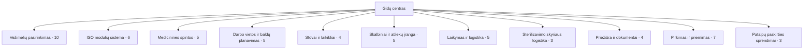

# Promedical: 57 straipsnių teminis žemėlapis

2026-10-09 · Lietuvos gydymo įstaigų pirkimų ir ūkio darbuotojams · Treg tyrimas.

**57 temos, 11 teminių grupių; 57 straipsnių tekstai parengti, 0 dar rengiami.** Visiems nustatytas 42 dienų kalendorius po 1–2 straipsnius kasdien. Tai rengimo būsena, ne 57 jau vieši straipsniai: galutinis faktų, medijos, ryšių, revizijų ir įdiegimo patvirtinimas dar vyksta.

Analizė ir ribos: [TOPICAL_ANALYSIS.md](TOPICAL_ANALYSIS.md). Tikslūs 57 užduočių, 172 frazių → URL ir šaltinių duomenys: [CONTENT_MAP.json](CONTENT_MAP.json). Patikra: [CONTENT_PLAN_VERIFICATION.json](CONTENT_PLAN_VERIFICATION.json).

## Ką turi duoti šis turinys

Padėti įstaigai pasirinkti tikrą Klaro modelį, suderinti matmenis bei komplektaciją ir pateikti palyginamą užklausą. Katalogas lieka komercinių kategorijų bei konkrečių modelių paskirties vieta. Gidai atsako į sprendimus, kurių kategorijų sąrašas neišsprendžia: kas įeina į komplektą, kas tarpusavyje dera, ką išmatuoti, kokį dokumentą patikrinti.

Kiekvieno naujo straipsnio nauda – užpildoma patikros lentelė, komentaruotas tikras modelių palyginimas ar iliustracinė sprendimo schema. Šiuos ruošinius ir atitinkamą vaizdą reikia realiai parengti rašant; planas jų nežada kaip jau veikiančių atsisiuntimų. Kontaktas užklausai: info@promedical.lt, +370 686 88369.

## Teminės grupės

| Grupė | Straipsnių | Pagrindinis gidas |
|---|---:|---|
| Vežimėlių pasirinkimas | 10 | [Kaip pasirinkti medicininį vežimėlį įstaigai](#tema-1) |
| ISO modulių sistema | 6 | [ISO modulių sistema: kaip suderinti laikymą ir transportavimą](#tema-11) |
| Medicininės spintos | 5 | [Medicininės spintos pasirinkimas: talpa, moduliai ir prieiga](#tema-17) |
| Darbo vietos ir baldų planavimas | 5 | [Medicinos įstaigos baldų planavimas: patalpos, darbo vietos ir maršrutai](#tema-22) |
| Stovai ir laikikliai | 4 | [Stovai ir laikikliai medicinos įstaigai: paskirtis, vieta ir suderinamumas](#tema-27) |
| Skalbiniai ir atliekų įranga | 5 | [Kaip pasirinkti skalbinių ir atliekų vežimėlio komplektaciją](#tema-31) |
| Laikymas ir logistika | 5 | [Medicinos priemonių laikymo ir transportavimo planas](#tema-36) |
| Sterilizavimo skyriaus logistika | 3 | [Sterilizavimo skyriaus baldai ir transportavimas: įrangos poreikio planas](#tema-41) |
| Priežiūra ir dokumentai | 4 | [Medicininių baldų priežiūros planas pagal gamintojo dokumentus](#tema-44) |
| Pirkimas ir priėmimas | 7 | [Kaip parengti įrangos pirkimo užklausą gydymo įstaigai](#tema-48) |
| Patalpų paskirties sprendimai | 3 | [Medicinos įstaigos baldų planavimas: patalpos, darbo vietos ir maršrutai](#tema-22) |

Grupė „patalpos“ turi tris taikymo scenarijus ir remiasi bendru baldų planavimo gidu, todėl 11 grupių nereikalauja 11 besidubliuojančių pagrindinių straipsnių.

## Rengimo eilė ir datos

P1: sprendimai, reikalingi konkrečiai modelio užklausai ir pagrindiniams gidams. P2: suderinamumo, inventoriaus ir taikymo detalės. P3: platesnis planavimas bei naudojimo išlaidų palyginimas. Tai redakcinės svarbos žymos; jos nėra raktažodžių sudėtingumo ar paklausos balai.

Savininko nurodymu visų 57 straipsnių datos perkeltos į 2026-10-12–2026-11-22: 27 dienomis po vieną ir 15 dienų po du, 10:00 ir 14:00 Europe/Vilnius. Pagrindiniai gidai numatyti prieš juos papildančius straipsnius. Tai parengimo kalendorius; jei įdiegimas vėluos, visas langas bus perkeltas vienodai. Istorinės patvirtintos revizijos ir ankstesnio plano patikros kvitas išsaugoti. Po naujos peržiūros bei įdiegimo bendras variklis kiekvieną reviziją viešina nuo publishAt be atskiro cron.

Siūlomas pirmas rašymo etapas: baldų darbo vietos planavimas, stovų ir laikiklių paskirtys, priemonių laikymas ir transportavimas, sterilizavimo skyriaus baldų planavimas, priežiūros dokumentų kelias ir jau suplanuotas bazinio vežimėlio komplektacijos gidas. Toliau – konkrečių vežimėlių paskirtys, matmenys, ratukai, ISO suderinamumas ir pirkimo palyginimo užduotys. Ši eilė remiasi priklausomybėmis bei užklausos nauda, nes daugumos frazių apimtis neprieinama.

## Vežimėlių pasirinkimas

| Nr. | Tema | Prioritetas | Publikavimo data ir laikas | Būsena |
|---:|---|---|---|---|
| 1 | [Kaip pasirinkti medicininį vežimėlį įstaigai](#tema-1) | P1 | 2026-10-12 10:00 | Tekstas parengtas; galutinė peržiūra vyksta |
| 2 | [Bazinis vežimėlis ir priedai: kaip patikrinti komplektaciją](#tema-2) | P1 | 2026-10-14 14:00 | Tekstas parengtas; galutinė peržiūra vyksta |
| 3 | [Vaistų vežimėlio komplektacija pagal priemonių paskirstymo darbą](#tema-3) | P1 | 2026-10-15 10:00 | Tekstas parengtas; galutinė peržiūra vyksta |
| 4 | [Tvarstymo vežimėlis: darbo paviršiaus, laikymo vietų ir priedų planas](#tema-4) | P1 | 2026-10-16 10:00 | Tekstas parengtas; galutinė peržiūra vyksta |
| 5 | [Anesteziologinis vežimėlis: kaip suderinti aukštį, stalčius ir priedus](#tema-5) | P2 | 2026-10-17 10:00 | Tekstas parengtas; galutinė peržiūra vyksta |
| 6 | [Reanimacinio vežimėlio komplektacija: prieinamumas ir priedų suderinamumas](#tema-6) | P2 | 2026-10-17 14:00 | Tekstas parengtas; galutinė peržiūra vyksta |
| 7 | [Vizitų vežimėlis dokumentams ir darbo priemonėms: kaip pasirinkti](#tema-7) | P2 | 2026-10-18 10:00 | Tekstas parengtas; galutinė peržiūra vyksta |
| 8 | [Medicininis vežimėlis kompiuteriui: fizinio suderinamumo patikra](#tema-8) | P2 | 2026-10-19 10:00 | Tekstas parengtas; galutinė peržiūra vyksta |
| 9 | [Medicininio vežimėlio matmenys: durų, posūkių ir kabineto patikra](#tema-9) | P1 | 2026-10-20 10:00 | Tekstas parengtas; galutinė peržiūra vyksta |
| 10 | [Medicininio vežimėlio ratukai ir stabdžiai pagal grindis bei maršrutą](#tema-10) | P1 | 2026-10-20 14:00 | Tekstas parengtas; galutinė peržiūra vyksta |

### 1. Kaip pasirinkti medicininį vežimėlį įstaigai

**Skaitytojo sprendimas.** Atrinkti vežimėlio tipą pagal kabineto darbą, naudojamas priemones ir ribotą vietą.

**Unikalus rezultatas.** Sprendimų medis: poreikis → vežimėlio šeima → atmestini variantai; BASIC ir PROFI skirtumai pagal konkretų modelį.

**Frazė ir URL.** „kaip pasirinkti medicininį vežimėlį“ → `/gidai/medicininio-vezimelio-pasirinkimas`. Nėra patikimos skaitinės apimties. Frazės SERP: full-serp-2 (observed).

**Faktinis pagrindas.** [Moduliniai vežimėliai](https://www.klaro.cz/zakladni-voziky): 647 šioje šakoje susietų modelių; pavyzdžiai [ZV2234N-PZ](https://www.klaro.cz/produkt/zv2234n-pz), [ZV2278N-PZ](https://www.klaro.cz/produkt/zv2278n-pz), [ZV2279N-PZ](https://www.klaro.cz/produkt/zv2279n-pz). Kategorijų modelių skaičiai persidengia ir nesumuojami. Prieš skaitinį, medžiagos, apkrovos, valymo ar atitikties teiginį tikrinti konkrečiam modeliui taikomą gamintojo dokumentą.

**Turinio eiga.** Atsakymas į sprendimą → naudotinas ruošinys arba palyginimas → tikro modelio paaiškinimas → trūkstamų laukų patikra ir užklausa. Pagrindinis gidas savo temai. Susieti su katalogu `/kategorijos/zakladni-voziky`, atitinkamu modeliu ir pirkimo užklausa. Esamo patvirtinto teksto nuorodos šiame etape nekeistos.

### 2. Bazinis vežimėlis ir priedai: kaip patikrinti komplektaciją

**Skaitytojo sprendimas.** Atskirti bazinį gaminį, pasirenkamą priedą ir iliustracinę komplektaciją prieš prašant kainos.

**Unikalus rezultatas.** Vieno tikro bazinio modelio ir jo komplektacijos eilučių lentelė; kiekvienam priedui atskiras kodas ir patvirtinimo laukas.

**Frazė ir URL.** „medicininio vežimėlio komplektacija“ → `/gidai/bazinio-vezimelio-komplektacija`. Nėra patikimos skaitinės apimties. Frazės SERP: full-serp-refined-0 (observed).

**Faktinis pagrindas.** [Vežimėliai su priedais](https://www.klaro.cz/voziky-s-prislusenstvim): 92 šioje šakoje susietų modelių; pavyzdžiai [ukazka-lv1](https://www.klaro.cz/produkt/ukazka-lv1), [ukazka-lv2](https://www.klaro.cz/produkt/ukazka-lv2), [ukazka-lv3](https://www.klaro.cz/produkt/ukazka-lv3). Kategorijų modelių skaičiai persidengia ir nesumuojami. Prieš skaitinį, medžiagos, apkrovos, valymo ar atitikties teiginį tikrinti konkrečiam modeliui taikomą gamintojo dokumentą.

**Turinio eiga.** Atsakymas į sprendimą → naudotinas ruošinys arba palyginimas → tikro modelio paaiškinimas → trūkstamų laukų patikra ir užklausa. Grįžimas į pagrindinį gidą `/gidai/medicininio-vezimelio-pasirinkimas`. Susieti su katalogu `/kategorijos/voziky-s-prislusenstvim`, atitinkamu modeliu ir pirkimo užklausa. Tikslūs 6 vidinių nuorodų pasiūlymai ir jų parengtumas saugomi JSON.

### 3. Vaistų vežimėlio komplektacija pagal priemonių paskirstymo darbą

**Skaitytojo sprendimas.** Suskaičiuoti priemonių laikymo skyrius ir suderinti stalčius, modulius bei mechaninę prieigą.

**Unikalus rezultatas.** Anoniminis priemonių inventoriaus pavyzdys → stalčių ir skyrių planas; atskirti mechaninį užraktą nuo teisinių laikymo reikalavimų.

**Frazė ir URL.** „vaistų vežimėlio komplektacija“ → `/gidai/vaistu-vezimelio-komplektacija`. Nėra patikimos skaitinės apimties. Tikslios frazės SERP netirtas; artimos grupės rezultatai nėra tikslios intencijos įrodymas.

**Faktinis pagrindas.** [Vežimėliai su priedais](https://www.klaro.cz/voziky-s-prislusenstvim): 92 šioje šakoje susietų modelių; pavyzdžiai [ukazka-lv1](https://www.klaro.cz/produkt/ukazka-lv1), [ukazka-lv2](https://www.klaro.cz/produkt/ukazka-lv2), [ukazka-lv3](https://www.klaro.cz/produkt/ukazka-lv3). Kategorijų modelių skaičiai persidengia ir nesumuojami. Prieš skaitinį, medžiagos, apkrovos, valymo ar atitikties teiginį tikrinti konkrečiam modeliui taikomą gamintojo dokumentą.

**Turinio eiga.** Atsakymas į sprendimą → naudotinas ruošinys arba palyginimas → tikro modelio paaiškinimas → trūkstamų laukų patikra ir užklausa. Grįžimas į pagrindinį gidą `/gidai/medicininio-vezimelio-pasirinkimas`. Susieti su katalogu `/kategorijos/voziky-s-prislusenstvim`, atitinkamu modeliu ir pirkimo užklausa. Tikslūs 6 vidinių nuorodų pasiūlymai ir jų parengtumas saugomi JSON.

### 4. Tvarstymo vežimėlis: darbo paviršiaus, laikymo vietų ir priedų planas

**Skaitytojo sprendimas.** Išdėstyti naudojamas priemones ir pasirinkti reikiamą darbo vietą ant vežimėlio.

**Unikalus rezultatas.** Darbo vietos schema su paviršiaus, lentynų ir laikiklių zonomis; nėra tvarstymo ar infekcijų kontrolės protokolo.

**Frazė ir URL.** „tvarstymo vežimėlio komplektacija“ → `/gidai/tvarstymo-vezimelio-komplektacija`. Nėra patikimos skaitinės apimties. Tikslios frazės SERP netirtas; artimos grupės rezultatai nėra tikslios intencijos įrodymas.

**Faktinis pagrindas.** [Vežimėliai su priedais](https://www.klaro.cz/voziky-s-prislusenstvim): 92 šioje šakoje susietų modelių; pavyzdžiai [ZV2263N-prevazovy-01](https://www.klaro.cz/produkt/zv2263n-prevazovy-01). Kategorijų modelių skaičiai persidengia ir nesumuojami. Prieš skaitinį, medžiagos, apkrovos, valymo ar atitikties teiginį tikrinti konkrečiam modeliui taikomą gamintojo dokumentą.

**Turinio eiga.** Atsakymas į sprendimą → naudotinas ruošinys arba palyginimas → tikro modelio paaiškinimas → trūkstamų laukų patikra ir užklausa. Grįžimas į pagrindinį gidą `/gidai/medicininio-vezimelio-pasirinkimas`. Susieti su katalogu `/kategorijos/voziky-s-prislusenstvim`, atitinkamu modeliu ir pirkimo užklausa. Tikslūs 6 vidinių nuorodų pasiūlymai ir jų parengtumas saugomi JSON.

### 5. Anesteziologinis vežimėlis: kaip suderinti aukštį, stalčius ir priedus

**Skaitytojo sprendimas.** Palyginti konkrečių anesteziologinių modelių fizinę konfigūraciją su įstaigos pateiktu sąrašu.

**Unikalus rezultatas.** Dviejų patikrintų BASIC / PROFI modelių konfigūracijos lentelė; nekurti privalomų klinikinių priemonių sąrašo.

**Frazė ir URL.** „anesteziologinio vežimėlio komplektacija“ → `/gidai/anesteziologinio-vezimelio-komplektacija`. Nėra patikimos skaitinės apimties. Tikslios frazės SERP netirtas; artimos grupės rezultatai nėra tikslios intencijos įrodymas.

**Faktinis pagrindas.** [Anesteziologiniai vežimėliai](https://www.klaro.cz/basic-anesteziologicke): 7 šioje šakoje susietų modelių; pavyzdžiai [ukazka-av1](https://www.klaro.cz/produkt/ukazka-av1), [ukazka-av2](https://www.klaro.cz/produkt/ukazka-av2), [ukazka-av3](https://www.klaro.cz/produkt/ukazka-av3). Kategorijų modelių skaičiai persidengia ir nesumuojami. Prieš skaitinį, medžiagos, apkrovos, valymo ar atitikties teiginį tikrinti konkrečiam modeliui taikomą gamintojo dokumentą.

**Turinio eiga.** Atsakymas į sprendimą → naudotinas ruošinys arba palyginimas → tikro modelio paaiškinimas → trūkstamų laukų patikra ir užklausa. Grįžimas į pagrindinį gidą `/gidai/medicininio-vezimelio-pasirinkimas`. Susieti su katalogu `/kategorijos/basic-anesteziologicke`, atitinkamu modeliu ir pirkimo užklausa. Tikslūs 6 vidinių nuorodų pasiūlymai ir jų parengtumas saugomi JSON.

### 6. Reanimacinio vežimėlio komplektacija: prieinamumas ir priedų suderinamumas

**Skaitytojo sprendimas.** Sutikrinti konkrečių priedų pasiekiamumą ir vietą pagal įstaigos patvirtintą poreikį.

**Unikalus rezultatas.** Gaivinimo / reanimacinio termino bendras puslapis, fizinių priedų vietų brėžinys ir kodų patikra; be gaivinimo algoritmo.

**Frazė ir URL.** „reanimacinio vežimėlio komplektacija“ → `/gidai/reanimacinio-vezimelio-komplektacija`. Nėra patikimos skaitinės apimties. Tikslios frazės SERP netirtas; artimos grupės rezultatai nėra tikslios intencijos įrodymas.

**Faktinis pagrindas.** [Gaivinimo vežimėliai](https://www.klaro.cz/basic-resuscitacni): 11 šioje šakoje susietų modelių; pavyzdžiai [ukazka-rv1](https://www.klaro.cz/produkt/ukazka-rv1), [ukazka-rv2](https://www.klaro.cz/produkt/ukazka-rv2), [ukazka-rv3](https://www.klaro.cz/produkt/ukazka-rv3). Kategorijų modelių skaičiai persidengia ir nesumuojami. Prieš skaitinį, medžiagos, apkrovos, valymo ar atitikties teiginį tikrinti konkrečiam modeliui taikomą gamintojo dokumentą.

**Turinio eiga.** Atsakymas į sprendimą → naudotinas ruošinys arba palyginimas → tikro modelio paaiškinimas → trūkstamų laukų patikra ir užklausa. Grįžimas į pagrindinį gidą `/gidai/medicininio-vezimelio-pasirinkimas`. Susieti su katalogu `/kategorijos/basic-resuscitacni`, atitinkamu modeliu ir pirkimo užklausa. Tikslūs 6 vidinių nuorodų pasiūlymai ir jų parengtumas saugomi JSON.

### 7. Vizitų vežimėlis dokumentams ir darbo priemonėms: kaip pasirinkti

**Skaitytojo sprendimas.** Pasirinkti dokumentams ir darbo priemonėms tinkamą mobilios darbo vietos išdėstymą.

**Unikalus rezultatas.** Dokumentų formatų, darbo paviršiaus ir laikymo skyrių matavimo ruošinys; nenaudoti pacientų duomenų pavyzdžių.

**Frazė ir URL.** „vizitų vežimėlis“ → `/gidai/vizitu-vezimelio-pasirinkimas`. Nėra patikimos skaitinės apimties. Tikslios frazės SERP netirtas; artimos grupės rezultatai nėra tikslios intencijos įrodymas.

**Faktinis pagrindas.** [Vizitų vežimėliai](https://www.klaro.cz/basic-vizitove): 12 šioje šakoje susietų modelių; pavyzdžiai [ukazka-vv1](https://www.klaro.cz/produkt/ukazka-vv1), [ukazka-vv2](https://www.klaro.cz/produkt/ukazka-vv2), [ukazka-vv3](https://www.klaro.cz/produkt/ukazka-vv3). Kategorijų modelių skaičiai persidengia ir nesumuojami. Prieš skaitinį, medžiagos, apkrovos, valymo ar atitikties teiginį tikrinti konkrečiam modeliui taikomą gamintojo dokumentą.

**Turinio eiga.** Atsakymas į sprendimą → naudotinas ruošinys arba palyginimas → tikro modelio paaiškinimas → trūkstamų laukų patikra ir užklausa. Grįžimas į pagrindinį gidą `/gidai/medicininio-vezimelio-pasirinkimas`. Susieti su katalogu `/kategorijos/basic-vizitove`, atitinkamu modeliu ir pirkimo užklausa. Tikslūs 6 vidinių nuorodų pasiūlymai ir jų parengtumas saugomi JSON.

### 8. Medicininis vežimėlis kompiuteriui: fizinio suderinamumo patikra

**Skaitytojo sprendimas.** Patikrinti kompiuterio ir jo priedų matmenų, tvirtinimo bei laidų vietos suderinamumą.

**Unikalus rezultatas.** Įrenginio matavimų lapas su gamintojo tvirtinimo ir elektros dokumentų laukais; nepažadėti programinės integracijos ar akumuliatoriaus.

**Frazė ir URL.** „medicininiai vežimėliai kompiuteriams“ → `/gidai/medicininis-vezimelis-kompiuteriui`. Nėra patikimos skaitinės apimties. Frazės SERP: full-serp-refined-15 (observed).

**Faktinis pagrindas.** [Sveikatos priežiūros skaitmenizavimo sprendimai](https://www.klaro.cz/produkty-pro-digitalizaci): 6 šioje šakoje susietų modelių; pavyzdžiai [ukazka-vvn1](https://www.klaro.cz/produkt/ukazka-vvn1), [5856](https://www.klaro.cz/produkt/5856), [5855](https://www.klaro.cz/produkt/5855). Kategorijų modelių skaičiai persidengia ir nesumuojami. Prieš skaitinį, medžiagos, apkrovos, valymo ar atitikties teiginį tikrinti konkrečiam modeliui taikomą gamintojo dokumentą.

**Turinio eiga.** Atsakymas į sprendimą → naudotinas ruošinys arba palyginimas → tikro modelio paaiškinimas → trūkstamų laukų patikra ir užklausa. Grįžimas į pagrindinį gidą `/gidai/medicininio-vezimelio-pasirinkimas`. Susieti su katalogu `/kategorijos/produkty-pro-digitalizaci`, atitinkamu modeliu ir pirkimo užklausa. Tikslūs 6 vidinių nuorodų pasiūlymai ir jų parengtumas saugomi JSON.

### 9. Medicininio vežimėlio matmenys: durų, posūkių ir kabineto patikra

**Skaitytojo sprendimas.** Patikrinti, ar su visais numatytais priedais vežimėlis telpa į konkretų maršrutą.

**Unikalus rezultatas.** Skaitytojo užpildomas maršruto matavimo lapas ir aiškiai pažymėtas iliustracinis skaičiavimo pavyzdys; skirti korpuso ir išorinius matmenis.

**Frazė ir URL.** „medicininio vežimėlio matmenys“ → `/gidai/medicininio-vezimelio-matmenu-patikra`. Nėra patikimos skaitinės apimties. Tikslios frazės SERP netirtas; artimos grupės rezultatai nėra tikslios intencijos įrodymas.

**Faktinis pagrindas.** [Moduliniai vežimėliai](https://www.klaro.cz/zakladni-voziky): 647 šioje šakoje susietų modelių; pavyzdžiai [ZV2234N-PZ](https://www.klaro.cz/produkt/zv2234n-pz), [ZV2278N-PZ](https://www.klaro.cz/produkt/zv2278n-pz), [ZV2279N-PZ](https://www.klaro.cz/produkt/zv2279n-pz). Kategorijų modelių skaičiai persidengia ir nesumuojami. Prieš skaitinį, medžiagos, apkrovos, valymo ar atitikties teiginį tikrinti konkrečiam modeliui taikomą gamintojo dokumentą.

**Turinio eiga.** Atsakymas į sprendimą → naudotinas ruošinys arba palyginimas → tikro modelio paaiškinimas → trūkstamų laukų patikra ir užklausa. Grįžimas į pagrindinį gidą `/gidai/medicininio-vezimelio-pasirinkimas`. Susieti su katalogu `/kategorijos/zakladni-voziky`, atitinkamu modeliu ir pirkimo užklausa. Tikslūs 6 vidinių nuorodų pasiūlymai ir jų parengtumas saugomi JSON.

### 10. Medicininio vežimėlio ratukai ir stabdžiai pagal grindis bei maršrutą

**Skaitytojo sprendimas.** Palyginti konkrečių ratukų, stabdžių ir grindų derinius pagal numatomą naudojimą.

**Unikalus rezultatas.** Ratukų kodų ir gamintojo deklaruojamų savybių palyginimas; nekurti universalaus minimalaus skersmens ar antistatinių savybių reikalavimo.

**Frazė ir URL.** „medicininio vežimėlio ratukai“ → `/gidai/medicininio-vezimelio-ratukai-ir-stabdziai`. Nėra patikimos skaitinės apimties. Tikslios frazės SERP netirtas; artimos grupės rezultatai nėra tikslios intencijos įrodymas.

**Faktinis pagrindas.** [Vežimėlių priedai](https://www.klaro.cz/prislusenstvi): 115 šioje šakoje susietų modelių; pavyzdžiai [system-centralni-brzda](https://www.klaro.cz/produkt/system-centralni-brzda), [system-smerova-aretace](https://www.klaro.cz/produkt/system-smerova-aretace), [system-rucni-brzda](https://www.klaro.cz/produkt/system-rucni-brzda). Kategorijų modelių skaičiai persidengia ir nesumuojami. Prieš skaitinį, medžiagos, apkrovos, valymo ar atitikties teiginį tikrinti konkrečiam modeliui taikomą gamintojo dokumentą.

**Turinio eiga.** Atsakymas į sprendimą → naudotinas ruošinys arba palyginimas → tikro modelio paaiškinimas → trūkstamų laukų patikra ir užklausa. Grįžimas į pagrindinį gidą `/gidai/medicininio-vezimelio-pasirinkimas`. Susieti su katalogu `/kategorijos/prislusenstvi`, atitinkamu modeliu ir pirkimo užklausa. Tikslūs 6 vidinių nuorodų pasiūlymai ir jų parengtumas saugomi JSON.

## ISO modulių sistema

| Nr. | Tema | Prioritetas | Publikavimo data ir laikas | Būsena |
|---:|---|---|---|---|
| 11 | [ISO modulių sistema: kaip suderinti laikymą ir transportavimą](#tema-11) | P1 | 2026-10-13 10:00 | Tekstas parengtas; galutinė peržiūra vyksta |
| 12 | [ISO modulių matmenys: nominalus formatas ir realus įdėjimo tarpas](#tema-12) | P1 | 2026-10-21 10:00 | Tekstas parengtas; galutinė peržiūra vyksta |
| 13 | [ISO krepšio gylis ir talpa: kaip sutalpinti priemonių rinkinį](#tema-13) | P1 | 2026-10-22 10:00 | Tekstas parengtas; galutinė peržiūra vyksta |
| 14 | [ISO krepšių pertvaros: skyrių planas ir detalių suderinamumas](#tema-14) | P2 | 2026-10-23 10:00 | Tekstas parengtas; galutinė peržiūra vyksta |
| 15 | [ISO modulių ženklinimas: priemonių vietų ir papildymo žemėlapis](#tema-15) | P2 | 2026-10-23 14:00 | Tekstas parengtas; galutinė peržiūra vyksta |
| 16 | [ISO krepšiai ar padėklai: laikymo, pasiekiamumo ir transportavimo skirtumai](#tema-16) | P2 | 2026-10-24 10:00 | Tekstas parengtas; galutinė peržiūra vyksta |

### 11. ISO modulių sistema: kaip suderinti laikymą ir transportavimą

**Skaitytojo sprendimas.** Suprasti modulių, vežimėlių ir spintų sąsajas prieš renkantis visą sistemą.

**Unikalus rezultatas.** Bendra suderinamumo schema ir perdavimo tarp spintos bei vežimėlio patikra; ISO pavadinimas savaime neįrodo bet kurių dviejų modelių suderinamumo.

**Frazė ir URL.** „ISO modulių suderinamumas“ → `/gidai/iso-moduliu-sistema`. Nėra patikimos skaitinės apimties. Tikslios frazės SERP netirtas; artimos grupės rezultatai nėra tikslios intencijos įrodymas.

**Faktinis pagrindas.** [ISO modulių sistema](https://www.klaro.cz/iso-modul-system): 206 šioje šakoje susietų modelių; pavyzdžiai [3-4-S11416-M11417VAR-01](https://www.klaro.cz/produkt/3-4-S11416-M11417VAR-01), [S11416-M11417VAR-02](https://www.klaro.cz/produkt/S11416-M11417VAR-02), [S11416-M11417VAR-03](https://www.klaro.cz/produkt/S11416-M11417VAR-03). Kategorijų modelių skaičiai persidengia ir nesumuojami. Prieš skaitinį, medžiagos, apkrovos, valymo ar atitikties teiginį tikrinti konkrečiam modeliui taikomą gamintojo dokumentą.

**Turinio eiga.** Atsakymas į sprendimą → naudotinas ruošinys arba palyginimas → tikro modelio paaiškinimas → trūkstamų laukų patikra ir užklausa. Pagrindinis gidas savo temai. Susieti su katalogu `/kategorijos/iso-modul-system`, atitinkamu modeliu ir pirkimo užklausa. Esamo patvirtinto teksto nuorodos šiame etape nekeistos.

### 12. ISO modulių matmenys: nominalus formatas ir realus įdėjimo tarpas

**Skaitytojo sprendimas.** Atskirti nominalų modulio formatą nuo tikros laikymo vietos ir kreipiančiųjų matmenų.

**Unikalus rezultatas.** Dviejų tikrų modulių ir vieno laikymo rėmo matavimo lentelė; 600×400 ir 400×300 naudoti tik ten, kur tai patvirtinta šaltinyje.

**Frazė ir URL.** „ISO 600x400 moduliai“ → `/gidai/iso-moduliu-matmenu-patikra`. Nėra patikimos skaitinės apimties. Frazės SERP: full-serp-refined-6 (observed).

**Faktinis pagrindas.** [ISO modulių sistema](https://www.klaro.cz/iso-modul-system): 206 šioje šakoje susietų modelių; pavyzdžiai [3-4-S11416-M11417VAR-01](https://www.klaro.cz/produkt/3-4-S11416-M11417VAR-01), [S11416-M11417VAR-02](https://www.klaro.cz/produkt/S11416-M11417VAR-02), [S11416-M11417VAR-03](https://www.klaro.cz/produkt/S11416-M11417VAR-03). Kategorijų modelių skaičiai persidengia ir nesumuojami. Prieš skaitinį, medžiagos, apkrovos, valymo ar atitikties teiginį tikrinti konkrečiam modeliui taikomą gamintojo dokumentą.

**Turinio eiga.** Atsakymas į sprendimą → naudotinas ruošinys arba palyginimas → tikro modelio paaiškinimas → trūkstamų laukų patikra ir užklausa. Grįžimas į pagrindinį gidą `/gidai/iso-moduliu-sistema`. Susieti su katalogu `/kategorijos/iso-modul-system`, atitinkamu modeliu ir pirkimo užklausa. Tikslūs 6 vidinių nuorodų pasiūlymai ir jų parengtumas saugomi JSON.

### 13. ISO krepšio gylis ir talpa: kaip sutalpinti priemonių rinkinį

**Skaitytojo sprendimas.** Parinkti krepšio gylį pagal realių pakuočių matmenis ir patikrinti naudingo tūrio ribas.

**Unikalus rezultatas.** Iliustracinis skirtingų aukščių pakuočių sudėjimo pavyzdys su gamintojo matmenimis; tūrio nelyginti su leistina apkrova.

**Frazė ir URL.** „ISO krepšio gylis“ → `/gidai/iso-krepsio-gylis-ir-talpa`. Nėra patikimos skaitinės apimties. Tikslios frazės SERP netirtas; artimos grupės rezultatai nėra tikslios intencijos įrodymas.

**Faktinis pagrindas.** [ISO modulių sistema](https://www.klaro.cz/iso-modul-system): 206 šioje šakoje susietų modelių; pavyzdžiai [3-4-S11416-M11417VAR-01](https://www.klaro.cz/produkt/3-4-S11416-M11417VAR-01), [S11416-M11417VAR-02](https://www.klaro.cz/produkt/S11416-M11417VAR-02), [S11416-M11417VAR-03](https://www.klaro.cz/produkt/S11416-M11417VAR-03). Kategorijų modelių skaičiai persidengia ir nesumuojami. Prieš skaitinį, medžiagos, apkrovos, valymo ar atitikties teiginį tikrinti konkrečiam modeliui taikomą gamintojo dokumentą.

**Turinio eiga.** Atsakymas į sprendimą → naudotinas ruošinys arba palyginimas → tikro modelio paaiškinimas → trūkstamų laukų patikra ir užklausa. Grįžimas į pagrindinį gidą `/gidai/iso-moduliu-sistema`. Susieti su katalogu `/kategorijos/iso-modul-system`, atitinkamu modeliu ir pirkimo užklausa. Tikslūs 6 vidinių nuorodų pasiūlymai ir jų parengtumas saugomi JSON.

### 14. ISO krepšių pertvaros: skyrių planas ir detalių suderinamumas

**Skaitytojo sprendimas.** Parinkti pertvarų skaičių, padėtį ir konkretaus krepšio tinkamą priedą.

**Unikalus rezultatas.** Vieno krepšio skyrių brėžinys ir pertvarų kodų lentelė pagal tikras įpjovas bei gamintojo komplektaciją.

**Frazė ir URL.** „ISO krepšių pertvaros“ → `/gidai/iso-krepsiu-pertvaru-planas`. Nėra patikimos skaitinės apimties. Tikslios frazės SERP netirtas; artimos grupės rezultatai nėra tikslios intencijos įrodymas.

**Faktinis pagrindas.** [ISO modulių sistema](https://www.klaro.cz/iso-modul-system): 206 šioje šakoje susietų modelių; pavyzdžiai [3-4-S11416-M11417VAR-01](https://www.klaro.cz/produkt/3-4-S11416-M11417VAR-01), [S11416-M11417VAR-02](https://www.klaro.cz/produkt/S11416-M11417VAR-02), [S11416-M11417VAR-03](https://www.klaro.cz/produkt/S11416-M11417VAR-03). Kategorijų modelių skaičiai persidengia ir nesumuojami. Prieš skaitinį, medžiagos, apkrovos, valymo ar atitikties teiginį tikrinti konkrečiam modeliui taikomą gamintojo dokumentą.

**Turinio eiga.** Atsakymas į sprendimą → naudotinas ruošinys arba palyginimas → tikro modelio paaiškinimas → trūkstamų laukų patikra ir užklausa. Grįžimas į pagrindinį gidą `/gidai/iso-moduliu-sistema`. Susieti su katalogu `/kategorijos/iso-modul-system`, atitinkamu modeliu ir pirkimo užklausa. Tikslūs 6 vidinių nuorodų pasiūlymai ir jų parengtumas saugomi JSON.

### 15. ISO modulių ženklinimas: priemonių vietų ir papildymo žemėlapis

**Skaitytojo sprendimas.** Sukurti priemonių vietų ir papildymo žymas taip, kad jos atitiktų fizines modulių vietas.

**Unikalus rezultatas.** Neutralus vieta–modulis–priemonė žymėjimo ruošinys; be pacientų duomenų ir nepatikrintų skenavimo sistemos pažadų.

**Frazė ir URL.** „ISO modulių ženklinimas“ → `/gidai/iso-moduliu-zenklinimas`. Nėra patikimos skaitinės apimties. Tikslios frazės SERP netirtas; artimos grupės rezultatai nėra tikslios intencijos įrodymas.

**Faktinis pagrindas.** [ISO modulių sistema](https://www.klaro.cz/iso-modul-system): 206 šioje šakoje susietų modelių; pavyzdžiai [3-4-S11416-M11417VAR-01](https://www.klaro.cz/produkt/3-4-S11416-M11417VAR-01), [S11416-M11417VAR-02](https://www.klaro.cz/produkt/S11416-M11417VAR-02), [S11416-M11417VAR-03](https://www.klaro.cz/produkt/S11416-M11417VAR-03). Kategorijų modelių skaičiai persidengia ir nesumuojami. Prieš skaitinį, medžiagos, apkrovos, valymo ar atitikties teiginį tikrinti konkrečiam modeliui taikomą gamintojo dokumentą.

**Turinio eiga.** Atsakymas į sprendimą → naudotinas ruošinys arba palyginimas → tikro modelio paaiškinimas → trūkstamų laukų patikra ir užklausa. Grįžimas į pagrindinį gidą `/gidai/iso-moduliu-sistema`. Susieti su katalogu `/kategorijos/iso-modul-system`, atitinkamu modeliu ir pirkimo užklausa. Tikslūs 6 vidinių nuorodų pasiūlymai ir jų parengtumas saugomi JSON.

### 16. ISO krepšiai ar padėklai: laikymo, pasiekiamumo ir transportavimo skirtumai

**Skaitytojo sprendimas.** Pasirinkti atvirą krepšį ar padėklą pagal priemonių pakuotes ir fizinį naudojimą.

**Unikalus rezultatas.** Krepšio ir padėklo parinkimo lentelė su realiais modeliais; sterilizavimo ir plovimo tinkamumą tikrinti atskirai instrukcijoje.

**Frazė ir URL.** „ISO krepšiai ir padėklai“ → `/gidai/iso-krepsiai-ar-padeklai`. Nėra patikimos skaitinės apimties. Tikslios frazės SERP netirtas; artimos grupės rezultatai nėra tikslios intencijos įrodymas.

**Faktinis pagrindas.** [ISO modulių sistema](https://www.klaro.cz/iso-modul-system): 206 šioje šakoje susietų modelių; pavyzdžiai [3-4-S11416-M11417VAR-01](https://www.klaro.cz/produkt/3-4-S11416-M11417VAR-01), [S11416-M11417VAR-02](https://www.klaro.cz/produkt/S11416-M11417VAR-02), [S11416-M11417VAR-03](https://www.klaro.cz/produkt/S11416-M11417VAR-03). Kategorijų modelių skaičiai persidengia ir nesumuojami. Prieš skaitinį, medžiagos, apkrovos, valymo ar atitikties teiginį tikrinti konkrečiam modeliui taikomą gamintojo dokumentą.

**Turinio eiga.** Atsakymas į sprendimą → naudotinas ruošinys arba palyginimas → tikro modelio paaiškinimas → trūkstamų laukų patikra ir užklausa. Grįžimas į pagrindinį gidą `/gidai/iso-moduliu-sistema`. Susieti su katalogu `/kategorijos/iso-modul-system`, atitinkamu modeliu ir pirkimo užklausa. Tikslūs 6 vidinių nuorodų pasiūlymai ir jų parengtumas saugomi JSON.

## Medicininės spintos

| Nr. | Tema | Prioritetas | Publikavimo data ir laikas | Būsena |
|---:|---|---|---|---|
| 17 | [Medicininės spintos pasirinkimas: talpa, moduliai ir prieiga](#tema-17) | P1 | 2026-10-25 10:00 | Tekstas parengtas; galutinė peržiūra vyksta |
| 18 | [Mobili ar stacionari medicininė spinta: vietos ir judėjimo poreikio palyginimas](#tema-18) | P2 | 2026-10-25 14:00 | Tekstas parengtas; galutinė peržiūra vyksta |
| 19 | [Medicininės spintos durys: atidarymo vietos ir priėjimo matavimas](#tema-19) | P2 | 2026-10-26 10:00 | Tekstas parengtas; galutinė peržiūra vyksta |
| 20 | [Medicininės spintos užraktas: mechaninės prieigos ir raktų valdymo patikra](#tema-20) | P2 | 2026-10-27 10:00 | Tekstas parengtas; galutinė peržiūra vyksta |
| 21 | [Medicininės spintos vidus: lentynų, stalčių ir modulių planas](#tema-21) | P1 | 2026-10-28 10:00 | Tekstas parengtas; galutinė peržiūra vyksta |

### 17. Medicininės spintos pasirinkimas: talpa, moduliai ir prieiga

**Skaitytojo sprendimas.** Pasirinkti spintos šeimą pagal laikomas priemones, vietą ir reikalingą prieigą.

**Unikalus rezultatas.** Poreikio → spintos šeimos → komplektacijos sprendimų medis; vaistų ir instrumentų sinonimus jungti pagal tikrą skaitytojo poreikį.

**Frazė ir URL.** „medicininės spintos pasirinkimas“ → `/gidai/medicinines-spintos-pasirinkimas`. Nėra patikimos skaitinės apimties. Tikslios frazės SERP netirtas; artimos grupės rezultatai nėra tikslios intencijos įrodymas.

**Faktinis pagrindas.** [Spintos](https://www.klaro.cz/skrine): 55 šioje šakoje susietų modelių; pavyzdžiai [ZS1211](https://www.klaro.cz/produkt/zs1211), [ZS1211A](https://www.klaro.cz/produkt/zs1211a), [ZS1221](https://www.klaro.cz/produkt/zs1221). Kategorijų modelių skaičiai persidengia ir nesumuojami. Prieš skaitinį, medžiagos, apkrovos, valymo ar atitikties teiginį tikrinti konkrečiam modeliui taikomą gamintojo dokumentą.

**Turinio eiga.** Atsakymas į sprendimą → naudotinas ruošinys arba palyginimas → tikro modelio paaiškinimas → trūkstamų laukų patikra ir užklausa. Pagrindinis gidas savo temai. Susieti su katalogu `/kategorijos/skrine`, atitinkamu modeliu ir pirkimo užklausa. Tikslūs 6 vidinių nuorodų pasiūlymai ir jų parengtumas saugomi JSON.

### 18. Mobili ar stacionari medicininė spinta: vietos ir judėjimo poreikio palyginimas

**Skaitytojo sprendimas.** Nuspręsti, ar laikymo vieta turi judėti tarp patalpų, ir įvertinti stovėjimo bei transportavimo vietą.

**Unikalus rezultatas.** Vieno judančio ir vieno stacionaraus modelio scenarijų palyginimas; naudoti tik gamintojo deklaruotą apkrovą ir matmenis.

**Frazė ir URL.** „medicininės spintos su ratukais“ → `/gidai/mobili-ar-stacionari-medicinine-spinta`. Nėra patikimos skaitinės apimties. Tikslios frazės SERP netirtas; artimos grupės rezultatai nėra tikslios intencijos įrodymas.

**Faktinis pagrindas.** [Spintos](https://www.klaro.cz/skrine): 55 šioje šakoje susietų modelių; pavyzdžiai [ATP0002](https://www.klaro.cz/produkt/atp0002), [ZS1211](https://www.klaro.cz/produkt/zs1211), [ZS1211A](https://www.klaro.cz/produkt/zs1211a). Kategorijų modelių skaičiai persidengia ir nesumuojami. Prieš skaitinį, medžiagos, apkrovos, valymo ar atitikties teiginį tikrinti konkrečiam modeliui taikomą gamintojo dokumentą.

**Turinio eiga.** Atsakymas į sprendimą → naudotinas ruošinys arba palyginimas → tikro modelio paaiškinimas → trūkstamų laukų patikra ir užklausa. Grįžimas į pagrindinį gidą `/gidai/medicinines-spintos-pasirinkimas`. Susieti su katalogu `/kategorijos/skrine`, atitinkamu modeliu ir pirkimo užklausa. Tikslūs 6 vidinių nuorodų pasiūlymai ir jų parengtumas saugomi JSON.

### 19. Medicininės spintos durys: atidarymo vietos ir priėjimo matavimas

**Skaitytojo sprendimas.** Patikrinti durų atidarymo vietą ir pasiekiamumą jau suplanuotame kabinete.

**Unikalus rezultatas.** Patalpos planas su uždaros ir atidarytos spintos kontūrais, lentynos išėmimo bei darbo vietos matavimo laukais.

**Frazė ir URL.** „medicininės spintos durys“ → `/gidai/medicinines-spintos-duru-atidarymo-vieta`. Nėra patikimos skaitinės apimties. Tikslios frazės SERP netirtas; artimos grupės rezultatai nėra tikslios intencijos įrodymas.

**Faktinis pagrindas.** [Spintos](https://www.klaro.cz/skrine): 55 šioje šakoje susietų modelių; pavyzdžiai [ATP0002](https://www.klaro.cz/produkt/atp0002), [ZS1211](https://www.klaro.cz/produkt/zs1211), [ZS1211A](https://www.klaro.cz/produkt/zs1211a). Kategorijų modelių skaičiai persidengia ir nesumuojami. Prieš skaitinį, medžiagos, apkrovos, valymo ar atitikties teiginį tikrinti konkrečiam modeliui taikomą gamintojo dokumentą.

**Turinio eiga.** Atsakymas į sprendimą → naudotinas ruošinys arba palyginimas → tikro modelio paaiškinimas → trūkstamų laukų patikra ir užklausa. Grįžimas į pagrindinį gidą `/gidai/medicinines-spintos-pasirinkimas`. Susieti su katalogu `/kategorijos/skrine`, atitinkamu modeliu ir pirkimo užklausa. Tikslūs 6 vidinių nuorodų pasiūlymai ir jų parengtumas saugomi JSON.

### 20. Medicininės spintos užraktas: mechaninės prieigos ir raktų valdymo patikra

**Skaitytojo sprendimas.** Pasirinkti realiai siūlomą užrakto variantą ir aprašyti, kas bei kaip juo naudosis.

**Unikalus rezultatas.** Modelio užrakto tipo, raktų ir dalių informacijos lentelė; mechaninis užraktas nelaikomas teisinių vaistų laikymo reikalavimų patvirtinimu.

**Frazė ir URL.** „medicininių spintų užraktai“ → `/gidai/medicinines-spintos-uzrakto-patikra`. Nėra patikimos skaitinės apimties. Tikslios frazės SERP netirtas; artimos grupės rezultatai nėra tikslios intencijos įrodymas.

**Faktinis pagrindas.** [Spintos](https://www.klaro.cz/skrine): 55 šioje šakoje susietų modelių; pavyzdžiai [ATP0002](https://www.klaro.cz/produkt/atp0002), [ZS1211](https://www.klaro.cz/produkt/zs1211), [ZS1211A](https://www.klaro.cz/produkt/zs1211a). Kategorijų modelių skaičiai persidengia ir nesumuojami. Prieš skaitinį, medžiagos, apkrovos, valymo ar atitikties teiginį tikrinti konkrečiam modeliui taikomą gamintojo dokumentą.

**Turinio eiga.** Atsakymas į sprendimą → naudotinas ruošinys arba palyginimas → tikro modelio paaiškinimas → trūkstamų laukų patikra ir užklausa. Grįžimas į pagrindinį gidą `/gidai/medicinines-spintos-pasirinkimas`. Susieti su katalogu `/kategorijos/skrine`, atitinkamu modeliu ir pirkimo užklausa. Tikslūs 6 vidinių nuorodų pasiūlymai ir jų parengtumas saugomi JSON.

### 21. Medicininės spintos vidus: lentynų, stalčių ir modulių planas

**Skaitytojo sprendimas.** Sukonfigūruoti spintos vidų pagal laikomų priemonių sąrašą ir pakuočių matmenis.

**Unikalus rezultatas.** Lentynų, stalčių ir ISO modulių išdėstymo ruošinys su atskirais tūrio, apkrovos bei komplektacijos laukais.

**Frazė ir URL.** „medicininės spintos stalčiai“ → `/gidai/medicinines-spintos-lentynu-ir-stalciu-planas`. Nėra patikimos skaitinės apimties. Tikslios frazės SERP netirtas; artimos grupės rezultatai nėra tikslios intencijos įrodymas.

**Faktinis pagrindas.** [Spintos](https://www.klaro.cz/skrine): 55 šioje šakoje susietų modelių; pavyzdžiai [ZS1211](https://www.klaro.cz/produkt/zs1211), [ZS1211A](https://www.klaro.cz/produkt/zs1211a), [ZS1221](https://www.klaro.cz/produkt/zs1221). Kategorijų modelių skaičiai persidengia ir nesumuojami. Prieš skaitinį, medžiagos, apkrovos, valymo ar atitikties teiginį tikrinti konkrečiam modeliui taikomą gamintojo dokumentą.

**Turinio eiga.** Atsakymas į sprendimą → naudotinas ruošinys arba palyginimas → tikro modelio paaiškinimas → trūkstamų laukų patikra ir užklausa. Grįžimas į pagrindinį gidą `/gidai/medicinines-spintos-pasirinkimas`. Susieti su katalogu `/kategorijos/skrine`, atitinkamu modeliu ir pirkimo užklausa. Tikslūs 6 vidinių nuorodų pasiūlymai ir jų parengtumas saugomi JSON.

## Darbo vietos ir baldų planavimas

| Nr. | Tema | Prioritetas | Publikavimo data ir laikas | Būsena |
|---:|---|---|---|---|
| 22 | [Medicinos įstaigos baldų planavimas: patalpos, darbo vietos ir maršrutai](#tema-22) | P1 | 2026-10-28 14:00 | Tekstas parengtas; galutinė peržiūra vyksta |
| 23 | [Kaip pasirinkti Mayo instrumentų staliuką](#tema-23) | P1 | 2026-10-29 10:00 | Tekstas parengtas; galutinė peržiūra vyksta |
| 24 | [Kaip aprašyti nerūdijančio plieno stalo poreikį](#tema-24) | P2 | 2026-10-30 10:00 | Tekstas parengtas; galutinė peržiūra vyksta |
| 25 | [Nerūdijančio plieno klasė: kaip perskaityti medicininių baldų medžiagų nurodymą](#tema-25) | P3 | 2026-10-31 10:00 | Tekstas parengtas; galutinė peržiūra vyksta |
| 26 | [Staliukas prie lovos: aukščio, pagrindo ir lovos tarpo suderinamumas](#tema-26) | P2 | 2026-10-31 14:00 | Tekstas parengtas; galutinė peržiūra vyksta |

### 22. Medicinos įstaigos baldų planavimas: patalpos, darbo vietos ir maršrutai

**Skaitytojo sprendimas.** Išmatuoti patalpą ir susieti darbo vietas su laikymo bei judėjimo poreikiais.

**Unikalus rezultatas.** Kabinetų matavimo ir zonų planavimo ruošinys; pagrindinis patalpos planas prieš stalo, spintos ar logistikos įrangos atranką.

**Frazė ir URL.** „medicininių baldų planavimas“ → `/gidai/medicinos-istaigos-baldu-planavimas`. Nėra patikimos skaitinės apimties. Tikslios frazės SERP netirtas; artimos grupės rezultatai nėra tikslios intencijos įrodymas.

**Faktinis pagrindas.** [Medicininiai baldai](https://www.klaro.cz/zdravotnicky-nabytek-prehled-hlavni): 16 šioje šakoje susietų modelių; pavyzdžiai [NEREZ1044](https://www.klaro.cz/produkt/nerez1044), [1200](https://www.klaro.cz/produkt/1200), [1100](https://www.klaro.cz/produkt/1100). Kategorijų modelių skaičiai persidengia ir nesumuojami. Prieš skaitinį, medžiagos, apkrovos, valymo ar atitikties teiginį tikrinti konkrečiam modeliui taikomą gamintojo dokumentą.

**Turinio eiga.** Atsakymas į sprendimą → naudotinas ruošinys arba palyginimas → tikro modelio paaiškinimas → trūkstamų laukų patikra ir užklausa. Pagrindinis gidas savo temai. Susieti su katalogu `/kategorijos/zdravotnicky-nabytek-prehled-hlavni`, atitinkamu modeliu ir pirkimo užklausa. Tikslūs 6 vidinių nuorodų pasiūlymai ir jų parengtumas saugomi JSON.

### 23. Kaip pasirinkti Mayo instrumentų staliuką

**Skaitytojo sprendimas.** Palyginti Mayo staliukų aukščio reguliavimą, paviršių, apkrovą ir pagrindą.

**Unikalus rezultatas.** NEREZ1101, NEREZ1120 ir NEREZ1135 palyginimo laukų lentelė; aukščio ir apkrovos klausimai lieka šiame viename gide.

**Frazė ir URL.** „Mayo staliuko pasirinkimas“ → `/gidai/mayo-staliuko-pasirinkimas`. Nėra patikimos skaitinės apimties. Tikslios frazės SERP netirtas; artimos grupės rezultatai nėra tikslios intencijos įrodymas.

**Faktinis pagrindas.** [Instrumentų vežimėliai](https://www.klaro.cz/kategorie-instrumentacni-voziky): 8 šioje šakoje susietų modelių; pavyzdžiai [NEREZ1120](https://www.klaro.cz/produkt/nerez1120), [NEREZ1135](https://www.klaro.cz/produkt/nerez1135), [NEREZ1101](https://www.klaro.cz/produkt/nerez1101). Kategorijų modelių skaičiai persidengia ir nesumuojami. Prieš skaitinį, medžiagos, apkrovos, valymo ar atitikties teiginį tikrinti konkrečiam modeliui taikomą gamintojo dokumentą.

**Turinio eiga.** Atsakymas į sprendimą → naudotinas ruošinys arba palyginimas → tikro modelio paaiškinimas → trūkstamų laukų patikra ir užklausa. Grįžimas į pagrindinį gidą `/gidai/medicinos-istaigos-baldu-planavimas`. Susieti su katalogu `/kategorijos/kategorie-instrumentacni-voziky`, atitinkamu modeliu ir pirkimo užklausa. Tikslūs 8 vidinių nuorodų pasiūlymai ir jų parengtumas saugomi JSON.

### 24. Kaip aprašyti nerūdijančio plieno stalo poreikį

**Skaitytojo sprendimas.** Aprašyti stalo darbo paviršiaus, matmenų, apatinės vietos ir pastatymo poreikį.

**Unikalus rezultatas.** Stalo poreikio ruošinys su realaus modelio laukais; nekurti maisto gamybos ar pramoninio stalo intencijos atskiro medicininio puslapio.

**Frazė ir URL.** „nerūdijančio plieno medicininis stalas“ → `/gidai/nerudijancio-plieno-stalo-poreikis`. Nėra patikimos skaitinės apimties. Tikslios frazės SERP netirtas; artimos grupės rezultatai nėra tikslios intencijos įrodymas.

**Faktinis pagrindas.** [Nerūdijančiojo plieno stalai](https://www.klaro.cz/nerezove-stoly): 16 šioje šakoje susietų modelių; pavyzdžiai [ATS001](https://www.klaro.cz/produkt/ATS001), [ATS002](https://www.klaro.cz/produkt/ATS002), [ATS003](https://www.klaro.cz/produkt/ATS003). Kategorijų modelių skaičiai persidengia ir nesumuojami. Prieš skaitinį, medžiagos, apkrovos, valymo ar atitikties teiginį tikrinti konkrečiam modeliui taikomą gamintojo dokumentą.

**Turinio eiga.** Atsakymas į sprendimą → naudotinas ruošinys arba palyginimas → tikro modelio paaiškinimas → trūkstamų laukų patikra ir užklausa. Grįžimas į pagrindinį gidą `/gidai/medicinos-istaigos-baldu-planavimas`. Susieti su katalogu `/kategorijos/nerezove-stoly`, atitinkamu modeliu ir pirkimo užklausa. Tikslūs 6 vidinių nuorodų pasiūlymai ir jų parengtumas saugomi JSON.

### 25. Nerūdijančio plieno klasė: kaip perskaityti medicininių baldų medžiagų nurodymą

**Skaitytojo sprendimas.** Teisingai perskaityti gamintojo nurodytą plieno klasę ir atskirti ją nuo konstrukcijos bei priežiūros savybių.

**Unikalus rezultatas.** Gamintojo medžiagų nurodymo komentaruotas pavyzdys; nepasirinkti dezinfekanto ar universalios plieno klasės visoms patalpoms.

**Frazė ir URL.** „medicininių baldų nerūdijančio plieno klasė“ → `/gidai/medicininiu-baldu-nerudijancio-plieno-klase`. Nėra patikimos skaitinės apimties. Tikslios frazės SERP netirtas; artimos grupės rezultatai nėra tikslios intencijos įrodymas.

**Faktinis pagrindas.** [Nerūdijančiojo plieno stalai](https://www.klaro.cz/nerezove-stoly): 16 šioje šakoje susietų modelių; pavyzdžiai [ATS001](https://www.klaro.cz/produkt/ATS001), [ATS002](https://www.klaro.cz/produkt/ATS002), [ATS003](https://www.klaro.cz/produkt/ATS003). Kategorijų modelių skaičiai persidengia ir nesumuojami. Prieš skaitinį, medžiagos, apkrovos, valymo ar atitikties teiginį tikrinti konkrečiam modeliui taikomą gamintojo dokumentą.

**Turinio eiga.** Atsakymas į sprendimą → naudotinas ruošinys arba palyginimas → tikro modelio paaiškinimas → trūkstamų laukų patikra ir užklausa. Grįžimas į pagrindinį gidą `/gidai/medicinos-istaigos-baldu-planavimas`. Susieti su katalogu `/kategorijos/nerezove-stoly`, atitinkamu modeliu ir pirkimo užklausa. Tikslūs 6 vidinių nuorodų pasiūlymai ir jų parengtumas saugomi JSON.

### 26. Staliukas prie lovos: aukščio, pagrindo ir lovos tarpo suderinamumas

**Skaitytojo sprendimas.** Sutikrinti staliuko prie lovos reguliavimą ir pagrindo vietą su konkrečia lova bei darbo poreikiu.

**Unikalus rezultatas.** POSTMAN konkrečių modelių aukščio, pagrindo ir lovos tarpo matavimo ruošinys; neperkelti Mayo staliukų ar klinikinės ergonomikos reikalavimų.

**Frazė ir URL.** „ligonio staliukas virš lovos“ → `/gidai/staliuko-prie-lovos-suderinamumas`. 50/mėn. (istorinė bazė). Tikslios frazės SERP netirtas; artimos grupės rezultatai nėra tikslios intencijos įrodymas.

**Faktinis pagrindas.** [Medicininiai baldai](https://www.klaro.cz/zdravotnicky-nabytek-prehled-hlavni): 16 šioje šakoje susietų modelių; pavyzdžiai [1200](https://www.klaro.cz/produkt/1200), [1100](https://www.klaro.cz/produkt/1100). Kategorijų modelių skaičiai persidengia ir nesumuojami. Prieš skaitinį, medžiagos, apkrovos, valymo ar atitikties teiginį tikrinti konkrečiam modeliui taikomą gamintojo dokumentą.

**Turinio eiga.** Atsakymas į sprendimą → naudotinas ruošinys arba palyginimas → tikro modelio paaiškinimas → trūkstamų laukų patikra ir užklausa. Grįžimas į pagrindinį gidą `/gidai/medicinos-istaigos-baldu-planavimas`. Susieti su katalogu `/kategorijos/zdravotnicky-nabytek-prehled-hlavni`, atitinkamu modeliu ir pirkimo užklausa. Tikslūs 6 vidinių nuorodų pasiūlymai ir jų parengtumas saugomi JSON.

## Stovai ir laikikliai

| Nr. | Tema | Prioritetas | Publikavimo data ir laikas | Būsena |
|---:|---|---|---|---|
| 27 | [Stovai ir laikikliai medicinos įstaigai: paskirtis, vieta ir suderinamumas](#tema-27) | P1 | 2026-11-01 10:00 | Tekstas parengtas; galutinė peržiūra vyksta |
| 28 | [Infuzijų stovo apkrova: bendra riba, kabliukai ir priedai](#tema-28) | P1 | 2026-11-02 10:00 | Tekstas parengtas; galutinė peržiūra vyksta |
| 29 | [Sulankstomas infuzijų stovas: transportavimo ir laikymo matmenų patikra](#tema-29) | P2 | 2026-11-03 10:00 | Tekstas parengtas; galutinė peržiūra vyksta |
| 30 | [Sieniniai medicinos įstaigos laikikliai: vietos, paskirties ir tvirtinimo patikra](#tema-30) | P3 | 2026-11-03 14:00 | Tekstas parengtas; galutinė peržiūra vyksta |

### 27. Stovai ir laikikliai medicinos įstaigai: paskirtis, vieta ir suderinamumas

**Skaitytojo sprendimas.** Atskirti stovų ir laikiklių paskirtis bei nuspręsti, kurį gaminių tipą lyginti.

**Unikalus rezultatas.** Paskirties medis infuzijų stovams, sieniniams laikikliams ir kitiems tikriems gaminiams; nekurti nepatvirtintos monitorių ar lubinių sistemų pasiūlos.

**Frazė ir URL.** „medicininiai stovai ir laikikliai“ → `/gidai/medicininiai-stovai-ir-laikikliai`. Nėra patikimos skaitinės apimties. Tikslios frazės SERP netirtas; artimos grupės rezultatai nėra tikslios intencijos įrodymas.

**Faktinis pagrindas.** [Stovai, laikikliai ir pakabos](https://www.klaro.cz/stojany-a-drzaky): 74 šioje šakoje susietų modelių; pavyzdžiai [NEREZ0005](https://www.klaro.cz/produkt/nerez0005), [NEREZ5090](https://www.klaro.cz/produkt/nerez5090), [01060](https://www.klaro.cz/produkt/01060). Kategorijų modelių skaičiai persidengia ir nesumuojami. Prieš skaitinį, medžiagos, apkrovos, valymo ar atitikties teiginį tikrinti konkrečiam modeliui taikomą gamintojo dokumentą.

**Turinio eiga.** Atsakymas į sprendimą → naudotinas ruošinys arba palyginimas → tikro modelio paaiškinimas → trūkstamų laukų patikra ir užklausa. Pagrindinis gidas savo temai. Susieti su katalogu `/kategorijos/stojany-a-drzaky`, atitinkamu modeliu ir pirkimo užklausa. Tikslūs 6 vidinių nuorodų pasiūlymai ir jų parengtumas saugomi JSON.

### 28. Infuzijų stovo apkrova: bendra riba, kabliukai ir priedai

**Skaitytojo sprendimas.** Atskirti bendrą stovo apkrovą nuo atskiro kabliuko ar priedo ribos pagal konkretaus modelio dokumentą.

**Unikalus rezultatas.** Stovo ir priedų deklaruojamų ribų lentelė bei iliustracinė masių suma; be universalių saugių apkrovų ar klinikinio naudojimo nurodymų.

**Frazė ir URL.** „infuzijų stovo apkrova“ → `/gidai/infuziju-stovo-apkrovos-patikra`. Nėra patikimos skaitinės apimties. Tikslios frazės SERP netirtas; artimos grupės rezultatai nėra tikslios intencijos įrodymas.

**Faktinis pagrindas.** [Infuzijų stovai ir laikikliai](https://www.klaro.cz/infuzni-stojany): 25 šioje šakoje susietų modelių; pavyzdžiai [NEREZ1002IS-NEREZ0007](https://www.klaro.cz/produkt/nerez1002is-nerez0007), [NEREZ1002IS-NEREZ0081A](https://www.klaro.cz/produkt/nerez1002is-00081a), [NEREZ1005AIS*](https://www.klaro.cz/infuzni-stojan-nerez1005ais). Kategorijų modelių skaičiai persidengia ir nesumuojami. Prieš skaitinį, medžiagos, apkrovos, valymo ar atitikties teiginį tikrinti konkrečiam modeliui taikomą gamintojo dokumentą.

**Turinio eiga.** Atsakymas į sprendimą → naudotinas ruošinys arba palyginimas → tikro modelio paaiškinimas → trūkstamų laukų patikra ir užklausa. Grįžimas į pagrindinį gidą `/gidai/medicininiai-stovai-ir-laikikliai`. Susieti su katalogu `/kategorijos/infuzni-stojany`, atitinkamu modeliu ir pirkimo užklausa. Tikslūs 6 vidinių nuorodų pasiūlymai ir jų parengtumas saugomi JSON.

### 29. Sulankstomas infuzijų stovas: transportavimo ir laikymo matmenų patikra

**Skaitytojo sprendimas.** Palyginti sulankstyto ir darbinio stovo matmenis su konkrečiu laikymo bei transportavimo poreikiu.

**Unikalus rezultatas.** InfuFlex modelio dokumentų laukai ir transportavimo scenarijus; vieno produkto savybių neapibendrinti visai stovų kategorijai.

**Frazė ir URL.** „sulankstomas infuzijų stovas“ → `/gidai/sulankstomo-infuziju-stovo-pasirinkimas`. Nėra patikimos skaitinės apimties. Tikslios frazės SERP netirtas; artimos grupės rezultatai nėra tikslios intencijos įrodymas.

**Faktinis pagrindas.** [InfuFlex – sulankstomas infuzijų stovas gelbėjimo tarnyboms ir išvažiuojamųjų paslaugų darbuotojams](https://www.klaro.cz/infuflex-page): 1 šioje šakoje susietų modelių; pavyzdžiai [NEREZ1006*](https://www.klaro.cz/nerez1006). Kategorijų modelių skaičiai persidengia ir nesumuojami. Prieš skaitinį, medžiagos, apkrovos, valymo ar atitikties teiginį tikrinti konkrečiam modeliui taikomą gamintojo dokumentą.

**Turinio eiga.** Atsakymas į sprendimą → naudotinas ruošinys arba palyginimas → tikro modelio paaiškinimas → trūkstamų laukų patikra ir užklausa. Grįžimas į pagrindinį gidą `/gidai/medicininiai-stovai-ir-laikikliai`. Susieti su katalogu `/kategorijos/infuflex-page`, atitinkamu modeliu ir pirkimo užklausa. Tikslūs 6 vidinių nuorodų pasiūlymai ir jų parengtumas saugomi JSON.

### 30. Sieniniai medicinos įstaigos laikikliai: vietos, paskirties ir tvirtinimo patikra

**Skaitytojo sprendimas.** Parinkti laikiklį realiai laikomam daiktui ir surinkti konkretaus tvirtinimo dokumentus.

**Unikalus rezultatas.** Tikro Klaro laikiklio daikto matmenų ir tvirtinimo pagrindo ruošinys; apkrovą ir montavimą tikrinti pagal gamintoją bei patalpą.

**Frazė ir URL.** „medicininiai sieniniai laikikliai“ → `/gidai/medicininiu-sieniniu-laikikliu-pasirinkimas`. Nėra patikimos skaitinės apimties. Tikslios frazės SERP netirtas; artimos grupės rezultatai nėra tikslios intencijos įrodymas.

**Faktinis pagrindas.** [Stovai, laikikliai ir pakabos](https://www.klaro.cz/stojany-a-drzaky): 74 šioje šakoje susietų modelių; pavyzdžiai [NEREZ5090](https://www.klaro.cz/produkt/nerez5090), [01060](https://www.klaro.cz/produkt/01060), [NEREZ5091](https://www.klaro.cz/produkt/nerez5091). Kategorijų modelių skaičiai persidengia ir nesumuojami. Prieš skaitinį, medžiagos, apkrovos, valymo ar atitikties teiginį tikrinti konkrečiam modeliui taikomą gamintojo dokumentą.

**Turinio eiga.** Atsakymas į sprendimą → naudotinas ruošinys arba palyginimas → tikro modelio paaiškinimas → trūkstamų laukų patikra ir užklausa. Grįžimas į pagrindinį gidą `/gidai/medicininiai-stovai-ir-laikikliai`. Susieti su katalogu `/kategorijos/stojany-a-drzaky`, atitinkamu modeliu ir pirkimo užklausa. Tikslūs 6 vidinių nuorodų pasiūlymai ir jų parengtumas saugomi JSON.

## Skalbiniai ir atliekų įranga

| Nr. | Tema | Prioritetas | Publikavimo data ir laikas | Būsena |
|---:|---|---|---|---|
| 31 | [Kaip pasirinkti skalbinių ir atliekų vežimėlio komplektaciją](#tema-31) | P1 | 2026-11-04 10:00 | Tekstas parengtas; galutinė peržiūra vyksta |
| 32 | [Skalbinių maišas ir rėmas: angos, tvirtinimo ir talpos suderinamumas](#tema-32) | P2 | 2026-11-05 10:00 | Tekstas parengtas; galutinė peržiūra vyksta |
| 33 | [Švarių skalbinių transportavimo vežimėlis: vietų ir uždarymo poreikio planas](#tema-33) | P2 | 2026-11-06 10:00 | Tekstas parengtas; galutinė peržiūra vyksta |
| 34 | [Atliekų maišų laikikliai medicinos įstaigai: angos ir keitimo mechanizmo pasirinkimas](#tema-34) | P2 | 2026-11-06 14:00 | Tekstas parengtas; galutinė peržiūra vyksta |
| 35 | [Kiek skalbinių vežimėlių reikia: maršruto ir apkrovos planavimo pavyzdys](#tema-35) | P3 | 2026-11-07 10:00 | Tekstas parengtas; galutinė peržiūra vyksta |

### 31. Kaip pasirinkti skalbinių ir atliekų vežimėlio komplektaciją

**Skaitytojo sprendimas.** Pasirinkti reikiamą rėmo, maišo ir dangčio tipą pagal įstaigos aprašytą darbą.

**Unikalus rezultatas.** Paskirčių ir konstrukcijų palyginimas; švarių, surenkamų skalbinių bei atliekų poreikiai atskiriami pagal įstaigos procesą.

**Frazė ir URL.** „skalbinių ir atliekų vežimėliai“ → `/gidai/skalbiniu-ir-atlieku-vezimelio-pasirinkimas`. Nėra patikimos skaitinės apimties. Tikslios frazės SERP netirtas; artimos grupės rezultatai nėra tikslios intencijos įrodymas.

**Faktinis pagrindas.** [Skalbinių ir atliekų tvarkymas](https://www.klaro.cz/manipulace-s-pradlem-a-odpadem): 47 šioje šakoje susietų modelių; pavyzdžiai [SERVISNISADA01](https://www.klaro.cz/produkt/servisnisada01), [12066](https://www.klaro.cz/produkt/12066), [PLV131](https://www.klaro.cz/produkt/plv131). Kategorijų modelių skaičiai persidengia ir nesumuojami. Prieš skaitinį, medžiagos, apkrovos, valymo ar atitikties teiginį tikrinti konkrečiam modeliui taikomą gamintojo dokumentą.

**Turinio eiga.** Atsakymas į sprendimą → naudotinas ruošinys arba palyginimas → tikro modelio paaiškinimas → trūkstamų laukų patikra ir užklausa. Pagrindinis gidas savo temai. Susieti su katalogu `/kategorijos/manipulace-s-pradlem-a-odpadem`, atitinkamu modeliu ir pirkimo užklausa. Tikslūs 6 vidinių nuorodų pasiūlymai ir jų parengtumas saugomi JSON.

### 32. Skalbinių maišas ir rėmas: angos, tvirtinimo ir talpos suderinamumas

**Skaitytojo sprendimas.** Patikrinti, ar konkretaus maišo anga ir tvirtinimas tinka konkrečiam rėmui.

**Unikalus rezultatas.** Žingsnių matavimo lapas su angos, tvirtinimo ir dangčio vietos laukais; nominalūs litrai neįrodo tinkamo įstatymo.

**Frazė ir URL.** „skalbinių vežimėlio maišai“ → `/gidai/skalbiniu-maisui-tinkamo-remo-patikra`. Nėra patikimos skaitinės apimties. Tikslios frazės SERP netirtas; artimos grupės rezultatai nėra tikslios intencijos įrodymas.

**Faktinis pagrindas.** [Skalbinių ir atliekų tvarkymas](https://www.klaro.cz/manipulace-s-pradlem-a-odpadem): 47 šioje šakoje susietų modelių; pavyzdžiai [XVAK21](https://www.klaro.cz/produkt/xvak21), [XVAK21-pruhy](https://www.klaro.cz/produkt/xvak21-pruhy), [XVAK22](https://www.klaro.cz/produkt/xvak22). Kategorijų modelių skaičiai persidengia ir nesumuojami. Prieš skaitinį, medžiagos, apkrovos, valymo ar atitikties teiginį tikrinti konkrečiam modeliui taikomą gamintojo dokumentą.

**Turinio eiga.** Atsakymas į sprendimą → naudotinas ruošinys arba palyginimas → tikro modelio paaiškinimas → trūkstamų laukų patikra ir užklausa. Grįžimas į pagrindinį gidą `/gidai/skalbiniu-ir-atlieku-vezimelio-pasirinkimas`. Susieti su katalogu `/kategorijos/manipulace-s-pradlem-a-odpadem`, atitinkamu modeliu ir pirkimo užklausa. Tikslūs 6 vidinių nuorodų pasiūlymai ir jų parengtumas saugomi JSON.

### 33. Švarių skalbinių transportavimo vežimėlis: vietų ir uždarymo poreikio planas

**Skaitytojo sprendimas.** Parinkti skalbinių transportavimo vietų skaičių ir uždarymo konstrukciją pagal konkretų maršrutą.

**Unikalus rezultatas.** Lankstytų komplektų matmenų bei išdavimo vietų ruošinys; nekurti universalaus infekcijų kontrolės ar izoliavimo protokolo.

**Frazė ir URL.** „švarių skalbinių vežimėlis“ → `/gidai/svariu-skalbiniu-transportavimo-vezimelis`. Nėra patikimos skaitinės apimties. Tikslios frazės SERP netirtas; artimos grupės rezultatai nėra tikslios intencijos įrodymas.

**Faktinis pagrindas.** [Skalbinių ir atliekų tvarkymas](https://www.klaro.cz/manipulace-s-pradlem-a-odpadem): 47 šioje šakoje susietų modelių; pavyzdžiai [12066](https://www.klaro.cz/produkt/12066), [PLV131](https://www.klaro.cz/produkt/plv131), [8003N](https://www.klaro.cz/produkt/8003n). Kategorijų modelių skaičiai persidengia ir nesumuojami. Prieš skaitinį, medžiagos, apkrovos, valymo ar atitikties teiginį tikrinti konkrečiam modeliui taikomą gamintojo dokumentą.

**Turinio eiga.** Atsakymas į sprendimą → naudotinas ruošinys arba palyginimas → tikro modelio paaiškinimas → trūkstamų laukų patikra ir užklausa. Grįžimas į pagrindinį gidą `/gidai/skalbiniu-ir-atlieku-vezimelio-pasirinkimas`. Susieti su katalogu `/kategorijos/manipulace-s-pradlem-a-odpadem`, atitinkamu modeliu ir pirkimo užklausa. Tikslūs 6 vidinių nuorodų pasiūlymai ir jų parengtumas saugomi JSON.

### 34. Atliekų maišų laikikliai medicinos įstaigai: angos ir keitimo mechanizmo pasirinkimas

**Skaitytojo sprendimas.** Palyginti maišo angą, dangčio valdymą ir maišo pakeitimą pagal konkrečią konstrukciją.

**Unikalus rezultatas.** Rėmo ir maišo suderinamumo lentelė; atliekų klasifikavimo, spalvų ar privalomų talpų reikalavimų neperkelti iš katalogo.

**Frazė ir URL.** „medicininių atliekų maišų laikikliai“ → `/gidai/medicininiu-atlieku-maisu-laikiklis`. Nėra patikimos skaitinės apimties. Frazės SERP: full-serp-refined-9 (observed).

**Faktinis pagrindas.** [Skalbinių ir atliekų tvarkymas](https://www.klaro.cz/manipulace-s-pradlem-a-odpadem): 47 šioje šakoje susietų modelių; pavyzdžiai [SERVISNISADA01](https://www.klaro.cz/produkt/servisnisada01), [PLV131](https://www.klaro.cz/produkt/plv131), [XVAK21](https://www.klaro.cz/produkt/xvak21). Kategorijų modelių skaičiai persidengia ir nesumuojami. Prieš skaitinį, medžiagos, apkrovos, valymo ar atitikties teiginį tikrinti konkrečiam modeliui taikomą gamintojo dokumentą.

**Turinio eiga.** Atsakymas į sprendimą → naudotinas ruošinys arba palyginimas → tikro modelio paaiškinimas → trūkstamų laukų patikra ir užklausa. Grįžimas į pagrindinį gidą `/gidai/skalbiniu-ir-atlieku-vezimelio-pasirinkimas`. Susieti su katalogu `/kategorijos/manipulace-s-pradlem-a-odpadem`, atitinkamu modeliu ir pirkimo užklausa. Tikslūs 6 vidinių nuorodų pasiūlymai ir jų parengtumas saugomi JSON.

### 35. Kiek skalbinių vežimėlių reikia: maršruto ir apkrovos planavimo pavyzdys

**Skaitytojo sprendimas.** Apskaičiuoti įrangos poreikio intervalą pagal maršrutus, komplektų kiekį ir galimą užimtumą.

**Unikalus rezultatas.** Aiškiai iliustracinis skaičiavimas su keičiamais įstaigos duomenimis; nevadinti jo tikru klientų projektu ar normatyvu.

**Frazė ir URL.** „skalbinių vežimėlių kiekis“ → `/gidai/skalbiniu-vezimeliu-kiekio-planas`. Nėra patikimos skaitinės apimties. Tikslios frazės SERP netirtas; artimos grupės rezultatai nėra tikslios intencijos įrodymas.

**Faktinis pagrindas.** [Skalbinių ir atliekų tvarkymas](https://www.klaro.cz/manipulace-s-pradlem-a-odpadem): 47 šioje šakoje susietų modelių; pavyzdžiai [SERVISNISADA01](https://www.klaro.cz/produkt/servisnisada01), [12066](https://www.klaro.cz/produkt/12066), [PLV131](https://www.klaro.cz/produkt/plv131). Kategorijų modelių skaičiai persidengia ir nesumuojami. Prieš skaitinį, medžiagos, apkrovos, valymo ar atitikties teiginį tikrinti konkrečiam modeliui taikomą gamintojo dokumentą.

**Turinio eiga.** Atsakymas į sprendimą → naudotinas ruošinys arba palyginimas → tikro modelio paaiškinimas → trūkstamų laukų patikra ir užklausa. Grįžimas į pagrindinį gidą `/gidai/skalbiniu-ir-atlieku-vezimelio-pasirinkimas`. Susieti su katalogu `/kategorijos/manipulace-s-pradlem-a-odpadem`, atitinkamu modeliu ir pirkimo užklausa. Tikslūs 6 vidinių nuorodų pasiūlymai ir jų parengtumas saugomi JSON.

## Laikymas ir logistika

| Nr. | Tema | Prioritetas | Publikavimo data ir laikas | Būsena |
|---:|---|---|---|---|
| 36 | [Medicinos priemonių laikymo ir transportavimo planas](#tema-36) | P1 | 2026-11-08 10:00 | Tekstas parengtas; galutinė peržiūra vyksta |
| 37 | [Stelažo apkrova ir vieta: kaip suplanuoti medicinos priemonių laikymą](#tema-37) | P2 | 2026-11-08 14:00 | Tekstas parengtas; galutinė peržiūra vyksta |
| 38 | [REGO dėžės ir vežimėlis: formato bei komplektacijos suderinamumas](#tema-38) | P2 | 2026-11-09 10:00 | Tekstas parengtas; galutinė peržiūra vyksta |
| 39 | [Padėklų vežimėlis: formatas, vietų skaičius ir tarpai tarp jų](#tema-39) | P2 | 2026-11-10 10:00 | Tekstas parengtas; galutinė peržiūra vyksta |
| 40 | [Padėklų įdėklai: matmenų, paskirties ir medžiagos patikra](#tema-40) | P3 | 2026-11-11 10:00 | Tekstas parengtas; galutinė peržiūra vyksta |

### 36. Medicinos priemonių laikymo ir transportavimo planas

**Skaitytojo sprendimas.** Susieti sandėliavimo vietas ir perdavimo maršrutą prieš renkantis stelažą, dėžes ar padėklų vežimėlį.

**Unikalus rezultatas.** Priemonė–vieta–perdavimo taškas schema su užpildomu inventoriaus ruošiniu; nėra klinikinių laikymo sąlygų instrukcija.

**Frazė ir URL.** „medicinos priemonių laikymas ir transportavimas“ → `/gidai/medicinos-priemoniu-laikymo-ir-transportavimo-planas`. Nėra patikimos skaitinės apimties. Tikslios frazės SERP netirtas; artimos grupės rezultatai nėra tikslios intencijos įrodymas.

**Faktinis pagrindas.** [Transportavimas ir sandėliavimas](https://www.klaro.cz/vybaveni-pro-manipulaci-a-skladovani): 124 šioje šakoje susietų modelių; pavyzdžiai [NEREZ0005](https://www.klaro.cz/produkt/nerez0005), [123](https://www.klaro.cz/produkt/123), [122031](https://www.klaro.cz/produkt/122031). Kategorijų modelių skaičiai persidengia ir nesumuojami. Prieš skaitinį, medžiagos, apkrovos, valymo ar atitikties teiginį tikrinti konkrečiam modeliui taikomą gamintojo dokumentą.

**Turinio eiga.** Atsakymas į sprendimą → naudotinas ruošinys arba palyginimas → tikro modelio paaiškinimas → trūkstamų laukų patikra ir užklausa. Pagrindinis gidas savo temai. Susieti su katalogu `/kategorijos/vybaveni-pro-manipulaci-a-skladovani`, atitinkamu modeliu ir pirkimo užklausa. Tikslūs 6 vidinių nuorodų pasiūlymai ir jų parengtumas saugomi JSON.

### 37. Stelažo apkrova ir vieta: kaip suplanuoti medicinos priemonių laikymą

**Skaitytojo sprendimas.** Sutikrinti lentynų bei bendrą apkrovą ir stelažo vietą pagal priemonių inventorių.

**Unikalus rezultatas.** Gamintojo lentynos / viso stelažo ribų lentelė ir iliustracinis svorių paskirstymas; tvirtinimas ir stabilumas tik pagal konkretų dokumentą.

**Frazė ir URL.** „medicininių stelažų apkrova“ → `/gidai/medicininio-stelazo-apkrovos-ir-vietos-planas`. Nėra patikimos skaitinės apimties. Tikslios frazės SERP netirtas; artimos grupės rezultatai nėra tikslios intencijos įrodymas.

**Faktinis pagrindas.** [Stelažai](https://www.klaro.cz/regaly): 52 šioje šakoje susietų modelių; pavyzdžiai [ZR2231KAL*](https://www.klaro.cz/zr2231kal), [ZR2231KAP*](https://www.klaro.cz/zr2231kap), [ZR2231KBL*](https://www.klaro.cz/zr2231kbl). Kategorijų modelių skaičiai persidengia ir nesumuojami. Prieš skaitinį, medžiagos, apkrovos, valymo ar atitikties teiginį tikrinti konkrečiam modeliui taikomą gamintojo dokumentą.

**Turinio eiga.** Atsakymas į sprendimą → naudotinas ruošinys arba palyginimas → tikro modelio paaiškinimas → trūkstamų laukų patikra ir užklausa. Grįžimas į pagrindinį gidą `/gidai/medicinos-priemoniu-laikymo-ir-transportavimo-planas`. Susieti su katalogu `/kategorijos/regaly`, atitinkamu modeliu ir pirkimo užklausa. Tikslūs 6 vidinių nuorodų pasiūlymai ir jų parengtumas saugomi JSON.

### 38. REGO dėžės ir vežimėlis: formato bei komplektacijos suderinamumas

**Skaitytojo sprendimas.** Patikrinti konkrečių REGO dėžių, priedų ir vežimėlio vietų tarpusavio suderinamumą.

**Unikalus rezultatas.** Vienos realios dėžės ir vežimėlio kodų poros patikra; REGO ir ISO sistemų netapatinti pagal pavadinimą.

**Frazė ir URL.** „REGO laikymo sistema“ → `/gidai/rego-deziu-ir-vezimelio-suderinamumas`. Nėra patikimos skaitinės apimties. Frazės SERP: full-serp-refined-14 (observed).

**Faktinis pagrindas.** [REGO laikymo sistema](https://www.klaro.cz/rego-cz): 42 šioje šakoje susietų modelių; pavyzdžiai [RB1011](https://www.klaro.cz/rb1011), [RB1011D](https://www.klaro.cz/rb1011d), [RB1011P](https://www.klaro.cz/rb1011p). Kategorijų modelių skaičiai persidengia ir nesumuojami. Prieš skaitinį, medžiagos, apkrovos, valymo ar atitikties teiginį tikrinti konkrečiam modeliui taikomą gamintojo dokumentą.

**Turinio eiga.** Atsakymas į sprendimą → naudotinas ruošinys arba palyginimas → tikro modelio paaiškinimas → trūkstamų laukų patikra ir užklausa. Grįžimas į pagrindinį gidą `/gidai/medicinos-priemoniu-laikymo-ir-transportavimo-planas`. Susieti su katalogu `/kategorijos/rego-cz`, atitinkamu modeliu ir pirkimo užklausa. Tikslūs 6 vidinių nuorodų pasiūlymai ir jų parengtumas saugomi JSON.

### 39. Padėklų vežimėlis: formatas, vietų skaičius ir tarpai tarp jų

**Skaitytojo sprendimas.** Suderinti realaus padėklo formatą bei aukštį su konkretaus vežimėlio vietomis.

**Unikalus rezultatas.** Padėklas–kreipiančiosios–tarpas lentelė su tikrais modeliais; nesumaišyti nominalaus vietų skaičiaus ir tinkamo pakuotės aukščio.

**Frazė ir URL.** „padėklų vežimėlio matmenys“ → `/gidai/padeklu-vezimelio-formato-pasirinkimas`. Nėra patikimos skaitinės apimties. Tikslios frazės SERP netirtas; artimos grupės rezultatai nėra tikslios intencijos įrodymas.

**Faktinis pagrindas.** [Vežimėliai su padėklais](https://www.klaro.cz/plata): 149 šioje šakoje susietų modelių; pavyzdžiai [NEREZ3100](https://www.klaro.cz/produkt/nerez3100), [NEREZ3101](https://www.klaro.cz/produkt/nerez3101), [NEREZ3104](https://www.klaro.cz/produkt/nerez3104). Kategorijų modelių skaičiai persidengia ir nesumuojami. Prieš skaitinį, medžiagos, apkrovos, valymo ar atitikties teiginį tikrinti konkrečiam modeliui taikomą gamintojo dokumentą.

**Turinio eiga.** Atsakymas į sprendimą → naudotinas ruošinys arba palyginimas → tikro modelio paaiškinimas → trūkstamų laukų patikra ir užklausa. Grįžimas į pagrindinį gidą `/gidai/medicinos-priemoniu-laikymo-ir-transportavimo-planas`. Susieti su katalogu `/kategorijos/plata`, atitinkamu modeliu ir pirkimo užklausa. Tikslūs 6 vidinių nuorodų pasiūlymai ir jų parengtumas saugomi JSON.

### 40. Padėklų įdėklai: matmenų, paskirties ir medžiagos patikra

**Skaitytojo sprendimas.** Parinkti tikro padėklo įdėklą pagal jo formą, paskirtį ir gamintojo nurodomą medžiagą.

**Unikalus rezultatas.** Įdėklo ir padėklo matmenų ruošinys; triukšmo mažinimo ar neslydimo savybėms nekurti nepatikrintų skaitinių rodiklių.

**Frazė ir URL.** „neslystantys padėklų įdėklai“ → `/gidai/padeklu-ideklu-suderinamumas`. Nėra patikimos skaitinės apimties. Tikslios frazės SERP netirtas; artimos grupės rezultatai nėra tikslios intencijos įrodymas.

**Faktinis pagrindas.** [Triukšmą ir slydimą mažinantys įdėklai](https://www.klaro.cz/protihlukove-a-protiskluzove-podlozky): 24 šioje šakoje susietų modelių; pavyzdžiai [RBVL01](https://www.klaro.cz/rbvl01), [RBVL02](https://www.klaro.cz/rbvl02), [RBVL03](https://www.klaro.cz/rbvl03). Kategorijų modelių skaičiai persidengia ir nesumuojami. Prieš skaitinį, medžiagos, apkrovos, valymo ar atitikties teiginį tikrinti konkrečiam modeliui taikomą gamintojo dokumentą.

**Turinio eiga.** Atsakymas į sprendimą → naudotinas ruošinys arba palyginimas → tikro modelio paaiškinimas → trūkstamų laukų patikra ir užklausa. Grįžimas į pagrindinį gidą `/gidai/medicinos-priemoniu-laikymo-ir-transportavimo-planas`. Susieti su katalogu `/kategorijos/protihlukove-a-protiskluzove-podlozky`, atitinkamu modeliu ir pirkimo užklausa. Tikslūs 6 vidinių nuorodų pasiūlymai ir jų parengtumas saugomi JSON.

## Sterilizavimo skyriaus logistika

| Nr. | Tema | Prioritetas | Publikavimo data ir laikas | Būsena |
|---:|---|---|---|---|
| 41 | [Sterilizavimo skyriaus baldai ir transportavimas: įrangos poreikio planas](#tema-41) | P1 | 2026-11-11 14:00 | Tekstas parengtas; galutinė peržiūra vyksta |
| 42 | [Nerūdijančio plieno padėklai sterilizavimo skyriui: matmenų ir talpinimo patikra](#tema-42) | P2 | 2026-11-12 10:00 | Tekstas parengtas; galutinė peržiūra vyksta |
| 43 | [Vežimėliai plovimo mašinoms: A ir B variantų suderinamumo patikra](#tema-43) | P3 | 2026-11-13 10:00 | Tekstas parengtas; galutinė peržiūra vyksta |

### 41. Sterilizavimo skyriaus baldai ir transportavimas: įrangos poreikio planas

**Skaitytojo sprendimas.** Susieti skyriaus jau aprašytą procesą su baldų, laikymo bei transportavimo vietomis.

**Unikalus rezultatas.** Įstaigos proceso žingsnių → fizinės įrangos poreikio ruošinys; neskirti sterilizavimo ciklų, zonų teisinių ribų ar proceso instrukcijos.

**Frazė ir URL.** „sterilizavimo skyriaus baldai“ → `/gidai/sterilizavimo-skyriaus-baldu-ir-transportavimo-planas`. Nėra patikimos skaitinės apimties. Tikslios frazės SERP netirtas; artimos grupės rezultatai nėra tikslios intencijos įrodymas.

**Faktinis pagrindas.** [Sterilizavimo įranga](https://www.klaro.cz/produkty-pro-sterilizaci): 153 šioje šakoje susietų modelių; pavyzdžiai [NEREZ2704](https://www.klaro.cz/produkt/nerez2704), [NEREZ2705](https://www.klaro.cz/produkt/nerez2705), [NEREZ2606](https://www.klaro.cz/produkt/nerez2606). Kategorijų modelių skaičiai persidengia ir nesumuojami. Prieš skaitinį, medžiagos, apkrovos, valymo ar atitikties teiginį tikrinti konkrečiam modeliui taikomą gamintojo dokumentą.

**Turinio eiga.** Atsakymas į sprendimą → naudotinas ruošinys arba palyginimas → tikro modelio paaiškinimas → trūkstamų laukų patikra ir užklausa. Pagrindinis gidas savo temai. Susieti su katalogu `/kategorijos/produkty-pro-sterilizaci`, atitinkamu modeliu ir pirkimo užklausa. Tikslūs 6 vidinių nuorodų pasiūlymai ir jų parengtumas saugomi JSON.

### 42. Nerūdijančio plieno padėklai sterilizavimo skyriui: matmenų ir talpinimo patikra

**Skaitytojo sprendimas.** Palyginti padėklų matmenis ir numatytą laikymo bei transportavimo įrangą.

**Unikalus rezultatas.** Dviejų realių padėklų ir vienos laikymo vietos matmenų palyginimas; proceso tinkamumas tik pagal konkretaus modelio instrukciją.

**Frazė ir URL.** „sterilizavimo padėklai“ → `/gidai/nerudijancio-plieno-sterilizavimo-padeklo-pasirinkimas`. Nėra patikimos skaitinės apimties. Tikslios frazės SERP netirtas; artimos grupės rezultatai nėra tikslios intencijos įrodymas.

**Faktinis pagrindas.** [Nerūdijančiojo plieno padėklai](https://www.klaro.cz/nerezova-plata-sterilizace): 135 šioje šakoje susietų modelių; pavyzdžiai [NEREZ2704](https://www.klaro.cz/produkt/nerez2704), [NEREZ2705](https://www.klaro.cz/produkt/nerez2705), [NEREZ2606](https://www.klaro.cz/produkt/nerez2606). Kategorijų modelių skaičiai persidengia ir nesumuojami. Prieš skaitinį, medžiagos, apkrovos, valymo ar atitikties teiginį tikrinti konkrečiam modeliui taikomą gamintojo dokumentą.

**Turinio eiga.** Atsakymas į sprendimą → naudotinas ruošinys arba palyginimas → tikro modelio paaiškinimas → trūkstamų laukų patikra ir užklausa. Grįžimas į pagrindinį gidą `/gidai/sterilizavimo-skyriaus-baldu-ir-transportavimo-planas`. Susieti su katalogu `/kategorijos/nerezova-plata-sterilizace`, atitinkamu modeliu ir pirkimo užklausa. Tikslūs 6 vidinių nuorodų pasiūlymai ir jų parengtumas saugomi JSON.

### 43. Vežimėliai plovimo mašinoms: A ir B variantų suderinamumo patikra

**Skaitytojo sprendimas.** Sutikrinti tikro transportavimo vežimėlio variantą su turimos plovimo mašinos dokumentais.

**Unikalus rezultatas.** ATYP_100_22_A dviejų ir ATYP_100_22_B trijų pozicijų laukų palyginimas; tai vežimėliai, ne plovimo mašinos ar universalus jų tinkamumo įrodymas.

**Frazė ir URL.** „vežimėlis plovimo mašinai“ → `/gidai/vezimelio-plovimo-masinai-suderinamumas`. Nėra patikimos skaitinės apimties. Tikslios frazės SERP netirtas; artimos grupės rezultatai nėra tikslios intencijos įrodymas.

**Faktinis pagrindas.** [Didelės talpos plovimo mašinos](https://www.klaro.cz/velkokapacitni-mycky): 2 šioje šakoje susietų modelių; pavyzdžiai [ATYP_100_22_A](https://www.klaro.cz/vozik-do-velkokapacitnich-mycek-var-a), [ATYP_100_22_B](https://www.klaro.cz/vozik-do-velkokapacitnich-mycek-varianta-b-tri-pozice). Kategorijų modelių skaičiai persidengia ir nesumuojami. Prieš skaitinį, medžiagos, apkrovos, valymo ar atitikties teiginį tikrinti konkrečiam modeliui taikomą gamintojo dokumentą.

**Turinio eiga.** Atsakymas į sprendimą → naudotinas ruošinys arba palyginimas → tikro modelio paaiškinimas → trūkstamų laukų patikra ir užklausa. Grįžimas į pagrindinį gidą `/gidai/sterilizavimo-skyriaus-baldu-ir-transportavimo-planas`. Susieti su katalogu `/kategorijos/velkokapacitni-mycky`, atitinkamu modeliu ir pirkimo užklausa. Tikslūs 6 vidinių nuorodų pasiūlymai ir jų parengtumas saugomi JSON.

## Priežiūra ir dokumentai

| Nr. | Tema | Prioritetas | Publikavimo data ir laikas | Būsena |
|---:|---|---|---|---|
| 44 | [Medicininių baldų priežiūros planas pagal gamintojo dokumentus](#tema-44) | P2 | 2026-11-14 10:00 | Tekstas parengtas; galutinė peržiūra vyksta |
| 45 | [Kaip patikrinti medicininės įrangos valymo dokumentus](#tema-45) | P2 | 2026-11-14 14:00 | Tekstas parengtas; galutinė peržiūra vyksta |
| 46 | [Kaip rasti Klaro atsarginę dalį pagal įrangos kodą](#tema-46) | P1 | 2026-11-15 10:00 | Tekstas parengtas; galutinė peržiūra vyksta |
| 47 | [Valymo vežimėlio komplektacija: priemonių ir laikymo vietų planas](#tema-47) | P2 | 2026-11-16 10:00 | Tekstas parengtas; galutinė peržiūra vyksta |

### 44. Medicininių baldų priežiūros planas pagal gamintojo dokumentus

**Skaitytojo sprendimas.** Sudaryti priežiūros darbų ir dokumentų sąrašą konkrečiam įrangos inventoriui.

**Unikalus rezultatas.** Modelis–instrukcija–gamintojo nurodytas darbas–atsakingas asmuo ruošinys; nekurti savavališkų priežiūros intervalų ar mūsų serviso pažado.

**Frazė ir URL.** „medicininių baldų priežiūra“ → `/gidai/medicininiu-baldu-prieziuros-planas`. Nėra patikimos skaitinės apimties. Tikslios frazės SERP netirtas; artimos grupės rezultatai nėra tikslios intencijos įrodymas.

**Faktinis pagrindas.** [Medicininiai baldai](https://www.klaro.cz/zdravotnicky-nabytek-prehled-hlavni): 16 šioje šakoje susietų modelių; pavyzdžiai [NEREZ1044](https://www.klaro.cz/produkt/nerez1044), [1200](https://www.klaro.cz/produkt/1200), [1100](https://www.klaro.cz/produkt/1100). Kategorijų modelių skaičiai persidengia ir nesumuojami. Prieš skaitinį, medžiagos, apkrovos, valymo ar atitikties teiginį tikrinti konkrečiam modeliui taikomą gamintojo dokumentą.

**Turinio eiga.** Atsakymas į sprendimą → naudotinas ruošinys arba palyginimas → tikro modelio paaiškinimas → trūkstamų laukų patikra ir užklausa. Pagrindinis gidas savo temai. Susieti su katalogu `/kategorijos/zdravotnicky-nabytek-prehled-hlavni`, atitinkamu modeliu ir pirkimo užklausa. Tikslūs 6 vidinių nuorodų pasiūlymai ir jų parengtumas saugomi JSON.

### 45. Kaip patikrinti medicininės įrangos valymo dokumentus

**Skaitytojo sprendimas.** Rasti konkretaus modelio ir jo medžiagų valymui taikomą dokumentą bei trūkstamus laukus.

**Unikalus rezultatas.** Modelio, paviršiaus ir instrukcijos redakcijos patikros lapas; neskirti dezinfekantų, koncentracijų, poveikio laiko ar procedūrų iš bendrų AI atsakymų.

**Frazė ir URL.** „medicininio vežimėlio valymo instrukcija“ → `/gidai/medicinines-irangos-valymo-dokumentai`. Nėra patikimos skaitinės apimties. Frazės SERP: full-serp-refined-13 (observed).

**Faktinis pagrindas.** [Vežimėlių priedai](https://www.klaro.cz/prislusenstvi): 115 šioje šakoje susietų modelių; pavyzdžiai [00101P](https://www.klaro.cz/produkt/00101P), [5790](https://www.klaro.cz/produkt/5790), [5791](https://www.klaro.cz/produkt/5791). Kategorijų modelių skaičiai persidengia ir nesumuojami. Prieš skaitinį, medžiagos, apkrovos, valymo ar atitikties teiginį tikrinti konkrečiam modeliui taikomą gamintojo dokumentą.

**Turinio eiga.** Atsakymas į sprendimą → naudotinas ruošinys arba palyginimas → tikro modelio paaiškinimas → trūkstamų laukų patikra ir užklausa. Grįžimas į pagrindinį gidą `/gidai/medicininiu-baldu-prieziuros-planas`. Susieti su katalogu `/kategorijos/prislusenstvi`, atitinkamu modeliu ir pirkimo užklausa. Tikslūs 6 vidinių nuorodų pasiūlymai ir jų parengtumas saugomi JSON.

### 46. Kaip rasti Klaro atsarginę dalį pagal įrangos kodą

**Skaitytojo sprendimas.** Tiksliai identifikuoti turimą gaminį bei detalę prieš užklausą.

**Unikalus rezultatas.** Modelio etiketės, detalės nuotraukos ir kodo užklausos ruošinys; valymo įrangos dalių šakos nevadinti visų medicininių gaminių servisu.

**Frazė ir URL.** „Klaro atsarginės dalys“ → `/gidai/klaro-atsargines-dalies-paieska`. Nėra patikimos skaitinės apimties. Frazės SERP: full-serp-23 (observed).

**Faktinis pagrindas.** [Atsarginės dalys](https://www.klaro.cz/uklid-nahradni-dily): 64 šioje šakoje susietų modelių; pavyzdžiai [5764L](https://www.klaro.cz/produkt/5764L), [5765L](https://www.klaro.cz/produkt/5765L), [01518](https://www.klaro.cz/produkt/01518). Kategorijų modelių skaičiai persidengia ir nesumuojami. Prieš skaitinį, medžiagos, apkrovos, valymo ar atitikties teiginį tikrinti konkrečiam modeliui taikomą gamintojo dokumentą.

**Turinio eiga.** Atsakymas į sprendimą → naudotinas ruošinys arba palyginimas → tikro modelio paaiškinimas → trūkstamų laukų patikra ir užklausa. Grįžimas į pagrindinį gidą `/gidai/medicininiu-baldu-prieziuros-planas`. Susieti su katalogu `/kategorijos/uklid-nahradni-dily`, atitinkamu modeliu ir pirkimo užklausa. Tikslūs 6 vidinių nuorodų pasiūlymai ir jų parengtumas saugomi JSON.

### 47. Valymo vežimėlio komplektacija: priemonių ir laikymo vietų planas

**Skaitytojo sprendimas.** Parinkti valymo darbo priemonių vežimėlio talpinimo vietas ir priedų komplektą.

**Unikalus rezultatas.** Konkretaus valymo vežimėlio priemonių sąrašo ir vietų lentelė; tai darbo įrangos atranka, ne kitų baldų dezinfekavimo protokolas.

**Frazė ir URL.** „valymo vežimėlio komplektacija“ → `/gidai/valymo-vezimelio-komplektacijos-pasirinkimas`. Nėra patikimos skaitinės apimties. Tikslios frazės SERP netirtas; artimos grupės rezultatai nėra tikslios intencijos įrodymas.

**Faktinis pagrindas.** [Valymo įranga](https://www.klaro.cz/uklidove-vybaveni): 52 šioje šakoje susietų modelių; pavyzdžiai [PLV101](https://www.klaro.cz/produkt/plv101), [PLV111](https://www.klaro.cz/produkt/plv111), [PLV141](https://www.klaro.cz/produkt/plv141). Kategorijų modelių skaičiai persidengia ir nesumuojami. Prieš skaitinį, medžiagos, apkrovos, valymo ar atitikties teiginį tikrinti konkrečiam modeliui taikomą gamintojo dokumentą.

**Turinio eiga.** Atsakymas į sprendimą → naudotinas ruošinys arba palyginimas → tikro modelio paaiškinimas → trūkstamų laukų patikra ir užklausa. Grįžimas į pagrindinį gidą `/gidai/medicininiu-baldu-prieziuros-planas`. Susieti su katalogu `/kategorijos/uklidove-vybaveni`, atitinkamu modeliu ir pirkimo užklausa. Tikslūs 6 vidinių nuorodų pasiūlymai ir jų parengtumas saugomi JSON.

## Pirkimas ir priėmimas

| Nr. | Tema | Prioritetas | Publikavimo data ir laikas | Būsena |
|---:|---|---|---|---|
| 48 | [Kaip parengti įrangos pirkimo užklausą gydymo įstaigai](#tema-48) | P1 | 2026-10-14 10:00 | Tekstas parengtas; galutinė peržiūra vyksta |
| 49 | [Įrangos komplekto priėmimas: ką sutikrinti su užsakymu](#tema-49) | P1 | 2026-11-17 10:00 | Tekstas parengtas; galutinė peržiūra vyksta |
| 50 | [Medicininės įrangos pasiūlymų palyginimas: vienodi modeliai ir komplektacijos](#tema-50) | P1 | 2026-11-17 14:00 | Tekstas parengtas; galutinė peržiūra vyksta |
| 51 | [Medicininių baldų techninė specifikacija: poreikio ir patikrinamų parametrų ruošinys](#tema-51) | P1 | 2026-11-18 10:00 | Tekstas parengtas; galutinė peržiūra vyksta |
| 52 | [Medicininių baldų naudojimo išlaidos: ką įtraukti į pasiūlymų palyginimą](#tema-52) | P2 | 2026-11-19 10:00 | Tekstas parengtas; galutinė peržiūra vyksta |
| 53 | [Medicinos įstaigos baldų atnaujinimas etapais: inventoriaus ir poreikio planas](#tema-53) | P3 | 2026-11-20 10:00 | Tekstas parengtas; galutinė peržiūra vyksta |
| 54 | [Netipinės baldų komplektacijos užklausa: matmenys, pavyzdžiai ir tikslinimai](#tema-54) | P3 | 2026-11-20 14:00 | Tekstas parengtas; galutinė peržiūra vyksta |

### 48. Kaip parengti įrangos pirkimo užklausą gydymo įstaigai

**Skaitytojo sprendimas.** Parengti tiekėjui palyginamą poreikio ir komplektacijos užklausą.

**Unikalus rezultatas.** Vienas bendras pirkimo užklausos ruošinys su kodais, kiekiais, vieta ir tikslinamais dokumentais; nėra viešojo pirkimo teisinė išvada.

**Frazė ir URL.** „medicininės įrangos pirkimo užklausa“ → `/gidai/irangos-pirkimo-uzklausa`. Nėra patikimos skaitinės apimties. Tikslios frazės SERP netirtas; artimos grupės rezultatai nėra tikslios intencijos įrodymas.

**Faktinis pagrindas.** [Medicininiai baldai](https://www.klaro.cz/zdravotnicky-nabytek-prehled-hlavni): 16 šioje šakoje susietų modelių; pavyzdžiai [NEREZ1044](https://www.klaro.cz/produkt/nerez1044), [1200](https://www.klaro.cz/produkt/1200), [1100](https://www.klaro.cz/produkt/1100). Kategorijų modelių skaičiai persidengia ir nesumuojami. Prieš skaitinį, medžiagos, apkrovos, valymo ar atitikties teiginį tikrinti konkrečiam modeliui taikomą gamintojo dokumentą.

**Turinio eiga.** Atsakymas į sprendimą → naudotinas ruošinys arba palyginimas → tikro modelio paaiškinimas → trūkstamų laukų patikra ir užklausa. Pagrindinis gidas savo temai. Susieti su katalogu `/kategorijos/zdravotnicky-nabytek-prehled-hlavni`, atitinkamu modeliu ir pirkimo užklausa. Esamo patvirtinto teksto nuorodos šiame etape nekeistos.

### 49. Įrangos komplekto priėmimas: ką sutikrinti su užsakymu

**Skaitytojo sprendimas.** Sutikrinti gautą komplektą su užsakymo eilutėmis ir gautais dokumentais.

**Unikalus rezultatas.** Gauta–užsakyta–patvirtinti eilutėmis susietas priėmimo lapas; neimituoti techninės saugos, klinikinės tinkamumo ar teisinės atitikties sertifikavimo.

**Frazė ir URL.** „medicininės įrangos priėmimas“ → `/gidai/irangos-komplekto-priemimo-patikra`. Nėra patikimos skaitinės apimties. Tikslios frazės SERP netirtas; artimos grupės rezultatai nėra tikslios intencijos įrodymas.

**Faktinis pagrindas.** [Vežimėliai su priedais](https://www.klaro.cz/voziky-s-prislusenstvim): 92 šioje šakoje susietų modelių; pavyzdžiai [ukazka-lv1](https://www.klaro.cz/produkt/ukazka-lv1), [ukazka-lv2](https://www.klaro.cz/produkt/ukazka-lv2), [ukazka-lv3](https://www.klaro.cz/produkt/ukazka-lv3). Kategorijų modelių skaičiai persidengia ir nesumuojami. Prieš skaitinį, medžiagos, apkrovos, valymo ar atitikties teiginį tikrinti konkrečiam modeliui taikomą gamintojo dokumentą.

**Turinio eiga.** Atsakymas į sprendimą → naudotinas ruošinys arba palyginimas → tikro modelio paaiškinimas → trūkstamų laukų patikra ir užklausa. Grįžimas į pagrindinį gidą `/gidai/irangos-pirkimo-uzklausa`. Susieti su katalogu `/kategorijos/voziky-s-prislusenstvim`, atitinkamu modeliu ir pirkimo užklausa. Tikslūs 5 vidinių nuorodų pasiūlymai ir jų parengtumas saugomi JSON.

### 50. Medicininės įrangos pasiūlymų palyginimas: vienodi modeliai ir komplektacijos

**Skaitytojo sprendimas.** Suvienodinti dviejų pasiūlymų modelių, priedų, kiekių ir dokumentų eilutes.

**Unikalus rezultatas.** Iliustracinė dviejų skirtingai surašytų pasiūlymų normalizavimo lentelė su neįkainotų laukų žymėjimu; neišgalvoti kainų ar garantijų.

**Frazė ir URL.** „medicininės įrangos pasiūlymų palyginimas“ → `/gidai/medicinines-irangos-pasiulymu-palyginimas`. Nėra patikimos skaitinės apimties. Frazės SERP: full-serp-refined-11 (observed).

**Faktinis pagrindas.** [Vežimėliai su priedais](https://www.klaro.cz/voziky-s-prislusenstvim): 92 šioje šakoje susietų modelių; pavyzdžiai [ukazka-lv1](https://www.klaro.cz/produkt/ukazka-lv1), [ukazka-lv2](https://www.klaro.cz/produkt/ukazka-lv2), [ukazka-lv3](https://www.klaro.cz/produkt/ukazka-lv3). Kategorijų modelių skaičiai persidengia ir nesumuojami. Prieš skaitinį, medžiagos, apkrovos, valymo ar atitikties teiginį tikrinti konkrečiam modeliui taikomą gamintojo dokumentą.

**Turinio eiga.** Atsakymas į sprendimą → naudotinas ruošinys arba palyginimas → tikro modelio paaiškinimas → trūkstamų laukų patikra ir užklausa. Grįžimas į pagrindinį gidą `/gidai/irangos-pirkimo-uzklausa`. Susieti su katalogu `/kategorijos/voziky-s-prislusenstvim`, atitinkamu modeliu ir pirkimo užklausa. Tikslūs 5 vidinių nuorodų pasiūlymai ir jų parengtumas saugomi JSON.

### 51. Medicininių baldų techninė specifikacija: poreikio ir patikrinamų parametrų ruošinys

**Skaitytojo sprendimas.** Paversti fizinį įstaigos poreikį patikrinamais parametrais ir jų dokumentų laukais.

**Unikalus rezultatas.** Poreikis–parametras–patikros dokumentas lentelė, remiantis aktualiomis VPT gairėmis; neteikti bendros teisinės atitikties garantijos ar kopijuotos diskriminuojančios specifikacijos.

**Frazė ir URL.** „medicininių baldų techninė specifikacija“ → `/gidai/medicininiu-baldu-technines-specifikacijos-ruosinys`. Nėra patikimos skaitinės apimties. Frazės SERP: full-serp-refined-12 (observed).

**Faktinis pagrindas.** [Medicininiai baldai](https://www.klaro.cz/zdravotnicky-nabytek-prehled-hlavni): 16 šioje šakoje susietų modelių; pavyzdžiai [NEREZ1044](https://www.klaro.cz/produkt/nerez1044), [1200](https://www.klaro.cz/produkt/1200), [1100](https://www.klaro.cz/produkt/1100). Kategorijų modelių skaičiai persidengia ir nesumuojami. Prieš skaitinį, medžiagos, apkrovos, valymo ar atitikties teiginį tikrinti konkrečiam modeliui taikomą gamintojo dokumentą.

**Turinio eiga.** Atsakymas į sprendimą → naudotinas ruošinys arba palyginimas → tikro modelio paaiškinimas → trūkstamų laukų patikra ir užklausa. Grįžimas į pagrindinį gidą `/gidai/irangos-pirkimo-uzklausa`. Susieti su katalogu `/kategorijos/zdravotnicky-nabytek-prehled-hlavni`, atitinkamu modeliu ir pirkimo užklausa. Tikslūs 5 vidinių nuorodų pasiūlymai ir jų parengtumas saugomi JSON.

### 52. Medicininių baldų naudojimo išlaidos: ką įtraukti į pasiūlymų palyginimą

**Skaitytojo sprendimas.** Palyginti įsigijimo ir dokumentais patvirtintas papildomas išlaidas pagal pasirinktą naudojimo laiką.

**Unikalus rezultatas.** Tuščias išlaidų modelis su vartotojo įrašomomis kainomis, priedais ir laikotarpiu; nekurti tarnavimo laiko, priežiūros kainų ar mūsų garantijų.

**Frazė ir URL.** „medicininių baldų naudojimo išlaidos“ → `/gidai/medicininiu-baldu-naudojimo-islaidu-palyginimas`. Nėra patikimos skaitinės apimties. Tikslios frazės SERP netirtas; artimos grupės rezultatai nėra tikslios intencijos įrodymas.

**Faktinis pagrindas.** [Medicininiai baldai](https://www.klaro.cz/zdravotnicky-nabytek-prehled-hlavni): 16 šioje šakoje susietų modelių; pavyzdžiai [NEREZ1044](https://www.klaro.cz/produkt/nerez1044), [1200](https://www.klaro.cz/produkt/1200), [1100](https://www.klaro.cz/produkt/1100). Kategorijų modelių skaičiai persidengia ir nesumuojami. Prieš skaitinį, medžiagos, apkrovos, valymo ar atitikties teiginį tikrinti konkrečiam modeliui taikomą gamintojo dokumentą.

**Turinio eiga.** Atsakymas į sprendimą → naudotinas ruošinys arba palyginimas → tikro modelio paaiškinimas → trūkstamų laukų patikra ir užklausa. Grįžimas į pagrindinį gidą `/gidai/irangos-pirkimo-uzklausa`. Susieti su katalogu `/kategorijos/zdravotnicky-nabytek-prehled-hlavni`, atitinkamu modeliu ir pirkimo užklausa. Tikslūs 5 vidinių nuorodų pasiūlymai ir jų parengtumas saugomi JSON.

### 53. Medicinos įstaigos baldų atnaujinimas etapais: inventoriaus ir poreikio planas

**Skaitytojo sprendimas.** Suplanuoti baldų keitimo etapus pagal turimą inventorių, naują poreikį ir priklausomas komplektacijas.

**Unikalus rezultatas.** Esama–paliekama–keičiama inventoriaus matrica ir iliustracinis etapų planas; be savavališko techninės saugos įvertinimo ar pakeitimo normatyvų.

**Frazė ir URL.** „medicinos įstaigos baldų atnaujinimas“ → `/gidai/medicinos-istaigos-baldu-atnaujinimo-planas`. Nėra patikimos skaitinės apimties. Tikslios frazės SERP netirtas; artimos grupės rezultatai nėra tikslios intencijos įrodymas.

**Faktinis pagrindas.** [Medicininiai baldai](https://www.klaro.cz/zdravotnicky-nabytek-prehled-hlavni): 16 šioje šakoje susietų modelių; pavyzdžiai [NEREZ1044](https://www.klaro.cz/produkt/nerez1044), [1200](https://www.klaro.cz/produkt/1200), [1100](https://www.klaro.cz/produkt/1100). Kategorijų modelių skaičiai persidengia ir nesumuojami. Prieš skaitinį, medžiagos, apkrovos, valymo ar atitikties teiginį tikrinti konkrečiam modeliui taikomą gamintojo dokumentą.

**Turinio eiga.** Atsakymas į sprendimą → naudotinas ruošinys arba palyginimas → tikro modelio paaiškinimas → trūkstamų laukų patikra ir užklausa. Grįžimas į pagrindinį gidą `/gidai/irangos-pirkimo-uzklausa`. Susieti su katalogu `/kategorijos/zdravotnicky-nabytek-prehled-hlavni`, atitinkamu modeliu ir pirkimo užklausa. Tikslūs 5 vidinių nuorodų pasiūlymai ir jų parengtumas saugomi JSON.

### 54. Netipinės baldų komplektacijos užklausa: matmenys, pavyzdžiai ir tikslinimai

**Skaitytojo sprendimas.** Parengti neįprastos komplektacijos užklausą pagal aiškius matmenis ir patikrintą gamintojo pavyzdį.

**Unikalus rezultatas.** Vieno Klaro netipinės gamybos pavyzdžio komentaruotas užklausos ruošinys; nepažadėti mūsų gamybos, keitimo galimybės, kainos ar termino.

**Frazė ir URL.** „individualūs medicininiai baldai“ → `/gidai/netipines-baldu-komplektacijos-uzklausa`. Nėra patikimos skaitinės apimties. Tikslios frazės SERP netirtas; artimos grupės rezultatai nėra tikslios intencijos įrodymas.

**Faktinis pagrindas.** [Gamyba pagal individualų poreikį](https://www.klaro.cz/atypicka-vyroba): 145 šioje šakoje susietų modelių; pavyzdžiai [ATP0002](https://www.klaro.cz/produkt/atp0002), [ATYPKN343](https://www.klaro.cz/produkt/ATYPKN343), [ATYPKN273](https://www.klaro.cz/produkt/ATYPKN273). Kategorijų modelių skaičiai persidengia ir nesumuojami. Prieš skaitinį, medžiagos, apkrovos, valymo ar atitikties teiginį tikrinti konkrečiam modeliui taikomą gamintojo dokumentą.

**Turinio eiga.** Atsakymas į sprendimą → naudotinas ruošinys arba palyginimas → tikro modelio paaiškinimas → trūkstamų laukų patikra ir užklausa. Grįžimas į pagrindinį gidą `/gidai/irangos-pirkimo-uzklausa`. Susieti su katalogu `/kategorijos/atypicka-vyroba`, atitinkamu modeliu ir pirkimo užklausa. Tikslūs 5 vidinių nuorodų pasiūlymai ir jų parengtumas saugomi JSON.

## Patalpų paskirties sprendimai

| Nr. | Tema | Prioritetas | Publikavimo data ir laikas | Būsena |
|---:|---|---|---|---|
| 55 | [Laboratorijos baldai: fizinės darbo ir laikymo vietos planas](#tema-55) | P2 | 2026-11-21 10:00 | Tekstas parengtas; galutinė peržiūra vyksta |
| 56 | [Vaistinės baldai ir moduliai: priemonių inventoriaus ir vietų planas](#tema-56) | P2 | 2026-11-22 10:00 | Tekstas parengtas; galutinė peržiūra vyksta |
| 57 | [Kambarių aptarnavimo vežimėlis: priemonių, grindų ir durų variantų patikra](#tema-57) | P3 | 2026-11-22 14:00 | Tekstas parengtas; galutinė peržiūra vyksta |

### 55. Laboratorijos baldai: fizinės darbo ir laikymo vietos planas

**Skaitytojo sprendimas.** Suderinti realių laikomų priemonių matmenis su modulinių baldų darbo bei laikymo vietomis.

**Unikalus rezultatas.** MetalLine BASIC / PROFI konkrečių modelių darbo vietos schema; nekurti cheminių medžiagų laikymo ar laboratorinio proceso saugos nurodymų.

**Frazė ir URL.** „laboratorijos baldų planavimas“ → `/gidai/laboratorijos-baldu-darbo-vietos-planas`. Nėra patikimos skaitinės apimties. Tikslios frazės SERP netirtas; artimos grupės rezultatai nėra tikslios intencijos įrodymas.

**Faktinis pagrindas.** [Laboratorijos ir vaistinės](https://www.klaro.cz/laboratore-a-lekarny): 41 šioje šakoje susietų modelių; pavyzdžiai [ZS1211](https://www.klaro.cz/produkt/zs1211), [ZS1211A](https://www.klaro.cz/produkt/zs1211a), [ZS1221](https://www.klaro.cz/produkt/zs1221). Kategorijų modelių skaičiai persidengia ir nesumuojami. Prieš skaitinį, medžiagos, apkrovos, valymo ar atitikties teiginį tikrinti konkrečiam modeliui taikomą gamintojo dokumentą.

**Turinio eiga.** Atsakymas į sprendimą → naudotinas ruošinys arba palyginimas → tikro modelio paaiškinimas → trūkstamų laukų patikra ir užklausa. Grįžimas į pagrindinį gidą `/gidai/medicinos-istaigos-baldu-planavimas`. Susieti su katalogu `/kategorijos/laboratore-a-lekarny`, atitinkamu modeliu ir pirkimo užklausa. Tikslūs 6 vidinių nuorodų pasiūlymai ir jų parengtumas saugomi JSON.

### 56. Vaistinės baldai ir moduliai: priemonių inventoriaus ir vietų planas

**Skaitytojo sprendimas.** Sutikrinti pakuočių, stalčių ir laikymo modulių fizinius poreikius konkrečiai darbo vietai.

**Unikalus rezultatas.** Pakuotės–modulis–vieta ruošinys su tikrais gaminių kodais; baldų pasirinkimo netapatinti su teisinių vaistų laikymo sąlygų patvirtinimu.

**Frazė ir URL.** „vaistinės baldų planavimas“ → `/gidai/vaistines-baldu-ir-moduliu-planas`. Nėra patikimos skaitinės apimties. Tikslios frazės SERP netirtas; artimos grupės rezultatai nėra tikslios intencijos įrodymas.

**Faktinis pagrindas.** [Laboratorijos ir vaistinės](https://www.klaro.cz/laboratore-a-lekarny): 41 šioje šakoje susietų modelių; pavyzdžiai [ZS1211](https://www.klaro.cz/produkt/zs1211), [ZS1211A](https://www.klaro.cz/produkt/zs1211a), [ZS1221](https://www.klaro.cz/produkt/zs1221). Kategorijų modelių skaičiai persidengia ir nesumuojami. Prieš skaitinį, medžiagos, apkrovos, valymo ar atitikties teiginį tikrinti konkrečiam modeliui taikomą gamintojo dokumentą.

**Turinio eiga.** Atsakymas į sprendimą → naudotinas ruošinys arba palyginimas → tikro modelio paaiškinimas → trūkstamų laukų patikra ir užklausa. Grįžimas į pagrindinį gidą `/gidai/medicinos-istaigos-baldu-planavimas`. Susieti su katalogu `/kategorijos/laboratore-a-lekarny`, atitinkamu modeliu ir pirkimo užklausa. Tikslūs 6 vidinių nuorodų pasiūlymai ir jų parengtumas saugomi JSON.

### 57. Kambarių aptarnavimo vežimėlis: priemonių, grindų ir durų variantų patikra

**Skaitytojo sprendimas.** Pasirinkti kambarių ūkio darbo vežimėlį pagal priemonių kiekį, grindis ir uždarymo poreikį.

**Unikalus rezultatas.** VAN STANDARD / MAX konkrečių kietų bei minkštų grindų ir durų variantų palyginimas; traukinio minibaras NEREZ0051 nėra medicininio gido pavyzdys.

**Frazė ir URL.** „kambarių aptarnavimo vežimėlis“ → `/gidai/kambariu-aptarnavimo-vezimelio-pasirinkimas`. Nėra patikimos skaitinės apimties. Tikslios frazės SERP netirtas; artimos grupės rezultatai nėra tikslios intencijos įrodymas.

**Faktinis pagrindas.** [Palatų aptarnavimas ir slauga](https://www.klaro.cz/obsluha-pokoju): 13 šioje šakoje susietų modelių; pavyzdžiai [HV1001](https://www.klaro.cz/produkt/hv1001), [HV1001D](https://www.klaro.cz/produkt/hv1001d), [HV1002](https://www.klaro.cz/produkt/hv1002). Kategorijų modelių skaičiai persidengia ir nesumuojami. Prieš skaitinį, medžiagos, apkrovos, valymo ar atitikties teiginį tikrinti konkrečiam modeliui taikomą gamintojo dokumentą.

**Turinio eiga.** Atsakymas į sprendimą → naudotinas ruošinys arba palyginimas → tikro modelio paaiškinimas → trūkstamų laukų patikra ir užklausa. Grįžimas į pagrindinį gidą `/gidai/medicinos-istaigos-baldu-planavimas`. Susieti su katalogu `/kategorijos/obsluha-pokoju`, atitinkamu modeliu ir pirkimo užklausa. Tikslūs 6 vidinių nuorodų pasiūlymai ir jų parengtumas saugomi JSON.

## Publikavimo ir GEO patikra

Rašant sukurti tikrą temos vaizdą ir lentelę ar schemą, patikrinti konkrečius šaltinius, vienetus, modelių kodus bei priedų suderinamumą. Gido pradžioje pateikti tiesioginį atsakymą; palyginime aiškiai atskirti gamintojo patvirtintus parametrus nuo dar tikslinamų. Išvadas rišti prie nurodyto modelio ir naudojimo sąlygų.

Nuoroda į kitą planuojamą straipsnį kol kas yra pasiūlymas; ji tampa vieša tik parengus bei patvirtinus tinkamą tikslinį tekstą ir leidžiant bendram revizijos / domeno / datos filtrui. Užklausa turi pateikti modelių kodus, kiekius ir gide surinktus matavimus. Kainų, sandėlio likučių, pristatymo, garantijų, mūsų gamybos ar klinikinės atitikties pažadų nekurti.

Privačiame Studio yra 54 tušti planai; patikrintas palaikomų reason, sourceQueries, vidinių nuorodų ir šaltinių laukų perdavimas bei dabartinis seoResearch. Du naujų užduočių V1 failai: [24 užduotys](CONTENT_PLAN_BATCH_01.json), [22 užduotys](CONTENT_PLAN_BATCH_02.json). Ankstesnis [8 užduočių failas](CONTENT_PLAN.json) paliktas istoriniam suderinamumui. Išsamus JSON žemėlapis yra redakcinė dokumentacija; šioje V1 sistemoje atskiro planningBrief įterpimo adapterio nėra.

Nauji tekstai, jų iliustracijos, vieša publikacija ir matavimai po paleidimo yra tolesnis darbas. 1 856 patvirtintos katalogo bei esamų gidų revizijos, jų datos ir viešas turinio paketas išsaugoti.
