# Bendras agentų prekybos ir paslaugų core

2026-10-01. Savininko autorizuota plėtra: klientų tekstiniai bandymai, Codex CLI kalibravimas, tiekėjų paieška ir susirašinėjimas, pasiūlymai su antkainiu bei sąskaitos. Pirmas profilis – traktoriupadangos; architektūra skirta visam svetainių tinklui. Šis dokumentas atskiria dabartinį prototipą nuo būsimų vykdomų funkcijų. Public svetainių Phase 1 ir jų nepriklausoma D1 forma išlieka.

## Vienas core, atskira kiekvieno verslo konfigūracija

Nekuriame atskirų agentų programų domenams. `siteId` serveris išsprendžia į patikimą `businessId`; hostname, patvirtinti faktai ir kontaktai gaunami iš to paties viešo core registro. Naršyklės arba modelio pateiktas siteId nesuteikia kitos įmonės teisių. Kiekvienas case, pokalbis, laiškas, pasiūlymas, tiekėjo derybos ir sąskaita priklauso business/aplinkos scope. PostgreSQL RLS jau naudojamas pokalbių core; būsimos komercinės lentelės privalės naudoti tą pačią izoliaciją.

| Bendras mechanizmas | Verslo profilis / adapteris |
| --- | --- |
| Voice ir text transportai, kontaktų UI, pokalbio atmintis | Kalbos, tonas, patvirtintos žinios, specialisto procedūros |
| CustomerNeedState, kilmė ir revisions | Tipizuoti prekės/paslaugos laukai ir būtini patikslinimai |
| Tyrimo užduotys, šaltiniai ir pasiūlymų normalizavimas | Katalogai, gamintojų dokumentai, specifikacijos ir tinkamumo tikrinimas |
| RFQ, laiškų gijos, priminimai, ribotas derybų ciklas | Tiekėjų šalys, kalbos, leidžiamos sąlygos, derybų ribos |
| Pasiūlymo versijos, TTL, kliento patvirtinimas | Antkainis, minimali marža, garantijos, paslaugos pajėgumas |
| Decimal skaičiavimai, sąskaitos dokumentas, outbox | Teisinis pardavėjas, PVM profilis, apskaitos adapteris, numeravimo serija |
| QualityReview, eval, candidate/canary/rollback | Kiekvieno verslo regresijos ir leistini pataisos scope |

Padangų adapteris supras žymėjimą, apkrovos/greičio indeksą, TL/TT, 4WD riedėjimo santykį. Svetainių paslaugų adapteris supras darbų apimtį, puslapius, terminą ir priėmimo kriterijus; ten tiekėjo paiešką gali pakeisti vidinio pajėgumo patikra. Core sąskaitos eilutė lieka „prekė arba paslauga“, be traktorių taisyklių.

Bendra teisinė įmonė gali aptarnauti kelis siteId, tačiau numeravimo registras tada priklauso jos apskaitos profiliui ir serijai, o ne savavališkai kiekvienam domenui. Vieši tiekėjų katalogo faktai gali būti bendri; sutartos kainos, susirašinėjimas ir klientai lieka atskirti. Profilio prijungimas savaime neaktyvuoja siuntimo, prekybos ar balso.

## Būsima sandorio eiga

```mermaid
flowchart LR
  A[Voice arba text klientas] --> B[Versijuotas poreikis]
  B --> C[Specifikacija ir pajėgumas]
  C --> D[Viešų šaltinių atranka]
  D --> E[Tiekėjų RFQ ir sąlygų patikra]
  E --> F[Patvirtintas tiekėjo pasiūlymas]
  F --> G[Savikaina ir verslo kainodara]
  G --> H[Kliento pasiūlymo versija]
  H --> I[Klientas priima tikslią versiją]
  I --> J[Apskaitos dokumentas]
  J --> K[Mokėjimo patvirtinimas]
  K --> L[Užsakymas ir pristatymas]
  L --> M[Garantija ir grąžinimai]
```

Tai koordinuoja patvari case būsenų mašina ir jobs, ne ilgas vieno modelio pokalbis. Būsenos: `need_incomplete → research_ready → sourcing → supplier_quote_ready → customer_quote_ready → awaiting_acceptance → accepted → awaiting_payment → procurement_ready → ordered → fulfilled`. Atskirai `expired`, `cancelled`, `blocked`, `refund_pending`. Sąskaitos/proformos išrašymo momentą ir mokėjimo prieš užsakymą taisyklę nustato patvirtintas komercinis/apskaitos profilis; schema neįteisina universalios praktikos visiems verslams.

Kiekvienas perėjimas turi expected_revision, idempotency_key, patikimą veikėjo tapatybę ir kvitą. Poreikio pataisa anuliuoja nuo jo priklausančius nepriimtus pasiūlymus. Galutinis priėmimas fiksuoja konkretų pasiūlymo hash, kainą, specifikaciją, pristatymo ir sutarties sąlygas. Modelio pasakyta „klientas sutiko“ nėra patvirtinimas; aiškus UI veiksmas arba patikrintos el. pašto gijos atsakymas turi nuorodą į tą versiją. Pasibaigus TTL sąlygos tikrinamos dar kartą.

## Specialistai ir įrankių ribos

Pokalbio agentas surenka poreikį ir paaiškina serverio patvirtintą būseną. Tyrėjas randa kandidatus ir prideda šaltinių įrodymus. Tiekėjų agentas parengia RFQ ir derasi nustatytose ribose. Pasiūlymo agentas paaiškina apskaičiuotą variantą. Dokumentų agentas surenka trūkstamus duomenis; kodas skaičiuoja sumas ir apskaitos adapteris išrašo dokumentą. Kokybės agentas vertina kiekvieną pokalbį ir reikšmingą komercinį veiksmą. Šie vaidmenys nėra šeši nepriklausomi nevaldomi procesai: jie vykdo trumpus jobs viename core ir naudoja bendrą case.

Pradžioje balso pusėje lieka mažas stabilus įrankių rinkinys. Foninis intention routeris gali ruošti poreikio patikslinimą, ieškoti pagal jau patvirtintą poreikį ir parinkti instrukcijų fragmentus. Jo rezultatas turi need_revision ir pasenęs atmetamas. Jev galima bandyti shadow režimu prieš Gemini/taisyklių bazę; tai neprivaloma priklausomybė. Routerio kategorija nėra leidimas išsiųsti laišką, suteikti nuolaidą ar užsakyti. Negalime pažadėti nulio laukimo: kol trunka išorinis darbas, UI ir balsas pateikia tikrą būseną ir leidžia tęsti pokalbį.

| Būsimas įrankis | Reikalinga teisė / kvitas |
| --- | --- |
| `research.search`, `supplier.catalog.lookup` | Read-only, laiko/šaltinių limitai, patikrintas URL ir šaltinio data |
| `rfq.draft` | Case specifikacija; siuntimo nėra |
| `rfq.send`, `supplier.reply.draft` | Per-verslą siuntimo mandatas, patikrintas gavėjas, RFQ scope, outbox |
| `quote.calculate`, `quote.prepare` | Patikrintos sąlygos, mokesčių ir kainodaros profilis; modelis neskaičiuoja pinigų |
| `customer.offer.send` | Galiojanti pasiūlymo versija, kontaktas ir prašyto atsakymo teisė |
| `invoice.draft` | Specifikacija, pardavėjo/pirkėjo duomenys, patvirtintas mokesčių profilis |
| `invoice.issue`, `order.place` | Atskiras mandatas, priimtas pasiūlymas, apskaitos/užsakymo adapteris ir auditas |

Šie production komerciniai tools dar neįjungti. 2026-10-01 įgyvendinti atskiri owner-only vietiniai synthetic order-tests API, bendras testinių laiškų modulis ir UI; jų įrodymai bei ribos [TEXT_CLIENT_LAB](TEXT_CLIENT_LAB.md). Kliento balso registre lieka keturi informaciniai tools. Codex CLI laboratorijos adapteris skirtas tekstiniams bandymams ir kalibravimo kandidatams; jis neįterpiamas į gyvo balso kritinį kelią ir negauna filesystem redagavimo ar siuntimo teisių.

## Tiekėjų paieška ir derybos

Pradedame nuo LT/LV/PL/EE/DE, plečiame tik pagal poreikį. Paieška vietos kalba randa gamintojo ar pardavėjo puslapį; agregatorius tik atranda kandidatą. Užrašome URL, laiką, produktą/SKU, kainos valiutą ir PVM pagrindą, siūlomą kiekį, pristatymo regioną ir trūkumus. Paieškos rezultatų tekstas nėra likučio ar galutinės kainos patvirtinimas. Turinys ir tiekėjo laiškai laikomi duomenimis, negali keisti agento instrukcijų ar teisių.

RFQ nurodo tik reikalingą specifikaciją, kiekį ir pristatymo šalį/pašto kodą; kliento asmens duomenų tiekėjams neperduodame be būtinybės. Prašome patvirtinti kainą ir jos PVM pagrindą, faktinį likutį, pristatymo kainą/terminą, galiojimą, garantiją bei grąžinimus. Užklausos kalba – tiekėjo kalba, bet SKU, matmenys, sumos ir datos iš kanoninės struktūros nesikeičia vertimo metu. Tai užklausa, ne pirkimo pavedimas.

Siuntimų limitai per business/tiekėją/case, atpažįstami bounce ir atsisakymai, deduplikuojamos gijos. Derybų max ciklai, kainos riba, termino riba ir draudimas įsipareigoti už profilio ribų – serverio politika. Naujas banko sąskaitos numeris laiške keičia tik patikros užduotį, ne patvirtintą mokėjimo gavėją. Laimėjęs pasiūlymas tikrinamas pagal specifikacijos atitikimą, pristatymą, grąžinimo riziką ir galutinę savikainą; mažiausia vieša kaina viena pati nelaimi.

Tiekėjas tampa „rastais kontaktais“ po patikros; „patikimu partneriu“ tik pagal faktinius sandorius ir įrodymus. Įmonės identitetas, sutartos sąlygos, atsako greitis, realus pristatymas, problemos ir patikros data saugomi atskirai. Neatliktas sandoris nekuria patirties ar partnerystės teiginio.

## Kaina ir apskaita

Savikaina apima pirkimą, transportą, muitus/importą jei taikoma, mokėjimo/valiutos išlaidas ir patvirtintus kitus kaštus. Grąžinimo rezervas yra aiški verslo hipotezė/politika, ne išgalvotas mokestis klientui. Atskaitomas ir neatskaitomas PVM normalizuojami pagal patvirtintą sandorio profilį. Užsienio tiekėjo šalis savaime nenustato 0 % PVM: reikšmingi įmonių statusai, klientas ir prekių judėjimas. [ES oficiali tarpvalstybinio PVM informacija](https://europa.eu/youreurope/business/finance-and-tax/vat/cross-border-vat/index_en.htm).

Antkainis nuo savikainos skiriasi nuo maržos. Testinis pavyzdys: 440 EUR savikaina be PVM ir 15 % antkainis → 506 EUR be PVM; tai nėra patvirtinta mūsų kainodara. Agentas negali viešos kainos „su PVM“ įrašyti į sąskaitos „be PVM“ lauką. Mišrioms mokesčių kategorijoms reikės per-eilutę tarifų ir apskaitos adapterio; dabartinis juodraštis turi vieną deklaruotą EUR mokesčio kategoriją.

Prieš tikrą B2C sandorį kliento pasiūlymas ir pardavimo kelias turi apimti kainą su mokesčiais ir papildomas išlaidas, pardavėją, mokėjimą, pristatymą, skundus, garantijas ir taikomas atsisakymo/grąžinimo sąlygas. Pardavėjo atsakomybė neišnyksta pasirinkus tiesioginį tiekėjo siuntimą. Išimtis turi būti nustatyta konkrečiam sandoriui. [VVTAT informacijos vartotojui reikalavimai](https://vvtat.lrv.lt/lt/informacijos-teikimo-vartotojui-reikalavimai/).

Sąskaitą generuoja deterministinis dokumentų servisas iš priimto pasiūlymo ir patvirtintų duomenų. Reikalingus rekvizitus parenkame pagal dokumento rūšį ir pirkėją; nevienodiname B2C ir B2B asmens duomenų reikalavimų. Numeris ir serija skiriami atominiu apskaitos registru; dokumentas nekinta, taisymai atliekami atskirais apskaitos dokumentais. PDF, apskaitos eksportas ir taikomas i.SAF procesas yra apskaitos adapterio atsakomybė. [VMI PVM sąskaitos faktūros rekvizitai](https://www.vmi.lt/evmi/pvm-s%C4%85skaitos-fakt%C5%ABros-rekvizitai-80-str.-).

Proforma, galutinė sąskaita ir gautas mokėjimas turi atskiras būsenas. „Apmokėta“ nustatoma tik banko/mokėjimo tiekėjo patikimu kvitu ir sumos/valiutos/gavėjo sutikrinimu. Kliento ar tiekėjo laiškas „apmokėjau“ yra tik patikros signalas. Savininkas pateikė laikinus MB Memocasting rekvizitus ir naujausiu nurodymu testams pasirinko ne PVM mokėtojo profilį. Tikras registrinis/mokestinis statusas, banko duomenys ir production mandatų ribos dar nepatvirtinti; kitos nišos ar tiekėjo rekvizitai jų nepakeičia.

## Viena kliento istorija per balsą ir el. paštą

Pokalbis yra case įvykių dalis. El. pašto connectorius turės provider message ID, dedupe, originalias gijos nuorodas, patikimą account mapping ir opaque case atsakymo tokeną. Laiško From adresas arba svetimas cookie savaime nesuteikia visos istorijos. Per kitą įrenginį istoriją susiejame tik patikrinę kontaktą. Bendras naršyklės slapukas lieka patogiam įrenginio tęstinumui, o komerciniam įsipareigojimui naudojame atskirą patvirtinimą.

Agentas atsako nuo dabartinės case būsenos, nerengia naujo sandorio kiekvienam laiškui. Priminimai siunčiami tik pagal profilio taisykles ir prašytą bendravimą; atsisakymas sustabdo srautą. Laiško priėmimas SMTP nėra gavimo įrodymas; e2e testas patikrina tikrą inbox ir atsakymo sugrįžimą į tą patį case.

## Įgyvendinimo etapai ir vartai

| Etapas | Rezultatas ir priėmimas |
| --- | --- |
| C0 vietinė laboratorija | Šeši tekstiniai archetipai, analysis/quality jobs, vietiniai .eml, viešų kainų įrodymai, bendras sąskaitos juodraščio kodas. Aiškiai Codex, ne Gemini/audio ar pristatymo įrodymas. |
| C1 bendras komercinis state ir read-only sourcing | RLS lentelės, tipizuoti profiliai, versijos/TTL, tikrų šaltinių adapteris, ribotas web tyrimas. Dvi skirtingos nišos ir tarp-nišų neigiami testai; be siunčiamų užsakymų. |
| C2 testinis paštas ir tęstinumas | Prijungtas savininko testinis inbox, inbound dedupe/case mapping, laiškas → inbox → atsakymas → tas pats case. Tiekėjų gijos pradžioje fixtures, be tikro išorinio RFQ. |
| C3 tiekėjai ir kainodara | Patvirtintas siuntimo/derybų mandatas, kainodara, tikras RFQ/atsakymas, sąlygų validatorius. Fiksuojama, ką tiekėjas patvirtino ir ko ne. |
| C4 tikri dokumentai ir mokėjimas | Patvirtinta juridinė/mokestinė konfigūracija, apskaitos adapteris, numeravimas/idempotency, PDF patikra, mokėjimo sutikrinimas, credit/refund scenarijai. |
| C5 ribotas užsakymų pilotas | Order adapteris, rezervavimo galiojimas, pristatymas, cancellation/refund/guarantee scenarijai, kiekio ir išlaidų limitai. |
| C6 plėtra ir kalibravimas | Canary pagal verslą, kritinių pažeidimų nulis bandymų imtyje, bendros ir profilio regresijos, darbo/išlaidų įrodymai. Kandidatas neperkeliamas į kitus verslus be jų patikrų. |

Gyvo balso M0/M6-A vartai iš [ROADMAP](ROADMAP.md) lieka atskiri. Tekstinių scenarijų sėkmė nepatvirtina STT, tarimo, interruption ar mobiliųjų įrenginių veikimo.

## Dabartiniai bandymų pasiūlymai

**Naujausia kliento pateikimo versija:** [CUSTOMER_VIEW](CUSTOMER_VIEW.md). Žemiau viešos kainos yra vidinis sourcing įrodymas. Klientui jų URL/savikaina nebesiunčiami: pateikiamos mūsų kainos su atskiro profilio antkainiu (peržiūrai 15 %). Bendras core jau automatiškai generuoja ir prisega profesionalų PDF po imituoto patvirtinimo. Production derybų, shipping cost ir fiskalinio išrašymo vartai lieka.

2026-10-01 rankiniu tyrimu patikrinti du pirmos nišos prekių puslapiai: [GTK 420/85 R28 – Padangų zona](https://padanguzona.lt/produktai/42085r28-gtk-169r28-rs200-139-a8-136-b-aLN7W), 584,05 EUR/vnt. su PVM; [CEAT 420/85 R28 – BayWa](https://www.baywa.de/p/ceat-specialty-traktorreifen-420-85-r-28-farmax-r85-139d-142a8-radial-tl/p_32802342/2227868), 619,95 EUR/vnt. su PVM. Tai momentinis viešų kainų įrodymas, ne tiekėjo rezervacija ar patvirtintas pardavimo pasiūlymas. GTK puslapyje apkrovos/greičio indeksų antraštė ir struktūrinis laukas nesutampa; BayWa pristatymo į Lietuvą sąlygos nepatvirtintos. Vien dydis nepatvirtina tinkamumo konkrečiam traktoriui.

Laboratorija išsaugo modelio laiško juodraštį, prie jo atskiru deterministiniu žingsniu prideda tik specifikaciją atitinkančias viešų prekių nuorodas. Nėra antkainio ar mokėjimo prašymo. Tai eksperimentinis pasiūlymo prototipas; production core kontroliuojamas informacinis follow-up lieka atskiras artefaktas. Penki savininko autorizuoti testiniai laiškai išsiųsti iš info@pinet.lt; SMTP priėmimas įrodytas, gavėjo inbox dar ne. Prieš production C2–C3 kiekvienas modelio laiško teiginys turės būti patikrintas pagal need/source/tool kvitus.
