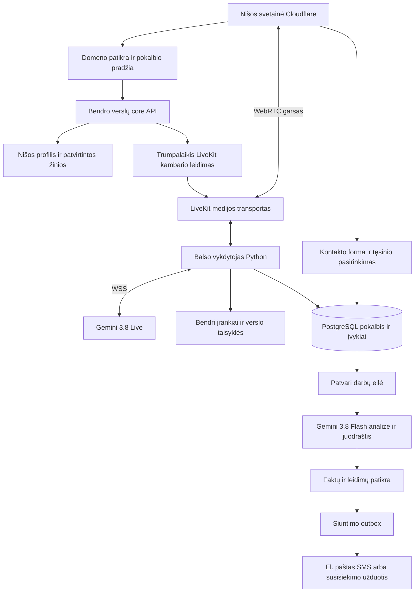

# Bendro AI balso konsultanto planas

Aktualus kliento vaizdas: [CUSTOMER_VIEW](CUSTOMER_VIEW.md) — mūsų antkainis, tiekėjų duomenų atskyrimas, profesionalus PDF ir realūs SMTP kvitai. Bandymų žymos lieka tik vidinėje diagnostikoje.

Parengta 2026-09-30 maždaug 30 nišinių verslų tinklui. Savininkui autorizavus kūrimą, jau statomas [bendras runtime](../agent-business-core/runtime/README.md); dabartinio kodo ir patikrų būsena — [IMPLEMENTATION.md](IMPLEMENTATION.md). 2026-10-01 [tekstinė laboratorija ir bendras paštas](TEXT_CLIENT_LAB.md): šeši sintetiniai klientai, penki SMTP priimti pasiūlymų laiškai ir vienas testinės sąskaitos laiškas. Gavėjo inbox ir tikras balsas nepatvirtinti; visas roadmapas nėra užbaigtas.

Vietinė integruota traktorių svetainė: **http://127.0.0.1:5187/**. [Autonominių testų žurnalas](PRELIVE_QA.md) ir [tikro skambučio paleidimo instrukcija](LIVE_TEST_RUNBOOK.md) atskiria patikrintą kodą nuo dar trūkstamų Google/LiveKit, M0 audio bei viešo deployment įrodymų.

Rekomenduoju vieną bendrą Python verslo branduolį, nišų konfigūracijas, **Gemini 3.8 Live pokalbiui**, **Gemini 3.8 Flash analizei po pokalbio** ir **WebRTC transportą per LiveKit**. Viešos svetainės lieka esamame Cloudflare variklyje. Agentas kalba profesionaliai, informaciją ir veiksmus gauna iš patikrintų sistemų, o tolesnis laiškas rengiamas patvarioje darbų eilėje.

Šis pasirinkimas papildo [esamą agentinių verslų architektūrą](../agent-business-core/ARCHITECTURE.md). Nekuriame antro CRM, antro įrankių registro ar atskiros programos kiekvienam domenui. Senesnio plano Codex CLI profilis lieka kūrimo ir kitoms numatytoms užduotims; kliento balso kanalui šiame plane aiškiai pasirenkama Gemini API. Operacinio modelio pakeitimas registruojamas kaip nauja profilio versija.

Papildomas oficialių Vapi, Retell AI ir ElevenLabs dokumentų [auditas](BEST_PRACTICES_AUDIT.md) sustiprino pokalbio valdymą ir realaus garso vertinimą. Savininko pasiūlytas **TypeSafe Jev** numatytas kaip pasirenkamas foninis [sprendimų routeris](ROUTING_AND_INTELLIGENCE.md): parenka žinių kelią, leistiną įrankio handlerį ar patikrintą specialistinį promptą. Jo naudą pirmiausia lyginame su paprastesniu baseline; jis nėra papildomas privalomas žingsnis prieš kiekvieną balso atsakymą. Kliento poreikio juodraščio principai taip pat patikrinti savininko [AI_teacher projekte](AI_TEACHER_REVIEW.md).

Savininko [L2 Jev integracijos kodas](L2_JEV_REVIEW.md) papildė kompaktiškų promptų ir ribotų tool projekcijų modelį. Po kiekvieno pokalbio numatyta [kokybės analizė ir automatinė savikalibracija](SELF_CALIBRATION.md): maža pataisa → nepriklausomi testai → ribotas naujų sesijų bandymas → aktyvavimas arba rollback. Taip tobulinamos instrukcijos ir skills, o modelių svoriai savaime nepertreniruojami.

Informacinio piloto privalomas kelias yra **M0–M4 ir M6-A saugos, audio, privatumo bei kanalo vartai**. Jis gali veikti be tiekėjo/quote/booking jungties ir su Jev `off`. Kiekvieno pokalbio QualityReview lieka privalomas; automatinį runtime pataisų aktyvavimą įjungiame tik po atskirų M6-C testų ir canary, Jev `on` — po M6-B. Pilotui nereikia laukti visų plėtros funkcijų, o jo paleidimas jų vartų nepanaikina. Runtime skills yra versijuotos balso procedūros; savikalibracija neperrašo svetainių kūrimo skills ar studijos turinio paketų.

## Pagrindinės išvados

1. `gemini-3.8-live` yra realus stabilus modelis. Jo funkcijų kvietimas leidžia prijungti jūsų įrankius; modelis pats neįgyvendina CRM, registravimo ar pristatymo. [Google modelio specifikacija](https://ai.google.dev/gemini-api/docs/models/gemini-3.8-live).
2. Natūraliam pokalbiui nereikia trijų nuoseklių STT, tekstinio LLM ir TTS paslaugų. Native audio modelis apdoroja balsą ir generuoja balsą; analizei įjungiamos abiejų pusių transkripcijos. [Live API apžvalga](https://ai.google.dev/gemini-api/docs/live-api), [SDK transkripcijos](https://ai.google.dev/gemini-api/docs/live-api/get-started-sdk).
3. Nišos svetainė, realios verslo sąlygos ir gamintojų dokumentacija yra skirtingos žinių rūšys. „Žinoti viską“ praktiškai reiškia gebėti rasti pagrįstą atsakymą ir patikimai nustatyti, kada informacijos trūksta. Nei promptas, nei RAG negali garantuoti atsakymo į kiekvieną klausimą.
4. Gamybiniam klientų transportui renkuosi WebRTC. Gemini pusėje lieka jo WSS protokolas. LiveKit bibliotekos 3.8 suderinamumą reikia įrodyti bandymu: patikrintas vadovas dar daugiausia aprašo 3.1. Tai aiški pirmo etapo užduotis, o ne prielaida, kad integracija jau veikia. [LiveKit Gemini vadovas](https://docs.livekit.io/agents/models/realtime/plugins/gemini/).
5. Po pokalbio atskiras agentas parengia poreikio analizę ir kontekstinį atsakymą. Siuntimo tarnyba tikrina kontaktą, faktus ir leidimus. Automatinio siuntimo nereikia tvirtinti rankomis kiekvieną kartą, kai jis atitinka iš anksto apibrėžtą verslo mandatą.
6. Dabartinė `traktoriupadangos.lt` niša yra informacinis pirmos fazės pilotas. Jos dokumentuose nėra patvirtintų tiekėjų, sandėlio, kainų ar pardavimo pajėgumo. Balso agentas gali konsultuoti ir rinkti poreikį; komerciniam pasiūlymui būtini realūs duomenys. Vėlesnėmis fazėmis tas pats branduolys gali registruoti, tikrinti tiekėjus ir vykdyti sandorius.

## Kliento kelias

Lankytojas paspaudžia „Kalbėti su AI konsultantu“, pamato informaciją apie AI ir duomenų naudojimą, leidžia naudoti mikrofoną ir pradeda pokalbį. Konsultantas prisistato, atsako, tikslina poreikį ir pasako, kad prireikus pokalbio metu arba pabaigoje bus galima palikti el. paštą arba telefoną. Kontakto nereikia diktuoti balsu.

Agentas gali bet kada prireikus iškviesti `ui.open_contact_form`: widget parodo langą, patvirtina jo parodymą, o agentas pasako „Dabar savo ekrane galite įvesti kontaktinius duomenis“. Pokalbis tęsiasi; pateiktas kontaktas išsaugomas serverio ir apie rezultatą pranešama agentui.

Baigus pokalbį kontakto forma rodoma, jei kontakto dar nėra; kitu atveju klientas gali jį patikrinti arba redaguoti. Serveris analizuoja pokalbį nepriklausomai nuo formos pildymo greičio. Kai analizė ir patvirtintas kontaktas jau yra, eilė parengia atsakymą bei jį pristato tinkamu kanalu. Palikus tik telefoną sistema siunčia SMS tik turėdama įjungtą SMS adapterį; kitu atveju registruoja tikrą susisiekimo užduotį. Telefono numeris nėra el. pašto adresas.

Jei klientas nepateikia kontakto, išorinis laiškas ar žinutė nesiunčiami. Jei klientas užveria visą naršyklės langą, po pokalbio formos parodyti nebegalime; ją reikia siūlyti ir pokalbio metu, o normaliai baigus ar nutrūkus ryšiui tame pačiame puslapyje rodyti automatiškai.

## Sistemos schema

Tai loginiai vieno core moduliai. Atskiri balso ir foninių darbų procesai leidžia paskirstyti apkrovą, bet nereiškia atskirų verslo duomenų autoritetų.

## Dokumentų skaitymo tvarka

- [Tyrimas ir alternatyvos](RESEARCH.md): ką iš tikrųjų palaiko API, transportų palyginimas, dokumentacijos neatitikimai ir šaltiniai.
- [Balso platformų praktikos](BEST_PRACTICES_AUDIT.md): oficialių Vapi, Retell ir ElevenLabs sutarčių palyginimas bei konkrečios plano pataisos.
- [Routeris ir bendras supratimas](ROUTING_AND_INTELLIGENCE.md): Jev, foniniai įrankiai, specialistiniai promptai, poreikio būsena ir naudos bandymas.
- [AI_teacher vedlio peržiūra](AI_TEACHER_REVIEW.md): perimami principai iš tikro vietinio kodo ir adaptavimo ribos.
- [L2 Jev integracijos peržiūra](L2_JEV_REVIEW.md): aktualus companion routeris, promptų parinkimas ir saugomas provider pilotas.
- [Automatinė savikalibracija](SELF_CALIBRATION.md): kokybės rezultatas po kiekvieno pokalbio, pataisos, regresijos, canary ir rollback.
- [Techninė architektūra](ARCHITECTURE.md): moduliai, žinių atnaujinimas, tenant izoliacija, sutartys, duomenys ir patvarumas.
- [Pokalbis ir tolesnis bendravimas](CONVERSATION_AND_FOLLOWUP.md): UX, profesionalaus konsultanto elgesys, padangų pavyzdys, analizė ir siuntimas.
- [Įgyvendinimo etapai](ROADMAP.md): užduotys, priklausomybės ir patikrinami priėmimo kriterijai.
- [Sąnaudos ir eksploatavimas](COSTS_AND_OPERATIONS.md): kainodara, apkrova, biudžetai, privatumas ir paleidimo vartai.

## Pirmas konkretus rezultatas

Pirmiausia įgyvendinti vienos nišos kelią: tikras lietuviškas pokalbis naršyklėje, pertraukimas, žinių paieška, patvarus serverio transkriptas, po pokalbio pateiktas kontaktas ir vienas teisingas kontekstinis laiškas. Tikrinama ir neigiama eiga: nėra kontakto, neaiškus padangos matmuo, neveikianti integracija ir dubliuotas siuntimo bandymas.

Tik po šio rezultato įjungti antrą skirtingą nišą ir tikrinti izoliaciją. Iki 30 nišų plečiama registruojant profilius, žinias ir leidimus; naujas modelio serveris kiekvienam domenui nereikalingas. Pilna autonomija priklauso nuo realaus verslo įrankių, patvirtintų sąlygų ir išmatuotos kokybės.
## Dabartinis įgyvendinimas

Savininkui autorizavus core kūrimą, pirmo runtime ir realių patikrų būsena laikoma [IMPLEMENTATION.md](IMPLEMENTATION.md). Bendras Python core yra [agent-business-core/runtime](../agent-business-core/runtime/README.md); planas nėra visų jo vartų įgyvendinimo įrodymas.

Pridėtas operatoriaus pause/įrankių registras ir pasirenkama perskambinimo atmintis toje pačioje naršyklėje. UI lieka tas pats skambinimo langas; išsaugoma istorija ir serverio atpažinimo kodas, o naujos medijos sesijos sukuriamos kiekvienam skambučiui. Dabartinio 30 dienų laikotarpio ir įrenginio tapatybės ribos aprašytos runtime vadove.

