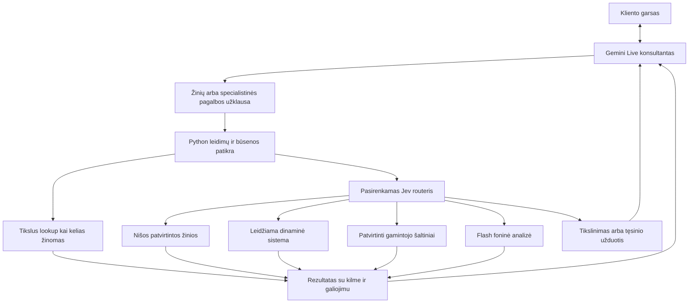

# Sprendimų routeris ir bendras pokalbio supratimas

Projektavimo papildymas 2026-09-30. Savininkas patvirtino, kad kalbama apie **Jev modelį iš TypeSafe AI**. Žemiau išsaugotas architektūros planas; jo siūlomi režimai ir specialisto promptų parinkimas nėra visi jau įgyvendinti.

**2026-10-01 įgyvendinimo būsena:** prijungtas tikras OpenRouter Jev Decisions API, įgyvendintas atskiras kiekvienos nišos ON/OFF valdymas bendro pašto UI ir revizijuotas operatoriaus API. OFF nepradeda Jev užklausų ir nesuteikia ankstesnių rekomendacijų; ON fone pateikia pagrindiniam tekstinio bandymo agentui dar aktualią ketinimo, vaidmens ir leidžiamų įrankių rekomendaciją. Tai patariamasis kontekstas: jis nevykdo veiksmų ir nesuteikia teisių. Pilnų specialisto promptų dinaminis įkėlimas ir tikras Gemini balso pritaikymas dar nepatvirtinti. [Naujo palyginimo metodika ir įrodymai](JEV_CALIBRATION_2026-10-01.md).

## Trijų rūšių sprendimai

| Sluoksnis | Ką daro | Ką paliekame kitam sluoksniui |
| --- | --- | --- |
| Python taisyklės | Domeno ir tenant nustatymas, teisių patikra, verslo fazė, biudžetas, skaičiavimas, veiksmų patvirtinimas, kvitai | Semantinis kliento ketinimo supratimas |
| Jev arba kitas tipizuotas routeris | Pasirenka leidžiamą handlerį iš riboto sąrašo, vertina šaltinio tinkamumą arba užduoties sudėtingumą | Balso ir laiško generavimas, tikslus suderinamumo skaičiavimas, autorizacija |
| Gemini Live ir Flash | Live kalba ir tikslina; Flash nagrinėja sudėtingą klausimą ar po pokalbio kuria poreikio analizę ir atsakymą | DB teisės ir faktiškai įvykusių veiksmų autoritetas |

TypeSafe API priima `state`, `model`, `questions`; `Choice` parenka iš kriterijų sąrašo, `Score` vertina pagal sutvarkytus lygius, `Noul` pateikia teigiamo atsakymo tikimybę. Viename kvietime galima klausti kelių skirtingų klausimų. Oficialus paviršius yra `POST https://api.typesafe.ai/v1/systemone`, Python biblioteka — `typesafe-sdk`. Produkcijoje fiksuotume patikrintą modelio versiją. [Oficiali API](https://docs.typesafe.ai/api), [quickstart](https://docs.typesafe.ai/introduction/quickstart).

`Choice` ir `Score` turi tikimybių pasiskirstymą bei iš jo apskaičiuotą `confidence`. Tai nėra pasirinkto varianto tikimybės sinonimas. `Noul` atskiro confidence neturi. Vienos klausimų rūšies slenkstis automatiškai netinka kitai; slenksčiai derinami pagal mūsų pažymėtus pavyzdžius. Aukštas confidence nėra įrodymas, kad kaina, kontaktas ar techninis suderinamumas teisingas. [Confidence semantika](https://docs.typesafe.ai/confidence).

Oficialiai dokumentuotos Jev 1.13 ribos apima skaitinį tikslumą, datų lyginimą, sudėtingą netiesioginį samprotavimą, nereikalingą kontekstą ir priešišką įvestį. Modelis neskirtas generuoti tekstui. Todėl tipizuotą išvestį skiriame nuo faktinio teisingumo, matematiką vykdome kodu, o leidimų nepatikime klasifikatoriui. [Modelio ribos](https://docs.typesafe.ai/model-jaggedness/jev-1.13).

## 2026-10-01 faktinis Jev adapteris

Sukurtas [jev_router.py](../agent-business-core/runtime/src/pinet_core/jev_router.py) ir aštuonios adapterio patikros. Pasirinktas **OpenRouter alpha Decisions** shadow adapteris su `typesafe/jev-1.13`; ši realizacija nėra aukščiau numatytas tiesioginis TypeSafe SDK adapteris. Konkreti sutartis patikrinta pagal [oficialų OpenRouter Jev tutorial](https://openrouter.ai/blog/tutorials/how-to-use-jev/) ir [modelio aprašą](https://openrouter.ai/blog/insights/what-is-jev/). Alpha paviršiaus stabilumas turi būti tikrinamas prieš live aktyvavimą.

Devyni ketinimai: informacija, specifikacija/pataisymas, kontaktų įvedimas, kainos prieštaravimas, pasiūlymo patvirtinimas, tiekėjo užklausa, atsisakymas, kita niša ir neaiškus ketinimas. `Choice` pateikia kategoriją/pasiskirstymą/confidence; papildomas `Noul` vertina specifikacijos pataisymą. Adapteris grąžina tik rolės ir esamų leidžiamų tools užuominas. Neprideda įrankių, argumentų, verslo faktų ar sandorio leidimo.

Numatytai išjungtas: tikram Jev modeliui šio darbo metu atlikta **0 užklausų**. Mock transporto testai nėra modelio tikslumo, kainos ar delsos įrodymas. Pokalbio/voice worker ir kalibravimo kampanija šio adapterio dar nekviečia. Atskiras shadow runner ir dedicated provider konfigūracija lieka prijungimo darbu; L2 projekto API raktai neperkelti.

Paruošta: kontakto ir sąskaitos numerio minimizavimas, tik sintetinės shadow įvestys, skambučio epoch ir poreikio revision patikra, klaidingų tikimybių atmetimas, bounded calls/spend, iki 3 s foninis timeout be retry, klaidos fallback ir privatūs provider atsakymai nespausdinami. Vėlyvas rezultatas atmetamas. Visų šiuo metu grąžinamų rezultatų `apply=false`; nėra aktyvaus routerio ar išmatuoto sprendimo slenksčio.

Prijungimo seka: atskiras raktas/biudžetas → foninis stebėjimas pagal šių nišų pažymėtus atvejus → klaidų matrica, p50/p95 ir actual spend → tik tinkamų sprendimų klasių įjungimas. Pirmas kandidatas yra specialistinės užduoties parinkimas; žinomas kontakto prašymas ir programinis sutikimo atsisakymas papildomo modelio nereikalauja. Gyvo Gemini atsakymas neturi laukti shadow užklausos.

## Routerio vieta skambučio metu



**Tenant routeris ir užduoties routeris yra skirtingi.** Verslą nustato patikrintas hostname ir sesijos leidimas. Jev niekada nenusprendžia, kurio verslo klientų DB atverti pagal kliento pasakytą pavadinimą.

Paprasto kontakto, žinomo produkto ID ar privalomo follow-up kelias jau žinomas iš kodo, todėl papildomas modelio kvietimas nereikalingas. Jev kviečiamas bendro `knowledge.resolve` arba specialistinės užduoties viduje, kai iš tikrųjų yra keli semantiškai skirtingi keliai. Tai išvengia dar vienos tinklo užklausos kiekviename balso apsikeitime. Jis neprivalo keisti gyvo modelio ar balso pokalbio viduryje.

Pradiniai leidžiami handleriai: `approved_site`, `business_facts`, `manufacturer_docs`, `dynamic_lookup`, `specialist_analysis`, `clarify`, `unresolved_followup`. Sąrašą kiekvienai užklausai sudaro serveris; nepalaikomas tiekėjų ar likučių adapteris į kandidatų sąrašą nepatenka. `clarify` ir `unresolved_followup` saugo nuo priverstinio pasirinkimo, kai nė vienas žinių kelias netinka.

Routerio state sudaro paskutinis aktualus kliento klausimas, būtini poreikio laukai, žinių aprėpties metaduomenys ir kandidatų aprašai. Visas transkriptas, el. paštas, telefonas ir kitų klientų atmintis jam nereikalingi. Kliento tekstas žymimas kaip nepatikimi duomenys. Jei prieiga prie routerio teikėjo pagal duomenų politiką išjungta, lieka programinis arba patvirtintas Gemini kelias.

`RouteDecision` saugo request ID, business, conversation, goal revision, allowed-candidate hash, model/version, selected handler, probability/confidence semantiką, duration, usage ir priimtą programinį sprendimą. Serveris patikrina schemą, kandidatų narystę ir užklausos aktualumą. Pasirinkimas nesuteikia handleriui jokių papildomų teisių.

Neapibrėžtumą sprendžiame pagal priežastį: trūksta kliento matmens — klausiame; trūksta šaltinio — užregistruojame spragą; reikia daugiau samprotavimo — Flash užduotis. Didesnis modelis nesukuria neegzistuojančio tiekėjo ar likučio. Žmogui perduodame tik jei egzistuoja realiai prieinamas operatorius; kitaip tiksliai įvardijame išsaugotą tęsinio prašymą.

Pradinė hipotezė: gyvo kelio routerio papildomos delsos biudžetas iki 300 ms, įskaitant tinklą; tai mūsų bandymo riba, ne Jev pažadas. Viršijus deadline naudojamas apibrėžtas fallback, vėlyvas atsakymas neperrašo jau priimto kelio. Realaus kvietimo timeout matuojamas; automatiniai SDK retries gyvame kelyje ribojami tuo pačiu deadline. Jei šios ribos nepavyksta pasiekti, Jev paliekamas foninei analizei. Nesudėtingas baseline turi būti prieinamas ir sutrikus TypeSafe.

Savininko [L2 Jev integracijos peržiūra](L2_JEV_REVIEW.md) pagrindė lane/context principą, tačiau jos saugomas OpenRouter pilotas užrašė p95 672 ms. Tai viršija mūsų siūlomą 300 ms gyvo kelio ribą. Todėl pradinis mūsų variantas — fono paruošimas ir shadow vertinimas; laukimas prieš kiekvieną repliką nepasirenkamas. Kitą providerį ar mažesnį kontekstą tikrinsime atskiru matavimu.

## Routeris parenka ir promptą bei tool projekciją

Vienas `SkillRegistry` iš bendro core turi įrankių schemas, semantiką ir procedūrų fragmentus. `PromptRegistry` saugo patvirtintus fragmentus bei jų manifestą. Jev grąžina tik pasirinktą ID, pavyzdžiui, `technical_explanation`, `need_interview`, `offer_preparation`, `booking_review` arba `supplier_inquiry`; kandidatai priklauso nuo nišos fazės ir auditorijos. Tai nėra laisvas prašymas modeliui sukurti naują sistemos promptą skambučio metu.

Serverio compiler sudeda bazinį kontraktą, nišos profilį, pasirinktą procedūrą ir minimalią aktualios būsenos projekciją. Užfiksuojami fragmentų hash, assembly order, tool schema hash, tokenų biudžetas ir goal revision. Specialistinė Flash užduotis gauna jai skirtą pilną promptą. Live konsultantas gauna trumpą rezultatą su įrodymais ir programinę aktualios procedūros būseną; neprivalo iš naujo skaityti visos specialistų instrukcijos.

Mažas pradinis Live tool rinkinys gali turėti `knowledge.resolve`, `need.patch`, `ui.open_contact_form` ir konkrečiai fazei leidžiamą veiksmą. `knowledge.resolve` viduje routeris parenka tikrą handlerį. Visi handleriai turi vardines schemas ir normalų mandatų gate; bendras endpointas nėra generic execute ar būdas apeiti teises. Tūkstančio tools visų nišų promptui nereikia.

Tiesioginis Live function declaration rinkinio ar `systemInstruction` pakeitimas vykstančioje sesijoje nepostuluojamas. M0 bandymas nustato pasirinkto SDK leidžiamą konteksto atnaujinimą, įrankio atsakymo scheduling ir interruption poveikį. Kol tai neįrodyta, dinamika veikia per jau deklaruotus įrankius bei jų rezultatus, o specialisto promptas taikomas atskiram foniniam kvietimui. Vien lango ar žinių kortelės parodymas neturi pradėti naujo pasisveikinimo ar nutraukti aktyvaus balso.

Routerio režimai: `off`, `shadow`, `on`, atskirai kiekvienai nišai ir sprendimų klasei. Mažas klaidingai parinktas fragmentas gali grąžinti tipizuotą `needs_clarification` ar `needs_specialist`; leidžiame vieną pakartotinį maršrutizavimą su nauju įrodymu, paskui aiškų tikslinimą arba tęsinį. Tai apsaugo nuo routerių ir specialistų ciklo.

## Išankstinis paruošimas be nereikalingo laukimo

Įvykiai į fono paruošėją gali patekti, kai gauta pakankamai stabili kliento frazė, ne po kiekvieno STT žodžio. Kodas debouncing, concurrency ir biudžetu riboja užklausas. Tarpinė frazė gali pradėti leistiną skaitymą, tačiau jos interpretacija yra provisional ir nesuteikia patvirtinimo įrašui, siuntimui ar sandoriui.

`PreparedContext` laikomas tik tai sesijai su business, goal revision, input span hash, kandidatų hash, fact/source versions ir TTL. Užbaigus kliento mintį tikriname, ar paruoštas paketas vis dar tinka. Pasikeitęs tikslas, matmuo ar atšauktas faktas panaikina jo pritaikomumą. Routerio pasirinktų faktų santrauka negali pakeisti jų originalios kilmės.

Jei paruošta paieška jau baigta, Gemini gauna rezultatą iškart per patikrintą adapterio eigą. Jei nebaigta, konsultantas gali užduoti kitą iš tikrųjų naudingą klausimą arba vieną kartą pasakyti, kad tikrina. Nekuriame dirbtinių klausimų vien laikui užpildyti ir nežadame „visai be delsos“ ten, kur būtinas išorinis sistemos atsakymas. Post-call analizė ir savikalibracija vyksta atskirai nuo gyvo kelio.

## Viena kliento poreikio būsena

Didžiausią naudą mūsų tinklui matau vienoje patvarioje `CustomerNeedState`, kurią naudoja balso konsultantas, įrankiai ir analitikas:

```text
goal_id / revision       dabartinis kliento tikslas ir jo pakeitimai
intent / task_phase      konsultacija, poreikio tikslinimas, pasirinkimo tikrinimas
fields[]                 reikšmė, kilmė, confirmed / proposed / unknown / superseded
constraints[]            biudžetas, terminas, vieta, tikras naudojimo scenarijus
questions[]              atsakyta / atvira, šaltinių nuorodos
recommendations[]        remiasi konkrečiomis fields ir fact versijomis
action_receipts[]        serverio patvirtinti rezultatai
next_step                klientui naudingas tęsinys
contact_ref              atskiras kontakto įrašas ir prašymo paskirtis
```

Tai papildoma struktūra šalia pilno transkripto; ne jo pakaitalas. Modelio ištrauktas laukas pradžioje yra `proposed`. Kritinio lauko patvirtinimas reikalauja susieto kliento patvirtinimo įvykio arba patikrinto UI pateikimo pagal to lauko sutartį. Laikinas STT tekstas negali suteikti patvirtinimo.

Įvedame rekomendacijų priklausomybes: jei klientas pataiso `16.9R34` į `18.4R34`, nuo ankstesnio dydžio priklausanti rekomendacija tampa negaliojančia. Agentas peržiūri tik paveiktą pasirinkimą, o ne kartoja visą anketą. Jau atliktas išorinis veiksmas nepanaikinamas vien pakeitus lauką; jo pakeitimas turi atskirą leistiną procedūrą ir kvitą.

Laiško agentas gauna visą serverio pokalbį, šią galutinę būseną ir kvitus. Jis dar kartą tikrina neatitikimus; balsinio agento ankstesnė struktūruota interpretacija netampa vieninteliu tiesos šaltiniu.

## Kitas naudingiausias klausimas

Nišos profilis aprašo laukus ir priklausomybes nuo kliento tikslo. Kodas išrenka trūkstamus laukus, kurie blokuoja teisėtą kitą žingsnį. Jev pasirinktinai ranguoja tik šiuos kandidatus pagal pateiktą situaciją; Gemini suformuluoja vieną natūralų klausimą.

Traktoriaus padangoms pirmi kandidatai gali būti tikslus matmuo, naudojimas, apkrova, dabartinė problema ir termino poreikis. Vardas nėra būtina sąlyga paaiškinti radialinės padangos savybes. Jei tikslas konkreti rekomendacija, apkrovos ir ratlankio neaiškumas gali būti svarbesnis už prekės ženklą. Tikras techninis suderinamumas tikrinamas gamintojo specifikacija ir leistinu skaičiavimu.

Klausimų prioritetas yra projektuojama heuristika, ne jau apskaičiuota statistinė informacijos vertė. Vertiname, ar ji sumažina nereikalingų klausimų kiekį ir pagerina tinkamą kliento rezultatą. Kontaktą siūlome natūralioje vietoje, kai klientas prašo pasiūlymo, trūksta atsakymo dabar arba jis nori tęsinio; jo pateikimas neatstoja poreikio supratimo.

## Fono darbas ir ekrano pagalba

Leidžiama paieška gali vykti, kol klientas atsako į kitą klausimą. Fono užduotis gauna goal revision, šaltinių galiojimą ir biudžetą. Pataisius matmenį senas atsakymas nebepritaikomas. Pradžioje apribojame foną iki vienos specialistinės užduoties pokalbiui; daugiau tik su matuota nauda. Beprasmiško agentų tarpusavio diskutavimo gyvo kliento sąskaita nenumatome.

Ekranas gali rodyti patikrinto matmens kortelę, nuorodą į naudojamą gidą ar pasiūlymo projektą. Konkreti UI sutartis naudoja tą patį autentifikuotą kanalą kaip kontakto popup, leidžiamas kortelių rūšis ir įdiegto domeno URL. Modelis negali pateikti vykdomo HTML ar savavališkai naviguoti klientą. Prieš uždarant neįkyrų modalą išsaugomas jo juodraštis.

## Kaip įrodysime Jev naudą

Pirmiausia pasirinkti vieną sprendimą, pavyzdžiui, žinių handlerio parinkimą. Sudaryti pradinių bent 200 pažymėtų užklausų imtį iš dviejų skirtingų nišų; pradinis dydis yra praktinis bandymas, ne statistinės galios garantija. Įtraukti lietuvių kalbą, šnekamąsias klaidas, panašius ketinimus, „nė vienas netinka“, prompt injection ir pataisytus laukus. Tuning ir galutinis testas atskiriami pagal visą pokalbį.

Toms pačioms užklausoms palyginti programinį baseline, Gemini kelią ir Jev kelią. Skaitymo shadow režimu Jev tik užrašo siūlomą variantą ir nieko papildomai nevykdo. Matuoti klasės tikslumą, pavojingų klaidų skaičių, neapibrėžtų užklausų aptikimą, automatiškai parenkamų atvejų dalį, p50/p95 papildomą delsą ir visos užduoties kainą. Atskirai tikrinti tikimybių kalibraciją mūsų imtyje; confidence nelaikyti faktinės sėkmės procentu.

Aktyvuoti tik tą sprendimų rūšį, kurios kokybė ir sąnaudos geresnės už baseline, nebloginant tikro balso eigos. Bendrą efektą tikrinti ribotu pilotu: poreikio supratimas, korekcijų skaičius, išspręsti klausimai, tinkamas follow-up ir realios užklausos vertė. Užregistruoti prompto, kriterijų ir modelio versijas bei paprastą routerio išjungimą. Nenaudoti tiekėjo reklaminio speedup kaip mūsų ekonominio rezultato.

Kokybės rezultatai kuria kontroliuojamą [savikalibracijos ciklą](SELF_CALIBRATION.md). Pataisos gali keisti leistinų promptų turinį ir routing kriterijus, tačiau nepriima naujų tools, teisių ar verslo faktų iš kliento transkripto.
