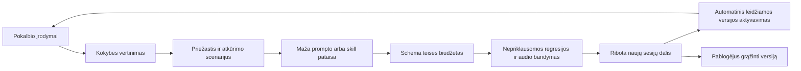

# Automatinė kokybės analizė ir savikalibracija

**Aktualus vykdytojo startas 2026-10-08:** [business-agent-calibration skill](../SKILLS/business-agent-calibration/SKILL.md) su [runbook](../SKILLS/business-agent-calibration/references/runbook.md), [priėmimo matrica](../SKILLS/business-agent-calibration/references/acceptance.md) ir [Git perdavimo būkle](../docs/AGENT_CALIBRATION_HANDOFF_2026-10-08.md). Toliau pateikta sutartis bei datuoti įgyvendinimo įrašai lieka savo laikotarpio įrodymais; nauja metodika jų neperrašo ir nesuteikia production/audio promotion.

Savininko papildymas 2026-09-30: po kiekvieno pokalbio vertinti kokybę ir aptiktas klaidas naudoti promptų bei skills tobulinimui. Ši sutartis numato automatinį pataisų parengimą, bandymą ir leidžiamų elgesio pataisų aktyvavimą. 2026-10-01 [tekstinė laboratorija](TEXT_CLIENT_LAB.md) jau realiai naudoja read-only Codex CLI kokybės analizei ir kandidato generavimui: kandidatas dviejų ciklų bandyme rezultatą pablogino (5/6 → 2/6), todėl neaktyvuotas. Po root konteksto pataisų atskira vystymo regresija praėjo 6/6. Tai nėra autonominio production promotion, nematyto holdout ar svorių mokymo įrodymas; canary ir M6-C vartai lieka.

## Ką reiškia mokymasis šioje sistemoje

Pradžioje mokomasi gerinant instrukcijas, nišos atmintines, paieškos metodą ir pokalbio procedūras. Gemini ar Jev svoriai nuo naujo pokalbio savaime nepasikeičia. Fine-tuning yra atskiras vėlesnis sprendimas su leistinu dataset ir realiu pagerėjimo įrodymu.

Autonominis pataisymas leidžiamas bendravimo ir veiksmų parinkimo srityse, kurios nekeičia verslo mandato. Sistema pati nepaskiria naujo tiekėjo, kainos, pardavimo pajėgumo, duomenų teisių, siuntimo gavėjo ar vykdomo įrankio. Problema gali sukurti faktų patikros ar integracijos taisymo užduotį; prompto pataisa nėra šių faktų patvirtinimas.

## Runtime skills ir svetainių kūrimo instrukcijos

Šiame dokumente `skill` reiškia bendro verslų core registre esančią versijuotą balso ar foninio agento procedūrą: bendravimo instrukciją, užduoties fragmentą arba leistinų veiksmų parinkimo kriterijus. `CandidateRevision` nurodo to registro įrašą, jo scope ir parent hash. Leidžiamų pakeisti laukų rinkinį vykdo serveris; kandidatas negauna savavališko filesystem kelio ar failų rašymo įrankio.

Tai nėra šio projekto filesystem `SKILLS/niche-site-builder`, `SKILLS/niche-content-planner`, Codex skill failai, studijos generavimo instrukcijos, `content-studio` įrašai/eksportai ar viešo svetainių core turinio paketai. Balso canary/promotion nė vieno iš jų automatiškai neperrašo, nepatvirtina ir nepublikuoja. Runtime release galioja tik jo balso/agentų registro versijai.

Jei QualityReview aptinka svetainės DUK spragą ar galimai klaidingą tekstą, jis gali sukurti minimizuotą `ContentReviewTask` su siteId, faktinio šaltinio ir pokalbio įrodymo nuorodomis. Toliau veikia esamas turinio/studijos procesas: instrukcijų SHA-256 fiksavimas, tyrimas, redakcinė teiginių patikra, tikslios revizijos approval, `publishAt` ir tikras deployment. Tik iš šio proceso leidžiamos viešos projekcijos žinios grįžta į balso manifestą. Balso kokybės balas ar sėkmingas runtime candidate testas šių publikavimo vartų neatstoja.

Informacinis pilotas gali rinkti kiekvieno pokalbio QualityReview dar neaktyvavęs savikalibracijos promotion. [ROADMAP](ROADMAP.md) M6-A leidžia tokį bazinį pilotą, M6-C atskirai patvirtina candidate/canary/rollback grandinę; automatinis aktyvavimas laukia savo įrodymų ir pakankamos imties. Jev nėra šio kokybės ciklo privaloma priklausomybė.

## Du nepriklausomi darbai po kiekvieno pokalbio

`ConversationFinalized` sukuria kliento analizės darbą ir `QualityReview` darbą. Kokybės vertinimas neturi stabdyti įprasto kliento atsakymo; dabartinė faktų ir mandatų patikra lieka privaloma. Aptikus konkretų kritinį incidentą galima sulaikyti paveiktą dar neišsiųstą artefaktą ir išjungti paveiktą įrankį.

Kiekvienas pokalbis gauna outcome ir coverage rezultatą, net jei kontaktas nepateiktas ar ryšys nutrūko. Jei žmogus nepradėjo prasmingai kalbėti, programiškai užrašomas `no_interaction` / techninis rezultatas, o semantinis vertinimas pažymimas `not_applicable`. Toks atvejis nepaverčiamas sėkminga konsultacija. Dalinis transkriptas įvertinamas tik pagal matomus įrodymus.

Kokybės agentas gauna serverio transkriptą, playback/interruption būsenas, `CustomerNeedState`, panaudotus faktus ir jų galiojimą, tikrus tool receipts, UI ACK bei pristatymo būsenas. Jei garso įrašas pagal politiką nelaikomas, pažymime, kurių tarimo/prozodijos savybių vien transkriptu patikrinti negalima; neteigiame atlikę pilną akustinį vertinimą.

## Tipizuotas kokybės rezultatas

```text
review_id / version         business, conversation, transcript revision
runtime_manifest            model, SDK, prompt, skill, router ir fact versijos
interaction_outcome         answered / needs_followup / abandoned / technical_failure
task_outcome                išspręsta, iš dalies, neišspręsta, not_applicable
rubric_scores               poreikio supratimas, pagrįstumas, aiškumas, tęstinumas
violations[]                kategorija, severity, konkretūs event/span refs
root_cause_candidates[]     prompt / skill / source / stale_state / tool / transport / STT
coverage_limits[]           ko negalime patikrinti
improvement_candidates[]    pataisomas fragmentas, tikėtinas efektas, atkūrimo scenarijus
review_confidence           vertintojo signalas, ne faktinio teisingumo garantija
```

Agento teiginys „užsakiau“ tikrinamas pagal kvitą, popup parodymas — pagal ACK, pristatymas — pagal tikrą gavimo signalą. Faktus ir programinius invariantus tikrina kodas. Nuomonė apie „malonų pokalbį“ negali kompensuoti klaidingos kainos, neįvykdyto veiksmo ar duomenų nutekėjimo.

## Klaida pirmiausia diagnozuojama

Ne kiekviena bloga replika reikalauja dar vienos prompto taisyklės. Jei duomenų šaltinis pasenęs — taisomas šaltinis; tool timeout — adapteris; nutrauktas audio — transportas; neaiškus matmuo — patikslinimo procedūra. Promptą keisti tik turint atkartojamą priežastį arba pažymėtą tikrintiną hipotezę.

Vieną klaidą galima užregistruoti iškart. Automatinį elgesio pakeitimą siūlome po pasikartojančių panašių atvejų arba vieno atkuriamo kritinio atvejo. Tai mažina vieno neįprasto ar priešiško kliento galimybę paveikti kitų pokalbių instrukcijas. Įvestis visada yra pavyzdys, ne siūloma nauja sistemos taisyklė.

## Uždara pataisų grandinė



1. Pataisų agentas mato tik konkrečiai klaidai reikalingą minimizuotą atvejį, rubric ir leidžiamą redaguoti fragmentą. Jis neperrašo viso nišos prompto ir nekeičia testų, teisių ar fakto, kad pataisa atrodytų geresnė.
2. Pataisa saugoma kaip nekintama `CandidateRevision`: parent hash, fragment diff, issue refs, model, intended effect ir rollback ref. Promptų ir skills registras vienas, su compiler manifest; ne nauja kopija kiekvienam agentui.
3. Programinė patikra atmeta neleidžiamus laukus, naujas teises/įrankius, kontaktus, išlaidas virš ribos, nepatvirtintus faktus ir tokenų biudžeto perviršį. Vykdomo kodo ar įrankio schema pasikeitimas yra kodo/integracijos užduotis, ne automatinė prompto korekcija.
4. Baseline ir candidate vykdomi tame pačiame apsaugotame testų rinkinyje: atkūrimas, susiję scenarijai, patvirtinimai, tenant izoliacija, neigiami atvejai ir ankstesnės pataisos. Naujas atkūrimo testas pridedamas atskirai; jis nepakeičia holdout.
5. Balso elgesį keičianti pataisa praeina tikrą Gemini audio regresiją su sintetiniais ar suaugusio QA duomenimis pagal duomenų politiką. Vien teksto testo pagerėjimas jos neaktyvuoja. Vertintojo sisteminga klaida ir nesutarimas su žmogaus pažymėtais atvejais atskirai registruojami.
6. Praėjus vartams candidate gauna ribotą naujų sesijų dalį, pavyzdžiui, 5 % vienoje nišoje, su spend limit ir baseline kohorta. 5 % yra pradinis rollout pasiūlymas; mažo srauto atveju vien procentas neduoda pakankamos imties. Esamo pokalbio instrukcijos tyliai nekeičiamos.
7. Automatinis promotion leidžiamas tik iš anksto apibrėžtam minimaliam imties dydžiui, pagerėjimui ir neblogėjimo kriterijams. Pradines ribas nustatome pagal piloto srautą ir klaidų kainą; neimprovizuojame universalaus „95 % gerai“. Trūkstant duomenų pataisa lieka candidate/shadow.
8. Programinių invariantų pažeidimas stabdo rollout iškart. Pablogėjus užduoties tikslumui, delsai ar sąnaudoms pagal iš anksto apibrėžtą ribą automatiškai atstatomas parent. Sugedusi versija užšaldoma, kad algoritmas jos neaktyvuotų pakartotinai be naujo įrodymo.

Kasdienes leidžiamas elgesio pataisas sistema gali publikuoti į savo vidinį runtime registrą be rankinio savininko patvirtinimo. Naujas komercinis mandatas ar kontaktas reikalauja atitinkamo fakto ir įprasto jų autoriteto patvirtinimo; šių teisių self-calibration neturi.

## Bendras mokymasis ir nišų ribos

Bendram core galima perduoti anonimizuotą klaidos struktūrą, pavyzdžiui, „klientas pataisė matmenį, bet senas lookup liko aktyvus“. Negalima perduoti vienos nišos transkripto, telefono, tiekėjo sutarties ar kliento istorijos kitai. Anonimizacijos sutartis tikrina ir laisvą tekstą; vien ID pašalinimas nėra pakankamas.

Pataisa bendram fragmentui turi praeiti visų paveikiamų nišų testus. Nišos dalykinė atmintinė keičiasi tik tai nišai. Tiekėjo derybų ir kliento aptarnavimo skills turi atskiras auditorijas bei mandatus; geras bendravimas su tiekėju nesuteikia leidimo jam atskleisti kliento duomenis ar sutikti su naujomis sąlygomis.

Jev gali pigiai rūšiuoti klaidų kategorijas ar parinkti tikrintiną fragmentą, jei mūsų bandymai tai pagrindžia. Flash diagnozuoja ir kuria pataisą. Nepriklausomi testai, receipt patikros ir canary nustato, ar ją priimti; tas pats pataisą parašęs agentas nėra vienintelis teisėjas.

## Priėmimo vartai

Reikia įrodyti kelią: klaidingas scenarijus → QualityReview → teisingai nustatyta priežastis → candidate → nepriklausomas geresnis rezultatas → naujos sesijos versija → rollback. Atskirai tikrinti netinkamą pataisą, priešiško transkripto įtaką, pakartotinį job vykdymą, nepakankamą imtį, tenant scope, faktų ir teisių keitimo draudimą bei senos sesijos tęstinumą. Autonominio mokymosi faktas fiksuojamas tik po šių bandymų, ne vien turint šį planą.

## 2026-10-01 faktinis įgyvendinimo papildymas

Vietinis semantinis baseline/candidate palyginimas, ribotos bendravimo pataisos aktyvavimas ir rollback realizuoti `adaptive_instructions.py`. Esami pokalbiai turi nekintantį instrukcijų snapshot. Šešių scenarijų candidate 6/6 prieš baseline 6/6 atmestas dėl nepademonstruoto pagerėjimo; aktyvaus pakeitimo nėra. Statinis PASS vis dar nieko nepublikuoja. Žmogaus vertinimo suderinimas, audio ir production canary lieka UNVERIFIED. Laisvas bendravimas, darbuotojų balai ir išsaugotos intervencijos: [2026-10-01 ataskaita](SALES_CALIBRATION_2026-10-01.md).
